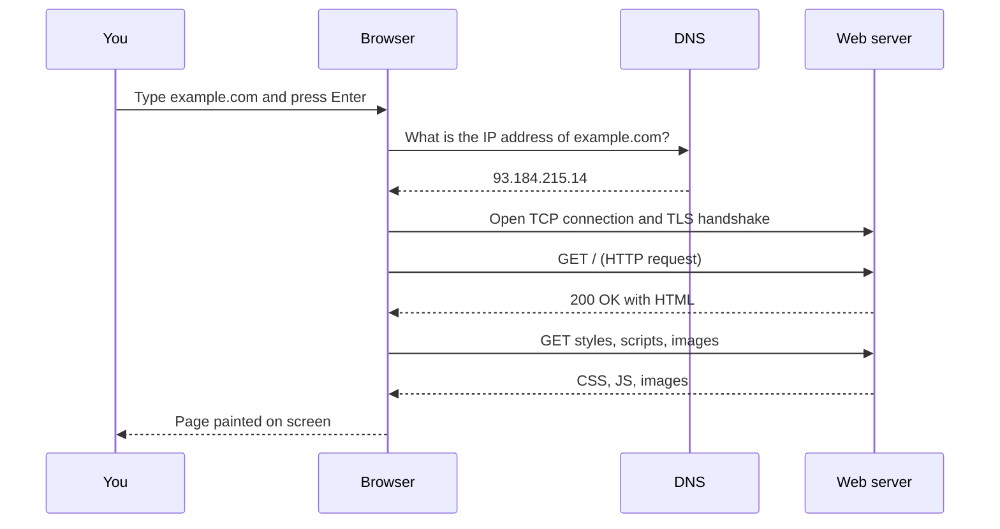
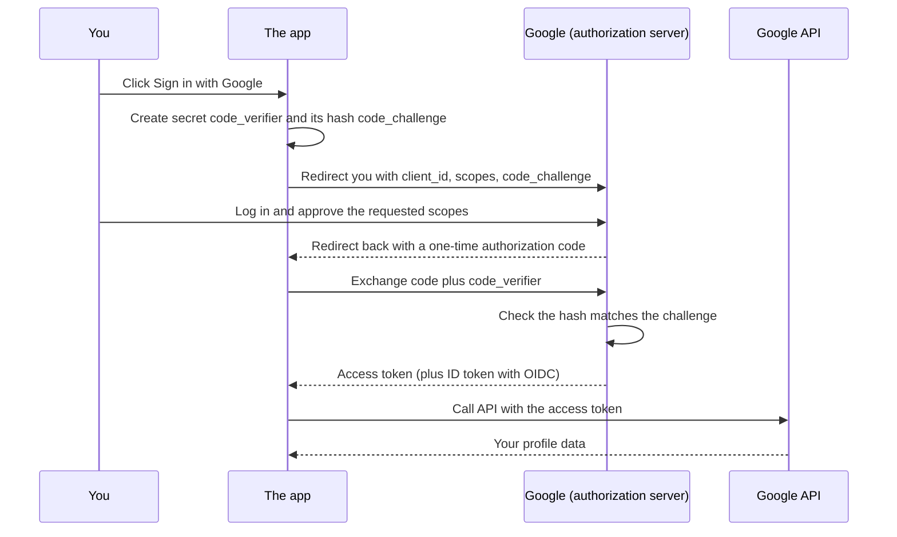
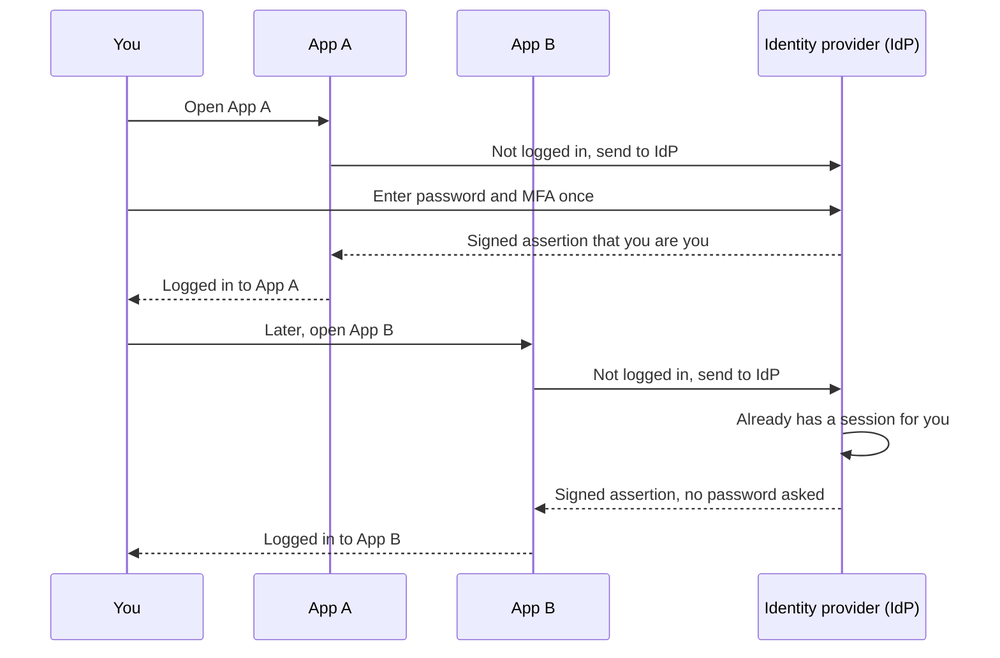
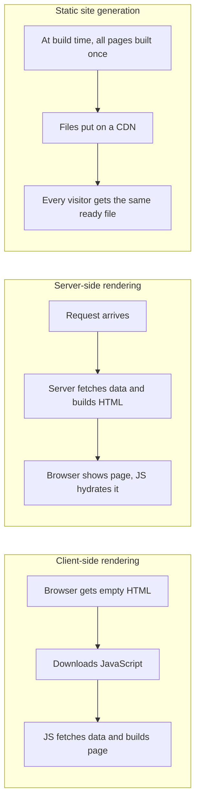
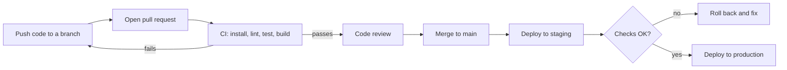
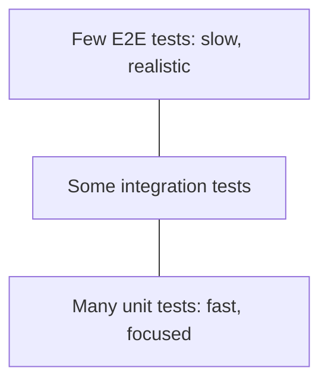

<h1 align="center">Dev knowledge</h1>

<i>Software engineering terms and concepts, explained in plain English, with links to learn more.</i>

Companion to <a href="https://github.com/alwintwk/web-dev-resources">web-dev-resources</a>. Last reviewed: September 2026. <a href="https://alwintwk.github.io/dev-knowledge/">Search it online</a> · <a href="https://alwintwk.github.io/dev-knowledge/flashcards.html">Quiz yourself</a>

## Table of contents

* [Start here](#start-here)
* [Common mix-ups](#common-mix-ups)
* [Diagrams](#diagrams)
* [Programming concepts](#programming-concepts)
* [Data structures & algorithms](#data-structures--algorithms)
* [Command line & Linux](#command-line--linux)
* [Web fundamentals](#web-fundamentals)
* [Networking](#networking)
* [Security](#security)
* [Auth & identity](#auth--identity)
* [Frontend concepts](#frontend-concepts)
* [Mobile development](#mobile-development)
* [Backend & APIs](#backend--apis)
* [Databases](#databases)
* [Architecture & design](#architecture--design)
* [System design interview](#system-design-interview)
* [Design principles](#design-principles)
* [DevOps & cloud](#devops--cloud)
* [Cloud services](#cloud-services)
* [Observability & reliability](#observability--reliability)
* [Testing](#testing)
* [Performance](#performance)
* [Concurrency](#concurrency)
* [Git & workflow](#git--workflow)
* [AI & LLMs](#ai--llms)
* [Privacy & compliance](#privacy--compliance)

---

## Start here

New to all this? Read the sections in this order. Each step pairs the ideas (this repo) with the tools that use them ([web-dev-resources](https://github.com/alwintwk/web-dev-resources)).

1. **How the web works:** [Web fundamentals](#web-fundamentals), [Networking](#networking), and the [visit-a-URL diagram](#what-happens-when-you-visit-a-url).
2. **Programming basics:** [Programming concepts](#programming-concepts), [Data structures & algorithms](#data-structures--algorithms), [Command line & Linux](#command-line--linux).
3. **Frontend:** [Frontend concepts](#frontend-concepts) and the [rendering diagram](#csr-vs-ssr-vs-ssg). Tools: [UI frameworks](https://github.com/alwintwk/web-dev-resources#ui-frameworks), [CSS](https://github.com/alwintwk/web-dev-resources#css-frameworks--styling). Building an app instead of a site? See [Mobile development](#mobile-development).
4. **Backend:** [Backend & APIs](#backend--apis), [Databases](#databases). Tools: [Backend frameworks](https://github.com/alwintwk/web-dev-resources#backend-frameworks), [Databases & ORMs](https://github.com/alwintwk/web-dev-resources#databases-orms--search).
5. **Security & login:** [Security](#security), [Auth & identity](#auth--identity), and the [OAuth](#oauth-20-login-with-pkce) and [SSO](#single-sign-on-sso) diagrams.
6. **Shipping it:** [Git & workflow](#git--workflow), [Testing](#testing), [DevOps & cloud](#devops--cloud), [Cloud services](#cloud-services), [Observability](#observability--reliability), and the [CI/CD diagram](#cicd-pipeline).
7. **Leveling up:** [Architecture](#architecture--design), [System design interview](#system-design-interview), [Design principles](#design-principles), [Performance](#performance), [Concurrency](#concurrency), [AI & LLMs](#ai--llms).

Want a structured course alongside? [The Odin Project](https://www.theodinproject.com/) or [Full Stack Open](https://fullstackopen.com/en/) are free.

Unsure about two similar-sounding terms? Check [Common mix-ups](#common-mix-ups).

<a href="#table-of-contents"><b>↥ Back to top</b></a>

## Common mix-ups

| These two (or three) | The difference in one line |
|---|---|
| Authentication vs authorization | Authentication = *who are you?* Authorization = *what may you do?* |
| OAuth vs OIDC vs SAML | OAuth grants an app access; OIDC adds "who the user is" on top of OAuth; SAML is the older XML way to do SSO. |
| Cookie vs localStorage vs sessionStorage | Cookie is sent to the server on every request; localStorage stays in the browser forever; sessionStorage is cleared when the tab closes. |
| Session vs JWT | Session: server keeps the login record, browser holds an ID. JWT: the browser holds the whole signed record, server stores nothing. |
| Encoding vs encryption vs hashing | Encoding changes format and anyone can reverse it (Base64); encryption needs a key to reverse; hashing can't be reversed. |
| 401 vs 403 | 401: "I don't know who you are, log in." 403: "I know who you are, and the answer is no." |
| PUT vs PATCH | PUT replaces the whole thing; PATCH changes only the fields you send. |
| CSR vs SSR vs SSG | Page is built in the browser / on the server per request / once at build time. |
| Library vs framework | You call a library; a framework calls your code. |
| Frontend vs backend vs full-stack | What runs in the browser / what runs on the server / both. |
| Compiler vs interpreter | Compiler translates the whole program before running; interpreter translates as it runs. |
| Git vs GitHub | Git is the version-control tool on your machine; GitHub is a website that hosts Git repos. |
| `==` vs `===` (JavaScript) | `==` converts types before comparing (`"1" == 1` is true); `===` doesn't. Use `===`. |
| `var` vs `let` vs `const` (JavaScript) | `var` is old and function-scoped; `let` can be reassigned; `const` can't. Default to `const`. |
| Process vs thread | A process is a running program with its own memory; threads are workers inside one process sharing memory. |
| Concurrency vs parallelism | Concurrency: juggling many tasks by switching. Parallelism: doing many tasks at the exact same time on multiple cores. |
| Stack vs heap | Stack: fast, small, automatic memory for function calls. Heap: bigger memory for data that lives longer. |
| SQL vs NoSQL | Fixed tables with relations vs flexible documents or key-value pairs. |
| Container vs virtual machine | A container shares the host's OS kernel and starts in seconds; a VM runs a whole separate OS. |
| Monolith vs microservices | One deployable app vs many small apps talking over the network. |
| Latency vs throughput | How long one request takes vs how many requests you handle per second. |
| Unit vs integration vs E2E test | One function / several parts together / the whole app like a real user. |
| Continuous delivery vs continuous deployment | Delivery: every change is *ready* to ship with a button press. Deployment: every change ships automatically. |
| Merge vs rebase | Merge keeps both histories and adds a join commit; rebase rewrites your commits on top for a straight line. |

<a href="#table-of-contents"><b>↥ Back to top</b></a>

## Diagrams

### What happens when you visit a URL

### OAuth 2.0 login with PKCE

"Sign in with Google" on a web app. The app never sees your Google password.

### Single sign-on (SSO)

Log in once at the identity provider, then other apps let you straight in.

### CSR vs SSR vs SSG

### CI/CD pipeline

### Test pyramid

<a href="#table-of-contents"><b>↥ Back to top</b></a>

## Programming concepts

| Term | Plain English | Learn more |
|---|---|---|
| Variable | A named box that holds a value. | [MDN](https://developer.mozilla.org/en-US/docs/Glossary/Variable) |
| Function | A reusable recipe: give it inputs, it gives back an output. | [MDN](https://developer.mozilla.org/en-US/docs/Glossary/Function) |
| Scope | Where in the code a variable can be seen and used. | [MDN](https://developer.mozilla.org/en-US/docs/Glossary/Scope) |
| Closure | A function that remembers the variables around where it was created. | [MDN](https://developer.mozilla.org/en-US/docs/Web/JavaScript/Guide/Closures) |
| Callback | A function you hand to another function to call later. | [MDN](https://developer.mozilla.org/en-US/docs/Glossary/Callback_function) |
| Promise | A placeholder for a value that will arrive later (or fail). | [MDN](https://developer.mozilla.org/en-US/docs/Web/JavaScript/Guide/Using_promises) |
| async / await | Write waiting-for-results code that reads top to bottom like normal code. | [MDN](https://developer.mozilla.org/en-US/docs/Learn_web_development/Extensions/Async_JS/Promises) |
| Recursion | A function that solves a problem by calling itself on a smaller piece. | [MDN](https://developer.mozilla.org/en-US/docs/Glossary/Recursion) |
| Static vs dynamic typing | Types checked before running (TypeScript, Java) vs while running (JavaScript, Python). | [Wikipedia](https://en.wikipedia.org/wiki/Type_system) |
| Generics | Code that works for any type while keeping type safety, like `List<T>`. | [TypeScript docs](https://www.typescriptlang.org/docs/handbook/2/generics.html) |
| Immutability | Once created, a value never changes; you make a new one instead. | [MDN](https://developer.mozilla.org/en-US/docs/Glossary/Immutable) |
| Pure function | Same input always gives the same output, and nothing outside is changed. | [Wikipedia](https://en.wikipedia.org/wiki/Pure_function) |
| Higher-order function | A function that takes or returns other functions, like `map` or `filter`. | [Wikipedia](https://en.wikipedia.org/wiki/Higher-order_function) |
| Object-oriented programming (OOP) | Organize code as objects that bundle data with the functions that act on it. | [MDN](https://developer.mozilla.org/en-US/docs/Learn_web_development/Extensions/Advanced_JavaScript_objects/Object-oriented_programming) |
| Functional programming | Build programs from pure functions and immutable data. | [Wikipedia](https://en.wikipedia.org/wiki/Functional_programming) |
| Interface | A contract listing what something must provide, without saying how. | [TypeScript docs](https://www.typescriptlang.org/docs/handbook/2/objects.html) |
| Exception / error handling | Signaling that something went wrong and catching it instead of crashing. | [MDN](https://developer.mozilla.org/en-US/docs/Web/JavaScript/Reference/Statements/try...catch) |
| Null / undefined | "No value here." A common source of crashes when code assumes a value exists. | [MDN](https://developer.mozilla.org/en-US/docs/Glossary/Null) |
| Dependency injection | Hand a piece of code the things it needs instead of letting it create them. Easier to test. | [Martin Fowler](https://martinfowler.com/articles/injection.html) |
| Garbage collection | The runtime automatically frees memory you're no longer using. | [MDN](https://developer.mozilla.org/en-US/docs/Glossary/Garbage_collection) |

<a href="#table-of-contents"><b>↥ Back to top</b></a>

## Data structures & algorithms

> See them animated at [VisuAlgo](https://visualgo.net/en). How fast they are: [Big O](#performance).

| Term | Plain English | Learn more |
|---|---|---|
| Array | A numbered row of items; instant access by position. | [Wikipedia](https://en.wikipedia.org/wiki/Array_(data_structure)) |
| Linked list | Items that each point to the next, like a treasure hunt. Easy inserts, slow lookups. | [Wikipedia](https://en.wikipedia.org/wiki/Linked_list) |
| Hash map | Look up a value by key almost instantly (`Map`, `dict`, object). | [Wikipedia](https://en.wikipedia.org/wiki/Hash_table) |
| Set | A collection with no duplicates, fast "is it in here?" checks. | [MDN](https://developer.mozilla.org/en-US/docs/Web/JavaScript/Reference/Global_Objects/Set) |
| Stack | Last in, first out, like a stack of plates (undo history). | [Wikipedia](https://en.wikipedia.org/wiki/Stack_(abstract_data_type)) |
| Queue | First in, first out, like a line at a shop. | [Wikipedia](https://en.wikipedia.org/wiki/Queue_(abstract_data_type)) |
| Tree | Items arranged as parents and children, like folders. The DOM is a tree. | [Wikipedia](https://en.wikipedia.org/wiki/Tree_(abstract_data_type)) |
| Binary search tree | A tree kept sorted so you can find things by going left or right. | [Wikipedia](https://en.wikipedia.org/wiki/Binary_search_tree) |
| Heap / priority queue | Always gives you the smallest (or largest) item first. | [Wikipedia](https://en.wikipedia.org/wiki/Heap_(data_structure)) |
| Graph | Points connected by lines: maps, social networks, dependencies. | [Wikipedia](https://en.wikipedia.org/wiki/Graph_(abstract_data_type)) |
| Trie | A tree of letters, great for autocomplete. | [Wikipedia](https://en.wikipedia.org/wiki/Trie) |
| Binary search | Find an item in a sorted list by halving the search area each step. | [Wikipedia](https://en.wikipedia.org/wiki/Binary_search) |
| Sorting algorithms | Ways to put items in order (merge sort, quicksort). Built-in `sort` is usually enough. | [Wikipedia](https://en.wikipedia.org/wiki/Sorting_algorithm) |
| BFS / DFS | Explore a graph level by level / go as deep as possible first. | [Wikipedia](https://en.wikipedia.org/wiki/Breadth-first_search) |
| Dynamic programming | Solve big problems by saving answers to smaller overlapping ones. | [Wikipedia](https://en.wikipedia.org/wiki/Dynamic_programming) |
| Two pointers / sliding window | Walk through a list with two markers to avoid nested loops. | [NeetCode](https://neetcode.io/roadmap) |

<a href="#table-of-contents"><b>↥ Back to top</b></a>

## Command line & Linux

> Free course: [The Missing Semester of Your CS Education](https://missing.csail.mit.edu/) (MIT).

| Term | Plain English | Learn more |
|---|---|---|
| Terminal vs shell | The terminal is the window; the shell (bash, zsh) is the program that reads your commands. | [Missing Semester](https://missing.csail.mit.edu/2020/course-shell/) |
| Working directory | The folder your commands currently run in (`pwd` shows it, `cd` changes it). | [Wikipedia](https://en.wikipedia.org/wiki/Working_directory) |
| PATH | The list of folders the shell searches to find a command you type. | [Wikipedia](https://en.wikipedia.org/wiki/PATH_(variable)) |
| stdin / stdout / stderr | A program's input, normal output, and error output streams. | [Wikipedia](https://en.wikipedia.org/wiki/Standard_streams) |
| Pipe (`\|`) | Feed one command's output straight into another's input. | [Wikipedia](https://en.wikipedia.org/wiki/Pipeline_(Unix)) |
| Exit code | A number a program returns when it ends: 0 = success, anything else = failure. | [Wikipedia](https://en.wikipedia.org/wiki/Exit_status) |
| File permissions (`chmod`) | Who may read, write, or run a file: owner, group, everyone. | [Wikipedia](https://en.wikipedia.org/wiki/Chmod) |
| root / `sudo` | The all-powerful admin user / run one command as that user. | [Wikipedia](https://en.wikipedia.org/wiki/Sudo) |
| Process / PID | A running program and its ID number (`ps`, `kill`). | [Wikipedia](https://en.wikipedia.org/wiki/Process_identifier) |
| SSH | Securely log in to and run commands on another computer. | [Wikipedia](https://en.wikipedia.org/wiki/Secure_Shell) |
| SSH keys | A key pair that logs you in without a password; the public half goes on the server. | [GitHub docs](https://docs.github.com/en/authentication/connecting-to-github-with-ssh/about-ssh) |
| Package manager (apt, Homebrew) | Installs and updates software from the command line. | [Homebrew](https://brew.sh/) |
| Symlink | A shortcut that points to another file or folder. | [Wikipedia](https://en.wikipedia.org/wiki/Symbolic_link) |
| Dotfiles | Hidden config files like `.zshrc` and `.gitconfig` in your home folder. | [dotfiles.github.io](https://dotfiles.github.io/) |
| grep / curl | Search text in files / make HTTP requests from the terminal. | [Missing Semester](https://missing.csail.mit.edu/2020/data-wrangling/) |

<a href="#table-of-contents"><b>↥ Back to top</b></a>

## Web fundamentals

| Term | Plain English | Learn more |
|---|---|---|
| HTTP | The language browsers and servers use to ask for and send web pages and data. | [MDN](https://developer.mozilla.org/en-US/docs/Web/HTTP) |
| HTTPS | HTTP inside an encrypted tunnel, so nobody in between can read or change it. | [MDN](https://developer.mozilla.org/en-US/docs/Glossary/HTTPS) |
| HTTP methods | The verb of a request: GET (read), POST (create), PUT/PATCH (update), DELETE (remove). | [MDN](https://developer.mozilla.org/en-US/docs/Web/HTTP/Methods) |
| HTTP status codes | Three-digit reply codes: 2xx ok, 3xx go elsewhere, 4xx your mistake, 5xx server's mistake. | [MDN](https://developer.mozilla.org/en-US/docs/Web/HTTP/Status) |
| URL | The full address of something on the web: scheme, domain, path, query. | [MDN](https://developer.mozilla.org/en-US/docs/Learn_web_development/Howto/Web_mechanics/What_is_a_URL) |
| DNS | The internet's phone book: turns `example.com` into the server's IP address. | [MDN](https://developer.mozilla.org/en-US/docs/Glossary/DNS) |
| Cookie | A small note the server asks your browser to keep and send back on every visit. | [MDN](https://developer.mozilla.org/en-US/docs/Web/HTTP/Cookies) |
| localStorage | Key-value storage in the browser that survives page reloads. | [MDN](https://developer.mozilla.org/en-US/docs/Web/API/Window/localStorage) |
| Same-origin policy | Browser rule: a page may only read data from its own site (scheme + domain + port). | [MDN](https://developer.mozilla.org/en-US/docs/Web/Security/Same-origin_policy) |
| CORS | The server's permission slip letting another site's page read its responses. | [MDN](https://developer.mozilla.org/en-US/docs/Web/HTTP/CORS) |
| Caching headers | Instructions telling browsers and CDNs how long they may reuse a response. | [MDN](https://developer.mozilla.org/en-US/docs/Web/HTTP/Caching) |
| CDN | Copies of your files stored on servers worldwide, so users download from one nearby. | [MDN](https://developer.mozilla.org/en-US/docs/Glossary/CDN) |
| WebSocket | A phone line kept open between browser and server so both can talk anytime. | [MDN](https://developer.mozilla.org/en-US/docs/Web/API/WebSockets_API) |
| Server-Sent Events | A one-way stream where the server keeps pushing updates to the browser. | [MDN](https://developer.mozilla.org/en-US/docs/Web/API/Server-sent_events) |
| Web standards | Shared rules (W3C, WHATWG, TC39) that make every browser behave the same. | [MDN](https://developer.mozilla.org/en-US/docs/Glossary/Web_standards) |

<a href="#table-of-contents"><b>↥ Back to top</b></a>

## Networking

| Term | Plain English | Learn more |
|---|---|---|
| IP address | A device's number on a network so data knows where to go. | [Wikipedia](https://en.wikipedia.org/wiki/IP_address) |
| TCP | Reliable delivery: packets arrive complete and in order, or get resent. | [MDN](https://developer.mozilla.org/en-US/docs/Glossary/TCP) |
| UDP | Fast, fire-and-forget delivery: no guarantee packets arrive. Used for video and games. | [Wikipedia](https://en.wikipedia.org/wiki/User_Datagram_Protocol) |
| TLS | The encryption layer under HTTPS; proves the server is who it claims to be. | [MDN](https://developer.mozilla.org/en-US/docs/Glossary/TLS) |
| HTTP/2 & HTTP/3 | Newer HTTP versions that send many requests at once over one connection; HTTP/3 runs on QUIC (UDP). | [MDN](https://developer.mozilla.org/en-US/docs/Glossary/HTTP_3) |
| Port | A numbered door on a machine; different programs listen on different doors (443 = HTTPS). | [Wikipedia](https://en.wikipedia.org/wiki/Port_(computer_networking)) |
| Load balancer | A traffic cop spreading incoming requests across several servers. | [Wikipedia](https://en.wikipedia.org/wiki/Load_balancing_(computing)) |
| Reverse proxy | A front desk server that receives requests and forwards them to the right backend. | [Cloudflare](https://www.cloudflare.com/learning/cdn/glossary/reverse-proxy/) |
| Firewall | A guard that blocks network traffic that doesn't match its rules. | [Wikipedia](https://en.wikipedia.org/wiki/Firewall_(computing)) |
| VPN | An encrypted tunnel that makes your device act as if it's on another network. | [Wikipedia](https://en.wikipedia.org/wiki/Virtual_private_network) |
| NAT | Lets many devices share one public IP address, like one mailroom for a building. | [Wikipedia](https://en.wikipedia.org/wiki/Network_address_translation) |
| Latency vs bandwidth | Latency: how long one trip takes. Bandwidth: how much fits through at once. | [MDN](https://developer.mozilla.org/en-US/docs/Web/Performance/Guides/Understanding_latency) |
| OSI model | A 7-layer mental map of networking, from cables up to apps. | [Cloudflare](https://www.cloudflare.com/learning/ddos/glossary/open-systems-interconnection-model-osi/) |

<a href="#table-of-contents"><b>↥ Back to top</b></a>

## Security

| Term | Plain English | Learn more |
|---|---|---|
| OWASP | Non-profit that publishes free web security guides and tools. | [OWASP](https://owasp.org/) |
| OWASP Top 10 | OWASP's ranked list of the most common, dangerous web app weaknesses. | [OWASP](https://owasp.org/www-project-top-ten/) |
| OWASP ASVS | A detailed checklist for verifying an app's security, by level. | [OWASP](https://owasp.org/ASVS/) |
| XSS (Cross-site scripting) | An attacker sneaks their JavaScript into your page, which then runs in other users' browsers. | [OWASP](https://owasp.org/www-community/attacks/xss/) |
| CSRF (Cross-site request forgery) | A bad site tricks your logged-in browser into sending a request you didn't mean to. | [OWASP](https://owasp.org/www-community/attacks/csrf) |
| SQL injection | User input gets glued into a database query and changes what it does. Fix: parameterized queries. | [OWASP](https://owasp.org/www-community/attacks/SQL_Injection) |
| SSRF | Tricking your server into fetching a URL the attacker picks, often internal-only. | [OWASP](https://owasp.org/www-community/attacks/Server_Side_Request_Forgery) |
| IDOR / broken access control | Changing an ID in a URL shows someone else's data because the server never checked ownership. | [OWASP](https://owasp.org/Top10/A01_2021-Broken_Access_Control/) |
| Clickjacking | Hiding your real page under a fake one so users click buttons they can't see. | [OWASP](https://owasp.org/www-community/attacks/Clickjacking) |
| CSP (Content Security Policy) | A header listing which scripts and sources a page may load; blunts XSS. | [MDN](https://developer.mozilla.org/en-US/docs/Web/HTTP/CSP) |
| HSTS | A header telling browsers "only ever use HTTPS for this site". | [MDN](https://developer.mozilla.org/en-US/docs/Web/HTTP/Headers/Strict-Transport-Security) |
| Input validation | Checking every piece of outside data before trusting it. | [OWASP Cheat Sheet](https://cheatsheetseries.owasp.org/cheatsheets/Input_Validation_Cheat_Sheet.html) |
| Hashing | One-way scrambling; you can check a match but can't un-scramble. | [Wikipedia](https://en.wikipedia.org/wiki/Cryptographic_hash_function) |
| Password hashing (bcrypt, Argon2) | Deliberately slow hashing with a salt so stolen password lists are hard to crack. | [OWASP Cheat Sheet](https://cheatsheetseries.owasp.org/cheatsheets/Password_Storage_Cheat_Sheet.html) |
| Encryption (symmetric vs asymmetric) | Symmetric: one shared key. Asymmetric: public key locks, private key unlocks. | [Cloudflare](https://www.cloudflare.com/learning/ssl/what-is-asymmetric-encryption/) |
| Encryption at rest / in transit | Data scrambled while stored on disk / while moving over the network. | [Wikipedia](https://en.wikipedia.org/wiki/Data_at_rest) |
| Secrets management | Keeping passwords and API keys out of code, in a vault or env vars. | [OWASP Cheat Sheet](https://cheatsheetseries.owasp.org/cheatsheets/Secrets_Management_Cheat_Sheet.html) |
| Least privilege | Give every user and service only the access it truly needs. | [Wikipedia](https://en.wikipedia.org/wiki/Principle_of_least_privilege) |
| Zero trust | Never trust a request just because it's "inside" the network; verify every time. | [Cloudflare](https://www.cloudflare.com/learning/security/glossary/what-is-zero-trust/) |
| Rate limiting | Capping how many requests someone can make per minute to stop abuse. | [Cloudflare](https://www.cloudflare.com/learning/bots/what-is-rate-limiting/) |
| DDoS | Flooding a service with junk traffic from many machines until it falls over. | [Cloudflare](https://www.cloudflare.com/learning/ddos/what-is-a-ddos-attack/) |
| CVE | A public ID number for a known security bug, like `CVE-2021-44228`. | [CVE](https://www.cve.org/) |
| Supply chain attack | Attacking you through a library or tool you depend on. | [Wikipedia](https://en.wikipedia.org/wiki/Supply_chain_attack) |
| SBOM | An ingredients list of every dependency in your software. | [CISA](https://www.cisa.gov/sbom) |
| SAST / DAST | Scanning source code for flaws / attacking the running app to find flaws. | [OWASP](https://owasp.org/www-community/Source_Code_Analysis_Tools) |
| Penetration testing | Hiring friendly hackers to break in and report how. | [Wikipedia](https://en.wikipedia.org/wiki/Penetration_test) |
| Threat modeling | Sitting down to list what could go wrong and who would attack it, before building. | [OWASP](https://owasp.org/www-community/Threat_Modeling) |

<a href="#table-of-contents"><b>↥ Back to top</b></a>

## Auth & identity

> Tools for this: [web-dev-resources → Auth](https://github.com/alwintwk/web-dev-resources#auth)

| Term | Plain English | Learn more |
|---|---|---|
| Authentication (AuthN) | Proving who you are (logging in). | [MDN](https://developer.mozilla.org/en-US/docs/Web/HTTP/Authentication) |
| Authorization (AuthZ) | Deciding what you're allowed to do once logged in. | [OWASP Cheat Sheet](https://cheatsheetseries.owasp.org/cheatsheets/Authorization_Cheat_Sheet.html) |
| Session | The server remembers you're logged in, usually via a cookie holding a session ID. | [OWASP Cheat Sheet](https://cheatsheetseries.owasp.org/cheatsheets/Session_Management_Cheat_Sheet.html) |
| SSO (Single Sign-On) | Log in once, get into many apps (e.g., "Sign in with Google" at work). | [Wikipedia](https://en.wikipedia.org/wiki/Single_sign-on) |
| IdP (Identity Provider) | The service that actually checks your identity for other apps (Google, Okta, Entra ID). | [Wikipedia](https://en.wikipedia.org/wiki/Identity_provider) |
| OAuth 2.0 | A way to let an app act on your behalf at another service without giving it your password. It's about access, not identity. | [oauth.net](https://oauth.net/2/) |
| OpenID Connect (OIDC) | A login layer on top of OAuth 2.0 that also tells the app who you are. | [OpenID](https://openid.net/developers/how-connect-works/) |
| SAML | Older XML-based SSO standard, common in enterprises. | [Wikipedia](https://en.wikipedia.org/wiki/Security_Assertion_Markup_Language) |
| JWT (JSON Web Token) | A signed, tamper-proof note containing claims like "user 42, expires 5pm". | [jwt.io](https://jwt.io/introduction) |
| Access token / refresh token | Short-lived pass for API calls / longer-lived pass used to get new access tokens. | [oauth.net](https://oauth.net/2/refresh-tokens/) |
| PKCE | An extra check in OAuth that stops stolen login codes being reused; required for apps and SPAs. | [oauth.net](https://oauth.net/2/pkce/) |
| Scopes | The list of permissions an OAuth token carries, like `read:email`. | [oauth.net](https://oauth.net/2/scope/) |
| MFA / 2FA | Needing a second proof (phone code, app, key) besides your password. | [OWASP Cheat Sheet](https://cheatsheetseries.owasp.org/cheatsheets/Multifactor_Authentication_Cheat_Sheet.html) |
| TOTP | The 6-digit codes that change every 30 seconds in authenticator apps. | [Wikipedia](https://en.wikipedia.org/wiki/Time-based_one-time_password) |
| Passkeys / WebAuthn | Passwordless login using your device's fingerprint, face, or PIN. Phishing-resistant. | [passkeys.dev](https://passkeys.dev/) |
| RBAC | Permissions grouped into roles (admin, editor, viewer). | [Wikipedia](https://en.wikipedia.org/wiki/Role-based_access_control) |
| ABAC | Permissions based on attributes (department, time of day, resource owner). | [Wikipedia](https://en.wikipedia.org/wiki/Attribute-based_access_control) |
| ReBAC | Permissions based on relationships ("can edit docs in folders you own"). | [OpenFGA](https://openfga.dev/docs/authorization-concepts) |
| SCIM | A standard for automatically creating and removing user accounts across apps. | [scim.cloud](https://scim.cloud/) |
| API key | A long secret string identifying which app is calling an API. | [Cloudflare](https://www.cloudflare.com/learning/security/api/what-is-api-key/) |

<a href="#table-of-contents"><b>↥ Back to top</b></a>

## Frontend concepts

> Tools for this: [web-dev-resources → UI frameworks](https://github.com/alwintwk/web-dev-resources#ui-frameworks)

| Term | Plain English | Learn more |
|---|---|---|
| DOM | The browser's live tree of every element on a page, which JavaScript can change. | [MDN](https://developer.mozilla.org/en-US/docs/Web/API/Document_Object_Model) |
| Component | A reusable, self-contained piece of UI, like a button or a card. | [React docs](https://react.dev/learn/your-first-component) |
| Props & state | Props: inputs a component receives. State: data a component remembers and changes. | [React docs](https://react.dev/learn/state-a-components-memory) |
| Virtual DOM | A lightweight copy of the DOM that frameworks compare to find the minimum real changes. | [Wikipedia](https://en.wikipedia.org/wiki/Virtual_DOM) |
| Reactivity / signals | Values that automatically update the UI wherever they're used when they change. | [Solid docs](https://docs.solidjs.com/concepts/signals) |
| SPA (Single-page app) | One page load; JavaScript swaps content as you navigate. | [MDN](https://developer.mozilla.org/en-US/docs/Glossary/SPA) |
| MPA (Multi-page app) | Classic sites where each link loads a fresh page from the server. | [web.dev](https://web.dev/articles/rendering-on-the-web) |
| CSR (Client-side rendering) | The browser builds the page with JavaScript after downloading an almost-empty HTML file. | [web.dev](https://web.dev/articles/rendering-on-the-web) |
| SSR (Server-side rendering) | The server builds the full HTML for each request. Faster first view, better SEO. | [web.dev](https://web.dev/articles/rendering-on-the-web) |
| SSG (Static site generation) | Pages built once at deploy time and served as plain files. | [web.dev](https://web.dev/articles/rendering-on-the-web) |
| ISR | Static pages that quietly rebuild in the background after a set time. | [Next.js docs](https://nextjs.org/docs/app/guides/incremental-static-regeneration) |
| Hydration | JavaScript "waking up" server-rendered HTML so buttons start working. | [web.dev](https://web.dev/articles/rendering-on-the-web) |
| Islands architecture | Mostly static HTML with small interactive "islands" of JavaScript. | [patterns.dev](https://www.patterns.dev/vanilla/islands-architecture/) |
| Server components | Components that run only on the server and send finished UI, no JS shipped for them. | [React docs](https://react.dev/reference/rsc/server-components) |
| Responsive design | Layouts that adapt to phone, tablet, and desktop screens. | [MDN](https://developer.mozilla.org/en-US/docs/Learn_web_development/Core/CSS_layout/Responsive_Design) |
| Accessibility (a11y) | Making sites usable for everyone, including people using screen readers or keyboards. | [MDN](https://developer.mozilla.org/en-US/docs/Web/Accessibility) |
| ARIA | Extra HTML attributes that describe custom widgets to assistive technology. | [MDN](https://developer.mozilla.org/en-US/docs/Web/Accessibility/ARIA) |
| PWA | A website that can be installed and work offline like an app. | [MDN](https://developer.mozilla.org/en-US/docs/Web/Progressive_web_apps) |
| Service worker | A background script that can cache files and handle requests offline. | [MDN](https://developer.mozilla.org/en-US/docs/Web/API/Service_Worker_API) |
| Bundler | Combines many source files into a few optimized files for the browser. | [MDN](https://developer.mozilla.org/en-US/docs/Learn_web_development/Extensions/Client-side_tools/Overview) |
| Transpiler | Converts code into another form (TypeScript to JavaScript, new JS to old JS). | [Wikipedia](https://en.wikipedia.org/wiki/Source-to-source_compiler) |
| Tree shaking | Removing code you imported but never used from the final bundle. | [MDN](https://developer.mozilla.org/en-US/docs/Glossary/Tree_shaking) |
| Code splitting | Breaking the bundle into chunks loaded only when needed. | [MDN](https://developer.mozilla.org/en-US/docs/Glossary/Code_splitting) |
| Polyfill | Code that adds a missing feature to older browsers. | [MDN](https://developer.mozilla.org/en-US/docs/Glossary/Polyfill) |
| Design tokens | Named values (colors, spacing, fonts) shared across a design system. | [W3C Community Group](https://www.designtokens.org/) |

<a href="#table-of-contents"><b>↥ Back to top</b></a>

## Mobile development

| Term | Plain English | Learn more |
|---|---|---|
| Native vs cross-platform vs hybrid | Native: separate code per platform (Swift, Kotlin) for the best performance; cross-platform: one codebase compiled to both (Flutter, React Native); hybrid: a website wrapped in a thin native shell. | [Wikipedia](https://en.wikipedia.org/wiki/Cross-platform_software) |
| iOS SDK / Android SDK | The official toolkit (compiler, libraries, emulator) Apple or Google give you to build apps for their platform. | [Android docs](https://developer.android.com/guide) |
| App store review | A human plus automated check of your app before it goes live; can take hours to days, and can reject you. | [Apple docs](https://developer.apple.com/app-store/review/guidelines/) |
| Push notifications | Messages sent straight to a user's device even when your app isn't open, via Apple's or Google's push service. | [Firebase docs](https://firebase.google.com/docs/cloud-messaging) |
| Deep links / universal links | A link that opens directly to a specific screen inside your app, instead of a website. | [Android docs](https://developer.android.com/training/app-links) |
| Offline-first | Design the app to read and write local data first, syncing with the server whenever a connection shows up. | [Android docs](https://developer.android.com/topic/architecture/data-layer/offline-first) |
| App bundle / APK / IPA | The installable package format: Android's AAB and APK, iOS's IPA. | [Android docs](https://developer.android.com/guide/app-bundle) |
| OTA updates | Pushing app or config changes to installed apps without going back through app store review. | [Expo docs](https://docs.expo.dev/eas-update/introduction/) |
| Permissions | Explicit consent your app must ask a user for before touching the camera, location, contacts, and so on. | [Android docs](https://developer.android.com/guide/topics/permissions/overview) |
| WebView | A mini browser embedded inside a native app, used to show web content in place. | [Apple docs](https://developer.apple.com/documentation/webkit/wkwebview) |
| Responsive vs adaptive (mobile) | Responsive: one flexible layout that reflows to fit any screen; adaptive: several fixed layouts, swapped in per screen size. | [Material Design](https://m3.material.io/foundations/adaptive-design/overview) |
| Mobile app signing | Cryptographically signing your app package so the OS and store can trust it wasn't tampered with. | [Android docs](https://developer.android.com/studio/publish/app-signing) |
| Crash reporting | Automatic capture of crash details from users' devices, so you find bugs you'd never hit yourself. | [Firebase docs](https://firebase.google.com/docs/crashlytics) |
| React Native bridge / new architecture (JSI) | How RN's JavaScript talks to native code: the old bridge batches messages as JSON; the new architecture (JSI) lets JS call native functions directly. | [React Native docs](https://reactnative.dev/architecture/overview) |

<a href="#table-of-contents"><b>↥ Back to top</b></a>

## Backend & APIs

> Tools for this: [web-dev-resources → Backend frameworks](https://github.com/alwintwk/web-dev-resources#backend-frameworks)

| Term | Plain English | Learn more |
|---|---|---|
| API | A menu of requests one program offers another. | [MDN](https://developer.mozilla.org/en-US/docs/Glossary/API) |
| REST | API style using URLs for things and HTTP verbs for actions (`GET /users/42`). | [MDN](https://developer.mozilla.org/en-US/docs/Glossary/REST) |
| GraphQL | API style where the client asks for exactly the fields it wants in one query. | [graphql.org](https://graphql.org/learn/) |
| RPC / gRPC | Calling a function on another server as if it were local; gRPC is Google's fast binary version. | [grpc.io](https://grpc.io/docs/what-is-grpc/introduction/) |
| JSON | The standard text format for sending data between programs. | [MDN](https://developer.mozilla.org/en-US/docs/Learn_web_development/Core/Scripting/JSON) |
| OpenAPI | A file describing every endpoint of a REST API, used to generate docs and clients. | [OpenAPI](https://www.openapis.org/what-is-openapi) |
| Webhook | The other service calls *your* URL when something happens ("payment succeeded"). | [Wikipedia](https://en.wikipedia.org/wiki/Webhook) |
| Middleware | Code that runs on every request before your handler (logging, auth, parsing). | [Express docs](https://expressjs.com/en/guide/using-middleware.html) |
| Idempotency | Doing the same request twice has the same effect as once; key for safe retries. | [MDN](https://developer.mozilla.org/en-US/docs/Glossary/Idempotent) |
| Pagination | Returning big lists in pages (by offset or cursor) instead of all at once. | [Wikipedia](https://en.wikipedia.org/wiki/Pagination) |
| API versioning | Keeping old API behavior working (`/v1`, `/v2`) while you change things. | [Microsoft](https://learn.microsoft.com/en-us/azure/architecture/best-practices/api-design) |
| Serverless | You upload functions; the cloud runs and scales them, you don't manage servers. | [Cloudflare](https://www.cloudflare.com/learning/serverless/what-is-serverless/) |
| Edge functions | Serverless functions running in data centers close to users. | [Cloudflare](https://www.cloudflare.com/learning/serverless/glossary/what-is-edge-computing/) |
| Background job / queue | Slow work (emails, video) put in a line and processed later by a worker. | [Wikipedia](https://en.wikipedia.org/wiki/Message_queue) |
| Cron job | A task scheduled to run at set times, like every night at 2am. | [Wikipedia](https://en.wikipedia.org/wiki/Cron) |
| Environment variables | Settings (like secrets or URLs) passed in from outside the code. | [Twelve-Factor](https://12factor.net/config) |

<a href="#table-of-contents"><b>↥ Back to top</b></a>

## Databases

> Tools for this: [web-dev-resources → Databases & ORMs](https://github.com/alwintwk/web-dev-resources#databases-orms--search)

| Term | Plain English | Learn more |
|---|---|---|
| SQL vs NoSQL | SQL: tables with fixed columns and relations. NoSQL: flexible shapes like documents or key-value. | [MongoDB](https://www.mongodb.com/resources/basics/databases/nosql-explained/nosql-vs-sql) |
| Primary key / foreign key | A row's unique ID / a column pointing at another table's row. | [Wikipedia](https://en.wikipedia.org/wiki/Foreign_key) |
| Index | A sorted lookup table so the DB finds rows without scanning everything, like a book index. | [Use The Index, Luke](https://use-the-index-luke.com/) |
| Transaction | A group of changes that all succeed together or all get undone. | [PostgreSQL docs](https://www.postgresql.org/docs/current/tutorial-transactions.html) |
| ACID | The four promises of a reliable transaction: Atomic, Consistent, Isolated, Durable. | [Wikipedia](https://en.wikipedia.org/wiki/ACID) |
| Normalization | Splitting data so each fact is stored once, avoiding contradictions. | [Wikipedia](https://en.wikipedia.org/wiki/Database_normalization) |
| JOIN | Combining rows from two tables that share a key. | [PostgreSQL docs](https://www.postgresql.org/docs/current/tutorial-join.html) |
| ORM | A library that lets you use database rows as objects in your code. | [Wikipedia](https://en.wikipedia.org/wiki/Object%E2%80%93relational_mapping) |
| Migration | A versioned script that changes the database structure step by step. | [Prisma](https://www.prisma.io/dataguide/types/relational/what-are-database-migrations) |
| N+1 query problem | Fetching a list, then one extra query per item. 101 queries where 1 would do. | [Prisma](https://www.prisma.io/docs/orm/prisma-client/queries/query-optimization-performance) |
| Connection pool | A set of reusable open DB connections, so each request skips the slow handshake. | [Wikipedia](https://en.wikipedia.org/wiki/Connection_pool) |
| Replication | Keeping copies of the database on other machines for safety and read speed. | [Wikipedia](https://en.wikipedia.org/wiki/Replication_(computing)) |
| Sharding | Splitting one big database across many machines by some key. | [Wikipedia](https://en.wikipedia.org/wiki/Shard_(database_architecture)) |
| CAP theorem | When the network splits, a distributed DB must pick consistency or availability. | [Wikipedia](https://en.wikipedia.org/wiki/CAP_theorem) |
| Eventual consistency | Copies may disagree for a moment but will catch up. | [Wikipedia](https://en.wikipedia.org/wiki/Eventual_consistency) |
| Row Level Security (RLS) | Rules inside the DB deciding which rows each user may see or change. | [PostgreSQL docs](https://www.postgresql.org/docs/current/ddl-rowsecurity.html) |
| Cache | A fast, temporary copy of data (often in Redis) to avoid repeating slow work. | [AWS](https://aws.amazon.com/caching/) |
| Vector database | Stores embeddings so you can search by meaning, not exact words. | [Cloudflare](https://www.cloudflare.com/learning/ai/what-is-vector-database/) |

<a href="#table-of-contents"><b>↥ Back to top</b></a>

## Architecture & design

| Term | Plain English | Learn more |
|---|---|---|
| Monolith | One app, one codebase, one deploy. Simple to start and often the right choice. | [Martin Fowler](https://martinfowler.com/bliki/MonolithFirst.html) |
| Microservices | Many small services, each deployed on its own, talking over the network. | [Martin Fowler](https://martinfowler.com/articles/microservices.html) |
| Client-server | Clients ask, servers answer. The basic shape of the web. | [Wikipedia](https://en.wikipedia.org/wiki/Client%E2%80%93server_model) |
| MVC | Split code into Model (data), View (UI), Controller (glue). | [MDN](https://developer.mozilla.org/en-US/docs/Glossary/MVC) |
| Event-driven architecture | Parts of the system react to events ("order placed") instead of calling each other directly. | [AWS](https://aws.amazon.com/event-driven-architecture/) |
| Pub/sub | Publishers shout messages to a topic; any subscriber listening gets them. | [Wikipedia](https://en.wikipedia.org/wiki/Publish%E2%80%93subscribe_pattern) |
| Message queue | A waiting line between services so work isn't lost when one side is busy. | [AWS](https://aws.amazon.com/message-queue/) |
| CQRS | Separate models for writing data and reading data. | [Martin Fowler](https://martinfowler.com/bliki/CQRS.html) |
| Event sourcing | Store every change as an event; current state is replaying them. | [Martin Fowler](https://martinfowler.com/eaaDev/EventSourcing.html) |
| Domain-driven design (DDD) | Shape the code around the business's own language and boundaries. | [Martin Fowler](https://martinfowler.com/bliki/DomainDrivenDesign.html) |
| Hexagonal / clean architecture | Keep business logic in the center, with databases and UIs plugged in at the edges. | [Alistair Cockburn](https://alistair.cockburn.us/hexagonal-architecture) |
| Horizontal vs vertical scaling | Add more machines / make one machine bigger. | [Wikipedia](https://en.wikipedia.org/wiki/Scalability) |
| Stateless service | Keeps no memory between requests, so any copy can handle any request. | [Twelve-Factor](https://12factor.net/processes) |
| Twelve-Factor App | 12 rules for building apps that deploy and scale cleanly in the cloud. | [12factor.net](https://12factor.net/) |
| Design patterns | Named, reusable solutions to common code problems (Factory, Observer, Adapter). | [Refactoring.Guru](https://refactoring.guru/design-patterns) |
| System design | Planning how the pieces of a large system fit together to meet scale and reliability needs. | [System Design Primer](https://github.com/donnemartin/system-design-primer) |

<a href="#table-of-contents"><b>↥ Back to top</b></a>

## System design interview

> Mention the key idea, then talk trade-offs — interviewers care more about *why* than the final diagram.

| Term | Plain English | Learn more |
|---|---|---|
| Design a URL shortener | Hash or count up a short code, store code→URL in a fast key-value store, and redirect on lookup. | [System Design Primer](https://github.com/donnemartin/system-design-primer/blob/master/solutions/system_design/pastebin/README.md) |
| Design a rate limiter | Keep a rolling counter of requests per user or IP in a fast store like Redis, and reject once it crosses the limit. | [Cloudflare](https://www.cloudflare.com/learning/bots/what-is-rate-limiting/) |
| Design a news feed | Fan out writes to each follower's feed at post time (fast reads, costly for celebrities) or merge feeds at read time (cheap writes, slower reads). | [System Design Primer](https://github.com/donnemartin/system-design-primer/blob/master/solutions/system_design/twitter/README.md) |
| Design a chat app | Real-time delivery over a WebSocket, messages stored per conversation, fanned out to whichever recipients are online. | [MDN](https://developer.mozilla.org/en-US/docs/Web/API/WebSockets_API) |
| Consistent hashing | Spread keys across servers so adding or removing one server only reshuffles a small slice of keys, not everything. | [paperplanes.de](http://www.paperplanes.de/2011/12/9/the-magic-of-consistent-hashing.html) |
| Back-of-the-envelope estimation | Rough math on QPS, storage, and bandwidth done in minutes, to sanity-check a design before drilling into detail. | [System Design Primer](https://github.com/donnemartin/system-design-primer#back-of-the-envelope-calculations) |
| Read-heavy vs write-heavy | Read-heavy systems lean on caching and read replicas; write-heavy systems lean on sharding and async writes. | [System Design Primer](https://github.com/donnemartin/system-design-primer#database) |
| Caching layer | A fast in-memory store sitting in front of the database so repeat reads never hit it. | [System Design Primer](https://github.com/donnemartin/system-design-primer#cache) |
| Database replication vs sharding choice | Replication copies the whole dataset for read scaling and durability; sharding splits the data across machines for write and storage scaling. | [System Design Primer](https://github.com/donnemartin/system-design-primer#sharding) |
| Idempotent APIs in payments | Attach a client-generated key to a payment request so retrying a timed-out call can't charge the card twice. | [Stripe docs](https://docs.stripe.com/api/idempotent_requests) |
| Design a notification system (fan-out) | One event triggers a queue that fans out to push, email, and SMS workers, so one slow channel can't block the others. | [AWS docs](https://docs.aws.amazon.com/sns/latest/dg/sns-common-scenarios.html) |
| Design a web crawler | Politely walk links breadth-first, dedupe by URL hash, and respect `robots.txt` and per-site rate limits. | [System Design Primer](https://github.com/donnemartin/system-design-primer/blob/master/solutions/system_design/web_crawler/README.md) |
| Load shedding / graceful degradation | Under heavy load, deliberately drop or simplify some requests so the whole system doesn't fall over. | [AWS builders' library](https://aws.amazon.com/builders-library/using-load-shedding-to-avoid-overload/) |
| Distributed ID generation (Snowflake IDs) | Generate unique, roughly time-sortable IDs across many machines without a central counter. | [Wikipedia](https://en.wikipedia.org/wiki/Snowflake_ID) |

<a href="#table-of-contents"><b>↥ Back to top</b></a>

## Design principles

| Term | Plain English | Learn more |
|---|---|---|
| DRY | Don't Repeat Yourself: each piece of knowledge lives in one place. | [Wikipedia](https://en.wikipedia.org/wiki/Don%27t_repeat_yourself) |
| KISS | Keep It Simple: the simplest working solution usually wins. | [Wikipedia](https://en.wikipedia.org/wiki/KISS_principle) |
| YAGNI | You Aren't Gonna Need It: don't build features for an imagined future. | [Martin Fowler](https://martinfowler.com/bliki/Yagni.html) |
| SOLID | Five object-oriented design rules for code that's easy to change. | [Wikipedia](https://en.wikipedia.org/wiki/SOLID) |
| Separation of concerns | Each part of the code handles one job. | [Wikipedia](https://en.wikipedia.org/wiki/Separation_of_concerns) |
| Coupling & cohesion | Low coupling: parts don't depend on each other's insides. High cohesion: related code lives together. | [Wikipedia](https://en.wikipedia.org/wiki/Coupling_(computer_programming)) |
| Composition over inheritance | Build behavior by combining small pieces rather than deep class trees. | [Wikipedia](https://en.wikipedia.org/wiki/Composition_over_inheritance) |
| Technical debt | Shortcuts taken now that make future changes slower, like interest on a loan. | [Martin Fowler](https://martinfowler.com/bliki/TechnicalDebt.html) |
| Refactoring | Improving code's structure without changing what it does. | [Refactoring.Guru](https://refactoring.guru/refactoring) |
| Code smell | A sign in the code that something might be wrong underneath. | [Refactoring.Guru](https://refactoring.guru/refactoring/smells) |

<a href="#table-of-contents"><b>↥ Back to top</b></a>

## DevOps & cloud

> Tools for this: [web-dev-resources → Hosting & deployment](https://github.com/alwintwk/web-dev-resources#hosting--deployment)

| Term | Plain English | Learn more |
|---|---|---|
| DevOps | Developers and operations working as one team to ship and run software. | [Atlassian](https://www.atlassian.com/devops) |
| CI (Continuous Integration) | Every push automatically builds and runs the tests. | [Martin Fowler](https://martinfowler.com/articles/continuousIntegration.html) |
| CD (Continuous Delivery / Deployment) | Every passing change is ready to ship / is shipped automatically. | [Atlassian](https://www.atlassian.com/continuous-delivery) |
| Container | An app packed with everything it needs, so it runs the same anywhere. | [Docker](https://www.docker.com/resources/what-container/) |
| Docker image | The frozen recipe a container is started from. | [Docker docs](https://docs.docker.com/get-started/docker-concepts/the-basics/what-is-an-image/) |
| Kubernetes | A system that runs and heals many containers across many machines. | [Kubernetes](https://kubernetes.io/docs/concepts/overview/) |
| Infrastructure as Code (IaC) | Servers, networks, and DBs defined in code files instead of clicked in a console. | [Terraform](https://developer.hashicorp.com/terraform/intro) |
| IaaS / PaaS / SaaS | Rent raw servers / rent a platform that runs your code / rent finished software. | [Cloudflare](https://www.cloudflare.com/learning/cloud/what-is-the-cloud/) |
| Environments | Separate copies of the app: dev (build), staging (rehearse), production (real users). | [Wikipedia](https://en.wikipedia.org/wiki/Deployment_environment) |
| Blue-green deployment | Run old and new versions side by side, then flip traffic over at once. | [Martin Fowler](https://martinfowler.com/bliki/BlueGreenDeployment.html) |
| Canary release | Give the new version to a small slice of users first, watch, then expand. | [Martin Fowler](https://martinfowler.com/bliki/CanaryRelease.html) |
| Feature flags | On/off switches in code to release features without redeploying. | [Martin Fowler](https://martinfowler.com/articles/feature-toggles.html) |
| Rollback | Going back to the last working version when a release breaks. | [Wikipedia](https://en.wikipedia.org/wiki/Rollback_(data_management)) |
| Artifact | The built output of a pipeline (a binary, image, or bundle) that gets deployed. | [Wikipedia](https://en.wikipedia.org/wiki/Artifact_(software_development)) |

<a href="#table-of-contents"><b>↥ Back to top</b></a>

## Cloud services

> Provider docs go deep fast — these rows map the shape of each building block, not one vendor's exact feature list.

| Term | Plain English | Learn more |
|---|---|---|
| Virtual machines (AWS EC2, Google Compute Engine, Azure VMs) | A rented computer in the cloud you fully control, like leasing a bare desktop instead of buying one. | [AWS docs](https://docs.aws.amazon.com/AWSEC2/latest/UserGuide/concepts.html) |
| Object storage (AWS S3, Google Cloud Storage, Azure Blob) | Store any file as a named object with a URL; no folder tree, and it scales to any size. | [AWS docs](https://docs.aws.amazon.com/AmazonS3/latest/userguide/Welcome.html) |
| Managed SQL database (AWS RDS, Google Cloud SQL, Azure SQL Database) | A regular relational database where the provider handles patching, backups, and scaling. | [AWS docs](https://docs.aws.amazon.com/AmazonRDS/latest/UserGuide/Welcome.html) |
| Managed NoSQL database (AWS DynamoDB, Google Firestore, Azure Cosmos DB) | A flexible, schema-less database built to spread across many machines automatically. | [AWS docs](https://docs.aws.amazon.com/amazondynamodb/latest/developerguide/Introduction.html) |
| Serverless functions (AWS Lambda, Google Cloud Functions, Azure Functions) | Upload just your function; the provider runs it on demand and bills only for the time it runs. | [AWS docs](https://docs.aws.amazon.com/lambda/latest/dg/welcome.html) |
| Containers-as-a-service (AWS Fargate, Google Cloud Run, Azure Container Instances) | Run a container without provisioning or managing the servers underneath it. | [AWS docs](https://docs.aws.amazon.com/AmazonECS/latest/developerguide/what-is-fargate.html) |
| Managed Kubernetes (AWS EKS, Google Kubernetes Engine, Azure Kubernetes Service) | The provider runs Kubernetes's control plane for you; you only manage what runs on top. | [AWS docs](https://docs.aws.amazon.com/eks/latest/userguide/what-is-eks.html) |
| CDN (AWS CloudFront, Google Cloud CDN, Azure Front Door) | The provider's own edge-server network that caches your content close to users worldwide. | [AWS docs](https://docs.aws.amazon.com/AmazonCloudFront/latest/DeveloperGuide/Introduction.html) |
| DNS (AWS Route 53, Google Cloud DNS, Azure DNS) | The provider's managed domain-name lookup service, so your domain reliably points at the right IP. | [AWS docs](https://docs.aws.amazon.com/Route53/latest/DeveloperGuide/Welcome.html) |
| Load balancer (AWS Elastic Load Balancing, Google Cloud Load Balancing, Azure Load Balancer) | A managed layer that spreads incoming requests across many servers and stops sending traffic to unhealthy ones. | [AWS docs](https://docs.aws.amazon.com/elasticloadbalancing/latest/userguide/what-is-load-balancing.html) |
| Message queue (AWS SQS, Google Cloud Tasks, Azure Queue Storage) | A managed waiting line that holds work until a server is free to pick it up. | [AWS docs](https://docs.aws.amazon.com/AWSSimpleQueueService/latest/SQSDeveloperGuide/welcome.html) |
| Pub/sub (AWS SNS, Google Cloud Pub/Sub, Azure Service Bus) | A managed broadcast system: one publisher, many subscribers, nothing to poll. | [AWS docs](https://docs.aws.amazon.com/sns/latest/dg/welcome.html) |
| IAM (AWS IAM, Google Cloud IAM, Azure RBAC) | The provider's system for deciding exactly which users and services may touch which resources. | [AWS docs](https://docs.aws.amazon.com/IAM/latest/UserGuide/introduction.html) |
| Secrets manager (AWS Secrets Manager, Google Secret Manager, Azure Key Vault) | A locked vault for passwords and API keys, so they never sit in your code or config files. | [AWS docs](https://docs.aws.amazon.com/secretsmanager/latest/userguide/intro.html) |
| VPC (AWS VPC, Google VPC, Azure Virtual Network) | Your own private, walled-off slice of the provider's network that you control. | [AWS docs](https://docs.aws.amazon.com/vpc/latest/userguide/what-is-amazon-vpc.html) |
| Monitoring & logs (AWS CloudWatch, Google Cloud Monitoring, Azure Monitor) | The provider's built-in dashboard for watching metrics and reading logs from everything you run. | [AWS docs](https://docs.aws.amazon.com/AmazonCloudWatch/latest/monitoring/WhatIsCloudWatch.html) |
| Regions & availability zones | A region is a geographic area (like `us-east-1`); zones are separate data centers inside it, so one outage doesn't take everything down. | [AWS docs](https://docs.aws.amazon.com/AWSEC2/latest/UserGuide/using-regions-availability-zones.html) |
| Autoscaling (AWS Auto Scaling, Google Cloud autoscaler, Azure Autoscale) | Automatically add or remove servers as traffic rises and falls, so you're not paying for idle capacity. | [AWS docs](https://docs.aws.amazon.com/autoscaling/ec2/userguide/what-is-amazon-ec2-auto-scaling.html) |

<a href="#table-of-contents"><b>↥ Back to top</b></a>

## Observability & reliability

> Tools for this: [web-dev-resources → Analytics & monitoring](https://github.com/alwintwk/web-dev-resources#analytics--monitoring)

| Term | Plain English | Learn more |
|---|---|---|
| Observability | Being able to tell what's happening inside a running system from its outputs. | [OpenTelemetry](https://opentelemetry.io/docs/concepts/observability-primer/) |
| Logs / metrics / traces | Diary entries / numbers over time / the path one request took through services. | [OpenTelemetry](https://opentelemetry.io/docs/concepts/signals/) |
| SLI / SLO / SLA | What you measure / the target you aim for / the promise with penalties in a contract. | [Google SRE book](https://sre.google/sre-book/service-level-objectives/) |
| Error budget | How much failure your SLO allows before you stop shipping and fix reliability. | [Google SRE workbook](https://sre.google/workbook/error-budget-policy/) |
| Uptime / "nines" | Percent of time a service works; 99.9% ≈ 8.8 hours down per year. | [Wikipedia](https://en.wikipedia.org/wiki/High_availability) |
| SRE | Site Reliability Engineering: running operations with software engineering. | [Google SRE](https://sre.google/) |
| Incident / postmortem | A production outage / the blameless write-up of what happened and how to prevent it. | [Google SRE book](https://sre.google/sre-book/postmortem-culture/) |
| On-call | Taking turns being the person paged when production breaks. | [PagerDuty](https://www.pagerduty.com/resources/learn/call-rotations-schedules/) |
| Circuit breaker | Stop calling a failing service for a while so failures don't cascade. | [Martin Fowler](https://martinfowler.com/bliki/CircuitBreaker.html) |
| Retry with backoff | Try again after a failure, waiting longer each time. | [AWS](https://aws.amazon.com/builders-library/timeouts-retries-and-backoff-with-jitter/) |
| Single point of failure | One part whose failure takes everything down. | [Wikipedia](https://en.wikipedia.org/wiki/Single_point_of_failure) |

<a href="#table-of-contents"><b>↥ Back to top</b></a>

## Testing

> Tools for this: [web-dev-resources → Testing](https://github.com/alwintwk/web-dev-resources#testing)

| Term | Plain English | Learn more |
|---|---|---|
| Unit test | Tests one small piece (a function) on its own. | [Martin Fowler](https://martinfowler.com/bliki/UnitTest.html) |
| Integration test | Tests several pieces working together (e.g., code + real database). | [Martin Fowler](https://martinfowler.com/bliki/IntegrationTest.html) |
| End-to-end (E2E) test | Drives the real app like a user would, clicking through the browser. | [Playwright](https://playwright.dev/docs/intro) |
| Test pyramid | Many fast unit tests, fewer integration tests, few slow E2E tests. | [Martin Fowler](https://martinfowler.com/articles/practical-test-pyramid.html) |
| TDD | Write a failing test first, then the code to pass it, then clean up. | [Martin Fowler](https://martinfowler.com/bliki/TestDrivenDevelopment.html) |
| Mock / stub / fake | Stand-ins for real dependencies so tests run fast and predictably. | [Martin Fowler](https://martinfowler.com/articles/mocksArentStubs.html) |
| Test coverage | Percent of code lines your tests execute. High coverage ≠ good tests. | [Martin Fowler](https://martinfowler.com/bliki/TestCoverage.html) |
| Regression | Something that used to work breaks after a change. | [Wikipedia](https://en.wikipedia.org/wiki/Regression_testing) |
| Flaky test | A test that sometimes passes and sometimes fails with no code change. | [Google Testing Blog](https://testing.googleblog.com/2016/05/flaky-tests-at-google-and-how-we.html) |
| Snapshot test | Saves output once and fails if it changes later. | [Jest docs](https://jestjs.io/docs/snapshot-testing) |
| Contract test | Checks that a service still matches what its consumers expect. | [Martin Fowler](https://martinfowler.com/bliki/ContractTest.html) |
| Load test | Simulates many users to see when the system slows or breaks. | [k6 docs](https://grafana.com/docs/k6/latest/testing-guides/test-types/load-testing/) |

<a href="#table-of-contents"><b>↥ Back to top</b></a>

## Performance

> Tools for this: [web-dev-resources → Performance tools](https://github.com/alwintwk/web-dev-resources#performance--browser-support)

| Term | Plain English | Learn more |
|---|---|---|
| Big O notation | How work grows as input grows: O(1) flat, O(n) linear, O(n²) explodes. | [Big-O Cheat Sheet](https://www.bigocheatsheet.com/) |
| Latency vs throughput | Time for one request / how many requests per second. | [AWS](https://aws.amazon.com/compare/the-difference-between-throughput-and-latency/) |
| Core Web Vitals | Google's user-experience scores: LCP (load), INP (responsiveness), CLS (layout shift). | [web.dev](https://web.dev/articles/vitals) |
| TTFB | Time until the first byte of the response arrives. | [web.dev](https://web.dev/articles/ttfb) |
| Lazy loading | Only load images or code when they're about to be needed. | [MDN](https://developer.mozilla.org/en-US/docs/Web/Performance/Guides/Lazy_loading) |
| Debounce / throttle | Wait until events stop / allow at most one per interval. Tames rapid typing or scrolling. | [CSS-Tricks](https://css-tricks.com/debouncing-throttling-explained-examples/) |
| Memoization | Remember a function's answer for given inputs so you don't recompute it. | [Wikipedia](https://en.wikipedia.org/wiki/Memoization) |
| Profiling | Measuring where a program actually spends its time before optimizing. | [Chrome DevTools](https://developer.chrome.com/docs/devtools/performance) |
| Memory leak | Memory that's never freed, so the app gets slower and eventually crashes. | [MDN](https://developer.mozilla.org/en-US/docs/Web/JavaScript/Guide/Memory_management) |
| Event loop | How JavaScript runs one thing at a time yet handles many waiting tasks. | [MDN](https://developer.mozilla.org/en-US/docs/Web/JavaScript/Reference/Execution_model) |

<a href="#table-of-contents"><b>↥ Back to top</b></a>

## Concurrency

| Term | Plain English | Learn more |
|---|---|---|
| Process vs thread | A running program with its own memory vs a worker inside it that shares that memory. | [Wikipedia](https://en.wikipedia.org/wiki/Thread_(computing)) |
| Concurrency vs parallelism | Juggling many tasks by switching vs truly running them at the same moment. | [Go blog](https://go.dev/blog/waza-talk) |
| Race condition | Two things touch the same data at once and the result depends on who wins. | [Wikipedia](https://en.wikipedia.org/wiki/Race_condition) |
| Lock / mutex | Only one worker may hold it at a time, so shared data isn't changed simultaneously. | [Wikipedia](https://en.wikipedia.org/wiki/Lock_(computer_science)) |
| Deadlock | Two workers each wait for the other's lock forever. | [Wikipedia](https://en.wikipedia.org/wiki/Deadlock_(computer_science)) |
| Atomic operation | A step that happens completely or not at all, with nothing sneaking in between. | [Wikipedia](https://en.wikipedia.org/wiki/Linearizability) |
| Optimistic vs pessimistic locking | Assume no conflict and check at save time vs lock the row up front. | [Wikipedia](https://en.wikipedia.org/wiki/Optimistic_concurrency_control) |
| Non-blocking I/O | Start slow work (disk, network) and do other things instead of waiting. How Node.js scales. | [Node.js docs](https://nodejs.org/en/learn/asynchronous-work/overview-of-blocking-vs-non-blocking) |
| Web Workers | Run JavaScript on a background thread so the page stays smooth. | [MDN](https://developer.mozilla.org/en-US/docs/Web/API/Web_Workers_API/Using_web_workers) |
| Backpressure | A slow consumer telling a fast producer to slow down. | [Node.js docs](https://nodejs.org/en/learn/modules/backpressuring-in-streams) |

<a href="#table-of-contents"><b>↥ Back to top</b></a>

## Git & workflow

| Term | Plain English | Learn more |
|---|---|---|
| Git | Tracks every change to your code, so you can go back and work in parallel. | [Pro Git book](https://git-scm.com/book/en/v2) |
| Commit | A saved snapshot of changes with a message. | [Pro Git](https://git-scm.com/book/en/v2/Git-Basics-Recording-Changes-to-the-Repository) |
| Branch | A separate line of work that doesn't disturb the main code. | [Pro Git](https://git-scm.com/book/en/v2/Git-Branching-Branches-in-a-Nutshell) |
| Merge vs rebase | Join branches with a merge commit / replay your commits on top of another branch. | [Atlassian](https://www.atlassian.com/git/tutorials/merging-vs-rebasing) |
| Merge conflict | Two branches changed the same lines; a human must pick. | [GitHub docs](https://docs.github.com/en/pull-requests/collaborating-with-pull-requests/addressing-merge-conflicts/about-merge-conflicts) |
| Pull request (PR) | A request to merge your branch, where teammates review it first. | [GitHub docs](https://docs.github.com/en/pull-requests/collaborating-with-pull-requests/proposing-changes-to-your-work-with-pull-requests/about-pull-requests) |
| Code review | Teammates reading your change to catch bugs and share knowledge. | [Google eng practices](https://google.github.io/eng-practices/review/) |
| Trunk-based development | Everyone merges small changes into main often, instead of long-lived branches. | [trunkbaseddevelopment.com](https://trunkbaseddevelopment.com/) |
| Monorepo | Many projects living in one repository. | [monorepo.tools](https://monorepo.tools/) |
| Semantic versioning | `MAJOR.MINOR.PATCH`: breaking / new feature / bug fix. | [semver.org](https://semver.org/) |
| Conventional commits | A commit message format like `feat: add login` that tools can read. | [conventionalcommits.org](https://www.conventionalcommits.org/) |
| Agile / Scrum / Kanban | Work in small increments / in fixed sprints with set roles / as a continuous flow on a board. | [Atlassian](https://www.atlassian.com/agile) |
| ADR | Architecture Decision Record: a short note on a decision and why it was made. | [adr.github.io](https://adr.github.io/) |

<a href="#table-of-contents"><b>↥ Back to top</b></a>

## AI & LLMs

| Term | Plain English | Learn more |
|---|---|---|
| LLM | Large Language Model: AI trained on huge amounts of text to predict and generate text. | [Wikipedia](https://en.wikipedia.org/wiki/Large_language_model) |
| Token | A chunk of text (about ¾ of a word) that models read, write, and bill by. | [Anthropic docs](https://docs.anthropic.com/en/docs/about-claude/glossary) |
| Context window | How much text a model can look at in one go. | [Anthropic docs](https://docs.anthropic.com/en/docs/build-with-claude/context-windows) |
| Prompt engineering | Writing instructions that get reliable output from a model. | [Anthropic docs](https://docs.anthropic.com/en/docs/build-with-claude/prompt-engineering/overview) |
| Embeddings | Turning text into lists of numbers where similar meanings sit close together. | [Wikipedia](https://en.wikipedia.org/wiki/Word_embedding) |
| RAG | Retrieval-Augmented Generation: look up relevant documents first, then have the model answer using them. | [Wikipedia](https://en.wikipedia.org/wiki/Retrieval-augmented_generation) |
| Tool use / function calling | Letting a model call your code (search, database, APIs) to get things done. | [Anthropic docs](https://docs.anthropic.com/en/docs/build-with-claude/tool-use/overview) |
| AI agent | A model working in a loop, choosing tools and steps until a task is done. | [Anthropic](https://www.anthropic.com/engineering/building-effective-agents) |
| MCP | Model Context Protocol: a standard plug for connecting AI apps to tools and data. | [modelcontextprotocol.io](https://modelcontextprotocol.io/) |
| Hallucination | The model confidently states something false. | [Wikipedia](https://en.wikipedia.org/wiki/Hallucination_(artificial_intelligence)) |
| Prompt injection | Hidden instructions in data that hijack what the model does. | [OWASP](https://genai.owasp.org/llmrisk/llm01-prompt-injection/) |
| Fine-tuning | Further training a model on your own examples to specialize it. | [Wikipedia](https://en.wikipedia.org/wiki/Fine-tuning_(deep_learning)) |
| Evals | Test suites that score a model or prompt on a set of cases. | [Anthropic docs](https://docs.anthropic.com/en/docs/test-and-evaluate/develop-tests) |

<a href="#table-of-contents"><b>↥ Back to top</b></a>

## Privacy & compliance

| Term | Plain English | Learn more |
|---|---|---|
| PII | Personally Identifiable Information: data that can identify a person (name, email, ID number). | [Wikipedia](https://en.wikipedia.org/wiki/Personal_data) |
| GDPR | EU law on how personal data may be collected, used, and deleted. | [gdpr.eu](https://gdpr.eu/what-is-gdpr/) |
| CCPA / CPRA | California's privacy laws giving people rights over their data. | [California AG](https://oag.ca.gov/privacy/ccpa) |
| PDPA | Personal Data Protection Act: data privacy law in Singapore, with similar laws in Malaysia and Thailand. | [Wikipedia](https://en.wikipedia.org/wiki/Personal_Data_Protection_Act_2012) |
| Data minimization | Only collect the personal data you actually need. | [Wikipedia](https://en.wikipedia.org/wiki/Data_minimization) |
| Cookie consent | Asking users before setting non-essential tracking cookies. | [gdpr.eu](https://gdpr.eu/cookies/) |
| SOC 2 | An audit report proving a company handles customer data securely. | [AICPA](https://www.aicpa-cima.com/topic/audit-assurance/audit-and-assurance-greater-than-soc-2) |
| ISO 27001 | International standard for running an information security program. | [ISO](https://www.iso.org/standard/27001) |
| HIPAA | US law protecting health information. | [HHS](https://www.hhs.gov/hipaa/index.html) |
| PCI DSS | Security rules for anyone handling credit card data. | [PCI SSC](https://www.pcisecuritystandards.org/) |
| Audit log | A tamper-resistant record of who did what, and when. | [Wikipedia](https://en.wikipedia.org/wiki/Audit_trail) |

<a href="#table-of-contents"><b>↥ Back to top</b></a>

---

## Contributing

PRs welcome. One term per row, a plain-English explanation anyone can follow, and a link to a trustworthy source.

## License

[CC0 1.0](LICENSE): public domain. Copy, share, and reuse freely.
