# API styles

> The different ways two programs can talk to each other over a network — and why picking the right one saves you pain later.

[← Back to Backend & APIs](../README.md#backend--apis)

## Why this matters

Say you're building an online bookshop. The website needs to show a book's title and price. The mobile app needs the same book, but also the cover image, stock count, and reviews — and it's on a slow phone connection, so every extra byte costs something real. The warehouse system needs to know the instant an order is placed, without asking "any new orders?" every five seconds forever. And the payment provider needs to tell *your* server, unprompted, the moment a card payment clears.

That's four different programs, four different needs, all talking to the same bookshop backend. If you forced all four through one rigid way of asking for data, someone loses: the phone app downloads fields it never uses, the warehouse system polls itself into a resource leak, or the payment provider has nowhere to send its "it worked" message. This is why there isn't one "correct" way to build an API (a set of rules for how one program asks another program for something). There's a small family of styles, each one a different trade-off between simplicity, speed, flexibility, and who gets to start the conversation. Knowing the map of that family — and which trade-off each style makes — is what lets you pick the boring, right tool instead of reaching for whichever one you read about last.

## The map

At the highest level, every style on this page falls into one of two buckets: **request-response** (the client asks a question and waits for one answer) or **push and real-time** (the server can speak without being asked, or the connection stays open for a stream of updates). A third bucket, **async messaging**, solves a related but different problem — one program dropping a message in a queue for another to pick up later, with nobody waiting on the line — and is covered in its own page, linked at the end.

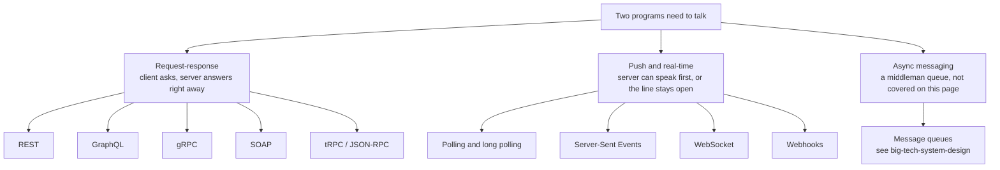

> **Why this matters:** almost every API decision you'll make as a junior developer is really just "which branch of this tree am I on?" Request-response styles differ mostly in *data format and contract*. Push and real-time styles differ mostly in *who is allowed to speak first, and for how long the connection stays open*. Once you know which branch you need, picking the specific style is a much smaller decision.

## Request–response styles

In every style below, the client sends one request and the server sends back one response, then the conversation is over (until the client asks again). This is the oldest and still by far the most common pattern on the web.

### REST

**In one line:** an API style where every "thing" (a book, an order, a user) gets its own web address (URL), and you use HTTP verbs — GET, POST, PUT, PATCH, DELETE — to say what you want to do to it.

**How it works:** REST (Representational State Transfer) treats your API like a set of nouns and a small, shared set of verbs. `/books/42` is a noun — one specific book. `GET` on that URL means "give me it." `PUT` means "replace it." `DELETE` means "remove it." Nothing about the verb changes between resources: the same four or five verbs apply to books, orders, and users alike, which is exactly what makes REST easy to guess your way through without reading documentation.

Think of it like a restaurant where every dish has its own printed card on the wall, each with a number. "Get card 42" gets you the book's details. "Add a new card to the orders board" places an order. You never need a new kind of instruction for a new kind of dish — you just point at a different card.

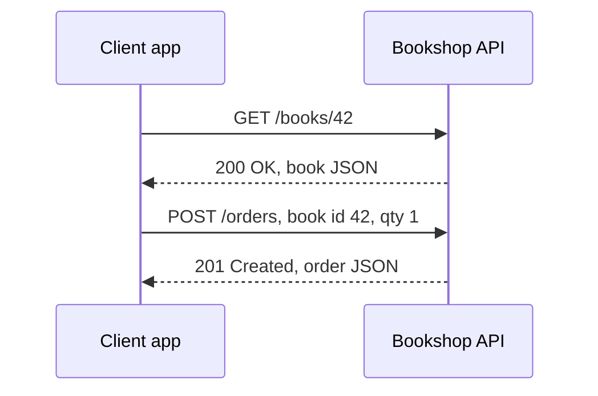

**Example:**

```http
GET /books/42 HTTP/1.1
Host: api.bookshop.com
Accept: application/json

HTTP/1.1 200 OK
Content-Type: application/json

{
  "id": 42,
  "title": "Dune",
  "author": "Frank Herbert",
  "price": 15.99,
  "inStock": true
}
```

```http
POST /orders HTTP/1.1
Host: api.bookshop.com
Content-Type: application/json

{ "bookId": 42, "quantity": 1 }

HTTP/1.1 201 Created
Content-Type: application/json

{ "orderId": 901, "status": "pending" }
```

**Good for:**
- Public APIs where developers want to guess a URL and `curl` it
- Simple CRUD (create, read, update, delete) over clear resources
- Getting free caching from browsers and proxies, since GET requests are just URLs

**Not great for:**
- A mobile screen that needs a sliver of five different resources — you either over-fetch (get whole objects and throw most away) or under-fetch (make five separate round trips)
- APIs with deeply nested, constantly-changing relationships between resources

**Real-world:** GitHub offers a REST API (and, alongside it, a GraphQL API for the cases REST is worse at).

### GraphQL

**In one line:** an API style with a single URL, where the client sends a query describing exactly the fields it wants — even across several linked resources — and gets back exactly that shape, no more and no less.

**How it works:** instead of many URLs for many resources, a GraphQL API exposes one endpoint (commonly `/graphql`) and a **schema** — a written contract of what fields and types exist and how they connect. The client writes a query that walks that schema: "give me this book's title, its author's name, and its three newest reviews' ratings" — all in one request, one response, no separate round trip for the author or the reviews.

It's like filling out a single order form for the whole kitchen instead of pointing at separate printed cards. You write down precisely what you want, from wherever it comes from in the kitchen, and one plate comes back with exactly that.

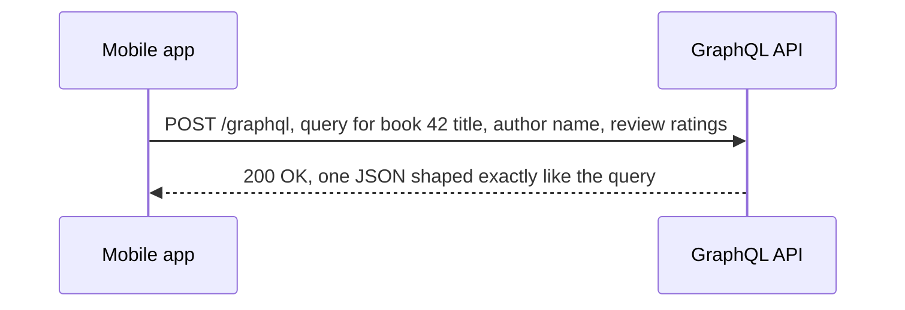

**Example:**

```graphql
query {
  book(id: 42) {
    title
    author {
      name
    }
    reviews(limit: 3) {
      rating
    }
  }
}
```

```json
{
  "data": {
    "book": {
      "title": "Dune",
      "author": { "name": "Frank Herbert" },
      "reviews": [{ "rating": 5 }, { "rating": 4 }, { "rating": 5 }]
    }
  }
}
```

**Good for:**
- Mobile clients on limited bandwidth, where every unused byte matters
- Screens that each need a different, specific slice of overlapping data
- Aggregating several backend resources into one round trip

**Not great for:**
- Simple, single-resource CRUD APIs, where GraphQL's extra machinery buys little
- Caching at the HTTP layer — most GraphQL traffic is `POST` to one URL, so the usual URL-based caching tricks don't apply out of the box
- Uploading files, which GraphQL wasn't designed around

**Real-world:** GitHub's v4 API and Shopify's Admin API are both GraphQL.

### gRPC

**In one line:** a fast, binary RPC (remote procedure call — calling a function on another computer as though it were a local one) style, built on HTTP/2, mainly used for service-to-service calls inside a company.

**How it works:** you define your API in a `.proto` file — a schema (a written contract of what fields, types, and functions exist) written in Protocol Buffers, Google's compact binary format. From that one file, tooling generates client and server code in whatever languages you need, so calling a remote function looks just like calling a local one: `client.GetBook(id: 42)`. Under the hood, gRPC sends compact binary data over HTTP/2 instead of readable JSON over HTTP/1.1, which is a large part of why it's faster and smaller on the wire.

It's the difference between mailing someone a full handwritten letter (JSON over HTTP) and paging them with a short code you both already agreed on in advance (a shared `.proto` contract) — far less to send, because both sides already know the shape of the message.

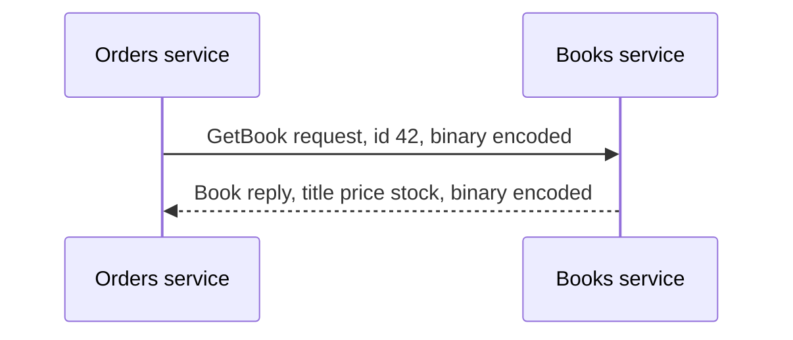

**Example:**

```proto
// book.proto
service BookService {
  rpc GetBook (BookRequest) returns (BookReply);
}

message BookRequest {
  int32 id = 1;
}

message BookReply {
  int32 id = 1;
  string title = 2;
  double price = 3;
  bool inStock = 4;
}
```

```js
// generated client, used like a local function
const reply = await bookClient.getBook({ id: 42 });
console.log(reply.title); // "Dune"
```

**Good for:**
- Low-latency calls between internal microservices (small, self-contained services that talk over the network — see [big-tech-system-design/concepts/microservices.md](https://github.com/alwintwk/big-tech-system-design/blob/main/concepts/microservices.md))
- Strongly typed contracts that many languages can share from one `.proto` file
- Streaming data in either direction over one long-lived connection

**Not great for:**
- Calling directly from a browser — browsers can't easily speak raw gRPC, so you usually need a proxy (gRPC-Web) in front
- Quick manual debugging — the binary payload isn't human-readable in a browser's network tab the way JSON is
- Public APIs where outside developers just want to `curl` an endpoint

**Real-world:** Google built gRPC from an internal system called Stubby and uses it heavily for service-to-service calls; it's also common in the Kubernetes ecosystem.

### SOAP

**In one line:** an older, strict, XML-based API style with a formal contract file (WSDL) and built-in standards for security and transactions — still common in banking, insurance, and government systems.

**How it works:** every SOAP request and response is an XML document called an "envelope," with a header (metadata, like security tokens) and a body (the actual request or data). The whole API is described up front in a WSDL file (Web Services Description Language) — a strict, machine-readable contract listing every operation, its inputs, and its outputs. Tooling can generate client code straight from that WSDL, similar in spirit to gRPC's `.proto`, but far more verbose on the wire.

If REST is a casual note and gRPC is a coded pager message, SOAP is a registered, notarized letter — heavier and slower to write, but it arrives with a stack of formal guarantees (built-in standards for security, reliability, and transactions) that the sender and receiver both agreed to in advance.

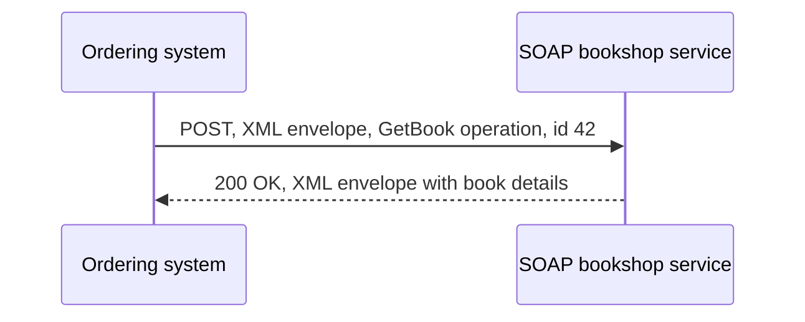

**Example:**

```xml
<?xml version="1.0"?>
<soap:Envelope xmlns:soap="http://www.w3.org/2003/05/soap-envelope">
  <soap:Header>
    <AuthToken>abc123</AuthToken>
  </soap:Header>
  <soap:Body>
    <GetBookRequest>
      <BookId>42</BookId>
    </GetBookRequest>
  </soap:Body>
</soap:Envelope>
```

**Good for:**
- Enterprise integrations that need a strict, formal contract both sides can validate against
- Systems that need built-in transaction and security standards (WS-Security, WS-AtomicTransaction) rather than rolling their own
- Legacy systems — banking, insurance, and government backends that were built on SOAP years ago and haven't moved off it

**Not great for:**
- Mobile and web apps, where the verbose XML costs bandwidth and parsing time for little benefit
- Fast iteration — the strict contract that protects enterprise integrations also makes small changes slower to ship
- New public-facing APIs, where REST or GraphQL are now the default choice

**Real-world:** many payment processors and government e-services still run SOAP interfaces alongside newer REST APIs, because replacing a decades-old, working, audited contract is a bigger risk than living with the XML.

### tRPC / JSON-RPC

**In one line:** RPC styles where the client calls a server function by name — tRPC shares TypeScript types directly between client and server with no separate schema file; JSON-RPC is the plain, language-agnostic version, calling a named method with a list of JSON parameters.

**How it works:** tRPC only makes sense when the same team, in the same TypeScript codebase (often a single Next.js project), owns both the client and the server. The server defines "procedures" as normal TypeScript functions; the client imports the *type* of the server's router and calls those procedures with full autocomplete and type-checking, with no `.proto` file, no OpenAPI document, and no code generation step — the types are inferred straight from the server code. JSON-RPC does the same basic thing — "call this named method with these parameters" — but as a plain, tiny JSON convention that works from any language, with no shared codebase required.

It's like calling a coworker's desk extension directly by name (`getBook(42)`) instead of walking to a labeled office door and knocking (a REST URL). tRPC only works when you and the coworker are on the same floor plan (the same TypeScript project); JSON-RPC works over any phone line, to anyone, as long as they know the extension number.

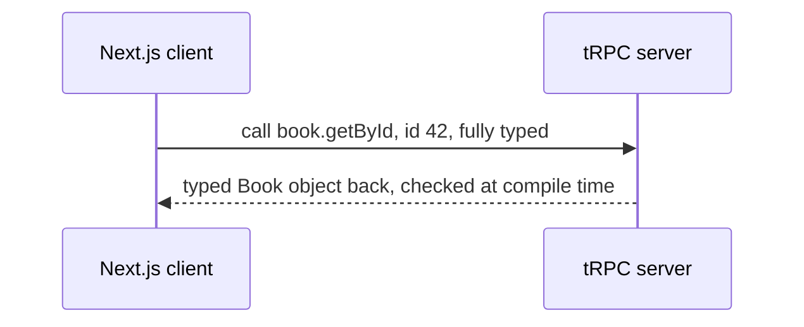

**Example:**

```ts
// server: router.ts
export const bookRouter = router({
  getById: publicProcedure
    .input(z.object({ id: z.number() }))
    .query(({ input }) => db.books.find(input.id)),
});
```

```ts
// client: no separate schema, types come straight from the server
const book = await trpc.book.getById.query({ id: 42 });
console.log(book.title); // TypeScript already knows this is a string
```

```json
// same idea in plain JSON-RPC 2.0, works from any language
{ "jsonrpc": "2.0", "method": "getBook", "params": { "id": 42 }, "id": 1 }
```

**Good for:**
- Full-stack TypeScript apps where one team owns both ends and wants end-to-end type safety without hand-writing types twice
- Small internal tools where a plain "call this method with these params" is all you need (JSON-RPC)
- Avoiding a separate schema-definition step entirely

**Not great for:**
- Public APIs consumed by many different languages or teams you don't control — tRPC's type-sharing trick only works inside one TypeScript codebase
- Large, polyglot systems that need generated clients in many languages, which is where gRPC or OpenAPI-described REST do better

**Real-world:** tRPC is popular in TypeScript-only full-stack apps built with Next.js. JSON-RPC underpins Ethereum's node API and the Language Server Protocol (LSP) that powers editor features like autocomplete in VS Code.

## Push and real-time styles

Everything above waits for the client to ask first. The styles below flip that, in different amounts: the server can hold a connection open, push data unprompted, or call you back on its own schedule.

### Polling and long polling

**In one line:** polling is the client repeatedly asking "anything new?" on a timer; long polling is the client asking once and the server holding that request open until there's an actual answer, or it times out.

**How it works:** plain (short) polling is the simplest possible way to fake real-time updates on top of an ordinary REST-style API: every few seconds, the client sends a normal request and checks if anything changed. It works everywhere, but it wastes requests when nothing has changed, and updates can lag by up to the polling interval. Long polling improves on that by having the server *not* answer immediately — it holds the connection open until it actually has something to report (or a timeout is reached), then the client immediately opens a new request and waits again. This gets updates almost as fast as a real push, using only plain HTTP.

Short polling is calling a shop every five minutes to ask "is my order ready?" Long polling is calling once and the shop keeps you on hold, in silence, until it's actually ready — then you hang up and call right back to wait for the next one.

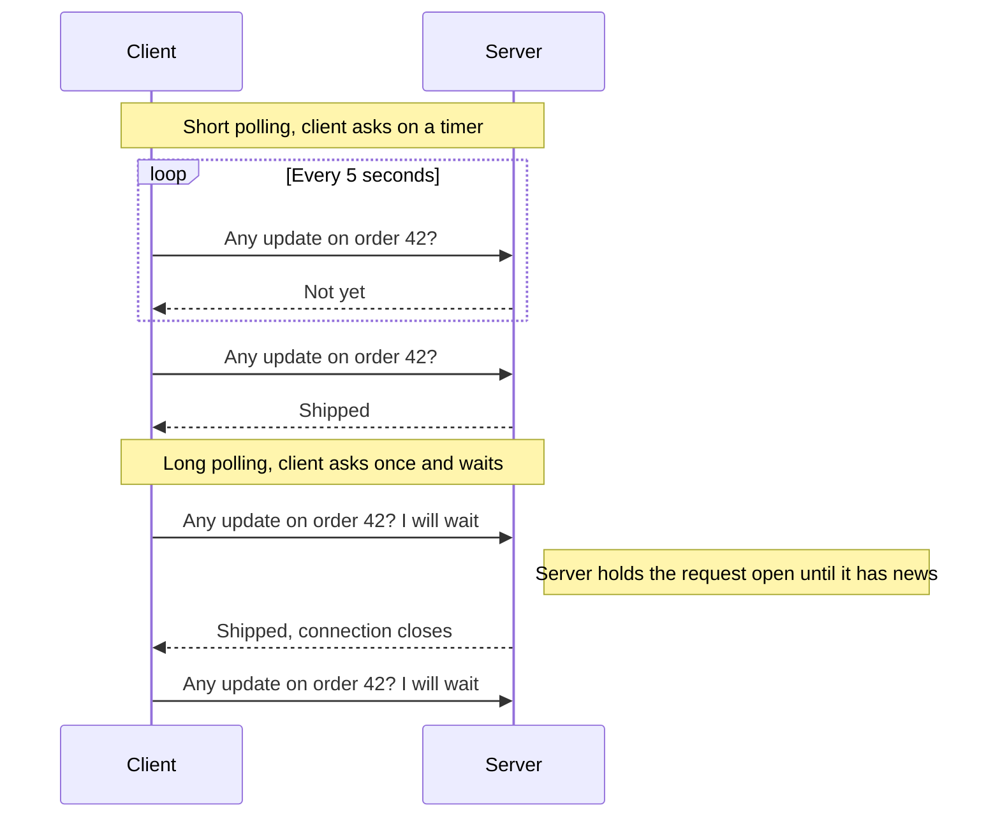

**Example:**

```js
// short polling
setInterval(async () => {
  const res = await fetch("/orders/42/status");
  const { status } = await res.json();
  updateUI(status);
}, 5000);
```

```js
// long polling, the server holds this request until it has news
async function poll() {
  const res = await fetch("/orders/42/status?wait=true");
  const { status } = await res.json();
  updateUI(status);
  poll(); // immediately ask again
}
poll();
```

**Good for:**
- Bolting near-real-time behavior onto an existing plain HTTP API, no new infrastructure needed
- Environments where WebSocket connections get blocked by a corporate proxy or firewall, since long polling is still ordinary HTTP

**Not great for:**
- Short polling: high-frequency updates, since most requests come back saying "nothing changed" — wasted work at scale
- Long polling: very large numbers of simultaneously waiting clients, since each one still ties up a server connection, just as WebSocket or SSE would, without their efficiency advantages

**Real-world:** Socket.IO, a popular real-time library, falls back to long polling automatically when a WebSocket connection can't be established, then upgrades once it can.

### Server-Sent Events (SSE)

**In one line:** the server pushes a one-way stream of text updates to the client over a single, long-lived HTTP connection, using the browser's built-in `EventSource`.

**How it works:** the client opens a normal HTTP `GET` request, but the server never closes it — instead it keeps writing small `data: ...` lines to the same connection as events happen, and the browser's `EventSource` API turns each one into a JavaScript event automatically. It's one-directional: the server can talk, but the client can't send anything back over that same connection (it uses an ordinary request for that). SSE also reconnects automatically if the connection drops, and can resume from the last event it saw.

It's a radio broadcast: you tune in and updates arrive continuously, but there's no way to talk back to the DJ on the same channel.

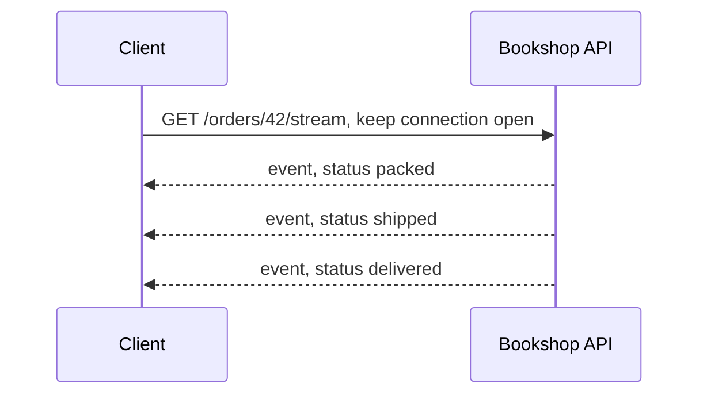

**Example:**

```
GET /orders/42/stream HTTP/1.1
Accept: text/event-stream

HTTP/1.1 200 OK
Content-Type: text/event-stream

data: {"status":"packed"}

data: {"status":"shipped"}

data: {"status":"delivered"}
```

```js
const events = new EventSource("/orders/42/stream");
events.onmessage = (e) => {
  const { status } = JSON.parse(e.data);
  updateUI(status);
};
```

**Good for:**
- One-directional live updates: order status, notifications, live scores, a stock price ticker
- Anything simpler than WebSocket will do, since it's plain HTTP with automatic reconnection built in

**Not great for:**
- Anything that needs the client to send frequent messages back over the same channel
- Binary data — SSE is text-only by design
- Browsers over plain HTTP/1.1, which cap around six connections per domain, so many open SSE streams to the same site can starve other requests (HTTP/2 removes this limit)

**Real-world:** many LLM APIs, including OpenAI's, stream chat responses to the client token-by-token using this same `text/event-stream` format.

### WebSocket

**In one line:** a single connection, upgraded from an ordinary HTTP request, that stays open and lets client and server send messages to each other in either direction, at any time.

**How it works:** the client starts with a normal HTTP request carrying an `Upgrade: websocket` header. If the server agrees, it replies `101 Switching Protocols`, and from that point on the same underlying connection carries WebSocket frames instead of HTTP — both sides can send a message whenever they want, with no need to open a new request each time. This full-duplex (both directions, simultaneously) behavior is what separates it from SSE.

It's a phone call: once you're connected, either person can speak at any moment, with no hanging up and redialing between sentences.

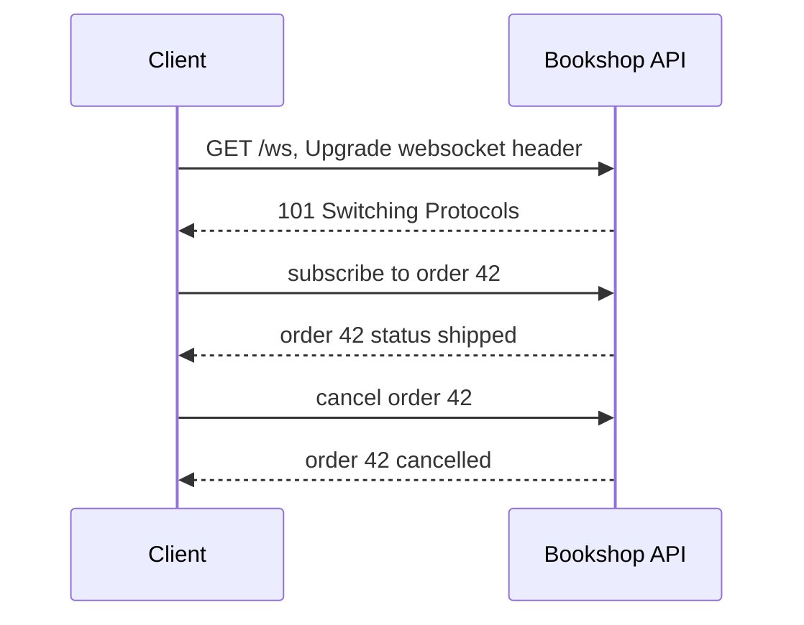

**Example:**

```js
const ws = new WebSocket("wss://api.bookshop.com/orders/42");

ws.onopen = () => ws.send(JSON.stringify({ action: "subscribe" }));

ws.onmessage = (event) => {
  const update = JSON.parse(event.data);
  updateUI(update.status);
};
```

**Good for:**
- Chat, multiplayer features, live collaborative editing — anything where both sides genuinely need to speak whenever they want
- Trading platforms and other low-latency, bidirectional feeds

**Not great for:**
- Plain request-response CRUD, where opening and maintaining a persistent connection is unnecessary overhead
- Stateless, horizontally-scaled serverless functions, since a WebSocket connection needs a server process to hold it open for as long as the client stays connected — see [big-tech-system-design/concepts/persistent-connections.md](https://github.com/alwintwk/big-tech-system-design/blob/main/concepts/persistent-connections.md) for how this is handled at scale

**Real-world:** Discord's Gateway API and Slack's Socket Mode both deliver events to bots over WebSocket connections.

### Webhooks

**In one line:** instead of you repeatedly asking another service for updates, you register a URL, and it calls *you* the moment something happens.

**How it works:** you give a third-party service a URL on your server ahead of time — a "callback URL." When their event happens (a payment clears, a pull request is opened), they send an ordinary HTTP `POST` to that URL with the event details. Your server should verify the request really came from them, usually by checking a cryptographic signature they include in a header, then respond quickly with `200 OK` so they know you received it, and do any slow processing afterward rather than while they're waiting.

It's giving your phone number to a delivery company instead of calling them every hour to ask "is it here yet?" They call you, once, the moment it actually arrives.

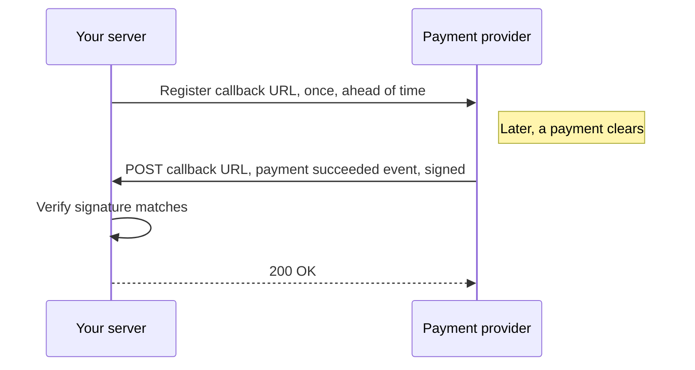

**Example:**

```http
POST /webhooks/payments HTTP/1.1
Host: bookshop.com
Stripe-Signature: t=1700000000,v1=5f8b...
Content-Type: application/json

{
  "type": "payment_intent.succeeded",
  "data": { "orderId": 901, "amount": 1599 }
}
```

```js
// verify the signature before trusting the payload
const signature = req.headers["stripe-signature"];
if (!verifyHmacSignature(req.rawBody, signature, webhookSecret)) {
  return res.status(400).send("invalid signature");
}
markOrderPaid(req.body.data.orderId);
res.status(200).send("ok");
```

**Good for:**
- Getting notified of events in a third-party system (payment succeeded, order shipped) without ever polling for them
- Decoupling systems — the sender doesn't need to know how you process the event, only that your URL exists

**Not great for:**
- Anything that needs an immediate, synchronous answer back, since the caller usually only expects a quick acknowledgement, not a result
- Situations where you can't expose a public, internet-reachable HTTPS endpoint for the other service to call

**Real-world:** Stripe sends webhooks for payment events, and GitHub sends webhooks for repository events like a push or a new pull request.

## Side by side

| Style | Data format | Transport | Who starts the talk | Typing / contract | Best for | Watch out for |
|---|---|---|---|---|---|---|
| REST | JSON (usually) | HTTP/1.1 or HTTP/2 | Client | Informal, or OpenAPI as a separate document | Public APIs, simple CRUD | Over- or under-fetching fields |
| GraphQL | JSON | HTTP, one endpoint | Client | Strict schema (SDL), enforced by the server | Flexible clients, many field shapes | Hard to cache at the HTTP layer |
| gRPC | Binary (Protocol Buffers) | HTTP/2 | Client | Strict `.proto` contract, generated code | Internal microservice calls, streaming | Not directly callable from a browser |
| SOAP | XML | HTTP or other transports | Client | Strict WSDL contract | Enterprise and legacy integrations | Verbose payloads, slower to evolve |
| tRPC / JSON-RPC | JSON | HTTP | Client | tRPC: shared TS types, no schema file. JSON-RPC: informal | Full-stack TypeScript apps, small RPC tools | tRPC is TypeScript-only, across one codebase |
| Polling / long polling | JSON (usually) | HTTP | Client, repeatedly | Whatever the underlying REST call defines | Retrofitting near-real-time onto REST | Wasted requests (polling) or tied-up connections (long polling) |
| Server-Sent Events | Text (`text/event-stream`) | HTTP, connection kept open | Client opens it, then server pushes | Informal, plain text events | One-directional live updates | Client can't reply on the same channel |
| WebSocket | Text or binary frames | TCP, upgraded from HTTP | Client opens it, then either side | Informal, you define your own messages | Bidirectional real-time features | Needs a server that can hold the connection open |
| Webhooks | JSON (usually) | HTTP | The other service | Whatever the provider documents | Event notifications from third parties | Must verify the signature, or trust nothing sent to you |

## Which one should I pick?

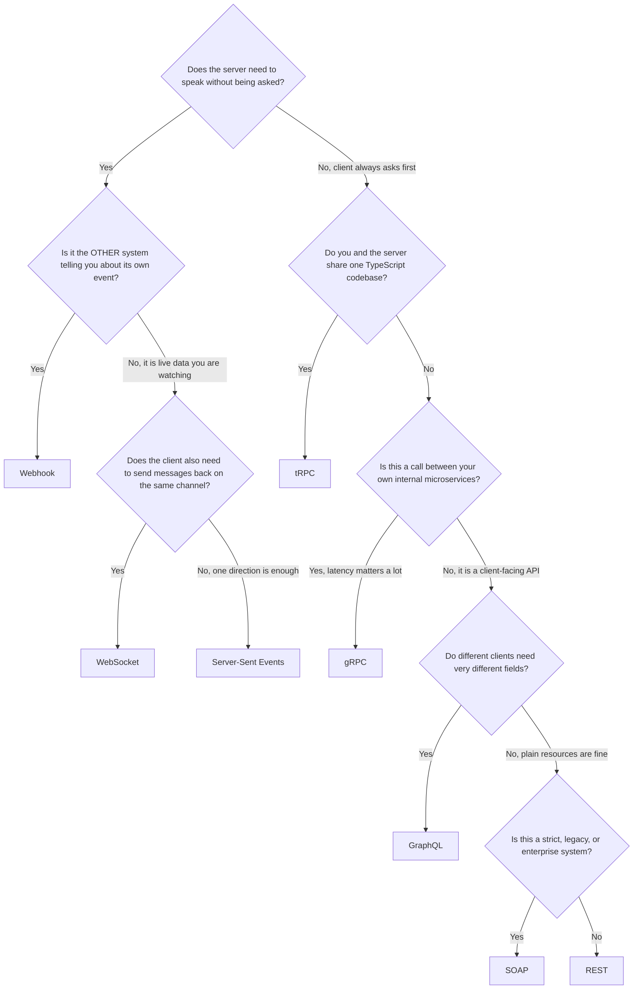

A few real scenarios to sanity-check the tree against:

1. **A mobile app with many screens, each needing a different slice of book, author, and review data, on a slow connection.** GraphQL — because each screen can ask for exactly the fields it needs, in one request, and nothing more.
2. **A public API for third-party developers who want to `curl` an endpoint and read the docs in five minutes.** REST — because URLs are guessable, HTTP caching works out of the box, and almost every language has a plain HTTP client.
3. **The pricing service calling the inventory service, both owned by your team, thousands of times a second.** gRPC — because the strict, generated contract and compact binary format matter more here than human-readability, and both ends are internal.
4. **A payment provider needs to tell your server the instant a card payment clears, without you polling it.** A webhook — because the payment provider already knows the moment it happens; there's no reason for you to keep asking.
5. **An order-tracking page that should update live as a package moves through packed, shipped, and delivered, with no need for the browser to send anything back.** Server-Sent Events — because it's one-directional, simpler to build and debug than WebSocket, and reconnects on its own.

## Cross-cutting ideas

These aren't API styles — they're concerns that show up no matter which style you pick.

### Versioning

APIs change, but callers built against the old version shouldn't break the moment you ship a new one. There are three common approaches: put the version in the URL (`/v1/books/42`, `/v2/books/42`) — simple and visible, but means maintaining parallel routes; put it in a header (`Accept: application/vnd.bookshop.v2+json`) — keeps URLs stable, but is less obvious to a developer poking around; or design so you rarely need a version at all, by only ever *adding* optional fields and never removing or renaming ones callers already depend on ("evolve without breaking"). Most real APIs mix the last approach with an occasional URL-versioned major bump for genuinely breaking changes.

### Pagination

Returning ten thousand books in one response is slow to generate and slow to parse — so large lists are split into pages. **Offset pagination** asks for a page by position: `GET /books?offset=40&limit=20` means "skip the first 40, give me the next 20." It's simple, but if a book is added or removed while someone is paging through, offsets can shift and rows get skipped or repeated. **Cursor pagination** asks instead for "everything after this specific item": `GET /books?after=book_42&limit=20` returns the 20 books following book 42, regardless of what's been added or removed elsewhere in the list. Cursor pagination is more work to build but stays correct under a changing dataset, which is why most large-scale APIs (Stripe, GitHub) use it for anything that can grow while someone is reading it.

### Idempotency

An idempotent request has the same effect whether you send it once or ten times — which matters because networks are unreliable, and a client that doesn't get a response has no way to know whether the request succeeded or just the reply got lost. `PUT /books/42` with the same body is naturally idempotent (setting a book's price to $15.99 twice leaves it at $15.99). `POST /orders`, by default, is not — sending it twice could create two orders. The fix is an **idempotency key**: the client generates a unique ID for the attempt and sends it along; the server remembers which keys it's already processed and returns the original result instead of repeating the action on a retry. See [big-tech-system-design/concepts/idempotency.md](https://github.com/alwintwk/big-tech-system-design/blob/main/concepts/idempotency.md) for the full mechanics.

### Rate limiting

If one client can call your API as fast as it wants, it can accidentally (or deliberately) starve everyone else, or overload your database. Rate limiting caps how many requests a client can make in a given window — commonly communicated back with headers like `X-RateLimit-Remaining` and a `429 Too Many Requests` response once the limit is hit. This applies to every style on this page: a REST client hammering `GET /books`, a GraphQL client sending an expensive nested query, or a webhook receiver that can't keep up all need some form of limit. See [big-tech-system-design/concepts/rate-limiting.md](https://github.com/alwintwk/big-tech-system-design/blob/main/concepts/rate-limiting.md) for the algorithms behind it.

### Caching API responses

Not every request needs to hit the database. HTTP gives you `Cache-Control` headers to say how long a response can be reused (`Cache-Control: max-age=60` means "this is good for 60 seconds"), and `ETag` — a short fingerprint of the response — lets a client ask "has this changed since the fingerprint I already have?" with a conditional `If-None-Match` request; if nothing changed, the server replies `304 Not Modified` with no body at all, saving the bandwidth of resending data the client already has. REST benefits from this almost for free, since each resource has its own cacheable URL; GraphQL and RPC-style POST requests need more deliberate work to get the same benefit, since they usually share one URL. See [big-tech-system-design/concepts/caching.md](https://github.com/alwintwk/big-tech-system-design/blob/main/concepts/caching.md) for caching beyond just the HTTP layer.

## Common mistakes

- **Picking GraphQL because it sounds modern, for a simple CRUD API.** If your clients all want roughly the same shape of data, REST is less machinery for the same result.
- **Building a public API with gRPC.** Great for internal service calls; painful for external developers who just want to hit an endpoint with `curl` or Postman.
- **Trusting a webhook payload without checking its signature.** Anyone can `POST` to a public URL pretending to be your payment provider — signature verification is not optional.
- **Using short polling for something that needs to feel instant.** Every interval you add is latency your users feel; long polling, SSE, or WebSocket exist specifically to remove that lag.
- **Reaching for WebSocket when SSE would do.** If the client never needs to send anything back over that channel, WebSocket adds connection-management complexity for no benefit.
- **Treating "POST is not idempotent" as someone else's problem.** A flaky network will eventually cause a client to retry a `POST /orders` — without an idempotency key, that's a duplicate order in production.
- **Forgetting that a REST API without pagination will, eventually, try to return every row in the table.** Add pagination before the table is big, not after the endpoint starts timing out.

## Go deeper

Big-tech-system-design concepts:
- [Persistent connections](https://github.com/alwintwk/big-tech-system-design/blob/main/concepts/persistent-connections.md) — how WebSocket connections are managed at scale, across many servers
- [Message queues and logs](https://github.com/alwintwk/big-tech-system-design/blob/main/concepts/message-queues-and-logs.md) — async messaging, the third bucket in "The map" above
- [Idempotency](https://github.com/alwintwk/big-tech-system-design/blob/main/concepts/idempotency.md) — making retries safe
- [Rate limiting](https://github.com/alwintwk/big-tech-system-design/blob/main/concepts/rate-limiting.md) — protecting an API from too many requests
- [Caching](https://github.com/alwintwk/big-tech-system-design/blob/main/concepts/caching.md) — keeping repeated reads cheap, including API responses

Tools: [web-dev-resources → APIs, RPC & realtime](https://github.com/alwintwk/web-dev-resources#apis-rpc--realtime)

External references:
- [MDN — HTTP request methods](https://developer.mozilla.org/en-US/docs/Web/HTTP/Methods)
- [MDN — WebSockets API](https://developer.mozilla.org/en-US/docs/Web/API/WebSockets_API)
- [MDN — Server-sent events](https://developer.mozilla.org/en-US/docs/Web/API/Server-sent_events)
- [graphql.org — Introduction to GraphQL](https://graphql.org/learn/)
- [grpc.io — What is gRPC](https://grpc.io/docs/what-is-grpc/introduction/)
- [RFC 6455 — The WebSocket Protocol](https://www.rfc-editor.org/rfc/rfc6455)
- [JSON-RPC 2.0 Specification](https://www.jsonrpc.org/specification)
