# Concurrency

> Many things happening at once, on one machine or many — and the specific ways that goes right, goes wrong, and gets kept safe.

[← Back to Concurrency](../README.md#concurrency)

## Why this matters

Picture the bookshop's checkout page on launch day for a hot new release. A thousand people hit "Buy" within the same second, on a book with three copies left. Somewhere in the code, something reads the stock count, decides "yes, there's a copy," and writes back a lower number. If two requests do that read at almost the same instant, both can see "3 in stock," both can decide to proceed, and the shop sells four copies of a book it had three of — or worse, sells the exact same physical copy twice. Meanwhile, the part of the system that emails order confirmations shouldn't freeze the whole server while it waits on a slow mail provider, and the nightly job that recalculates bestseller rankings shouldn't have to queue up behind every single checkout request either.

All of that is concurrency: several things that need to make progress around the same time, sometimes touching the same data, sometimes on one machine and sometimes spread across many. Handle it well and the app stays fast and correct under load. Handle it badly and you meet the two bugs almost every backend developer eventually meets in production: a frozen app (one slow thing blocking everything else that didn't need to wait on it) or a double charge (two things touching the same data at once, with nobody checking). This page covers the vocabulary and mental models for both sides of that: how a single machine can appear to do many things at once, exactly what goes wrong when shared data isn't handled carefully, and the tools — from a simple lock up to a distributed queue — that keep it safe.

## The map

Three questions sit behind almost everything below. First, on one machine: how do you actually get several things running "at once" — by switching between them rapidly, by truly running more than one at the same instant, or both — and with which mechanism (a process, a thread, an event loop, a coroutine, an actor, a worker pool)? Second, once two things really can touch the same data at the same time: what specifically can go wrong? Third: what tool actually stops that from happening? A final layer sits on top of all three — once an app isn't one process anymore but many, spread across different machines, everything above gets harder, because the network connecting them can be slow, can drop a message, or can partition entirely.

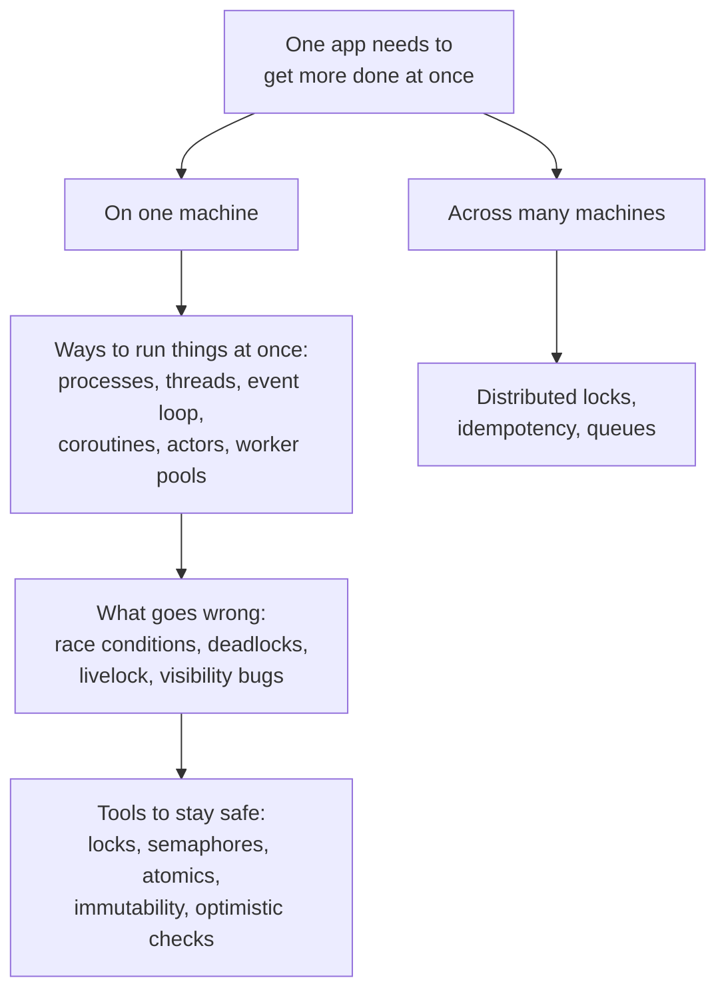

> **Why this matters:** the specific technique changes by language and runtime, but the shape of the problem doesn't. Every style below is answering one of those same three questions, just with a different trade-off between simplicity, speed, and how much you can trust the other thing not to interfere.

## Concurrency vs parallelism

These two words get used interchangeably in casual conversation, but they describe different things, and the difference changes which fix actually helps when something is "too slow."

### The difference

**In one line:** concurrency is structuring work so multiple tasks can each make progress by taking turns; parallelism is actually running more than one task at the exact same instant, on separate cores or machines.

**How it works:** picture one cook, alone in a kitchen, juggling a pot that needs stirring, vegetables that need chopping, and an oven timer to watch. Only one of those things is physically happening in any given moment, but the cook switches between them fast enough that all three appear to move forward together — that's concurrency. Parallelism is hiring a second cook: now the sauce gets stirred and the vegetables get chopped at literally the same moment, by two different pairs of hands. A single-core CPU, or a single-threaded runtime like Node.js's event loop, can only ever be concurrent — it fakes "at once" by switching fast. A multi-core machine, or a fleet of servers, can be genuinely parallel.

This distinction decides which fix actually helps. If the work is **I/O-bound** — mostly waiting on a network reply from a payment gateway, or a disk write to finish — concurrency alone helps a lot, because the "cook" doesn't need a second pair of hands, it just needs to stop standing frozen staring at the oven while nothing is happening. That's exactly what an event loop or a pool of lightweight coroutines is good at. If the work is **CPU-bound** — resizing an image, generating a PDF, computing a big report — only parallelism helps, because there's no waiting to overlap; the computation itself needs a second, real, physical worker. Adding more concurrency to CPU-bound work (more coroutines juggling on the same one core) doesn't make it faster; it just adds switching overhead.

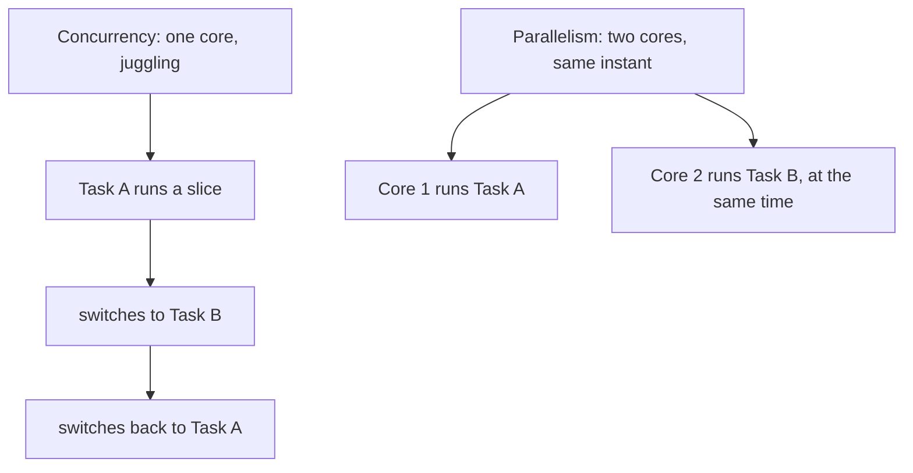

**Example:** the bookshop's checkout flow waiting on a payment provider's API is I/O-bound — a single Node.js process can hold thousands of these "waiting" checkouts concurrently, because none of them are actually using the CPU while they wait. Generating a PDF invoice for each of those orders is CPU-bound — running that on the same single-threaded process would freeze every other request in line behind it, and only spreading the work across real cores (a worker pool, or separate processes) actually speeds it up.

**Good for:**
- Concurrency: many mostly-waiting tasks (network calls, user requests, timers)
- Parallelism: a fixed amount of real computation that needs to finish faster

**Watch out for:**
- Adding threads or coroutines to CPU-bound work expecting a speedup, then being surprised when one core is still pegged at 100% and nothing got faster
- Assuming "it's concurrent" means "it's parallel" — they only sometimes overlap, and mixing them up leads to picking the wrong tool

## Ways to run things at once

Every mechanism below is a different answer to "how do I structure several tasks so they can all make progress," trading off cost to create, cost to switch between, and how much they can see of each other's memory.

### Processes

**In one line:** a process is a running program with its own private slice of memory, fully isolated from every other process by the operating system.

**How it works:** think of two completely separate kitchens, each with its own fridge, its own ingredients, its own staff — a cook in one kitchen cannot reach into the other kitchen's fridge directly, no matter how close the buildings are. That's a process: the operating system gives it its own memory space, and another process can't casually read or write into it. If two processes need to share something, they have to do it deliberately, through the operating system — a pipe, a socket, a shared memory segment, or simply a network call. This isolation is also the appeal: if one process crashes, it doesn't take the others down with it.

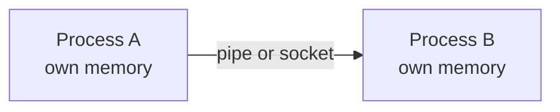

**Example:**

```bash
# each of these is a fully separate process, own memory, own PID
node checkout-service.js &
node email-worker.js &
node invoice-pdf-worker.js &
```

**Good for:**
- Isolating unrelated services so one crashing doesn't take the others down
- Running genuinely parallel work across CPU cores, since each process can be scheduled onto a different core

**Watch out for:**
- Starting a new process is comparatively slow and memory-heavy, so spinning one up per request doesn't scale
- Sharing data between processes always needs an explicit mechanism — there's no shortcut through shared variables

### Threads

**In one line:** a thread is a worker that runs inside a process and shares that process's memory with every other thread in it, which makes threads cheap to create but easy to let step on each other's data.

**How it works:** back in the kitchen, threads are more like several cooks sharing one kitchen, one set of ingredients, and one countertop. That's much cheaper to set up than building a second kitchen — everyone already has access to the same bowls and knives — but now two cooks can grab the same bowl at the same instant, and whoever wrote to it last wins, with no guarantee it's the one you expected. The operating system schedules threads onto CPU cores, so multiple threads inside one process can genuinely run in parallel on a multi-core machine, which is exactly what makes their shared memory both useful and dangerous.

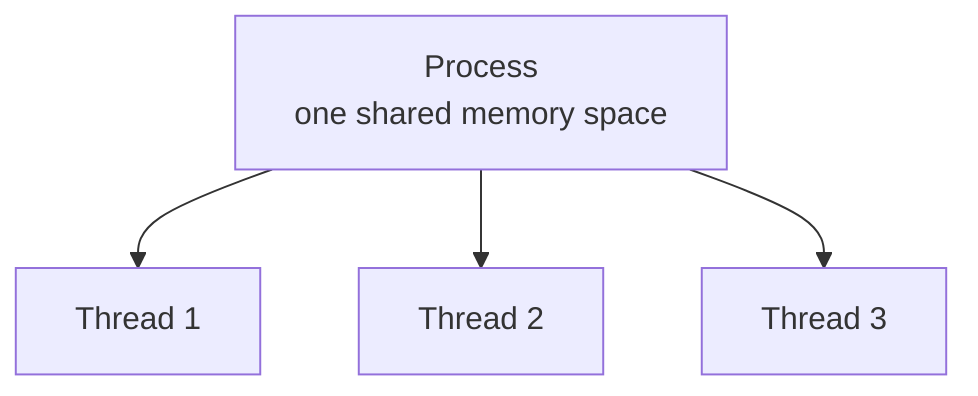

**Example:** in Java, `new Thread(() -> processOrder(orderId)).start()` starts a new OS thread inside the same process, sharing every object the rest of the program can see. Python has real OS threads too, but its Global Interpreter Lock (GIL) means only one thread runs Python bytecode at a time in the standard build (Python 3.13+ also ships an optional "free-threaded" build without it) — Python threads help with I/O-bound waiting, but not with CPU-bound parallelism, which is why Python reaches for separate processes (or `asyncio`, below) for those two cases respectively.

**Good for:**
- Genuine CPU parallelism in languages without a GIL-style restriction (Java, C#, Go, Rust, C++)
- Sharing large in-memory data structures between workers without copying them

**Watch out for:**
- Every shared variable is a potential race condition unless it's explicitly protected — see "What goes wrong," below
- Python's GIL means threads there don't give CPU parallelism the way they do in most other languages

### Event loop and async/await

**In one line:** a single thread that never sits idle waiting — it hands slow work (network, disk, timers) off to the runtime, moves on to other tasks, and comes back to resume each one the moment its slow work finishes.

**How it works:** imagine one waiter working a restaurant floor. Instead of standing at the kitchen window until an order is ready, the waiter drops the ticket off, immediately goes to take the next table's order, checks on a different table's drinks, and only comes back to the first table once the kitchen actually has the food. `async`/`await` is syntax that lets you write that waiter's code top-to-bottom, as if each step waited in place, while the runtime actually suspends the function at each `await` and resumes it later — no manual callback juggling required. Underneath, the event loop is a simple rule: run code from the call stack until it's empty, then drain everything that's ready in the microtask queue (resolved promises), then take one task from the callback queue (timers, I/O completions), and repeat.

<a href="https://alwintwk.github.io/dev-knowledge/diagrams/concurrency-event-loop.html">
  <picture>
    <source media="(prefers-color-scheme: dark)" srcset="../diagrams/concurrency-event-loop.dark.png">
    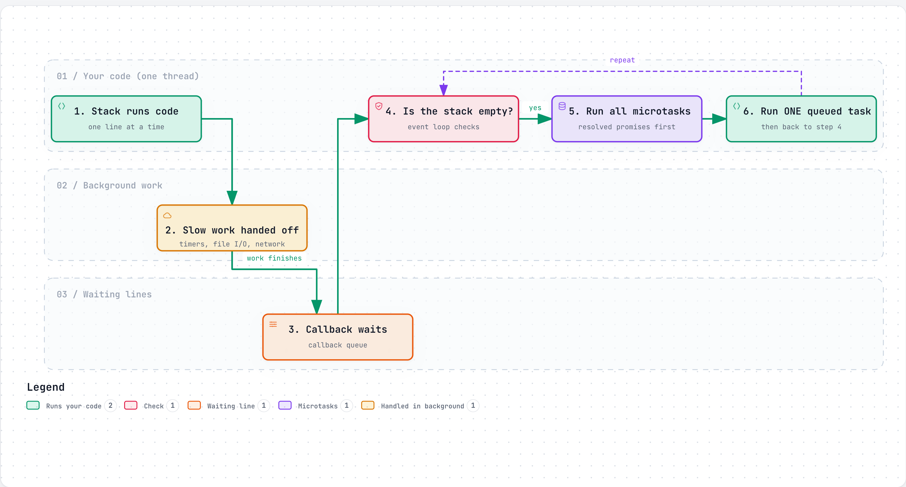
  </picture>
</a>

<sub>Click the diagram for the interactive version (zoom, dark mode, trace a path).</sub>

**Example:**

```js
async function checkout(bookId, userId) {
  // both requests are in flight at the same time, not one after the other
  const [book, user] = await Promise.all([
    fetchBook(bookId),
    fetchUser(userId),
  ]);

  if (book.stock <= 0) throw new Error("out of stock");
  return placeOrder(book, user);
}
```

`await` pauses only that one function; the event loop is free to run other requests' code while this one waits on the network. `Promise.all` starts both fetches concurrently instead of awaiting them one after another, which is the difference between two round trips run back-to-back and two round trips overlapped.

**Good for:**
- Handling thousands of concurrent, mostly-waiting connections cheaply on a single thread — exactly Node.js's core scaling story
- Writing async code that reads like ordinary, top-to-bottom synchronous code

**Watch out for:**
- One long synchronous computation (a big loop, a heavy JSON parse) blocks the entire event loop — nothing else runs until it finishes, no matter how many other requests are "waiting"
- An unhandled promise rejection can crash the process or silently vanish, depending on the runtime and version

### Coroutines / green threads

**In one line:** lightweight, cooperative "threads" that a language runtime schedules itself, rather than the operating system, so you can cheaply run thousands or millions of them at once.

**How it works:** Go's goroutines are functions that start with the `go` keyword and get multiplexed by Go's own scheduler onto a small pool of real OS threads — you might run a million goroutines on a machine with only a handful of actual threads, because most of them are just waiting, not consuming a core. Python's `asyncio` takes a different shape but solves the same problem: it's single-threaded and cooperative, much like JavaScript's event loop, where each `async def` function voluntarily hands control back at every `await`. In both cases, the appeal is the same: the cost of creating and switching between these "coroutines" is tiny compared to a real OS thread, so you can afford vastly more of them.

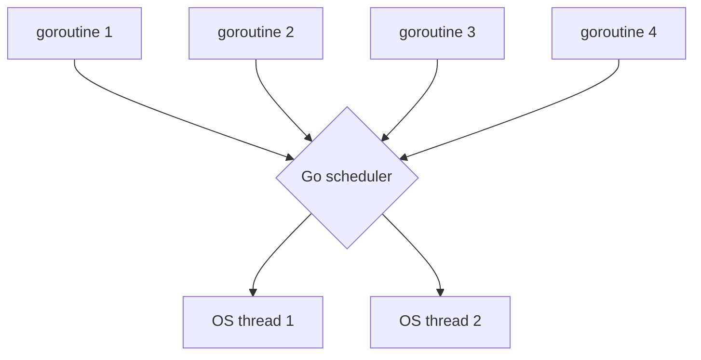

**Example, Go — goroutines and a channel:**

```go
func checkStock(bookID int, results chan<- int) {
    stock := db.GetStock(bookID) // slow I/O, this goroutine yields while waiting
    results <- stock             // send the answer back down the channel
}

func main() {
    results := make(chan int)
    go checkStock(42, results) // starts, doesn't block main
    go checkStock(7, results)  // starts, doesn't block main
    fmt.Println(<-results, <-results) // wait for both answers
}
```

**Example, Python — `asyncio.gather`:**

```python
async def fetch_book(session, book_id):
    async with session.get(f"/books/{book_id}") as resp:
        return await resp.json()

async def checkout(session, book_ids):
    # runs all the fetches concurrently, waits for all of them
    return await asyncio.gather(*(fetch_book(session, bid) for bid in book_ids))
```

**Good for:**
- Massive numbers of cheap, mostly-waiting tasks — tens of thousands of goroutines is routine in Go
- Structuring I/O-heavy code without manual callback management

**Watch out for:**
- A goroutine that sends on a channel nobody ever reads leaks forever — the garbage collector can't reclaim a goroutine stuck waiting
- `asyncio` only helps with I/O-bound work; Python's GIL still limits it to one core for CPU-bound work, same as threads
- Calling a blocking (non-async) function from inside async code stalls the whole event loop or goroutine scheduler thread, defeating the point

### Actor model

**In one line:** independent "actors" that never touch each other's memory directly — they only communicate by sending messages, and each actor processes one message at a time from its own private mailbox.

**How it works:** instead of several cooks reaching into one shared bowl, give every cook their own private station with their own ingredients. If one cook needs something from another, they don't walk over and grab it — they slide a note across the counter and wait for a reply. That note is a message, the other cook's inbox is a mailbox, and because each cook only ever handles one note at a time, there's no possibility of two cooks touching the same ingredient simultaneously — there's nothing shared to touch. An actor can update its own private state, send messages to other actors, or create new actors, but it can never reach into another actor's state directly.

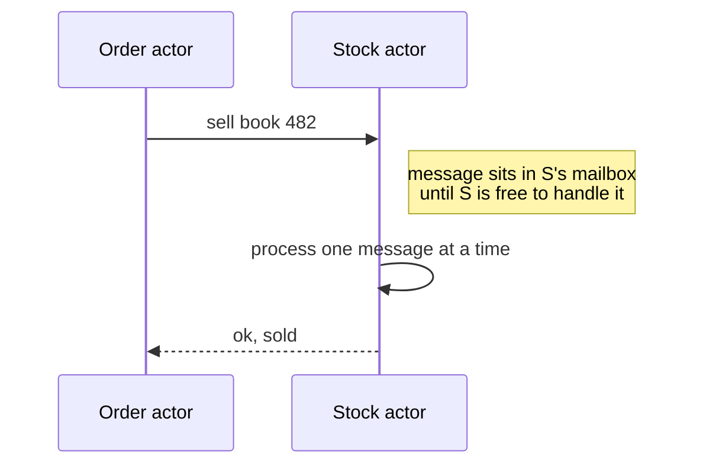

**Example, Erlang-style pseudocode — a "stock keeper" actor for one book:**

```erlang
loop(Stock) ->
    receive
        {sell, From} when Stock > 0 ->
            From ! {ok, sold},
            loop(Stock - 1);
        {sell, From} ->
            From ! {error, out_of_stock},
            loop(Stock)
    end.
```

**Good for:**
- Fault isolation — Erlang's "let it crash" philosophy restarts a failed actor in a known clean state instead of trying to defensively code around every possible failure
- Systems that naturally span multiple machines, since actors already talk only through messages, which cross a network boundary just as easily as a process boundary

**Watch out for:**
- Message ordering between two different senders isn't guaranteed, only the order from one specific sender to one specific actor
- Debugging a flow of messages across many actors is harder than reading a single stack trace — the state that mattered was in a mailbox, not on a call stack

### Worker pools

**In one line:** a fixed number of workers pulling tasks off a shared queue, so you get real parallelism without spawning a new thread or process for every single job.

**How it works:** rather than hiring a new cook for every order that comes in, a kitchen keeps a fixed staff of, say, four cooks, and every order goes into one shared basket. Whichever cook is free grabs the next order from the basket. This caps how many workers exist at once — protecting memory and CPU from being overwhelmed by a burst of ten thousand simultaneous orders — while still letting several orders cook in parallel.

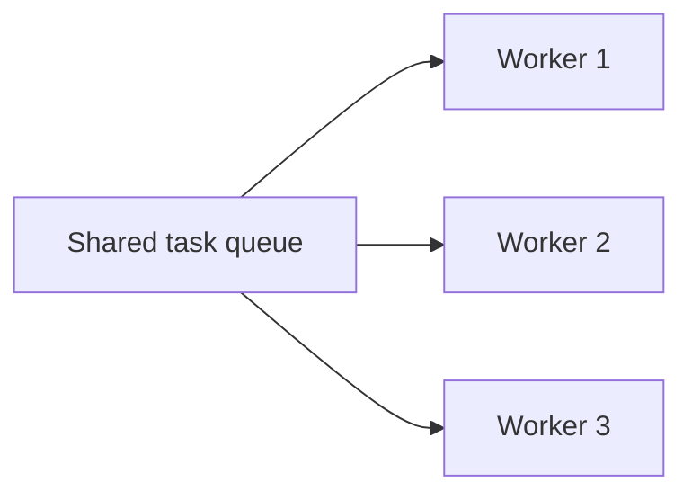

**Example:** Node's `worker_threads` module runs genuinely parallel JavaScript threads for CPU-bound work like generating a PDF invoice, and a small pool of them (instead of one thread per invoice) keeps memory bounded:

```js
const pool = new WorkerPool({ size: 4, script: "./generate-invoice.js" });
for (const order of pendingOrders) {
  pool.run({ orderId: order.id }); // queued if all 4 workers are busy
}
```

**Good for:**
- CPU-bound work (image processing, PDF generation, report building) that needs real parallelism but shouldn't be allowed to spawn unbounded workers
- Keeping resource usage predictable under a bursty load

**Watch out for:**
- A pool sized too small becomes a bottleneck; sized too large defeats the point of bounding resource usage
- Tasks that themselves block on I/O tie up a pool worker for no CPU benefit — worker pools are for CPU-bound work, not I/O-bound work

## What goes wrong

Every mechanism above lets two or more things make progress around the same time. The moment they touch the same piece of data, a specific, well-known set of bugs becomes possible.

### Race conditions

**In one line:** two things read and write the same shared data at close to the same time, and the final result depends on the exact timing of who ran first — not on any logic anyone actually wrote.

**How it works:** the bookshop's last-copy problem from "Why this matters" is the textbook case. Two customers, Customer A and Customer B, both check the stock count for the same book at nearly the same instant. Both see "1 in stock." Both decide that's enough to place an order. Both write an order row. The book had one copy; two people now believe they bought it. Nothing in the code was wrong on its own — `if stock > 0, then sell` is a perfectly reasonable sentence — the bug is the gap between the read and the write, a gap where another request can sneak in and act on the same stale information.

<a href="https://alwintwk.github.io/dev-knowledge/diagrams/concurrency-race-condition.html">
  <picture>
    <source media="(prefers-color-scheme: dark)" srcset="../diagrams/concurrency-race-condition.dark.png">
    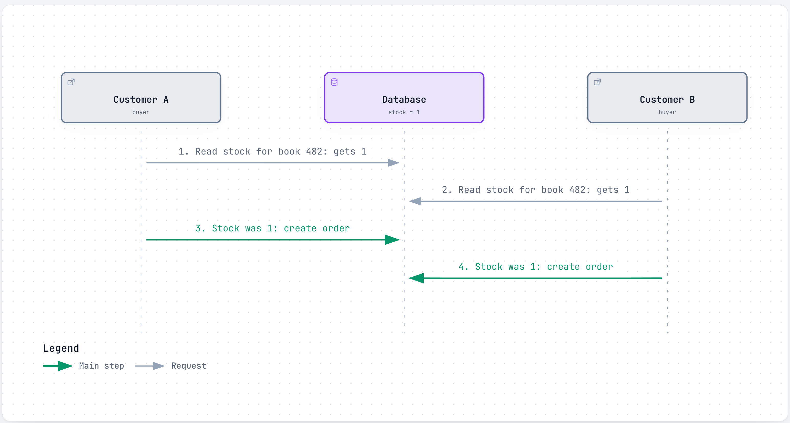
  </picture>
</a>

**Example, the naive, racy version:**

```js
// two separate steps: read, then write — a race can slip in between them
const book = await db.get("books", 482);
if (book.stock > 0) {
  await db.update("books", 482, { stock: book.stock - 1 });
  await createOrder(482);
}
```

The "Tools to stay safe" section, below, covers how to close this gap — most directly with an atomic operation, so the read-check-write happens as a single step nothing else can interleave with.

**Watch out for:**
- Code that "works in testing" because tests rarely fire two requests at the exact same instant — race conditions are notorious for only showing up under real load
- The database's isolation level changes how much of this a database alone can prevent — see [Transactions and correctness](databases.md#transactions-and-correctness) in the databases deep dive for the full breakdown of isolation levels and the anomalies each one stops

### Deadlocks

**In one line:** two or more things each hold a lock the other one needs, and each waits forever for the other to let go.

**How it works:** two cooks, one knife, one cutting board. Cook A grabs the knife and reaches for the board, which Cook B is holding. Cook B grabs the board and reaches for the knife, which Cook A is holding. Neither one will put down what they're holding until they get the other thing — so both stand there, frozen, forever. Computer scientists call the four conditions that must *all* be true for this to happen the Coffman conditions: **mutual exclusion** (a resource can only be held by one thing at a time), **hold and wait** (something holds one resource while waiting for another), **no preemption** (a resource can't be forcibly taken away from whoever holds it), and **circular wait** (a cycle exists — A waits on B, B waits on A). Break any single one of the four and a deadlock becomes impossible; the most common fix in practice is removing circular wait by always acquiring locks in the same, fixed global order.

<a href="https://alwintwk.github.io/dev-knowledge/diagrams/concurrency-deadlock.html">
  <picture>
    <source media="(prefers-color-scheme: dark)" srcset="../diagrams/concurrency-deadlock.dark.png">
    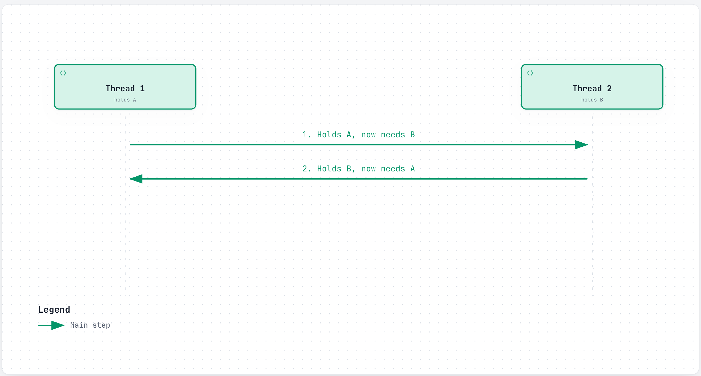
  </picture>
</a>

**Example, the classic lock-ordering bug:**

```go
// Goroutine 1
mu1.Lock()
mu2.Lock() // blocks forever if goroutine 2 already holds mu2
// ...
mu2.Unlock()
mu1.Unlock()

// Goroutine 2 — locks in the OPPOSITE order, this is the bug
mu2.Lock()
mu1.Lock() // blocks forever if goroutine 1 already holds mu1
// ...
mu1.Unlock()
mu2.Unlock()
```

Fixing it is as simple as making both goroutines lock `mu1` before `mu2`, always — removing the circular wait entirely.

**Watch out for:**
- Locking order that's consistent within one function but inconsistent across the codebase — deadlocks often come from two pieces of code written months apart, each locally reasonable
- Databases can deadlock too, between two transactions that lock rows in opposite order; most databases detect this automatically and abort one transaction so the other can proceed, rather than freezing forever

### Livelock and starvation

**In one line:** livelock is two things actively responding to each other but never actually making progress; starvation is one thing that keeps losing out to others and never gets its turn, even while the system as a whole keeps moving.

**How it works:** livelock is two people in a narrow hallway who both step aside to let the other pass, then both step back at the same moment, then both step aside again — busy, polite, and going nowhere. It's different from a deadlock: nobody is frozen, both sides are actively doing something, they're just doing it in a way that never resolves. Starvation is different again: it's not two things stuck reacting to each other, it's one low-priority task that keeps getting skipped because higher-priority work keeps cutting in line ahead of it — the system overall is fine and making progress, just never for that one unlucky task.

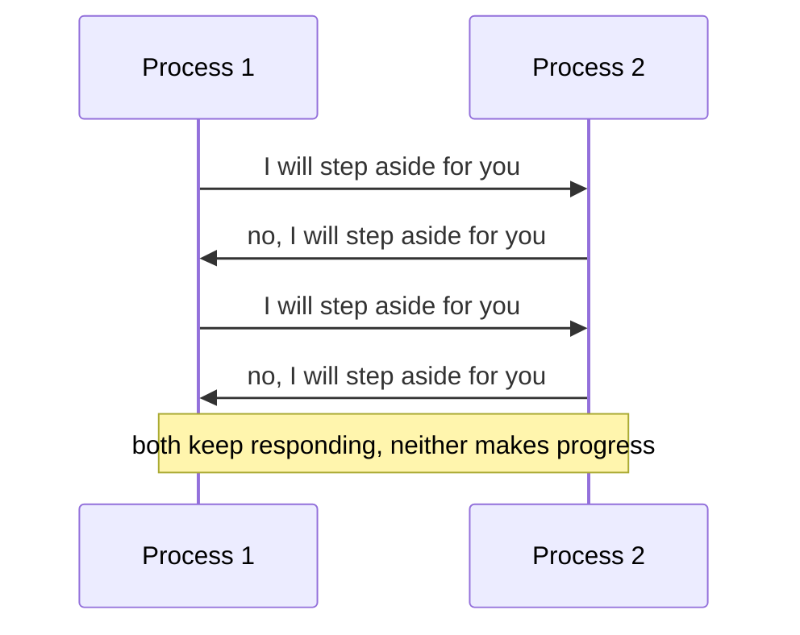

**Example:** two services both retry a failed request the instant the other one's retry also fails, on the same fixed delay — they keep colliding forever. Adding a small random jitter to each retry delay is the usual fix, so the two stop staying in lockstep. For starvation, imagine a background "recalculate bestsellers" job set to low priority on a busy checkout server — if checkout requests are treated as always higher priority, that job could in theory never run at all, even though the server is clearly not idle.

**Watch out for:**
- Retry logic with a fixed delay and no jitter is a common, easy way to accidentally build a livelock
- A priority scheme with no fairness guarantee (no aging, no minimum guaranteed turns) can starve low-priority work indefinitely, even under otherwise healthy load

### Visibility and memory ordering

**In one line:** even without two things racing to write "last," one thread's change to a shared variable might not be visible to another thread right away, because of CPU caches and reordering.

**How it works:** think of each CPU core as having its own personal sticky note (its cache) instead of writing straight onto a shared whiteboard (main memory) every time. A thread on one core can write a new value to its sticky note and consider the job done, without that value having made it to the shared whiteboard yet — so another thread reading the whiteboard still sees the old value, even though "the write already happened" from the first thread's point of view. Locks, atomic operations, and language-level memory barriers all include a promise to force that sticky note back onto the shared whiteboard at a known point, which is part of why they fix more than just "who wrote last" — they also fix "did anyone else even see it yet." This mostly isn't a concern in JavaScript, since its single-threaded event loop means there's never more than one core touching your variables at once; it matters far more in languages with real shared-memory threads, like Go, Java, C++, and Rust.

**Watch out for:**
- Reading a shared flag in a busy loop without any synchronization ("spin until this boolean flips") can loop forever on some hardware, because the compiler or CPU is free to assume nothing else changed it
- This is a real reason locks and atomics exist beyond just "stopping two writes from colliding" — they also guarantee everyone eventually sees the same value

## Tools to stay safe

Each tool below closes one of the gaps described above, at a different cost in complexity, throughput, or how much you have to trust the code using it correctly.

### Locks and mutexes

**In one line:** a mutex (mutual exclusion) is a flag only one thread can hold at a time, so any code between "lock" and "unlock" runs as if nothing else in the program exists.

**How it works:** picture a single key hanging by a stockroom door. Whoever has the key can go in and do what they need; everyone else has to wait outside until it's hung back up. A mutex is that key, made out of code: `lock()` takes it (waiting if someone else already has it), and `unlock()` hangs it back up. Anything between those two calls — the "critical section" — is now guaranteed to run without another thread touching the same protected data at the same time.

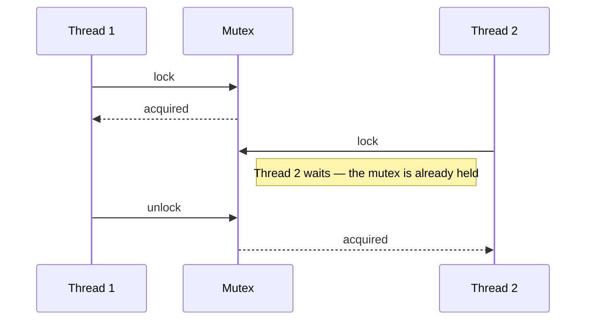

**Example, Go — `sync.Mutex`:**

```go
var mu sync.Mutex
var stock = 1

func sellBook() bool {
    mu.Lock()
    defer mu.Unlock() // guarantees the unlock happens even on an early return
    if stock > 0 {
        stock--
        return true
    }
    return false
}
```

**Good for:**
- Protecting a short section of shared, mutable state that several threads touch
- Simplicity — a mutex is the most direct, most widely understood way to say "only one at a time"

**Watch out for:**
- Forgetting to unlock (use `defer`, a `with`/`using` block, or your language's equivalent, so it happens even on an early return or an exception)
- Holding a lock across a slow operation — a network call, a disk write — turns a brief pause into a pileup of everything else waiting on that same lock
- Locking more than one mutex in inconsistent order across the codebase is exactly how deadlocks happen — see "What goes wrong," above

### Semaphores

**In one line:** a counter that lets up to N things through at once instead of just one — a mutex is really just a semaphore where N is 1.

**How it works:** think of a small parking lot with five spaces and a barrier that counts cars in and out. The sixth car has to wait at the barrier until one of the five already inside leaves. A semaphore works the same way for code: it starts with a count (how many "slots" are free), each acquire decreases the count and waits if it's already zero, and each release increases it back. Unlike a mutex, a semaphore isn't about exclusive access to data — it's about capping how many things are allowed to do something concurrently, full stop.

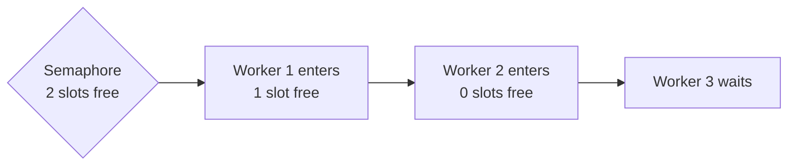

**Example, Python — `asyncio.Semaphore`:**

```python
sem = asyncio.Semaphore(5)  # at most 5 concurrent cover-image downloads

async def fetch_cover(book_id):
    async with sem:
        return await http_get(f"/covers/{book_id}.jpg")
```

**Good for:**
- Capping concurrent access to a limited resource — a database connection pool, a rate-limited third-party API
- Letting several things run at once (unlike a mutex), just not unlimited things

**Watch out for:**
- Picking N too low under-uses the resource; too high, and the semaphore stops protecting anything, since the resource behind it gets overwhelmed anyway
- Forgetting to release on an error path leaks a slot forever — use a context manager (`async with`, `try`/`finally`) rather than a manual acquire and release

### Atomic operations and compare-and-swap

**In one line:** an atomic operation runs as one indivisible step that nothing else can observe half-finished; compare-and-swap (CAS) is the classic building block — "update this value, but only if it still equals what I last saw."

**How it works:** think of a vending machine slot that either dispenses the snack and takes the coin in one indivisible click, or does neither — there's no in-between state where the coin's gone but the snack hasn't dropped. Compare-and-swap is the same idea applied to a value in memory or a database row: the operation checks "is the current value still what I expect?" and, only if so, swaps in the new value — both the check and the swap happening as one atomic step, so no other thread or transaction can sneak a change in between them. If the value had already changed, the CAS fails, and the caller re-reads and tries again.

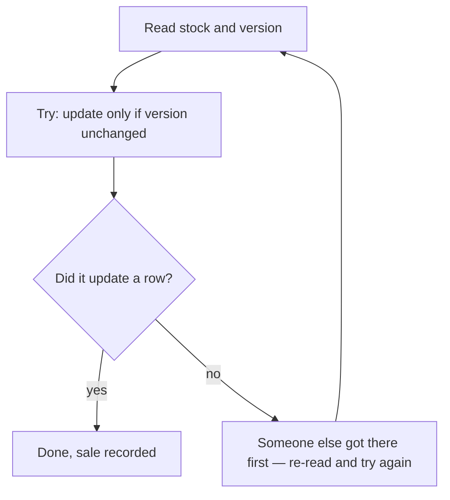

**Example, SQL — an atomic decrement, no race possible:**

```sql
UPDATE books SET stock = stock - 1 WHERE id = 482 AND stock > 0;
-- If this updates 0 rows, there was no stock left. The read ("is stock > 0"),
-- the check, and the write all happen as one atomic database step — there's
-- no gap for a second request to read the same stale value in between.
```

Most languages also expose CAS directly for in-memory values without needing a full lock — Go's `atomic.CompareAndSwapInt64`, Java's `AtomicInteger`, C#'s `Interlocked.CompareExchange` — all doing the same "swap only if unchanged" trick on a single variable.

**Good for:**
- Simple counters, flags, and single-value updates where a full lock is more machinery than the job needs
- The database-level version of a race-free read-check-write, without an explicit transaction lock

**Watch out for:**
- A CAS loop that retries in a tight cycle under heavy contention burns CPU without making progress — a livelock-adjacent problem
- Atomicity only covers the one operation — a sequence of several atomic operations, done one after another, is not itself atomic as a whole

### Immutability and message passing

**In one line:** the surest way to avoid a race condition is to never let two things mutate the same data at all — either make the data unchangeable, or pass copies of it through messages instead of sharing a pointer to it.

**How it works:** instead of two cooks stirring the same pot, give each cook their own bowl, or hand a finished dish down the line instead of both reaching into the same pan. Immutable data (data that, once created, is never changed — only replaced with a new copy) removes the "two writers" half of a race by construction: there's nothing to overwrite, only new versions to create. Message passing removes the other half: instead of two workers sharing one variable, each worker owns its own state and sends copies of data to the other, which is the same idea the actor model builds an entire concurrency style around. The Go community has a well-known proverb for this: "Do not communicate by sharing memory; instead, share memory by communicating."

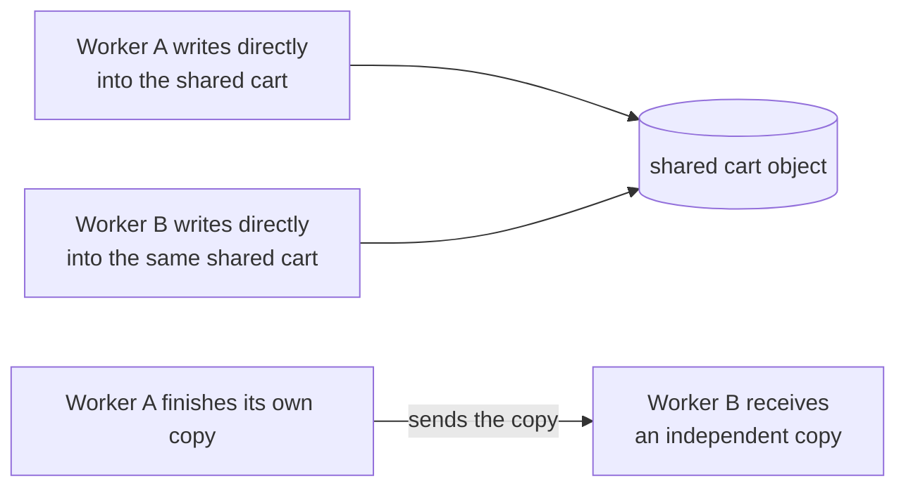

**Example, avoiding a shared mutation:**

```js
// instead of two places both mutating the same cart object...
// cart.items.push(book); // racy if two requests do this at once

// ...each step returns a brand new object, nothing shared gets mutated
const cartWithBook = { ...cart, items: [...cart.items, book] };
```

**Good for:**
- Functional-style code, actor systems, and Go/Elixir/Erlang-style concurrency, where "own your own data" is the default
- Making a whole class of race conditions structurally impossible, rather than something you have to remember to guard against

**Watch out for:**
- Copying large structures for every change can cost real memory and CPU — most languages soften this with structural sharing, but it's not free
- It only protects the memory you actually stop sharing — a shared database row behind both workers can still race, even if neither one mutates a shared in-process object

### Optimistic vs pessimistic concurrency

**In one line:** pessimistic concurrency locks a row up front so nobody else can touch it until you're done; optimistic concurrency lets everyone read and prepare freely, and only checks for a conflict at the moment you try to save.

**How it works:** this is the same trade-off as locks versus compare-and-swap, above, applied specifically to database rows — and the databases deep dive already covers it in full, including the version-column technique, the retry behavior on conflict, and when each approach degrades badly under contention. Rather than repeat that here: see [Locking vs optimistic concurrency](databases.md#transactions-and-correctness) in the databases page. The short version for this page's purposes is that pessimistic locking is a mutex applied to a row, and optimistic concurrency is compare-and-swap applied to a row.

**Good for:**
- Pessimistic: fields with heavy, near-certain contention, where most attempts would conflict anyway
- Optimistic: fields that are read often but rarely actually conflict, since it avoids paying for a lock most of the time

**Watch out for:**
- Picking pessimistic locking everywhere "to be safe" turns a busy row into a bottleneck that every request queues behind
- Optimistic concurrency requires the calling code to actually handle a failed write by re-reading and retrying — a version mismatch that's silently ignored is a bug, not a safety net

## Beyond one machine

Everything above assumes real, shared memory on one machine. The moment "concurrent" means several separate machines instead of several threads in one process, a new problem shows up on top of all the others: the network between them can be slow, can drop a message with no notice, or can partition entirely — and no lock, however well designed, can see through that.

### Distributed locks

**In one line:** a lock meant to work across separate machines or processes, usually coordinated through something like a database row, Redis, or ZooKeeper — and far trickier to get right than a local mutex, because the network itself can lie to you.

**How it works:** a local mutex is a physical key in one room — you can see with your own eyes whether it's on the hook. A distributed lock is a key that has to be recognized as valid by services running in different data centers, over connections that can pause or drop mid-conversation. The dangerous case: a process acquires a distributed lock with a 5-second expiry, then pauses for 6 seconds — a garbage collection pause, a slow disk, a network hiccup — past its own lock's expiry. The lock service, having seen no activity, assumes the process died and hands the lock to someone else. Both processes now believe, in good faith, that they hold the lock, and both may act on it.

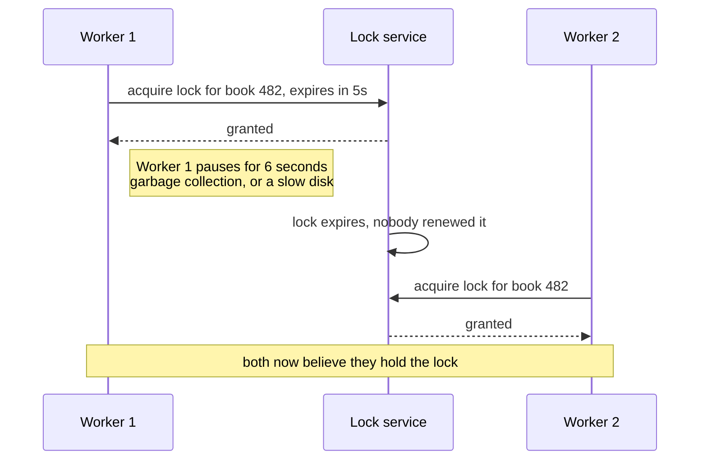

**Example, Redis — a common (if imperfect) pattern:**

```
SET lock:book:482 worker-a NX PX 5000
-- NX: only set if it doesn't already exist (this IS the "acquire")
-- PX 5000: auto-expire after 5000ms, so a crashed holder doesn't lock it forever
```

**Good for:**
- Making sure only one instance of a scheduled job runs across a fleet of servers, where an occasional, rare double-run is a tolerable inconvenience, not a disaster
- Coordinating across services when a local mutex simply isn't reachable from all of them

**Watch out for:**
- Treating a distributed lock as airtight the way a local mutex is — clock drift and pause-based expiry both mean it can't offer the same guarantee; this is the core of Martin Kleppmann's well-known critique of naive Redis-based locking
- When correctness genuinely matters (not just "mostly avoid double-running"), prefer a system with built-in fencing tokens — a monotonically increasing number the resource itself checks, so a "zombie" holder's late write gets rejected even if it still thinks it holds the lock

### Idempotency and retries

**In one line:** since a request or message over a network can be retried after a timeout with no way to know whether the first attempt actually succeeded, the operation that receives it needs to produce the same result whether it runs once or five times.

**How it works:** this concept is covered in depth on its own page — see [big-tech-system-design/concepts/idempotency.md](https://github.com/alwintwk/big-tech-system-design/blob/main/concepts/idempotency.md) for the full mechanics. Its connection to concurrency specifically: a distributed lock can expire and get reassigned mid-operation, a worker pulling from a queue can crash after doing the work but before confirming it, and a client that never got a response has no way to know if its request landed — all three of those are retry scenarios, and without idempotency, a retry after any of them can double an action that should have happened exactly once.


**Example:** the bookshop's `POST /orders` accepting a client-generated `Idempotency-Key` header, so a retried checkout after a dropped connection returns the original order instead of creating a second one.

**Good for:**
- Any operation that a client, a queue consumer, or a distributed-lock holder might retry after a failure it can't fully diagnose
- Making "at least once" delivery (the realistic guarantee most systems can actually offer) behave like "exactly once" from the caller's point of view

**Watch out for:**
- An idempotency key that's remembered forever, with no expiry, slowly leaks storage — most systems keep keys for a bounded window (hours to days), not indefinitely
- Idempotency protects against a repeated *request*; it doesn't fix a race between two genuinely different requests touching the same data — that's still a job for a lock or an atomic operation

### Queues to serialise work

**In one line:** instead of letting several workers race to touch the same resource directly, put the work into a queue and have exactly one worker — or one worker per partition — process it at a time, in order.

**How it works:** instead of five clerks all diving for the same order ticket at once, tickets go into a single tray, and clerks take the next one off the top, one at a time. No ticket gets grabbed by two clerks simultaneously, because there's only ever one "next" ticket. This is a way of sidestepping a whole category of race conditions entirely: if everything that touches book 482's stock has to go through the same queue partition, only one worker is ever touching it at a given moment, no locking required. See [big-tech-system-design/concepts/message-queues-and-logs.md](https://github.com/alwintwk/big-tech-system-design/blob/main/concepts/message-queues-and-logs.md) for how queues and logs work in depth.

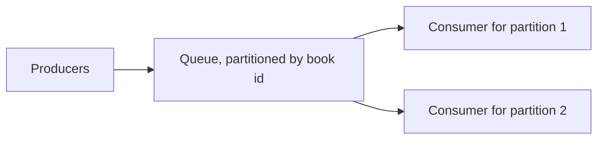

**Example:** every "sell one copy of book 482" event gets routed to the same queue partition (keyed by book ID), so the worker consuming that partition processes them strictly one at a time — no two sales of the same book are ever mid-flight together, without a single lock in sight.

**Good for:**
- Serialising all writes to one specific piece of data without needing a distributed lock at all
- Smoothing out a burst of concurrent requests into a steady, ordered stream a single worker can keep up with

**Watch out for:**
- A partitioning key that's too coarse (say, one partition for the entire bookshop) turns the queue itself into the bottleneck it was meant to avoid
- A slow consumer on one partition backs up only that partition's work — worth watching for lag per partition, not just overall queue depth

## Side by side

| Model | How it shares state | Good for | Pitfall | Example languages |
|---|---|---|---|---|
| Processes | Nothing by default — isolated memory, shared only via IPC | Fault isolation, real parallelism across cores | Slow and heavy to start per task | Any (OS-level) |
| Threads | Shared memory within one process | CPU parallelism, sharing large in-memory data | Any shared variable is a possible race | Java, C#, Go, Rust, C++ |
| Event loop / async-await | Single thread, no parallel access to worry about | Thousands of cheap, mostly-waiting connections | One blocking call freezes everything else | JavaScript / Node.js |
| Coroutines / green threads | Runtime-scheduled, cooperative | Very high volumes of lightweight concurrent tasks | Leaks if a task is left permanently waiting | Go, Python (`asyncio`), Kotlin |
| Actor model | Nothing — only messages, no shared memory at all | Fault-tolerant, naturally distributable systems | Harder to trace a bug across many mailboxes | Erlang, Elixir, Akka (Java/Scala) |
| Worker pools | Shared queue, isolated workers | Bounded, parallel CPU-bound work | Wrong pool size becomes the new bottleneck | Any (often paired with threads/processes) |

## Which model should I pick?

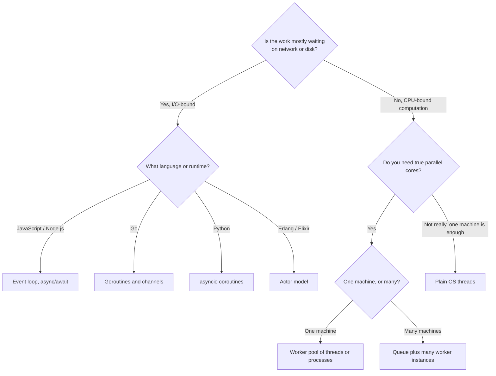

A few real scenarios to sanity-check the tree against:

1. **A checkout endpoint that calls a payment provider and a shipping-rate API, then waits on both.** Event loop with `async`/`await` and `Promise.all` — both calls are I/O-bound and can run concurrently on one thread with no extra machinery.
2. **A Go backend fetching stock levels for fifty books to render a "low stock" dashboard.** Goroutines and a channel — fifty cheap, concurrent, I/O-bound lookups is exactly what goroutines are built for.
3. **Generating a PDF invoice for every order placed in the last hour, ten thousand of them, overnight.** A worker pool of processes or threads — this is CPU-bound, so it needs real parallel cores, capped by a pool so it doesn't spawn ten thousand processes at once.
4. **A chat-and-presence system that has to survive individual connections crashing without taking the whole service down.** The actor model — each connection's state lives in its own actor, and a crash restarts just that one actor.
5. **A scheduled "send abandoned-cart emails" job that must run on exactly one instance of a horizontally-scaled fleet.** A distributed lock — no single machine can use a local mutex to coordinate across the whole fleet.

## Common mistakes

- **Doing "read, check, write" as three separate steps instead of one atomic operation.** Every gap between a read and its matching write is a window for a race condition to slip through — see `UPDATE ... WHERE stock > 0` in "Atomic operations," above, for the one-step fix.
- **Holding a lock across a slow network call.** A mutex held during a payment provider round trip turns a fast, contended resource into a queue behind the network's latency, not the lock's.
- **Blocking the event loop with synchronous CPU work.** A big synchronous loop or a heavy JSON parse in Node.js stalls every other request on that process, no matter how many of them were "just waiting."
- **Swallowing a rejected promise or a panicking goroutine.** A retry, a timeout, or a partial failure that nobody logs or handles looks like it worked, right up until the data quietly diverges from reality.
- **Treating a distributed lock like a local mutex.** A local mutex is enforced by the same machine that's checking it; a distributed lock depends on a clock, a network, and an expiry all cooperating — see "Distributed locks," above.
- **Adding a `sleep()` to "fix" a race condition instead of synchronizing properly.** It usually narrows the timing window rather than closing it, so the bug comes back the moment load changes.
- **Retrying a non-idempotent request without an idempotency key.** A flaky network will eventually cause a client, a queue consumer, or a distributed-lock holder to retry — without a key, that's a duplicate order, not a safety net.

## Go deeper

Big-tech-system-design concepts:
- [Idempotency](https://github.com/alwintwk/big-tech-system-design/blob/main/concepts/idempotency.md) — making retries safe, the concept behind "Idempotency and retries," above
- [Message queues and logs](https://github.com/alwintwk/big-tech-system-design/blob/main/concepts/message-queues-and-logs.md) — the mechanics behind "Queues to serialise work," above

Sibling deep dives:
- [Databases](databases.md#transactions-and-correctness) — ACID, isolation levels, and optimistic vs pessimistic locking at the database-row level

External references:
- [MDN — JavaScript execution model](https://developer.mozilla.org/en-US/docs/Web/JavaScript/Reference/Execution_model)
- [Go blog — Share Memory By Communicating](https://go.dev/blog/codelab-share)
- [Rob Pike — "Concurrency is not parallelism"](https://go.dev/blog/waza-talk)
- [Python — `asyncio` documentation](https://docs.python.org/3/library/asyncio.html)
- [Allen B. Downey — The Little Book of Semaphores](https://greenteapress.com/wp/semaphores/)
