# Databases

> A database is where your app's data lives permanently, organized so you can find it, trust it, and change it later without losing anything.

[← Back to Databases](../README.md#databases)

## Why this matters

Imagine you run a small bookshop with a single paper ledger for orders, a shelf list for stock, and a shoebox of customer index cards. It works fine until you get fifty orders a day, two staff writing in the same ledger at the same time, and a fire that could destroy the shoebox. A database is the software version of that ledger: a place to durably write down facts — a book exists, an order was placed, a user signed up, a review was left — so that later, your app can ask questions of those facts and trust the answers, even after a crash, even with a thousand people reading and writing at once.

Every other piece of a typical backend is, by comparison, disposable: restart the web server and nothing is lost, because nothing important was stored there. The database is usually the one component that must never casually lose data, must handle many people touching the same row at once without corrupting it, and must still answer "how many orders did we get last Tuesday" quickly once there are ten million rows. Picking the right kind of database, indexing it properly, and understanding what a "transaction" actually promises are what separate an app that quietly loses orders under load from one that doesn't.

## The map

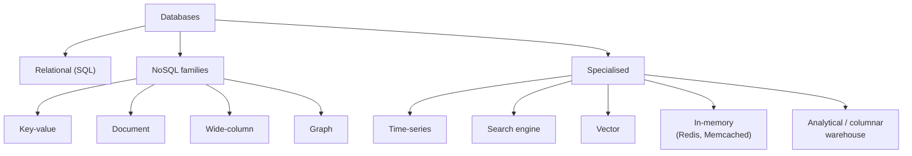

Relational is the oldest and still the default. NoSQL is a loose label for anything that gave up some of SQL's rules (usually joins, fixed schema, or strict consistency) to be simpler, more flexible, or easier to scale for one specific access pattern. Specialised databases go further still — each one is built to be excellent at exactly one job (searching text, storing embeddings, crunching billions of rows) and mediocre at everything else.

## Database families

### Relational (SQL)

**In one line:** data lives in tables with a fixed set of columns, and rows in different tables refer to each other by ID.

**How it works:** think of a set of spreadsheets that are allowed to reference each other's rows. A `books` sheet has a row per book; instead of retyping the author's name on every one of their books, each book row just stores the author's ID, and you look the name up in the `authors` sheet when you need it. The database enforces the rules — a book can't reference an author ID that doesn't exist — so the spreadsheets can't quietly drift out of sync with each other. You ask questions in SQL (Structured Query Language), a language built around "give me rows that match this, combined with rows from that other table."

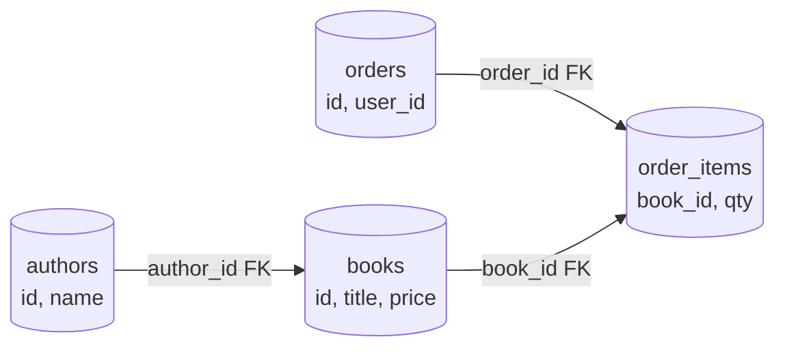

**Example:**

```sql
SELECT books.title, authors.name
FROM books
JOIN authors ON authors.id = books.author_id
WHERE books.published_year > 2020;
```

**Good for:**
- Data with real relationships you need to query together (orders, users, payments)
- Strong correctness guarantees (money, inventory, anything that must never be "a little bit wrong")
- Ad-hoc queries you didn't plan for on day one

**Not great for:**
- Data whose shape changes wildly between records
- Extreme write throughput spread across hundreds of machines without extra work (sharding)

### Key-value

**In one line:** every value is stored under one key, like a giant hash map — no joins, no schema, just `get` and `set`.

**How it works:** the classic analogy is a coat-check counter: you hand over a ticket number (the key) and get back exactly one item (the value), with no understanding of what's inside it. Because the database never has to interpret the value's structure, this is usually the fastest kind of database there is. It's the natural fit for a shopping cart, a session token, or a counter — anything you look up by one exact ID and never need to query by its contents.

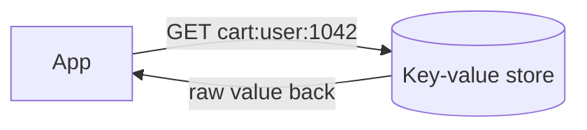

**Example:**

```
SET cart:user:1042 '{"book_ids":[482,110],"updated":"2026-09-28T10:00:00Z"}' EX 3600
GET cart:user:1042
INCR book:482:views
```

**Good for:**
- Caching, sessions, feature flags, rate-limit counters
- Anything read/written by a single exact key, very frequently

**Not great for:**
- Querying by anything other than the key ("find all carts over $50")
- Relationships between records

### Document

**In one line:** records are JSON-like documents grouped into collections, and different documents in the same collection can have different fields.

**How it works:** picture a filing cabinet of forms where each form can have extra fields stapled on as needed, instead of every form in the drawer being forced into identical boxes. This suits data that's naturally nested — a book with its reviews embedded right inside it, so reading a book's page is one lookup instead of a join across three tables. The trade-off is that keeping two different documents in sync (say, a book's title changing everywhere it's duplicated) is now the application's job, not the database's.

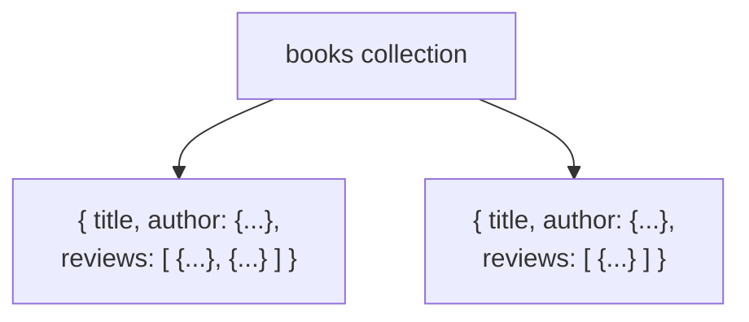

**Example:**

```javascript
// One book document, with reviews embedded for a fast single-read page load
{
  _id: ObjectId("6511f2..."),
  title: "The Last Cartographer",
  author: { id: 9, name: "R. Okafor" },
  price_cents: 1899,
  reviews: [
    { user_id: 220, rating: 5, body: "Loved the ending." },
    { user_id: 331, rating: 4, body: "Slow start, great payoff." }
  ]
}

db.books.find({ "reviews.rating": 5 });
```

**Good for:**
- Nested or variable-shape data (a product catalog where every category has different attributes)
- Fast iteration in early-stage products where the schema is still moving

**Not great for:**
- Transactions that must span many documents at once
- Heavy relational reporting across many entity types

### Wide-column

**In one line:** rows can each have a different, huge set of columns, and the table is split across many machines by row key, built for massive write volume.

**How it works:** imagine a spreadsheet where every row is allowed its own custom set of columns, and the sheet itself is physically sliced into pieces spread across dozens of buildings, grouped by some key you choose (like `book_id`). Writes for a given key always land on the same slice, so the database can absorb enormous write traffic by simply adding more slices. It's less about flexible schema and more about "we need to write faster than one machine's disk can keep up with."

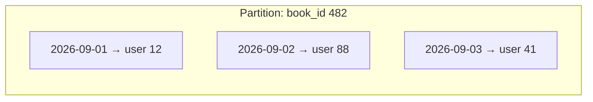

**Example:**

```sql
-- Cassandra / CQL: book view events, partitioned by book_id, ordered by time
CREATE TABLE book_views (
  book_id   int,
  viewed_at timestamp,
  user_id   int,
  PRIMARY KEY (book_id, viewed_at)
) WITH CLUSTERING ORDER BY (viewed_at DESC);

SELECT * FROM book_views WHERE book_id = 482 LIMIT 20;
```

**Good for:**
- Write-heavy, append-style data at huge scale (events, logs, metrics)
- Data that's always looked up by one known partition key

**Not great for:**
- Ad-hoc queries across columns you didn't plan the partition key around
- Strong consistency across rows without extra configuration

### Graph

**In one line:** nodes and the relationships (edges) between them are first-class, so "who's connected to whom, and how" is fast to ask.

**How it works:** picture a corkboard with pins for people and books, and string connecting the pins that are related — this author wrote that book, this reader reviewed that book. A graph database stores exactly that shape and is built to walk the strings fast: "readers who loved this book also loved..." means following two or three hops of string, which a relational join can also do but gets slower and more awkward the more hops you add.

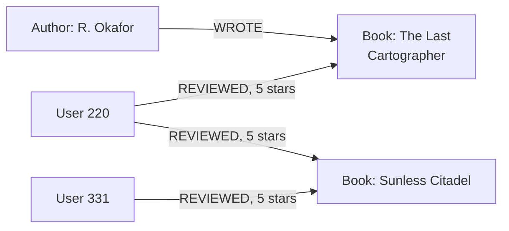

**Example:**

```cypher
// Books that readers who loved this one also rated 5 stars
MATCH (u:User)-[:REVIEWED {rating: 5}]->(b1:Book {id: 482})
MATCH (u)-[:REVIEWED {rating: 5}]->(b2:Book)
WHERE b2.id <> b1.id
RETURN b2.title, count(*) AS shared_fans
ORDER BY shared_fans DESC
LIMIT 5;
```

**Good for:**
- Recommendation engines, fraud rings, social graphs
- "Shortest path" or "N hops away" style questions

**Not great for:**
- Simple tabular reporting
- Aggregating over huge volumes of unrelated records

### Time-series

**In one line:** built for data points stamped with time, written once and rarely updated, queried by time range and aggregated.

**How it works:** think of a logbook where you only ever add a new line at the bottom, never edit an old one, and the questions people ask are "what was the average between 2pm and 3pm" rather than "show me entry #4821." Time-series databases lean into that: they store data in time order, compress it well because neighboring values are usually similar, and make range-and-aggregate queries (per-hour, per-day) cheap.

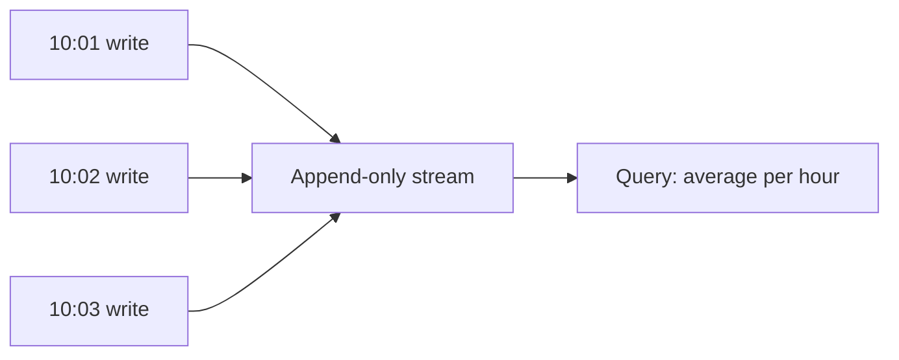

**Example:**

```sql
-- TimescaleDB (a Postgres extension): orders per hour, last 24 hours
SELECT time_bucket('1 hour', created_at) AS hour,
       count(*) AS orders,
       sum(total_cents) AS revenue_cents
FROM orders
WHERE created_at > now() - interval '24 hours'
GROUP BY hour
ORDER BY hour;
```

**Good for:**
- Metrics, monitoring dashboards, IoT sensor readings, price history

**Not great for:**
- Heavily relational data
- Frequent updates to old records (they're built for append, not edit)

### Search engines

**In one line:** built to answer "find things that match this text, ranked by relevance," not "look this exact ID up."

**How it works:** it's the book's back-of-the-page index taken to its extreme — instead of indexing a handful of important terms, it indexes almost every word in every document, then adds a scoring system for how well a document matches a query, including typos and partial matches. This structure is called an inverted index: instead of "document → words it contains," it stores "word → which documents contain it," which is exactly the direction a search query needs.

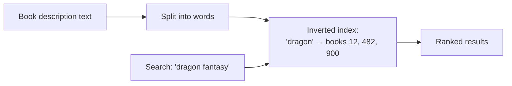

**Example:**

```json
GET /books/_search
{
  "query": {
    "match": { "description": "dragon fantasy adventure" }
  }
}
```

**Good for:**
- Full-text search, typo-tolerant search, faceted filtering, log search

**Not great for:**
- Being the source of truth for transactional writes
- Strict consistency guarantees

### Vector databases

**In one line:** stores embeddings — lists of numbers that represent an item's meaning — and finds the nearest ones, i.e. the most similar items.

**How it works:** imagine plotting every book on a giant map where books with similar themes and tone end up physically close together, even if they don't share a single keyword. An embedding is the coordinates of that point, produced by a machine learning model. To find recommendations, a vector database doesn't search for matching words — it searches for the nearest points on the map, which is why it can match "cozy dragon story" to a book that never uses either word.

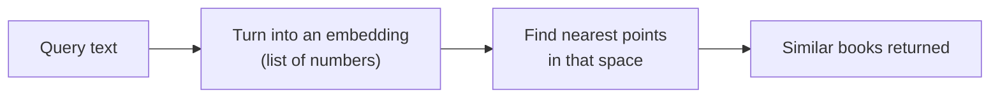

**Example:**

```sql
-- pgvector: 5 books whose embedding is closest to the search phrase's embedding
SELECT title
FROM books
ORDER BY embedding <-> '[0.12, -0.04, 0.88, ...]'
LIMIT 5;
```

**Good for:**
- Semantic search, recommendations, RAG (retrieval-augmented generation) feeding an LLM, image similarity

**Not great for:**
- Exact-match lookups (use a normal index for that)
- Small datasets where a simple filter would already do the job

### Analytical / columnar (OLTP vs OLAP explained here)

**In one line:** stores data column-by-column instead of row-by-row, so "sum this one column across a billion rows" is fast — built for analytics, not day-to-day app operations.

**How it works:** this is the split between OLTP (On-Line Transaction Processing — the everyday work of an app: create this order, update that row, fetch one user) and OLAP (On-Line Analytical Processing — big aggregate questions like "total revenue by month across every order ever placed"). OLTP touches a few rows but every column of each ("give me everything about order 4821"), so row-oriented storage (Postgres, MySQL) that keeps a whole row together on disk is a good fit. OLAP touches a few columns but millions of rows ("just the `total_cents` and `created_at` columns, from everything"), so column-oriented storage that keeps each column together separately is a much better fit — it only reads the columns the query actually needs, skips the rest, and compresses each column well because the values in it are similar. Analogy: OLTP is filling out one whole index card at once — name, address, every field together. OLAP is asking "what's the average age across a million index cards" — you only want the age field from every card, so it helps enormously if all the ages are already sitting together on one long sheet instead of scattered one-per-card.

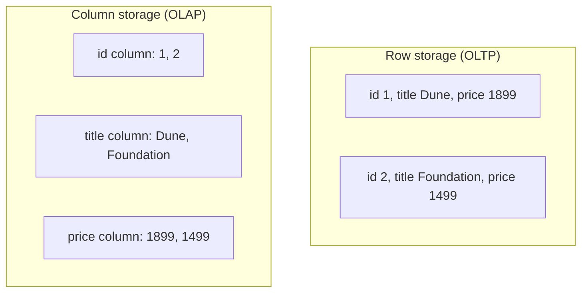

**Example:**

```sql
-- ClickHouse / BigQuery: revenue by month across 200M orders —
-- a columnar engine only reads the two columns this query actually touches
SELECT toStartOfMonth(created_at) AS month,
       sum(total_cents) / 100.0 AS revenue
FROM orders
GROUP BY month
ORDER BY month;
```

**Good for:**
- Dashboards, BI reporting, aggregations over huge datasets

**Not great for:**
- Single-row lookups or updates
- Being the primary, high-frequency transactional store

## Inside a database: indexes

### What an index is

**In one line:** an index is a separate, sorted (or hashed) lookup structure the database keeps on the side, so it doesn't have to scan every row to find what you want.

**How it works:** it's the same idea as a book's index at the back: instead of reading every page to find every mention of "sharding," you check the index, see "Sharding, 45, 102," and turn straight there. A database index works the same way — it stores the indexed column's values in sorted order alongside a pointer to where the full row actually lives, so a lookup can jump straight to the matching rows instead of reading the whole table. The cost is that the index itself takes disk space, and every write to the table now also has to update the index, not just the row.

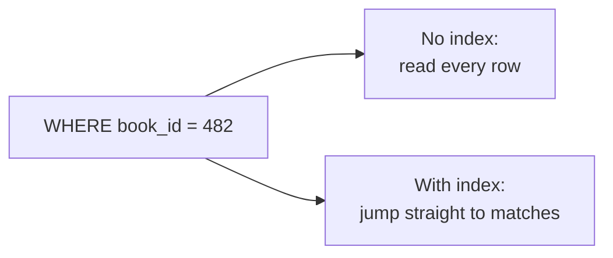

**Example — before and after, with `EXPLAIN`:**

```sql
EXPLAIN ANALYZE
SELECT * FROM reviews WHERE book_id = 482;
```

Before an index exists, Postgres has to check every single row:

```
Seq Scan on reviews  (cost=0.00..18450.00 rows=12 width=120) (actual time=42.180..312.501 rows=12 loops=1)
  Filter: (book_id = 482)
  Rows Removed by Filter: 999988
```

After adding `CREATE INDEX idx_reviews_book_id ON reviews(book_id);`, the same query jumps straight to the matching rows:

```
Index Scan using idx_reviews_book_id on reviews  (cost=0.42..8.55 rows=12 width=120) (actual time=0.031..0.045 rows=12 loops=1)
  Index Cond: (book_id = 482)
```

Same query, same data — 312ms of scanning a million rows becomes 0.045ms of jumping straight to twelve.

**Watch out for:**
- An index only helps the queries it was built for — it doesn't speed up every query on that table
- Every index makes writes to that table slightly slower, since the index has to be updated too

### B-tree indexes

**In one line:** the default, general-purpose index — a balanced tree that keeps values sorted, so both exact matches and ranges (`WHERE price > 20 AND price < 50`) are fast.

**How it works:** it works like a well-organized phone book — instead of a flat sorted list, values are arranged in a tree so you can narrow down to the right area in a handful of steps ("is it in the first half or second half? which quarter? which row?") no matter how many entries there are. "Balanced" means every path from the top to the bottom is roughly the same length, so even a table with a hundred million rows only takes a handful of steps to search — the tree's depth grows very slowly as the table grows.

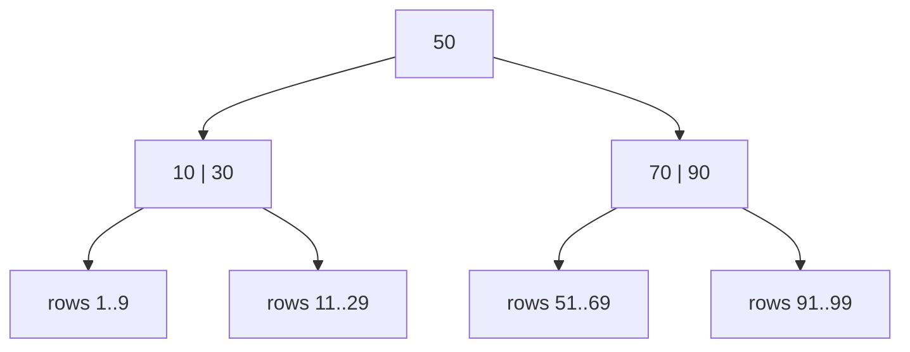

**Example:**

```sql
CREATE INDEX idx_books_price ON books(price);

SELECT title FROM books WHERE price BETWEEN 1000 AND 2000;
```

**Watch out for:**
- Writes get slightly slower, since the tree has to be kept sorted and balanced on every insert
- Barely helps on a low-cardinality column (few distinct values, like a boolean `is_available`) — the database ends up checking a large share of the table anyway

### Hash indexes

**In one line:** runs the value through a hash function to jump straight to a bucket — very fast for exact matches (`=`), useless for ranges or sorting.

**How it works:** it's like a locker room where your locker number is computed from your name by a formula, so you walk straight to it instead of searching row by row. The formula scrambles the order completely, though — you can jump straight to "locker for exactly this name," but you can't ask for "every locker between A and M," because the hash doesn't preserve any sense of order.

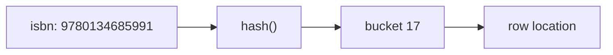

**Example:**

```sql
CREATE INDEX idx_books_isbn_hash ON books USING HASH (isbn);

-- Fast: exact match
SELECT * FROM books WHERE isbn = '9780134685991';

-- Cannot use this index at all:
SELECT * FROM books WHERE isbn LIKE '978013%';
```

**Watch out for:**
- No range queries, no sorting, no `LIKE 'prefix%'` matching
- Rarely the default choice — most databases reach for a B-tree unless you specifically know all you'll ever do is exact-match lookups

### Composite indexes and column order

**In one line:** an index across multiple columns at once, where the order of those columns decides which queries it can actually help with.

**How it works:** think of a phone book sorted by last name, then first name. It's great for "find everyone named Okafor," and also fine for "find Okafor, Rita" — but it's useless for "find everyone whose first name is Rita" on its own, because the book isn't sorted by first name at all. A composite index follows the same **leftmost-prefix rule**: it can help a query that filters on its first column, or its first and second columns together, but not a query that only filters on the second column while skipping the first.

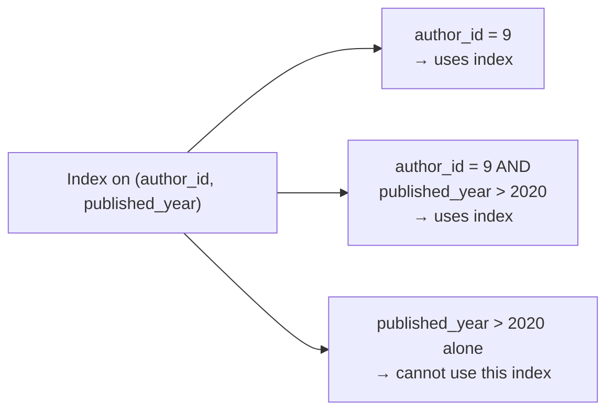

**Example:**

```sql
CREATE INDEX idx_books_author_year ON books(author_id, published_year);

-- Uses the index
SELECT * FROM books WHERE author_id = 9 AND published_year > 2020;

-- Does NOT use this index (published_year isn't the leftmost column)
SELECT * FROM books WHERE published_year > 2020;
```

**Watch out for:**
- Getting the column order backwards makes the index dead weight for your actual queries
- A rough rule of thumb for ordering columns: exact-match filters first, then range filters, then any column you sort by

### Other index types

**In one line:** some data doesn't fit a plain sorted tree — full text, geographic coordinates, and very write-heavy tables each get their own specialised index structure.

**How it works:** a **GIN index** (Generalized Inverted Index) is good for full-text search and for values that contain multiple things, like an array or a JSON field — it's essentially the same inverted-index idea search engines use, built into the database itself, so `WHERE description contains 'dragon'` doesn't mean scanning every description. A **geospatial index** (commonly GiST or an R-tree) is built for "what's near this point" or "what falls inside this box" — like dividing a map into overlapping regions so nearby points can be found without checking every point on the map. And one paragraph on the **LSM-tree** (log-structured merge tree) write path, used by Cassandra, RocksDB, and LevelDB: instead of updating a row in place on disk, a write first lands in an in-memory buffer called a memtable; once that buffer fills up, it's flushed to disk as a sorted, immutable file (an SSTable); over time, many small SSTables pile up, so a background process called compaction periodically merges them back into fewer, larger sorted files. This makes writes very fast (always appending, never seeking around on disk to update something in place) at the cost of reads sometimes having to check a few different files before finding the newest version of a key.

**Example:**

```sql
CREATE INDEX idx_books_description_gin
  ON books USING GIN (to_tsvector('english', description));

SELECT title FROM books
WHERE to_tsvector('english', description) @@ to_tsquery('dragon & fantasy');
```

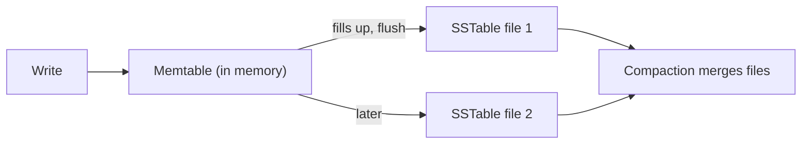

**Watch out for:**
- GIN indexes are more expensive to update than a B-tree, so they suit read-heavy text search, not write-heavy columns
- LSM-backed databases can need "read amplification" mitigations like bloom filters, since a read might otherwise have to check several SSTables to be sure it found the latest value

### When indexes hurt

**In one line:** indexes make reads faster but writes slower and storage bigger — adding one to every column is not free.

**How it works:** every `INSERT`, `UPDATE`, or `DELETE` on a table has to update every index on that table too, not just the row itself. A table with one index writes twice as much bookkeeping as a table with none; a table with ten indexes writes eleven times the structure work per change. It's the same trade as sticking tabs all over a book to find pages fast — handy for the two or three pages you look up constantly, but if you stick forty tabs all over it, adding or removing a single page means redoing every tab.

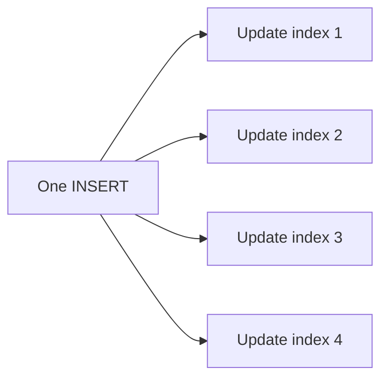

**Example:** a `books` table with five indexes, one of them on a rarely-queried `internal_notes` column and another duplicating an existing `(author_id)` index as `(author_id, id)` — every book insert now pays for five index updates, two of which no query in the codebase actually relies on. Dropping the unused and redundant ones (checked via `pg_stat_user_indexes` in Postgres — a view that shows how often each index is actually used) cuts insert latency without losing a single query's performance.

**Watch out for:**
- Indexes nobody ever queries against, left over from an experiment
- Two indexes that overlap, like `(author_id)` and `(author_id, published_year)` — the second one already covers what the first does

## Transactions and correctness

### ACID

**In one line:** ACID is four promises a database transaction makes, so a group of changes behaves like one safe, all-or-nothing unit.

**How it works:** take placing a bookshop order — it has to deduct stock, create an order row, and create order-item rows, all together. **Atomicity** means all three happen or none do — if payment fails halfway through, the stock deduction is undone too, not left half-applied. **Consistency** means the database's own rules are never broken, even mid-crash — an order can never end up pointing at a book ID that doesn't exist, because the database enforces that constraint. **Isolation** means two customers buying the last copy of a book at the same instant can't both succeed and walk away thinking they got it — covered in more depth just below. **Durability** means once the order confirmation is shown, that order survives even if the server crashes a millisecond later — it's already safely written to disk, not just sitting in memory.

<a href="https://alwintwk.github.io/dev-knowledge/diagrams/databases-acid-rollback.html">
  <picture>
    <source media="(prefers-color-scheme: dark)" srcset="../diagrams/databases-acid-rollback.dark.png">
    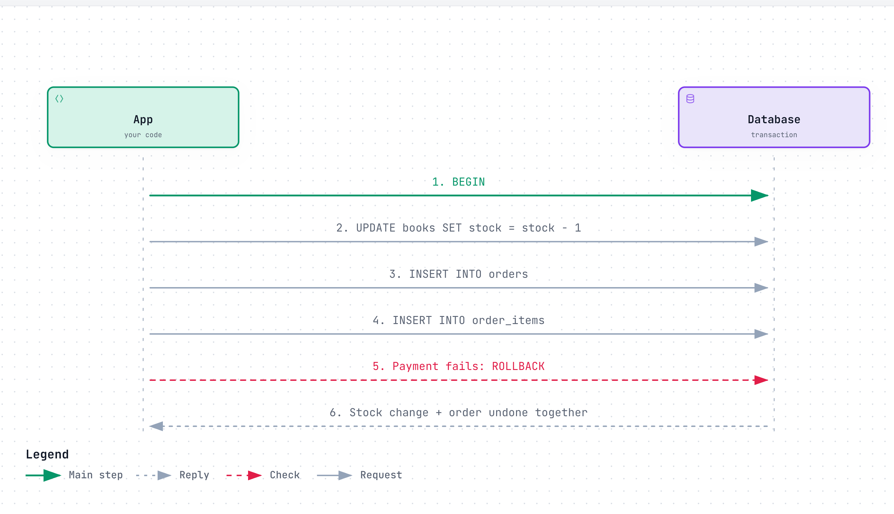
  </picture>
</a>

<sub>Click the diagram for the interactive version (zoom, dark mode, trace a path).</sub>

**Example:**

```sql
BEGIN;
UPDATE books SET stock = stock - 1 WHERE id = 482;
INSERT INTO orders (user_id, status) VALUES (7, 'pending') RETURNING id;
INSERT INTO order_items (order_id, book_id, quantity) VALUES (currval('orders_id_seq'), 482, 1);
-- payment succeeds
COMMIT;
-- if payment had failed instead:
-- ROLLBACK;
```

**Watch out for:**
- Many NoSQL databases only guarantee atomicity within a single document or row, not across several — that relaxed trade is what BASE (below) is about

### Isolation levels and anomalies

**In one line:** the isolation level controls how much of another transaction's in-progress, uncommitted work you're allowed to see — stricter levels are safer but slower.

**How it works:** four classic anomalies show what can go wrong without enough isolation. A **dirty read** is reading a value another transaction hasn't committed yet — which might still get rolled back, making the value you read never actually true. A **non-repeatable read** is reading the same row twice in one transaction and getting two different answers, because another transaction committed a change to it in between. A **phantom read** is running the same range query twice in one transaction and getting a different set of rows back, because another transaction inserted or deleted a row that matches the filter. A **lost update** is two transactions both reading a value, both computing an updated version, and one silently overwriting the other's change without either one knowing about the conflict.

| Isolation level | Dirty read | Non-repeatable read | Phantom read | Lost update |
|---|---|---|---|---|
| Read Uncommitted | Possible | Possible | Possible | Possible |
| Read Committed | Not possible | Possible | Possible | Possible |
| Repeatable Read | Not possible | Not possible | Possible* | Depends on the database* |
| Serializable | Not possible | Not possible | Not possible | Not possible |

*In PostgreSQL, Repeatable Read is snapshot isolation: it also blocks phantoms, and a lost update makes the second transaction fail with a serialization error so you can retry. MySQL's InnoDB at Repeatable Read does *not* stop lost updates for plain read-then-write code; you need `SELECT ... FOR UPDATE` or a version column. That's a reminder that the same isolation-level name doesn't always mean the exact same behavior across different databases.

<a href="https://alwintwk.github.io/dev-knowledge/diagrams/databases-lost-update.html">
  <picture>
    <source media="(prefers-color-scheme: dark)" srcset="../diagrams/databases-lost-update.dark.png">
    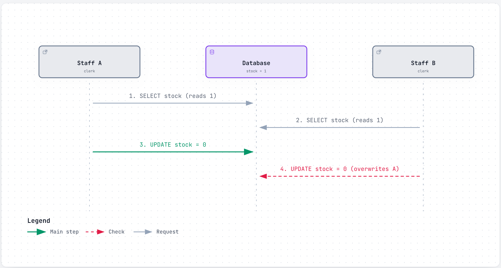
  </picture>
</a>

**Example:**

```sql
SET TRANSACTION ISOLATION LEVEL SERIALIZABLE;
BEGIN;
SELECT stock FROM books WHERE id = 482;
UPDATE books SET stock = stock - 1 WHERE id = 482;
COMMIT;
-- Under Serializable, Postgres detects the conflicting concurrent transaction
-- and forces one of the two to retry instead of silently losing an update.
```

**Watch out for:**
- Higher isolation levels mean more locking or more retried transactions, which costs throughput — pick the loosest level that's still safe for the specific operation, not the strictest one everywhere

### Locking vs optimistic concurrency

**In one line:** two ways to stop concurrent writes from clobbering each other — lock the row up front (pessimistic), or check a version number at write time (optimistic).

**How it works:** pessimistic locking is like taking the only key to the stockroom before you even check the shelves — nobody else can look until you're done, so conflicts simply can't happen, at the cost of everyone else waiting. Optimistic concurrency lets everyone look and prepare a change freely, but when you go to save, the database checks "has this row changed since I last read it?" — usually via a `version` column — and rejects your write if so, leaving your code to re-read and retry.

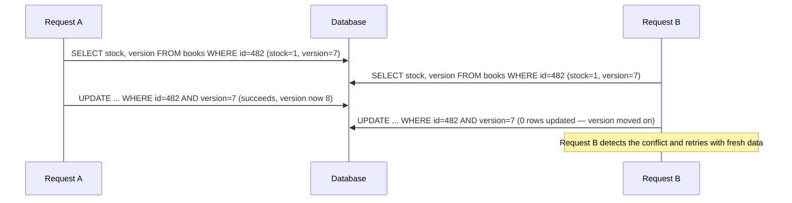

**Example:**

```sql
-- Optimistic concurrency with a version column
UPDATE books
SET stock = stock - 1, version = version + 1
WHERE id = 482 AND version = 7;
-- If this updates 0 rows, someone else already changed the row first — re-read and retry.
```

**Watch out for:**
- Pessimistic locking can cause deadlocks or become a bottleneck under heavy contention on the same row
- Optimistic concurrency needs the application to actually handle retries, and degrades badly when conflicts are frequent — a popular item's "last copy" being fought over by many buyers is exactly that case

### BASE and eventual consistency

**In one line:** BASE (Basically Available, Soft state, Eventual consistency) is the relaxed alternative to ACID that many distributed and NoSQL databases choose, trading immediate correctness for availability and speed.

**How it works:** a review count shown on a book's page might lag a second or two behind the true count on a replica that hasn't caught up yet, but the system stays fast and available even during network trouble, and the count does catch up shortly after. This is a deliberate trade, not a bug — see [CAP theorem and consistency](https://github.com/alwintwk/big-tech-system-design/blob/main/concepts/cap-and-consistency.md) for the full reasoning behind when a system chooses this over strict consistency, and what it gives up to get it.

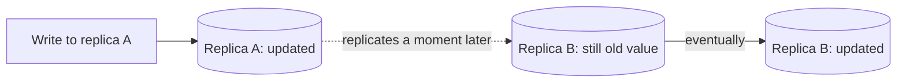

**Example:** a review just posted on one replica might not show up yet if a different reader hits a replica that hasn't received it — refreshing a second later shows it, once replication catches up.

**Watch out for:**
- "Eventual" has no fixed deadline unless the system documents one — don't assume it means "within a second"

## Designing the schema

### Normalization

**In one line:** splitting data across tables so each fact is stored exactly once, so you can't end up with two different answers to "what's this book's title."

**How it works:** normalization is usually explained in stages. **1NF (First Normal Form)** says each cell holds one value, not a list.

Before (breaks 1NF):

| order_id | book_titles |
|---|---|
| 501 | Dune, Foundation |

After:

| order_id | book_title |
|---|---|
| 501 | Dune |
| 501 | Foundation |

**2NF** says every non-key column must depend on the *whole* key, not just part of it.

Before (breaks 2NF — `book_title` only depends on `book_id`, not on the pair):

| order_id | book_id | book_title | quantity |
|---|---|---|---|
| 501 | 482 | Dune | 1 |

After: move `book_title` into a `books` table, keyed by `book_id` alone.

**3NF** says non-key columns shouldn't depend on other non-key columns.

Before (breaks 3NF — `author_name` depends on `author_id`, not directly on the book):

| id | title | author_id | author_name |
|---|---|---|---|
| 482 | Dune | 9 | F. Herbert |

After: split into `authors(id, name)` and `books(id, title, author_id)`.

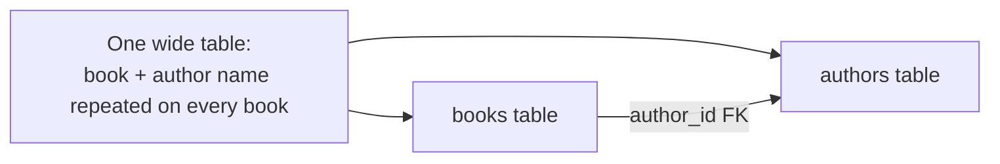

**Example:**

```sql
CREATE TABLE authors (id SERIAL PRIMARY KEY, name TEXT);
CREATE TABLE books (
  id SERIAL PRIMARY KEY,
  title TEXT,
  author_id INT REFERENCES authors(id)
);
```

**Watch out for:**
- Over-normalizing hurts read performance — a page that needs data from six joined tables to render once is a common symptom. Normalize for correctness first, then denormalize deliberately, only where it's measurably slow

### Denormalization and when to do it

**In one line:** deliberately duplicating some data across tables or documents to avoid a join, trading storage and update complexity for read speed.

**How it works:** it's like printing the author's name directly on a purchase receipt at the time of sale, instead of looking it up fresh every time the receipt is viewed — useful because if the author's name is corrected later, an old receipt arguably should still show what was true when it was issued. This is common in document databases (embedding an author's name inside a book document) and in read-heavy relational systems (caching a computed or joined value directly on the row that's read most often).

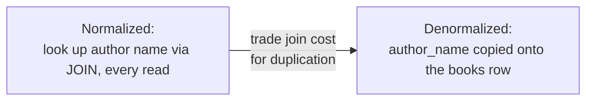

**Example:**

```sql
ALTER TABLE books ADD COLUMN author_name_cache TEXT;
-- Updated whenever authors.name changes, so book listing pages
-- never need to JOIN authors just to show the name.
```

**Watch out for:**
- Duplicated data can silently drift out of sync if a code path forgets to update every copy
- Only denormalize a specific, measured hot path — not the whole schema up front, before you know where it hurts

### Relationships

**In one line:** rows relate to each other in one of three shapes — one-to-one, one-to-many, or many-to-many (which needs a join table).

**How it works:** **one-to-one** is a user and their (optional, rarely-accessed) profile settings — sometimes split into its own table just to keep the main `users` table small. **One-to-many** is one author with many books; the foreign key sits on the "many" side (`books.author_id`), since each book has exactly one author here. **Many-to-many** is orders and books — one order can contain many books, and one book can appear in many orders — which needs a **join table** (`order_items`) holding a foreign key to each side, because neither `orders` nor `books` alone can express "many of each, matched to many of the other."

```mermaid
erDiagram
  AUTHORS ||--o{ BOOKS : writes
  BOOKS ||--o{ REVIEWS : has
  USERS ||--o{ REVIEWS : writes
  USERS ||--o{ ORDERS : places
  ORDERS ||--o{ ORDER_ITEMS : contains
  BOOKS ||--o{ ORDER_ITEMS : "ordered in"

  AUTHORS {
    int id PK
    string name
  }
  BOOKS {
    int id PK
    string title
    int author_id FK
    int price_cents
  }
  USERS {
    int id PK
    string email
  }
  ORDERS {
    int id PK
    int user_id FK
    string status
  }
  ORDER_ITEMS {
    int order_id FK
    int book_id FK
    int quantity
  }
  REVIEWS {
    int id PK
    int book_id FK
    int user_id FK
    int rating
  }
```

**Example:**

```sql
-- All books a given user has ever ordered
SELECT DISTINCT books.title
FROM users
JOIN orders ON orders.user_id = users.id
JOIN order_items ON order_items.order_id = orders.id
JOIN books ON books.id = order_items.book_id
WHERE users.id = 7;
```

**Watch out for:**
- Trying to cram a many-to-many relationship into one column (a comma-separated list of book IDs) instead of a join table — this breaks 1NF and makes querying painful
- Forgetting to index the foreign key columns on the join table itself — covered in [Common mistakes](#common-mistakes) below

## Scaling a database

### Vertical scaling

Give the same single database machine more CPU, RAM, or faster disks. It's the simplest scaling move — no application changes, no new failure modes — but it has a hard ceiling (the biggest machine you can rent or buy) and that one machine remains a single point of failure the whole time.

### Read replicas

Copy the database onto other machines that only serve reads, so read-heavy traffic can be spread across several copies while writes still go to one primary. Two to three sentences here can't do the mechanics justice — see [Replication](https://github.com/alwintwk/big-tech-system-design/blob/main/concepts/replication.md) for how the copies actually stay in sync and what can go wrong when they fall behind.

### Sharding

Split one big database into several smaller ones, each holding only a slice of the rows (by user ID, region, or some other key), so no single machine has to store or serve all of it. It solves a different problem than read replicas — write and storage scaling, not just read scaling — and comes with real complexity around cross-shard queries; see [Sharding](https://github.com/alwintwk/big-tech-system-design/blob/main/concepts/sharding.md) for the full picture.

### Connection pooling

Opening a new database connection is a slow handshake (TCP plus authentication), so a pool keeps a set of connections already open and hands them out to requests as needed, instead of opening and closing one per request. This matters most under high concurrency or with serverless functions, where naively opening a fresh connection per invocation can exhaust the database's max-connections limit long before the database itself is actually overloaded.

### Caching in front

Put a fast, temporary store (often Redis) in front of the database so repeated identical reads don't have to hit it at all. This is a different lever from all the ones above — it reduces load rather than adding capacity — see [Caching](https://github.com/alwintwk/big-tech-system-design/blob/main/concepts/caching.md) for cache-aside, write-through, TTLs, and the thundering-herd problem.

## Which database should I pick?

| Family | Data shape | Strengths | Weaknesses | Examples |
|---|---|---|---|---|
| Relational (SQL) | Tables, fixed columns, rows linked by keys | Joins, strong consistency, mature tooling | Schema changes need migrations; harder to scale writes horizontally | PostgreSQL, MySQL, SQLite |
| Key-value | Single key to an opaque value | Extremely fast, very simple | No queries beyond the key, no relationships | Redis, DynamoDB |
| Document | Nested, JSON-like documents | Flexible shape, natural for nested data | Multi-document transactions are harder, joins are awkward | MongoDB |
| Wide-column | Rows with dynamic, sparse columns, partitioned by key | Huge write throughput, linear scaling | Weak ad-hoc queries, eventually consistent by default | Cassandra |
| Graph | Nodes and edges | Fast traversal, relationship-heavy queries | Not built for tabular reports or huge aggregates | Neo4j |
| Time-series | Timestamped, mostly append-only points | Fast time-range aggregation, good compression | Poor fit for heavily relational or frequently-updated data | TimescaleDB |
| Search engine | Inverted index over text and fields | Full-text search, ranking, typo tolerance | Not a safe source of truth, eventually consistent | Elasticsearch, OpenSearch |
| Vector | High-dimensional embeddings | Semantic/similarity search, RAG for LLMs | Overkill for exact lookups, needs an embedding pipeline | pgvector |
| Analytical / columnar | Column-oriented storage | Fast aggregation over billions of rows | Slow single-row lookups or updates, not for live transactions | ClickHouse, BigQuery |

```mermaid
flowchart TD
  Start["What does your data need?"] --> Q1{"Rows relate to each other,<br/>need joins & transactions?"}
  Q1 -- yes --> PG["Relational:<br/>PostgreSQL, MySQL, SQLite"]
  Q1 -- no --> Q2{"Simple key to value,<br/>needs to be very fast?"}
  Q2 -- yes --> Redis["Key-value:<br/>Redis, DynamoDB"]
  Q2 -- no --> Q3{"Nested, flexible-shape<br/>records?"}
  Q3 -- yes --> Mongo["Document:<br/>MongoDB"]
  Q3 -- no --> Q4{"Full-text or<br/>fuzzy search?"}
  Q4 -- yes --> ES["Search engine:<br/>Elasticsearch, OpenSearch"]
  Q4 -- no --> Q5{"Searching by meaning,<br/>via embeddings?"}
  Q5 -- yes --> Vec["Vector:<br/>pgvector"]
  Q5 -- no --> Q6{"Big aggregate reports<br/>over huge datasets?"}
  Q6 -- yes --> OLAP["Analytical:<br/>ClickHouse, BigQuery"]
  Q6 -- no --> Q7{"Relationships & traversal<br/>are the main query?"}
  Q7 -- yes --> Neo["Graph:<br/>Neo4j"]
  Q7 -- no --> Q8{"Time-stamped metrics<br/>at high volume?"}
  Q8 -- yes --> TS["Time-series:<br/>TimescaleDB"]
  Q8 -- no --> Q9{"Massive write scale<br/>across many nodes?"}
  Q9 -- yes --> Cass["Wide-column:<br/>Cassandra"]
  Q9 -- no --> Default["Not sure?<br/>Start with Postgres."]
```

Note: start with Postgres unless you have a specific reason not to. It does relational data well, has a solid JSON column type for semi-structured data, and extensions like `pgvector` and TimescaleDB cover a surprising number of the "specialised" cases above without adding a second database to operate.

## Common mistakes

- **N+1 queries.** Fetching a list, then running one more query per row for its related data. Example: loading 50 orders, then looping and running `SELECT * FROM books WHERE id = ?` once per order — 51 queries where a single `JOIN` or `WHERE id IN (...)` would do just 1.
- **Missing index on foreign keys.** `order_items.book_id` and `order_items.order_id` are foreign keys, but most databases don't index them automatically — every join or filter on them becomes a full table scan as the table grows.
- **`SELECT *`.** Pulls every column including ones you don't need, breaks silently if someone adds a large `description` column later, and stops the database from using a smaller "covering" index that could otherwise answer the query without touching the full row at all.
- **Storing money as `float`/`double`.** `0.1 + 0.2` isn't exactly `0.3` in floating point — harmless for a chart, not harmless for a price. Store integer cents or a fixed-point `DECIMAL`/`NUMERIC` type instead.
- **No migrations.** Editing the production schema by hand through a GUI leaves no record of what changed, when, or why — the next environment (staging, a new teammate's machine, disaster recovery) has no way to reproduce it. Versioned migration files, checked into git, fix this.
- **Skipping connection pooling.** Opening a fresh database connection per request — especially from serverless functions — pays the handshake cost every single time and can exhaust the database's max-connections limit well before the database itself is actually overloaded.
- **Never testing backups.** A backup that has never been restored is a hope, not a backup — the first attempt at restoring one shouldn't happen during the actual outage.

## Go deeper

- Tools: [web-dev-resources → Databases, ORMs & search](https://github.com/alwintwk/web-dev-resources#databases-orms--search)
- Deeper dives on the pieces this page only summarizes: [Replication](https://github.com/alwintwk/big-tech-system-design/blob/main/concepts/replication.md) · [Sharding](https://github.com/alwintwk/big-tech-system-design/blob/main/concepts/sharding.md) · [Consistent hashing](https://github.com/alwintwk/big-tech-system-design/blob/main/concepts/consistent-hashing.md) · [CAP theorem and consistency](https://github.com/alwintwk/big-tech-system-design/blob/main/concepts/cap-and-consistency.md) · [Caching](https://github.com/alwintwk/big-tech-system-design/blob/main/concepts/caching.md)
- References: [Use The Index, Luke](https://use-the-index-luke.com/) · [PostgreSQL docs — transaction isolation](https://www.postgresql.org/docs/current/transaction-iso.html) · *Designing Data-Intensive Applications* by Martin Kleppmann — [O'Reilly](https://www.oreilly.com/library/view/designing-data-intensive-applications/9781491903063/)
