# Deployment strategies

> How new code gets from a developer's machine into production without taking the bookshop down — and the growing toolbox of tricks for shipping safely, watching what happens, and pulling back fast if it doesn't.

[← Back to DevOps & cloud](../README.md#devops--cloud)

## Why this matters

Say the bookshop's checkout team just finished a new payment flow that also lets customers apply a gift-card code. The code is done, review passed, tests are green on a laptop. None of that means it's safe to put in front of every paying customer at once. What if the gift-card lookup is slow under real traffic and every checkout starts timing out? What if a genuinely broken build gets deployed automatically at 2am while nobody's watching? What if the new code needs a database column that has to exist *before* the code can even start, and the old code is still running against the same database while that happens?

"Deploying" and "releasing" sound like the same moment, but treating them as one step is where most production incidents start. **Deploying** is getting new code running somewhere. **Releasing** is letting real users touch it. This page is about keeping those two separate, and the small set of well-worn patterns — recreate, rolling, blue-green, canary, feature flags — that control how, how fast, and how safely a release happens. Get this right and a bad release is a five-second flag flip. Get it wrong and it's an incident channel at 2am, plus a rollback that also has to undo a half-finished database migration.

## The map

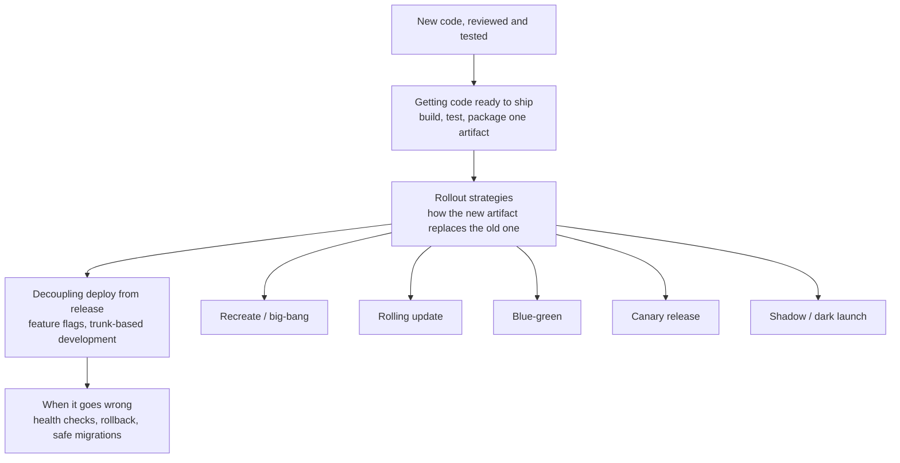

> **Why this matters:** the four boxes down the middle are also the four H2 sections below, in order. You build one trustworthy thing (an artifact), you choose how it physically replaces the old version in production, you optionally decouple "it's deployed" from "users can see it" with a flag, and you plan for the version that turns out to be broken anyway. Skipping straight to "which rollout strategy is fanciest" without the first and third steps is how teams end up with a canary release of a feature nobody can turn off in an emergency.

## Getting code ready to ship

Every rollout strategy below assumes you already have one trustworthy, versioned thing to deploy — an **artifact**. This section is about building that artifact reliably, once, so the rollout strategies have something solid to work with.

### CI/CD pipelines in depth

**In one line:** an automated assembly line that takes a commit, proves it works, packages exactly one artifact, and pushes that same artifact through dev, staging, and production, in order, with a gate between each step.

**How it works:** the README's pipeline diagram shows the outline — push, PR, CI, merge, deploy. This is what's actually happening inside "CI: install, lint, test, build" and after "merge to main." Four stages, each answering a different question. **Build** asks: does this even compile or bundle into something runnable? **Test** asks: does it behave correctly — unit tests, integration tests, maybe a slice of end-to-end checks? **Artifact** takes the proven build and packages it into one immutable, versioned thing (a Docker image tag, a compiled binary, a zip file) and stores it in a registry. **Promote** takes that exact artifact, unchanged, and moves it through dev, then staging, then production, with a gate before each move — automated checks, or a human clicking "approve."

It's a bakery: you bake one batch of bread (build, test, package), and that exact same loaf is what goes to the taste-test kitchen (dev), the demo counter (staging), and the shop shelf (production). You never rebake a different loaf for the shelf than the one that passed the taste test.

<a href="https://alwintwk.github.io/dev-knowledge/diagrams/deployment-cicd-pipeline.html">
  <picture>
    <source media="(prefers-color-scheme: dark)" srcset="../diagrams/deployment-cicd-pipeline.dark.png">
    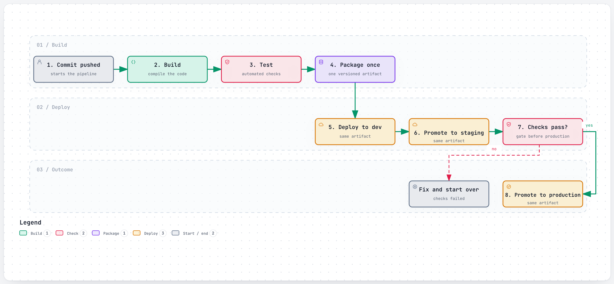
  </picture>
</a>

<sub>Click the diagram for the interactive version (zoom, dark mode, trace a path).</sub>

**Example:**

```yaml
# .github/workflows/deploy.yml (simplified)
jobs:
  build-test-package:
    steps:
      - run: npm ci
      - run: npm test
      - run: docker build -t bookshop-api:${{ github.sha }} .
      - run: docker push registry.example.com/bookshop-api:${{ github.sha }}

  deploy-staging:
    needs: build-test-package
    steps:
      - run: deploy bookshop-api:${{ github.sha }} to staging

  deploy-production:
    needs: deploy-staging
    environment: production   # requires a human approval click
    steps:
      - run: deploy bookshop-api:${{ github.sha }} to production
```

**Good for:**
- Catching a broken build or a failing test before it ever reaches a real environment
- Making "what's actually running in production" traceable back to one commit and one artifact

**Watch out for:**
- A pipeline that's slow enough that developers start batching up changes to avoid running it, which defeats the point of continuous integration
- Tests that pass locally but fail in CI because the CI environment is subtly different — usually a sign the artifact isn't as portable as it should be

### Build once, deploy many

**In one line:** build and test the artifact exactly once, then deploy that identical artifact, unchanged, to dev, staging, and production — never rebuild per environment.

**How it works:** rebuilding per environment is a trap. If staging and production each run their own `npm install` or `docker build` at deploy time, they can silently resolve different dependency versions, pick up a different base image tag, or just build at a different moment in time — so "it worked in staging" stops meaning anything, because staging and production were never actually running the same code. The fix is to build once, then treat everything that differs between environments (a database URL, an API key, a feature flag) as **configuration**, injected at deploy or run time, never baked into the build itself.

It's the difference between printing one final exam paper and photocopying it for every classroom, versus reprinting a "fresh" version of the paper for each room and hoping nobody made a typo the second time.

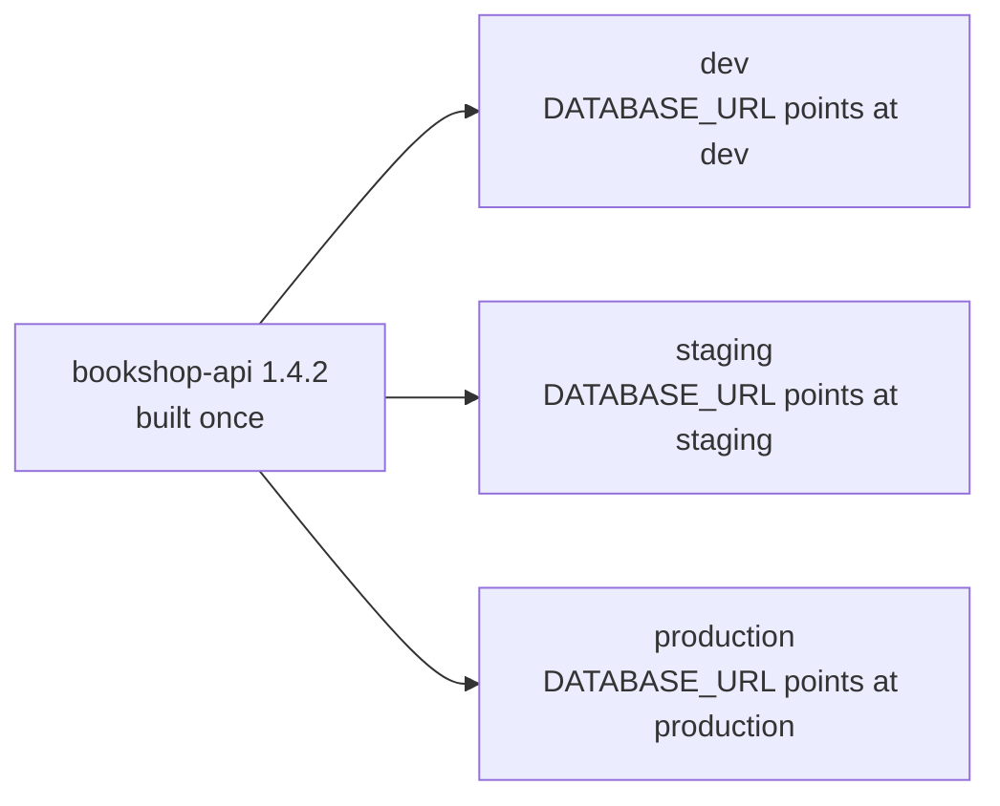

**Example:**

```bash
# same image tag, different environment variables per environment
docker run -e DATABASE_URL=$STAGING_DB bookshop-api:1.4.2
docker run -e DATABASE_URL=$PROD_DB    bookshop-api:1.4.2
```

**Good for:**
- Guaranteeing that what passed tests in staging is byte-for-byte what runs in production
- Fast rollbacks — the previous artifact is already built and sitting in the registry, ready to redeploy

**Watch out for:**
- Secrets or config accidentally baked into the image at build time instead of injected at deploy time, which breaks the "one artifact, many environments" promise
- A config difference between staging and production that's large enough to mean staging isn't really testing what production will do

### Infrastructure as code

**In one line:** describe your servers, databases, and networking in version-controlled config files instead of clicking through a cloud console, so the same file can create — or recreate — the exact same infrastructure every time.

**How it works:** Terraform reads `.tf` files describing the infrastructure you want (say, one load balancer, three app servers, one database) and compares that to a **state file** recording what it created last time. It then works out the difference — what to add, change, or destroy — to make reality match the file. Because the file is checked into version control, infrastructure changes can be reviewed like code, in a pull request, before anything actually changes.

It's an architect's blueprint versus building from memory each time. The blueprint gets reviewed and filed away; anyone can reproduce the exact same building from it later, and nobody has to remember which pipe went where.

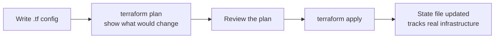

**Example:**

```hcl
resource "aws_s3_bucket" "book_covers" {
  bucket = "bookshop-covers-prod"
}

resource "aws_ecs_service" "checkout_api" {
  name            = "checkout-api"
  cluster         = aws_ecs_cluster.bookshop.id
  task_definition = aws_ecs_task_definition.checkout_api.arn
  desired_count   = 3
}
```

**Good for:**
- Reproducing an entire environment (say, a fresh staging environment) from one command instead of a checklist
- Reviewing infrastructure changes the same way you review code, before they happen

**Watch out for:**
- The state file drifting from reality if someone changes something by hand in the cloud console instead of through Terraform
- `terraform apply` running unreviewed changes straight against production — always read the plan output first

### Containers and images

**In one line:** package an app with its exact runtime, dependencies, and OS libraries into one portable image, so it runs the same on a laptop, in staging, and in production.

**How it works:** a **Dockerfile** is the recipe: a short list of steps (start from this base, copy in this code, install these dependencies, run this command). Running `docker build` turns that recipe into an **image** — a frozen, runnable snapshot. A **container** is one running instance of that image. Because the image bundles the exact runtime and libraries the app needs, it behaves the same wherever it runs, instead of depending on whatever happens to already be installed on the host machine.

It's a shipping container: a standard-sized box that any crane, ship, or truck can move without caring what's actually inside it.

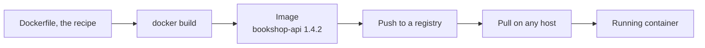

**Example:**

```dockerfile
FROM node:20-slim
WORKDIR /app
COPY package*.json ./
RUN npm ci --production
COPY . .
EXPOSE 3000
CMD ["node", "server.js"]
```

**Good for:**
- Making "works on my machine" a much rarer excuse, since the machine's differences are packaged away
- Running many small, isolated services on the same host without them fighting over dependency versions

**Watch out for:**
- Images that are far bigger than they need to be, because every build tool and temp file got copied in along with the app
- Treating a container as a permanent home for data — anything written inside a container that isn't in a mounted volume disappears when it's replaced

## Rollout strategies

Now you have one trustworthy artifact. The question this section answers: how do you actually swap it into production for real users, and what happens to the old version while that swap is happening?

### Recreate / big-bang

**In one line:** stop every instance of the old version, then start the new version — the simplest possible rollout, with a gap of downtime in between.

**How it works:** there's no moment where old and new code run side by side, which removes a whole category of "version A and version B disagree" bugs — but it also means there's a real, user-facing gap where nothing is serving traffic at all. It's closing the shop overnight to remodel, then reopening the next morning with the new layout: nobody can browse while it's closed, but there's zero risk of a customer wandering into a half-finished aisle.

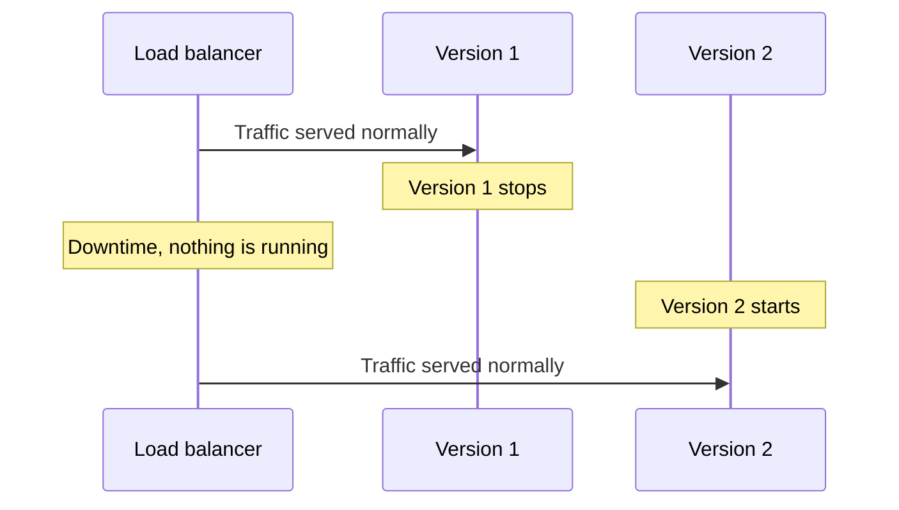

**Example:**

```bash
docker stop checkout-api-v1
docker run -d --name checkout-api-v2 bookshop-api:1.4.2
```

**Good for:**
- Small internal tools or batch jobs where a short, known-scope outage is genuinely acceptable
- Situations where old and new versions genuinely cannot coexist against the same data at once

**Watch out for:**
- Any user-facing service where downtime, even a few seconds, has a real cost
- It scales badly — the more instances you run, the longer the gap where none of them are up

### Rolling update

**In one line:** replace old instances with new ones a few at a time, so some capacity is always serving traffic, until every instance is on the new version.

**How it works:** instead of stopping everything at once, a rolling update starts a few new-version instances, waits for them to become healthy, removes an equal number of old ones, and repeats until the swap is complete. Two settings control the pace: how many *extra* new instances are allowed to exist beyond the normal count while the rollout is in progress (often called `maxSurge`), and how many instances are allowed to be unavailable at any one moment (`maxUnavailable`). It's repaving a road one lane at a time instead of closing the whole road — traffic keeps moving throughout, just squeezed onto whatever lanes are currently open.

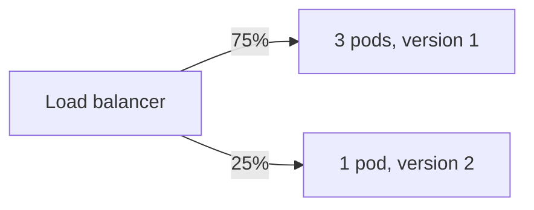

That's a snapshot partway through; the split moves from all version 1, through mixes like this, to all version 2 as each old pod is replaced.

**Example:**

```yaml
apiVersion: apps/v1
kind: Deployment
metadata:
  name: checkout-api
spec:
  replicas: 4
  strategy:
    type: RollingUpdate
    rollingUpdate:
      maxSurge: 1        # 1 extra pod allowed during the rollout
      maxUnavailable: 0  # never drop below 4 available pods
  template:
    spec:
      containers:
        - name: checkout-api
          image: bookshop-api:1.4.2
```

**Good for:**
- The default choice for most stateless services — no downtime, no need to run two full environments
- Gradually swapping capacity without any deliberate traffic-splitting logic

**Watch out for:**
- Old and new code briefly serving the same users at the same time, against the same database — any schema change has to tolerate both
- A rollout that stalls partway (new pods never become healthy) can leave a service stuck on a mix of versions until someone intervenes

### Blue-green

**In one line:** run two identical full environments — "blue" (current) and "green" (new) — then switch all traffic from one to the other at once, keeping the old one warm as an instant way back.

**How it works:** green is deployed and fully tested while blue keeps serving all live traffic, completely unaffected. Once green is verified, the switch — usually the load balancer's target, or a DNS change — flips every request to green in one motion. Unlike a rolling update, requests are never split between old and new code; unlike canary, the switch isn't gradual. It's two identical stages: the performance is running live on stage A while the dress rehearsal happens on stage B, and when B is ready, the spotlight swings across in one movement.

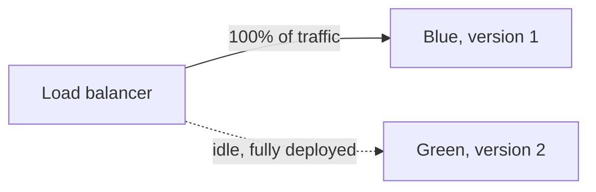

**Example:**

```bash
# point the load balancer at the green target group
aws elbv2 modify-listener --listener-arn $LISTENER \
  --default-actions Type=forward,TargetGroupArn=$GREEN_TARGET_GROUP
```

**Good for:**
- An instant, all-at-once cutover with an equally instant rollback — just switch the target back
- Testing the new environment for real, under production-like conditions, before it ever sees a user

**Watch out for:**
- Running two full production-sized environments at once costs roughly double, even if only briefly
- A database shared by both environments still needs to stay compatible with whichever one is live at the moment

### Canary release

**In one line:** send a small slice of real traffic to the new version, watch error rates and latency, then gradually increase that slice until it's serving everyone — or pull it back the moment something looks wrong.

**How it works:** a canary in a coal mine is a small, closely watched exposure that warns you before it affects everyone. A canary release does the same thing with traffic: 5% of requests go to the new version while 95% stay on the old, known-good one. If the new version's error rate and latency stay healthy, the slice grows — 25%, then 50%, then 100%. If it doesn't, the slice drops back to zero and the team investigates, having only ever exposed a small fraction of users to the problem. This differs from a plain rolling update in intent: a rolling update just swaps capacity, while a canary is a deliberate, watched comparison before the rest of production is trusted with the new version.

<a href="https://alwintwk.github.io/dev-knowledge/diagrams/deployment-canary-release.html">
  <picture>
    <source media="(prefers-color-scheme: dark)" srcset="../diagrams/deployment-canary-release.dark.png">
    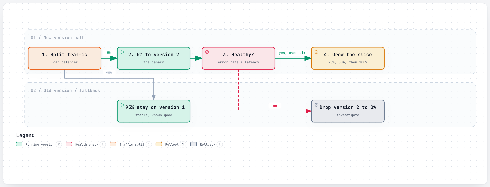
  </picture>
</a>

**Example:**

```yaml
# simplified Istio VirtualService, weighted traffic split
http:
  - route:
      - destination:
          host: checkout-api
          subset: v1
        weight: 95
      - destination:
          host: checkout-api
          subset: v2
        weight: 5
```

**Good for:**
- Catching a bad deploy — a slow query, a memory leak, a crash under real load — while it's only affecting a small, controlled slice of users
- Rollouts risky enough to want evidence before trusting the whole fleet

**Watch out for:**
- Needing enough traffic volume for the canary's small slice to be statistically meaningful — a canary on 5% of ten requests a minute tells you almost nothing
- The extra machinery: weighted routing, dashboards, and someone (or something) actually watching them, which is more operational overhead than a plain rolling update

### Shadow / dark launch

**In one line:** send a copy of real production traffic to the new version too, but throw away its response — users only ever see the old version's answer — so you can compare the new version's real-world behavior with zero user-facing risk.

**How it works:** the load balancer (or a proxy in front of it) mirrors each incoming request: one copy goes to the live version and its response is what the user actually gets, and a second copy goes to the new version purely so its behavior, timing, and output can be logged and compared afterward. It's a trainee doctor sitting in on real appointments, writing their own diagnosis on a notepad nobody acts on, purely to compare it against the senior doctor's actual diagnosis afterward.

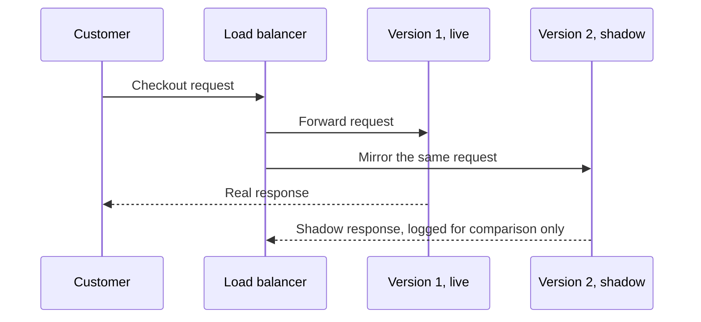

**Example:**

```nginx
location /checkout {
  proxy_pass http://v1-checkout;
  mirror /shadow-checkout;   # a copy of the request only, response ignored
}
```

**Good for:**
- Validating a risky rewrite (a new pricing engine, a new recommendation model) against real traffic patterns before it ever affects a user
- Comparing performance and output between old and new logic under genuine production load

**Watch out for:**
- The shadow copy still costs real compute and can hit real downstream systems — a shadowed "place order" call needs to be careful not to actually place a second order
- It only tells you how the new version *would* respond, not how users experience it, since nobody ever sees the shadow response

### A/B testing vs canary

**In one line:** both split traffic between two versions, but a canary asks "is the new version technically safe?" for a few minutes or hours, while an A/B test asks "which version performs better?" on purpose, over days or weeks, for a specifically sized audience.

**How it works:** the mechanism looks identical — some percentage of traffic on version A, some on version B — which is exactly why the two get confused. The goals are different. A canary is watching operational health: error rate, latency, crash rate, and the moment those look bad, the answer is always "route away from the new version." An A/B test is watching a business or product metric: conversion rate, revenue per checkout, click-through — and *either* version might "win," with losing not implying anything is broken. The audience selection differs too: a canary usually grabs a random small slice of all traffic and ramps it up fast; an A/B test typically assigns each user consistently to one variant (the same person sees the same version every time) and holds that split for as long as it takes to reach a statistically meaningful result. A canary is a safety check on a deploy; an A/B test is a product decision that happens to use the same traffic-splitting plumbing.

**Example:**

```js
// A/B test: consistent assignment, same user always sees the same variant
function variantFor(userId) {
  const hash = hashToInt(userId) % 100;
  return hash < 50 ? "control" : "gift-card-checkout-v2";
}
```

**Good for:**
- Canary: deciding whether a deploy is safe to keep rolling out
- A/B testing: deciding which of two working versions actually performs better with users

**Watch out for:**
- Calling a canary "done" the moment it reaches 100% — that's a completed rollout, not a concluded experiment, and vice versa: don't leave a canary running for three weeks waiting for statistical significance it was never designed to reach
- Mixing the two: judging an A/B test's business metric off a canary-sized 5% slice that hasn't run long enough to mean anything

## Decoupling deploy from release

Everything above assumed deploying and releasing happen together — new code goes live for everyone the moment it reaches production. Feature flags break that assumption apart: you can deploy code to 100% of production while it's still switched off for 100% of users, and turn it on independently of any deploy at all.

### Feature flags

**In one line:** an if-statement, driven by configuration instead of a code change, that decides whether a given user sees a given piece of code — so turning a feature on or off is a config flip, not a redeploy.

**How it works:** a flag service holds a simple rule ("gift-card-checkout is on for user 42") and the app checks it at the point where the new code would run. Four types show up constantly, and they're worth telling apart because they get removed (or not) very differently:
- **Release flag** — temporary, gates an in-progress feature so it can be merged and deployed dark, then switched on once it's ready. Deleted once the rollout is complete.
- **Experiment flag** — the same idea, feeding an A/B test: assigns users to a variant and stays until the experiment concludes and a winner is picked.
- **Ops / kill switch** — long-lived, wrapped around a risky or expensive subsystem (say, the gift-card lookup) so on-call can flip it off in seconds during an incident, with no deploy required.
- **Permission flag** — long-lived, gates a feature by who the user is: a paid plan, a beta group, an internal account. Often never removed, since it's describing a real, ongoing business rule.

It's a fuse box with individually labeled circuit breakers — you can flip off just the "gift cards" breaker without rewiring the whole house.

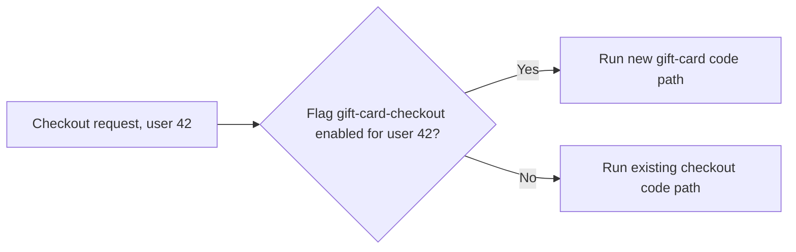

**Example:**

```js
if (flags.isEnabled("gift-card-checkout", { userId: user.id })) {
  return renderGiftCardCheckout(user, cart);
}
return renderStandardCheckout(user, cart);
```

**Good for:**
- Shipping incomplete or unapproved work to production safely, ahead of the moment it actually goes live
- Turning a bad feature off in seconds during an incident, with no deploy in the critical path

**Watch out for:**
- Old release flags nobody removes, until the codebase is full of `if` branches nobody's sure are safe to delete
- Flag checks so deeply threaded through the code that testing every combination of flags on and off becomes its own project

### Trunk-based development

**In one line:** everyone commits small changes directly to one shared main branch ("trunk") often, instead of working for days or weeks on long-lived feature branches, and uses feature flags — not branches — to hide unfinished work.

**How it works:** the full comparison against feature-branch and Git Flow style workflows lives in [Git workflows](git-workflows.md); what matters here is the deployment angle. Trunk-based development is what makes "build once, deploy many" and continuous deployment realistic, because main is always the thing that's currently being built and promoted — there's no long-lived branch sitting apart from what's actually shippable. Half-finished work doesn't hide in a branch that will need a painful merge later; it hides behind a feature flag that's already merged into main, switched off.

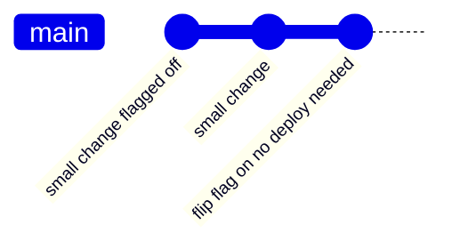

**Example:**

```bash
git checkout main
git pull
# small change, already flagged off, merges straight to main
git commit -am "add gift-card lookup behind gift-card-checkout flag"
git push origin main
```

**Good for:**
- Keeping main always deployable, since nothing large and half-finished is sitting on a separate branch
- Avoiding long-lived branches that drift far enough from main to make merging its own multi-day project

**Watch out for:**
- It only works smoothly alongside feature flags — without them, committing unfinished work straight to main breaks main for everyone
- Needs a genuinely strong automated test suite, since there's no long review window on a branch to catch problems before they reach main

### Dark launches

**In one line:** deploy the new code fully into production while it's invisible to real users — reachable only by internal testers or a targeting rule — then flip it on for everyone once it's proven itself, with no further deploy.

**How it works:** this is a different thing from the "Shadow / dark launch" rollout strategy covered earlier. That one was a *technique for testing a new version's behavior* by mirroring real traffic to it before trusting it. A dark launch, here, is the broader practice — enabled by feature flags — of shipping the code itself far ahead of exposing it: the feature can sit fully deployed and dark for days, visible only to the internal team or a specific targeting rule, completely independent of how the rollout to production happened.

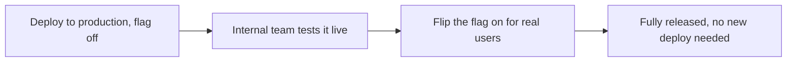

**Example:**

```js
// dark: only visible to the internal team, everyone else unaffected
flags.setRule("gift-card-checkout", { group: "bookshop-staff" });
```

**Good for:**
- Letting a feature soak in production, under real infrastructure, before any real user sees it
- Decoupling "code is ready" from "the business is ready to announce it" (a launch date, a legal approval)

**Watch out for:**
- A dark feature that quietly runs background work (sending emails, writing rows) even though nobody's supposed to be using it yet — "invisible in the UI" isn't the same as "does nothing"
- Forgetting it's dark, and being surprised when flipping the flag suddenly changes behavior for everyone at once

## When it goes wrong

However carefully you roll out, sometimes the new version is broken. This section is about noticing fast and getting back to safety.

### Health checks and readiness vs liveness

**In one line:** a readiness check asks "should traffic be sent to this instance right now?"; a liveness check asks "is this instance still working at all, or should it be killed and restarted?" — two different questions, checked separately.

**How it works:** a container can be **alive** (the process is running) without being **ready** (it's still loading its cache, or waiting on a database connection). Sending traffic to something alive-but-not-ready causes real errors; sending traffic to something dead does too, but for a different reason and needing a different fix. Readiness is the "we're open" sign in the shop window, only switched on once the till and the lights are actually working — checked before customers are let in. Liveness is a staff member periodically checking the shop hasn't caught fire, and calling in a whole new shift if it has.

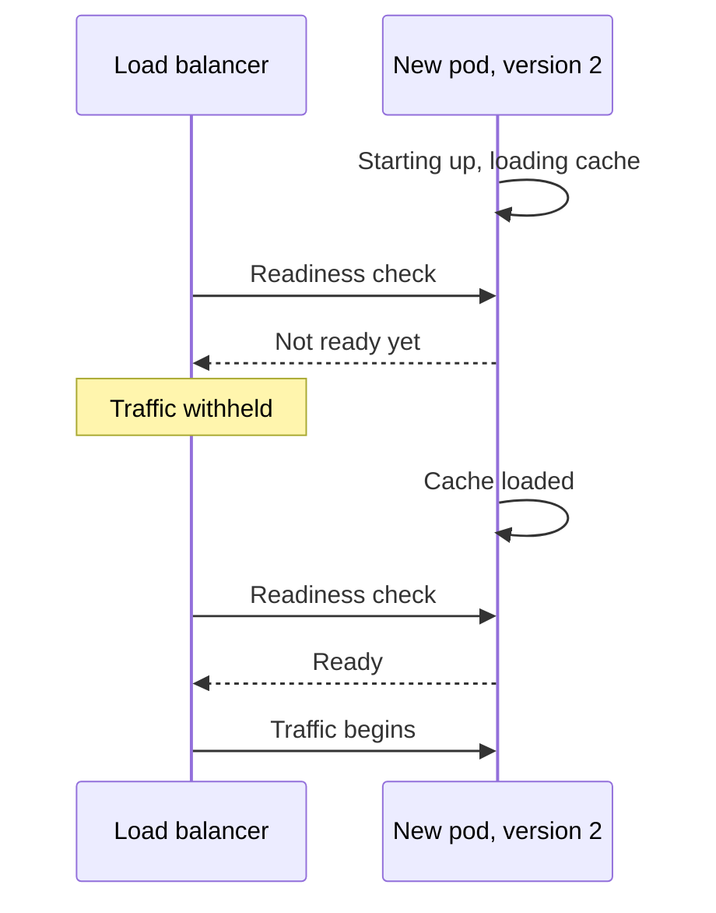

**Example:**

```yaml
readinessProbe:
  httpGet:
    path: /health/ready
    port: 3000
livenessProbe:
  httpGet:
    path: /health/live
    port: 3000
  periodSeconds: 10
```

**Good for:**
- Stopping a load balancer from sending real requests to an instance that's still starting up
- Automatically restarting an instance that's stuck or hung, without a human having to notice first

**Watch out for:**
- A liveness check that's too aggressive and restarts a healthy-but-momentarily-slow instance, causing a restart loop instead of fixing anything
- Confusing the two: a readiness failure means "stop sending traffic," not "restart me" — restarting a merely-not-ready instance doesn't help it get ready any faster

### Automatic rollback

**In one line:** a pipeline that watches error rate and latency right after a deploy and automatically redeploys the previous version the moment those numbers cross a bad threshold, instead of waiting for a human to notice.

**How it works:** this pairs naturally with a canary or rolling rollout — since only a slice of traffic is on the new version at any point, the blast radius of a bad deploy is already small, and an automated watcher can cut it off faster than a human staring at a dashboard. It's a smoke detector that doesn't just beep: it also calls the fire department and starts the sprinklers, without waiting for someone to smell smoke first.

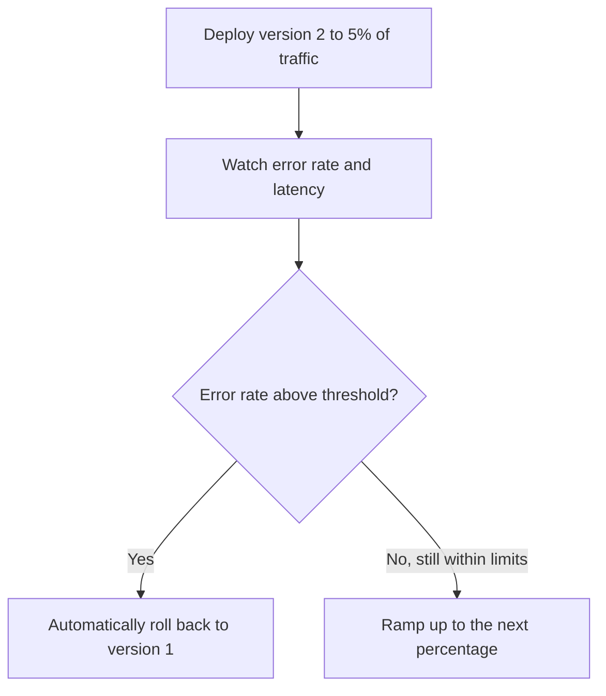

**Example:**

```yaml
# simplified rollout analysis step
analysis:
  metric: error-rate
  successCondition: result < 0.01
  failureLimit: 1
  onFailure: rollback
```

**Good for:**
- Cutting the time between "something's wrong" and "traffic stops hitting the broken version" down from minutes of human reaction time to seconds
- Overnight or unattended deploys, where no human is watching a dashboard live

**Watch out for:**
- A threshold set too sensitively, so normal noise (a brief latency blip) triggers rollbacks that interrupt otherwise-healthy rollouts
- Automatic rollback doesn't undo a database migration that already ran — see expand/contract below for why that matters

### Database migrations without downtime

**In one line:** change a database schema in several small, backward-compatible steps instead of one big change, so old and new code can both run against the same database at the same time during a rollout.

**How it works:** during a rolling update, a canary, or even the brief window of a blue-green switch, old and new code are, for a moment, both running against the same database. A schema change that only the new code understands will break the old code that's still live. The **expand/contract pattern** solves this in steps:

1. **Expand** — add the new column or table alongside the old one. Nothing reads it yet; both old and new code keep working exactly as before.
2. **Dual-write** — deploy code that writes to both the old and new column, keeping them in sync. Any instance still on the old code, not yet updated, only touches the old column, which is fine.
3. **Backfill** — run a background job that fills in the new column for rows that were written before dual-writing started.
4. **Switch reads** — once the data is confirmed to be in sync, deploy code that reads from the new column instead of the old one.
5. **Contract** — once every instance is on the new code and nothing reads the old column anymore, drop it.

It's replacing a load-bearing wall while the building stays open: you add a temporary support beam first (expand), confirm it's actually holding weight (dual-write, backfill), move the load onto it fully (switch reads), and only then take the old wall out (contract).

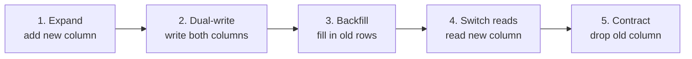

**Example:**

```sql
-- 1. Expand: nullable, so existing rows and old code are unaffected
ALTER TABLE orders ADD COLUMN gift_card_code_normalized TEXT;

-- 3. Backfill existing rows in batches
UPDATE orders
SET gift_card_code_normalized = UPPER(TRIM(gift_card_code))
WHERE gift_card_code_normalized IS NULL;

-- 5. Contract: only once every instance reads the new column
ALTER TABLE orders DROP COLUMN gift_card_code;
```

**Good for:**
- Any schema change that has to happen while a rolling, canary, or blue-green rollout is in progress
- Making a migration itself reversible, one small step at a time, instead of one irreversible leap

**Watch out for:**
- Running the contract step before every instance has actually switched to reading the new column — that instantly breaks whichever old instances are still around
- Treating "expand and contract" as one deploy instead of several — the whole point is that each step ships and settles on its own

### Roll forward vs roll back

**In one line:** rolling back means redeploying the last known-good version; rolling forward means shipping a new fix ahead instead — and once a migration's contract step has run, roll forward is often the only safe option.

**How it works:** rollback is the natural first instinct, and it's fine exactly when the previous version is still fully compatible with the current database — which is precisely what expand/contract is designed to guarantee at every step along the way. But if the contract step has already run and dropped the old column, the previous version's code has nothing left to read: rolling back now doesn't restore safety, it just breaks things in a different way. In that situation, rolling forward with a small, targeted fix on top of the new version is safer than trying to reverse a schema change that other data may already depend on.

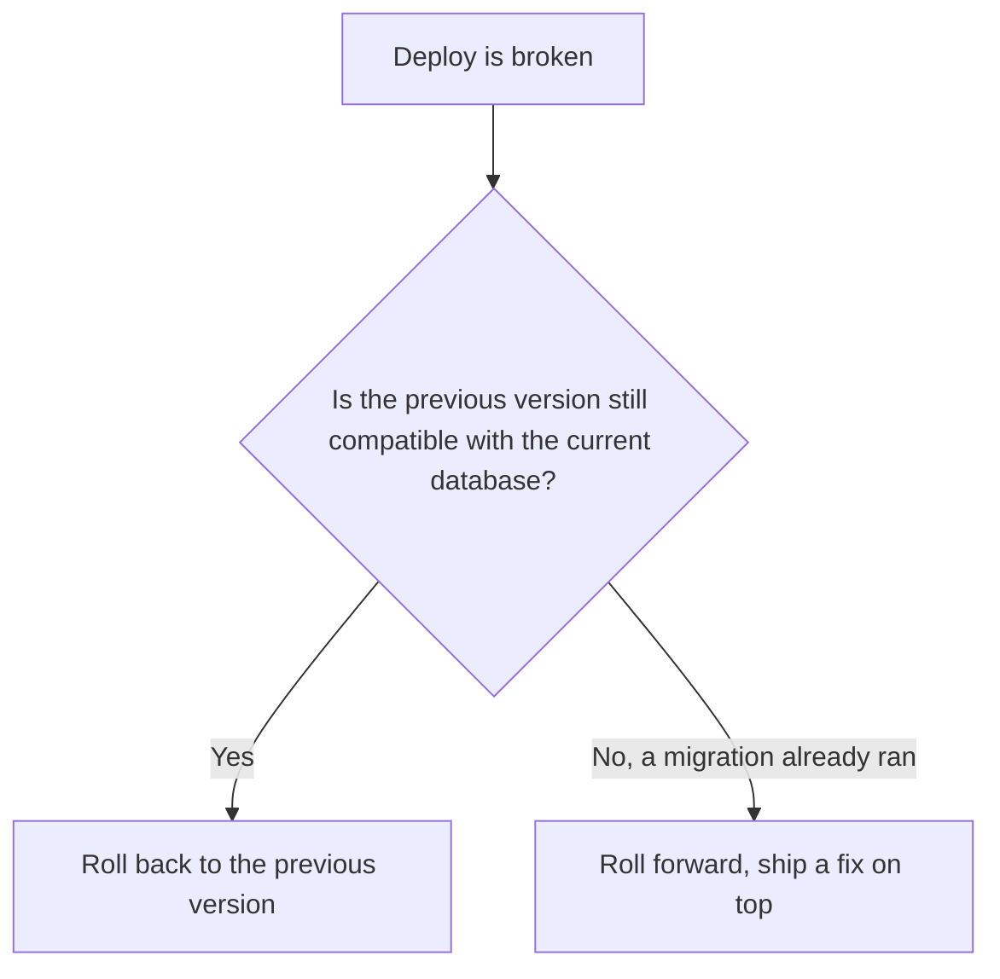

**Example:**

```bash
# roll back: previous version, same database, still compatible
kubectl rollout undo deployment/checkout-api
```

**Good for:**
- Rollback: a fast, low-risk way back when no irreversible migration step has run yet
- Roll forward: the only real option once a contract step, or any other irreversible change, has already happened

**Watch out for:**
- Reflexively rolling back without checking whether a migration ran first — that can turn one incident into two
- Treating roll-forward as slower or scarier by default; a small, well-tested fix is often faster to ship than untangling a schema mismatch

## Side by side

| Strategy | Downtime | Extra infra cost | Rollback speed | Risk exposure | Complexity |
|---|---|---|---|---|---|
| Recreate / big-bang | Yes, brief outage | None, one environment | Fast, but also has downtime | All-or-nothing | Low |
| Rolling update | None | Small, a few extra instances during rollout | Fast, roll the update backward | Gradual, old and new both serve traffic briefly | Medium |
| Blue-green | None | High, two full environments running at once | Instant, switch back | All-or-nothing per switch | Medium |
| Canary release | None | Small, a few new-version instances | Fast, drop traffic to 0% | Small and controlled, grows slowly | High |
| Shadow / dark launch | None | Medium, extra capacity to also run the shadow copy | Instant, users were never on it | None to real users, results are for comparison only | High |
| Feature-flagged release | None | Low, one flag service | Instant, flip the flag | Controlled by a targeting rule, independent of any deploy | Medium |

## Which one should I pick?

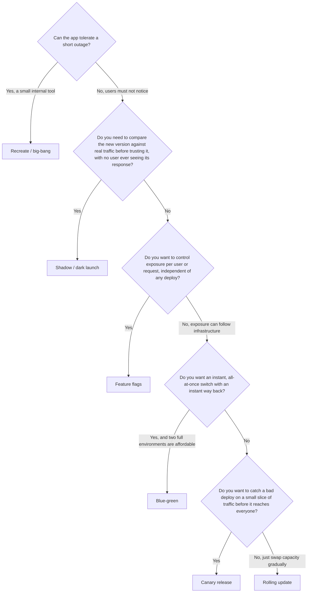

A few real scenarios to sanity-check the tree against:

1. **A small internal admin tool used by three warehouse staff, who already know to refresh if it's down for thirty seconds.** Recreate — the simplicity is worth more than a small, known-audience outage.
2. **The checkout service, which must never be down, with an instant way back if something's wrong.** Blue-green — an instant cutover, and the old environment stays warm as an instant rollback.
3. **A change to how shipping cost is calculated, risky enough that the team wants to watch error rates before trusting it.** Canary — start at 5% of checkouts, watch, ramp up.
4. **A finished gift-card checkout feature that legal hasn't approved for launch yet, but the team wants it deployed and ready.** Feature flag — deploy it dark now, flip it on the moment approval lands, no redeploy needed.
5. **A recommendation-engine rewrite the team wants to validate against real traffic patterns before a user ever sees its output.** Shadow / dark launch — mirror real checkout traffic, compare the two versions, decide later.

## Common mistakes

- Treating "deployed" and "released" as the same moment — a broken feature deployed straight to 100% of users has no soft landing.
- Running a schema migration that only the new code understands in the same step as the code deploy, breaking the old code still live during a rolling or canary rollout.
- Skipping readiness checks, so the load balancer sends real traffic to an instance that's still starting up and hasn't finished loading its cache.
- Leaving a "temporary" release flag in the codebase a year after the feature fully rolled out, until nobody remembers what it's for.
- Watching a canary's dashboards for thirty seconds and calling it safe, when the failure only shows up under a load pattern that happens once an hour.
- Assuming a bad deploy can always be rolled back, after a migration's contract step has already run and removed the column the old code needs.
- Reaching for blue-green or canary on a small side project, when the operational overhead costs more than the downtime it's avoiding.

## Go deeper

Big-tech-system-design concepts:
- [Microservices](https://github.com/alwintwk/big-tech-system-design/blob/main/concepts/microservices.md) — deployment gets harder once "the app" is many independently deployed services
- [Load balancing](https://github.com/alwintwk/big-tech-system-design/blob/main/concepts/load-balancing.md) — the traffic-splitting mechanics behind rolling updates, blue-green, and canary releases

Sibling deep dive: [Git workflows](git-workflows.md) — trunk-based development and branching strategies in full.

Tools: [web-dev-resources → Hosting & deployment](https://github.com/alwintwk/web-dev-resources#hosting--deployment)

External references:
- [Martin Fowler — BlueGreenDeployment](https://martinfowler.com/bliki/BlueGreenDeployment.html)
- [Martin Fowler — Feature Toggles](https://martinfowler.com/articles/feature-toggles.html)
- [Kubernetes — Deployments](https://kubernetes.io/docs/concepts/workloads/controllers/deployment/)
- [Google SRE Book — Release Engineering](https://sre.google/sre-book/release-engineering/)
