# Git workflows

> Git stores your code as a series of snapshots, not a pile of diffs — once that one idea clicks, branching, merging, rebasing, and undoing mistakes all stop being magic and start being predictable.

[← Back to Git & workflow](../README.md#git--workflow)

## Why this matters

Say three people are working on the same online bookshop. You're adding a "save for later" button to checkout. A teammate is fixing a bug in how orders calculate tax. Another is rewriting the book search page. All three of you are editing files that live in the same folders, sometimes the same files, at the same time — and none of you can afford to wait for the others to finish before starting your own work.

Git is what makes that possible without chaos. Each of you works on your own **branch** (an independent line of history), and Git gives you tools to combine that work back together later, tell each other what changed and why, and undo a mistake without losing everything else. But those tools have real trade-offs: merge a certain way and you get a messy history that's hard to read six months from now; rebase a branch someone else already pulled and you can break their local copy; run the wrong flavor of `git reset` and you can lose work that took hours to write. None of this is about memorizing commands — it's about understanding what Git is actually doing underneath them, so the command you reach for is the right one for the situation, not just the first one you remember.

## The map

Everything on this page builds on one fact: Git stores snapshots of your whole project, not a list of edits. From there, the page has four moving parts — how Git stores that history, how you combine separate lines of history back together, which overall shape a team gives its branches, and the habits a team layers on top to keep all of it reviewable. A fifth part, undoing things, is the safety net underneath all of it.

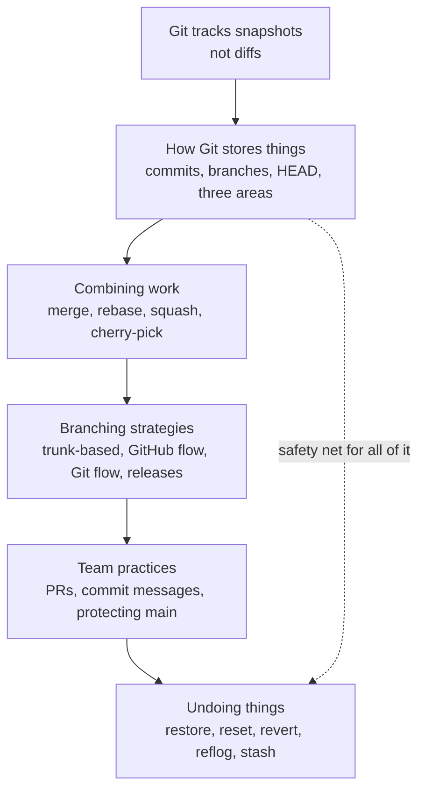

> **Why this matters:** the shape you pick for "branching strategies" decides how often code reaches production. The habits in "team practices" decide how safely it gets there. And "undoing things" is what saves you the day you get either of those wrong.

## How Git stores things

Before merge and rebase make sense, you need Git's actual data model — not the command-line mental model most tutorials teach, the real one underneath it.

### Commits, trees, and blobs

**In one line:** every commit is a full snapshot of your entire project at that moment, not a stored diff — Git figures out differences on the fly, when you ask for them.

**How it works:** a **commit** points to a **tree** (a snapshot of your whole folder structure at that moment), and each tree points to **blobs** (binary large objects — Git's word for a stored file's content, with no filename attached) for files, and to more trees for subfolders. If a file didn't change between two commits, both commits' trees just point at the exact same blob — Git doesn't store it twice. This is why `git diff` between two commits is *computed*, not looked up: Git walks both trees and compares what's different, on demand.

Think of each commit as a full photograph of your desk, not a list of "moved the stapler two inches left." Comparing two photos to see what moved is easy even though neither photo *is* a list of changes.

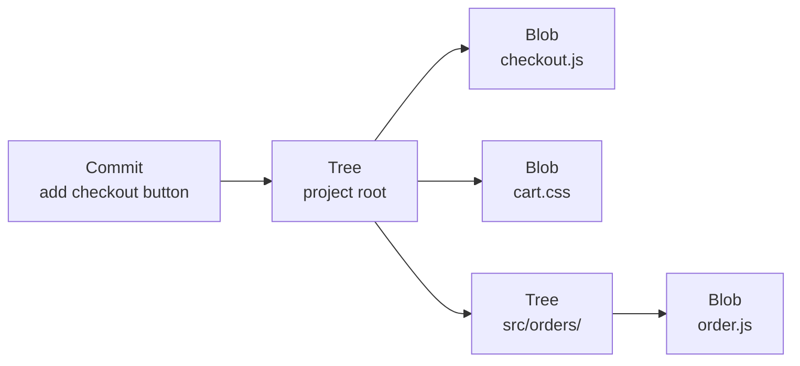

**Example:**

```bash
$ git cat-file -p HEAD
tree 9a3f2c1
parent 6b8e0aa
author Alwin <alwin@bookshop.dev> 1758963200 +0800
committer Alwin <alwin@bookshop.dev> 1758963200 +0800

Add checkout button to cart page

$ git cat-file -p 9a3f2c1
100644 blob 4c2a9e1  checkout.js
100644 blob 7ff10b2  cart.css
040000 tree 1a0dd33  src
```

**Good for:**
- Understanding why Git is fast at switching branches — it just points at a different snapshot, nothing to "replay"
- Understanding why identical files across commits cost almost no extra space

**Watch out for:**
- Assuming Git stores line-by-line diffs internally — it doesn't; diffs are a view Git computes for you, not the storage format

### Branches are just pointers

**In one line:** a branch is nothing but a small file holding one commit's ID (hash) — moving a branch forward is just changing that one value.

**How it works:** when you run `git commit`, Git creates the new commit, then moves your current branch's pointer to point at it. That's the entire mechanism — there's no special "branch object" holding a list of commits, just a name pointing at the latest one in that line, and each commit pointing back at its parent to form the chain. **HEAD** is a second, special pointer: it usually points at your current branch (which itself points at a commit), so HEAD moves automatically whenever your branch does. If you check out a specific commit instead of a branch, HEAD points straight at that commit instead — a state called "detached HEAD."

It's like a bookmark in a very long shared book: the branch name is the bookmark, the commit it points to is the page, and HEAD is a note on your desk saying which bookmark you're currently using.

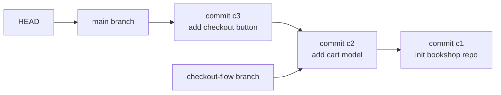

**Example:**

```bash
$ cat .git/refs/heads/main
c3f1a9d8e2b7...

$ git symbolic-ref HEAD
refs/heads/main

$ git log --oneline -1
c3f1a9d Add checkout button to cart page
```

**Good for:**
- Explaining why creating a branch is instant — `git branch checkout-flow` just writes one new small file, it doesn't copy anything
- Explaining detached HEAD warnings — you're pointed at a commit with no branch name tracking it, so new commits there can get lost once you check out something else

**Watch out for:**
- Committing while in detached HEAD state and then switching branches — those new commits have no branch pointing at them and can be hard to find again (reflog, below, is the way back)

### The three areas

**In one line:** every file in a Git project sits in one of three places — the working directory (what you're editing), the staging area (what you've marked ready), and the repository (what's actually committed).

**How it works:** the **working directory** is the actual files on disk that your editor touches. The **staging area** (also called the "index") is a holding pen — `git add` copies a file's current state there without committing it, which is why you can stage half your changes and leave the rest for a later commit. The **repository** is the permanent, committed history — what `git commit` writes from whatever's currently staged. Most day-to-day Git commands are really about moving content between these three areas in one direction or the other.

It's a delivery pipeline: the working directory is your workbench, the staging area is the loading dock where you've packed the boxes you're ready to ship, and the repository is the truck that's already left with a signed manifest.

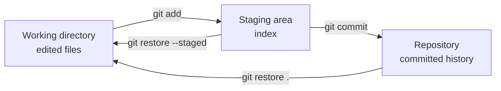

**Example:**

```bash
$ git status
On branch checkout-flow
Changes not staged for commit:
  modified:   checkout.js
Changes to be committed:
  new file:   cart.css

$ git add checkout.js
$ git commit -m "Add checkout button and cart styling"
[checkout-flow 4f2a1c9] Add checkout button and cart styling
 2 files changed, 31 insertions(+)
```

**Good for:**
- Building precise, single-purpose commits by staging only related changes, even from a messy working directory
- Understanding `git status`'s two separate lists — "not staged" vs "to be committed" — instead of treating it as one blob of noise

**Watch out for:**
- Running `git add .` out of habit and committing unrelated changes together, making the commit hard to review or revert cleanly

## Combining work

Once two branches have diverged, Git gives you several distinct ways to bring that work back together — each one keeps or rewrites history differently.

### Merge

**In one line:** merging brings one branch's commits into another — if the target branch hasn't moved since you branched off, Git just slides its pointer forward (fast-forward); if both branches have new commits, Git creates a new merge commit with two parents.

**How it works:** a **fast-forward merge** happens when the branch you're merging *into* has no commits that the other branch doesn't already contain — Git can just move the pointer up to the tip of the other branch, no new commit needed, because history is still a straight line. A **three-way merge** happens when both branches have diverged (both have commits the other doesn't) — Git looks at the common ancestor and both branch tips, combines the changes, and creates a **merge commit** with two parents recording that combination. Conflicts, covered below, only happen in this second case.

Fast-forward is like discovering nobody else touched the shared whiteboard while you were writing on your own copy — you just tape your copy over the original. A three-way merge (diagrammed below) is like two people editing separate copies at once — someone has to sit down with both versions and the original and write a combined final draft.

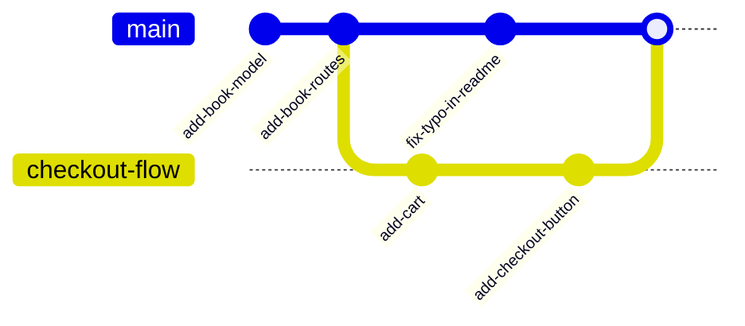

**Example:**

```bash
$ git checkout main
$ git merge checkout-flow
Merge made by the 'ort' strategy.
 checkout.js | 18 ++++++++++++++++++
 cart.css    | 13 +++++++++++++
 2 files changed, 31 insertions(+)
```

**Good for:**
- Preserving the exact, true history of when and how branches actually diverged and rejoined
- Merging long-lived branches (like a release branch back into main) where you want that record kept

**Watch out for:**
- A history full of merge commits from many tiny branches, which can get noisy and hard to read in `git log`
- Assuming a merge is always fast-forward — if main moved on, you'll get a merge commit (and possibly conflicts) instead

### Rebase

**In one line:** rebasing takes your branch's commits and replays them, one by one, on top of a different starting point — usually the latest version of main — producing a straight-line history instead of a merge commit.

**How it works:** `git rebase main`, run from your feature branch, finds the commits your branch has that main doesn't, then reapplies each one on top of main's current tip, as if you'd started your branch from there all along. Every replayed commit gets a **new hash**, because a commit's hash depends on its content and its parent — and the parent just changed. That's the entire reason for the golden rule: **never rebase commits that other people have already pulled.** If you rewrite history someone else built on top of, their branch and yours now disagree about what happened, and reconciling the two is painful.

It's rewriting your rough draft to start from the *latest* copy of a shared outline, sentence by sentence, so your final draft reads as if you'd written it in that order from the start. Fine if it's still your private draft. A problem the moment you've mailed copies to reviewers who started marking them up.

Starting from the same diverged branches shown in the merge diagram above, a rebase instead replays `checkout-flow`'s commits on top of main's latest commit, giving new hashes and a straight line:

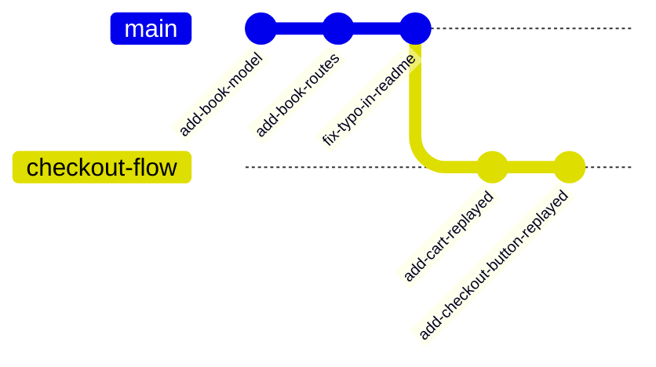

**Example:**

```bash
$ git checkout checkout-flow
$ git rebase main
Successfully rebased and updated refs/heads/checkout-flow.

$ git log --oneline -3
9c1d2e4 (HEAD -> checkout-flow) Add checkout button
7b8f0a2 Add cart
e1a44dc (main) Fix typo in readme
```

**Good for:**
- Keeping a linear, easy-to-follow history on a private feature branch before opening a pull request
- Cleanly resolving "my branch is behind main" without a merge commit cluttering the log

**Watch out for:**
- Rebasing a branch other people have already fetched or based work on — the golden rule exists because rewritten hashes break their copies
- Force-pushing after a rebase (`git push --force`) to a branch anyone else might be using — use `--force-with-lease` if you must, so you don't silently overwrite someone else's new commits

### Squash merge

**In one line:** squash merge takes every commit on a branch and combines them into a single new commit on the target branch, discarding the branch's internal commit-by-commit history.

**How it works:** instead of a merge commit that keeps every original commit and adds a two-parent commit on top (or a rebase that keeps every original commit but replays them), a squash merge flattens the whole branch into one commit's worth of change. The branch's individual "wip", "fix typo", "actually fix it this time" commits never appear in the target branch's history — only their combined end result does, as one clean commit you write a single message for. The source branch itself is untouched (and usually deleted after) — only the target branch's history changes.

It's turning in a clean final report instead of handing over every messy draft, sticky note, and crossed-out paragraph that led to it — the reader only needs the finished result.

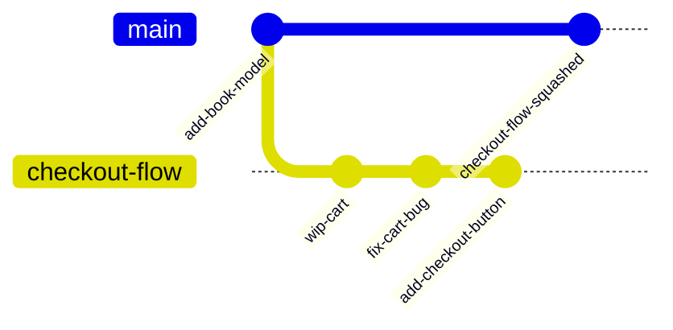

**Example:**

```bash
$ git checkout main
$ git merge --squash checkout-flow
Squash commit -- not updating HEAD
Automatic merge went well; stopped before committing as requested

$ git commit -m "Add checkout flow with cart and confirm button"
[main 8e21fa0] Add checkout flow with cart and confirm button
 3 files changed, 54 insertions(+), 4 deletions(-)
```

**Good for:**
- Feature branches with messy "wip" commits, where only the end result matters to the project's history
- GitHub's and GitLab's "squash and merge" pull request buttons, which do exactly this automatically

**Watch out for:**
- Losing fine-grained history that could help later with `git bisect` (finding which exact commit introduced a bug) — squashing trades that granularity away for a cleaner log
- Squashing a branch that mixes several unrelated changes — you lose the ability to revert just one of them later

### Cherry-pick

**In one line:** cherry-pick copies one specific commit from anywhere in the repository onto your current branch, as a brand-new commit with the same changes.

**How it works:** `git cherry-pick <commit-hash>` takes the diff introduced by that one commit and applies it on top of wherever you currently are, then creates a new commit with the same message and content (but a new hash, new parent, and often a new date). It's the tool for "I need *just that one fix*, not the whole branch it came from" — most commonly, taking a bug fix that landed on main and applying it to an older release branch too, without merging all of main's other unrelated commits along with it.

It's photocopying one page out of someone else's notebook and taping it into yours, instead of borrowing the whole notebook.

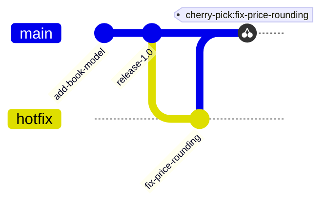

**Example:**

```bash
$ git checkout main
$ git cherry-pick a1b2c3d
[main f9e8d7c] Fix price rounding on checkout total
 Date: Mon Sep 28 14:02:11 2026 +0800
 1 file changed, 3 insertions(+), 1 deletion(-)
```

**Good for:**
- Backporting a single bug fix from main onto an older, still-supported release branch
- Pulling one commit out of a colleague's in-progress branch without merging the rest

**Watch out for:**
- Cherry-picking a commit that depends on other commits you didn't bring along — it can fail to apply cleanly, or apply but break at runtime
- Cherry-picking instead of merging as a habit — it duplicates commits (same change, different hash) across branches, which can confuse `git log` and later merges

### Resolving merge conflicts

**In one line:** a conflict happens when Git can't automatically combine two changes to the same lines — it pauses the merge and asks a human to pick the outcome.

**How it works:** during a three-way merge (or rebase, or cherry-pick), Git compares both versions of a file against their common ancestor. If both sides changed the exact same lines differently, Git can't guess which one you want, so it stops, writes both versions into the file separated by **conflict markers**, and leaves it to you. You edit the file down to what it *should* say, removing the markers entirely, then stage and commit (or continue the rebase) to tell Git you've resolved it. A conflict is not a bug and not something going wrong — it's Git correctly refusing to guess.

It's two editors marking up the same paragraph of a shared document in incompatible ways — the software can't know which edit should win, so it flags the paragraph and hands it back to a human to settle.

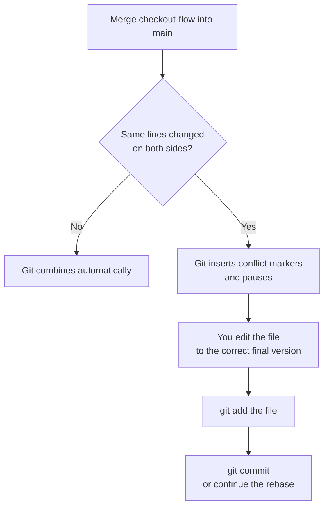

**Example:**

```
<<<<<<< HEAD
const TAX_RATE = 0.08; // updated for new regional rate
=======
const TAX_RATE = 0.06; // Alice's branch, old rate
>>>>>>> checkout-flow
```

```bash
# after manually editing the file down to one correct line:
$ git add checkout.js
$ git commit -m "Merge checkout-flow, keep updated tax rate"
```

**Good for:**
- Catching real, simultaneous changes to the same logic before they silently overwrite each other
- Forcing a conscious decision instead of Git guessing and picking the wrong side

**Watch out for:**
- Resolving a conflict by keeping "your" side without reading what the other side actually changed and why
- Forgetting to remove a conflict marker line — the file will still contain `<<<<<<<` or `>>>>>>>` and likely fail to run

## Branching strategies

The commands above work the same everywhere. What differs, team to team, is the *shape* a team gives its branches — how long they live, how often they merge into main, and how releases happen.

### Trunk-based development

**In one line:** everyone merges small changes into one shared "trunk" branch (usually `main`) very frequently — often daily — instead of working on long-lived branches.

**How it works:** feature branches, if used at all, live for hours to a day or two before merging back into main. Work that isn't finished yet is hidden behind a **feature flag** (a toggle that turns a feature on or off without a code change) rather than kept on a separate branch, so main stays releasable at all times. This only works with strong, fast automated tests, since every merge into main is close to shipping. It's the branching shape behind continuous deployment (shipping to production automatically, many times a day) — see [Deployment](deployment.md) for how feature flags and trunk-based development fit together with release strategy.

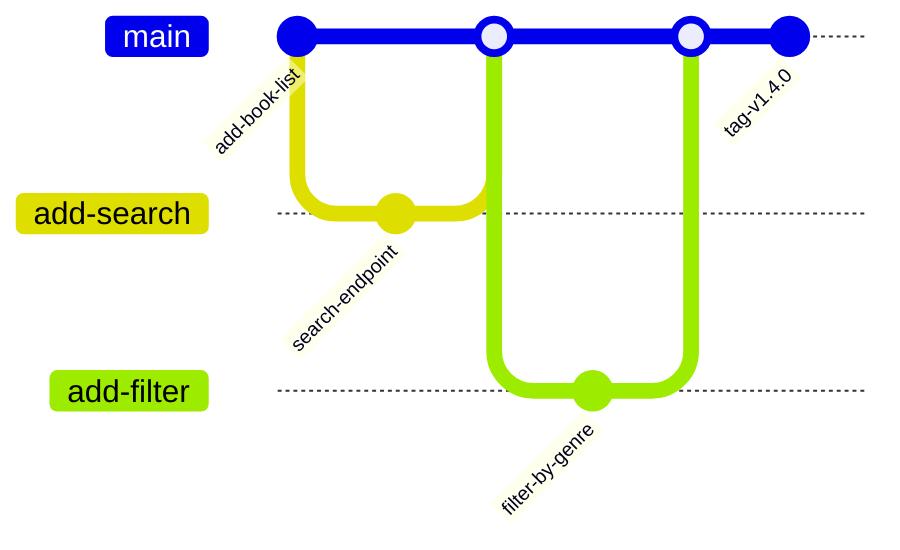

**Example:**

```bash
$ git checkout -b add-filter
$ git commit -am "Add genre filter behind FEATURE_GENRE_FILTER flag"
$ git checkout main
$ git merge add-filter   # merged same day, flag defaults off
```

**Good for:**
- Teams that deploy continuously and want to avoid large, risky merges
- Reducing merge conflicts, since branches never live long enough to drift far from main

**Watch out for:**
- Needing a real feature-flag system and solid CI, or "trunk-based" just becomes "everyone breaks main"
- Half-finished features shipping to production behind a flag that someone forgets to remove

### GitHub flow

**In one line:** one branch (`main`) is always deployable; every change gets its own short branch, a pull request, review, and merges straight back into main.

**How it works:** you branch off main, commit your work, open a pull request early (even before it's finished, to get early feedback), get it reviewed, then merge it into main — after which main is typically deployed right away. There's no separate `develop` branch and usually no long-lived release branch; main *is* the release. It's simpler than Git flow (next) and pairs naturally with continuous delivery, without requiring the flag discipline that full trunk-based development does, since branches can live a few days if needed.

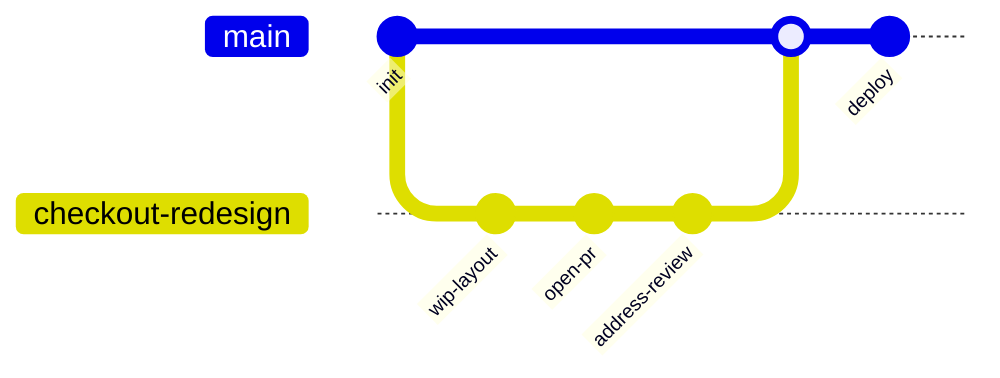

**Example:**

```bash
$ git checkout -b checkout-redesign
$ git push -u origin checkout-redesign
$ gh pr create --title "Redesign checkout page" --fill
# ...review, changes pushed to the same branch...
$ gh pr merge --squash
```

**Good for:**
- Small to medium teams shipping a single web app or service
- Keeping the model simple to explain to a new hire on day one

**Watch out for:**
- Assuming it scales unchanged to teams that must support multiple *live* versions of software at once — that's what release branches (below) are for
- Long-lived branches quietly turning into a private "develop" branch by accident, defeating the "always deployable main" point

### Git flow

**In one line:** a strict model with two permanent branches (`main` for releases, `develop` for integration) plus separate feature, release, and hotfix branches for everything else.

**How it works:** feature branches come off `develop` and merge back into it. When it's time to release, a `release` branch is cut from `develop` for final QA and version bumps, then merged into both `main` (tagged as the release) and back into `develop`. A `hotfix` branch comes off `main` directly for urgent production fixes, then merges into both `main` and `develop` too. It was written down by Vincent Driessen in 2010, for software with distinct, scheduled release cycles — think installed desktop software, not a website you deploy on every merge.

Many teams have since moved away from it for anything that deploys continuously: keeping `develop` and `main` in sync doubles the merge work, feature branches tend to live far longer than in GitHub flow (more drift, more conflicts), and the ceremony of release branches makes little sense when you can ship safely straight from main several times a day. It still fits teams that genuinely ship versioned releases on a schedule — see release branches and hotfixes, next.

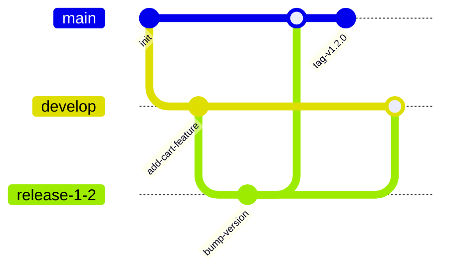

**Example:**

```bash
$ git checkout develop
$ git checkout -b feature/wishlist
$ git commit -am "Add wishlist button"
$ git checkout develop && git merge --no-ff feature/wishlist
$ git checkout -b release-1.2 develop
$ git commit -am "Bump version to 1.2.0"
$ git checkout main && git merge --no-ff release-1.2 && git tag v1.2.0
```

**Good for:**
- Software with genuinely scheduled, versioned releases and a need to support several versions in production at once
- Teams that want a very explicit, well-documented process, even at the cost of extra overhead

**Watch out for:**
- Adopting it by default for a simple web app that deploys on every merge — the extra branches and syncing cost more than they return
- The `develop`/`main` split drifting out of sync when someone hotfixes `main` and forgets to merge it back

### Release branches and hotfixes

**In one line:** a release branch is cut from main at the point you're preparing to ship a version, so ongoing work on main doesn't delay or destabilize that release; a hotfix branches off the released version to patch it urgently.

**How it works:** when a version is ready to stabilize, you branch (e.g. `release-2.0`) and only allow final bug fixes onto it, while main keeps moving forward with the *next* version's features. Once it ships, that commit gets tagged (e.g. `v2.0.0`). If a bug turns up in production afterward, a hotfix branch comes off the release branch (or the tag), gets a minimal fix, merges back into the release branch for a patch release (`v2.0.1`), and that same fix is usually cherry-picked forward into main so the next version doesn't ship with the same bug.

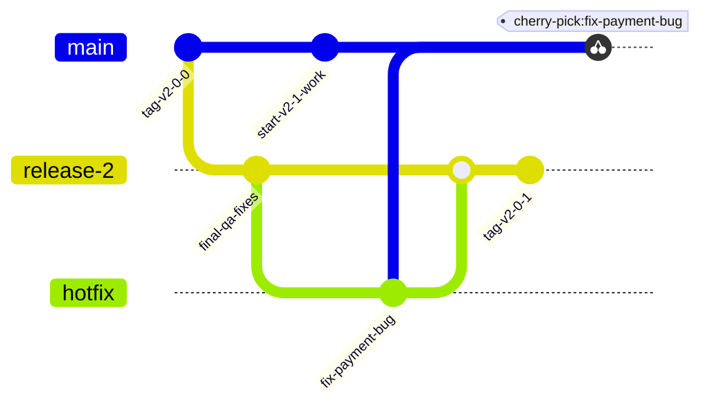

**Example:**

```bash
$ git checkout -b hotfix release-2
$ git commit -am "Fix payment bug rejecting valid cards"
$ git checkout release-2 && git merge hotfix && git tag v2.0.1
$ git checkout main && git cherry-pick <fix-payment-bug-hash>
```

**Good for:**
- Software supporting multiple versions in production at once (an installed app, an API with versioned clients)
- Shipping an urgent fix without dragging in unfinished work already sitting on main

**Watch out for:**
- Forgetting to cherry-pick or merge the hotfix forward into main, so the bug quietly comes back in the next release
- Letting a release branch live so long it effectively becomes a second main, drifting far apart

### Monorepo vs polyrepo

**In one line:** a monorepo keeps many projects in one repository; a polyrepo splits them across many repositories — this is a repo-layout choice, not a branching strategy, but it shapes how branching and PRs feel day to day.

**How it works:** in a monorepo, a single pull request can touch the website, the API, and a shared library together, and get reviewed and merged as one atomic change — but the repository grows large, and needs tooling to avoid running every test on every change. In a polyrepo, each project has its own history, its own release cadence, and clearer ownership, but a change that spans two services needs two coordinated pull requests, in two repositories, that have to land together.

**Example:**

```
# monorepo: one repo, one PR can touch all three
bookshop/{apps/web, apps/api, packages/shared-types}

# polyrepo: three repos, three histories, coordinated PRs
bookshop-web/  bookshop-api/  bookshop-shared-types/
```

**Good for:**
- Monorepo: cross-project changes that must land together, shared code reused without publishing a package for every change
- Polyrepo: independent teams and services with different release schedules and clear ownership boundaries

**Watch out for:**
- Monorepos without tooling to run only the affected tests — CI time balloons as the repo grows
- Polyrepos needing a cross-repo change to ship in the right order, with no atomic way to merge both halves at once

## Team practices

Branching strategy decides the shape of history. These habits decide whether that history is trustworthy and reviewable.

### Pull requests and code review

**In one line:** a pull request (PR) proposes merging one branch into another and gives teammates a place to read the diff, comment, and approve before it happens.

**How it works:** you push your branch, open a PR against main (or develop), and reviewers see every changed line, can comment on specific lines, request changes, or approve. Most teams block merging until at least one approval and passing CI checks are in place (more on that below, under protecting main). The PR is also a record — anyone can later read *why* a change was made, not just *what* changed, from the description and discussion attached to it.

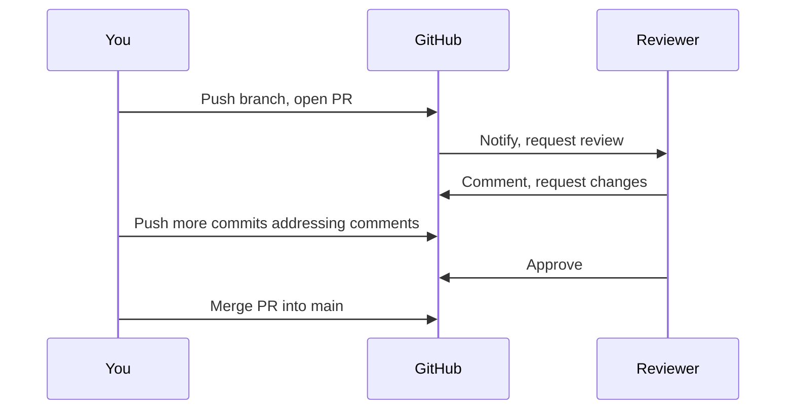

**Example:**

```bash
$ git push -u origin checkout-flow
$ gh pr create --title "Add checkout button" \
    --body "Adds a checkout button and wires it to the cart total."
```

**Good for:**
- Catching bugs and design problems before they reach main, with a second pair of eyes
- Spreading knowledge of the codebase across the team, instead of one person being the only one who understands a piece of it

**Watch out for:**
- Enormous PRs that touch dozens of files — reviewers skim instead of reading, and real problems slip through
- Rubber-stamp approvals given without actually reading the diff, which defeats the point of requiring one

### Commit messages and Conventional Commits

**In one line:** a good commit message explains *why* a change was made, not just what changed; Conventional Commits is a specific `type(scope): subject` format that tools can parse automatically.

**How it works:** the diff already shows *what* changed — a commit message earns its place by adding the *why*, which the code alone can't say. Conventional Commits standardizes the first line as `type(scope): short description`, where `type` is one of a small fixed set (`feat`, `fix`, `docs`, `refactor`, `test`, `chore`, and a few others) and an optional `scope` names the affected area. Tools like `semantic-release` read that structured prefix to automatically decide the next version number and generate a changelog, covered next.

**Example:**

```
feat(checkout): add save-for-later button to cart

Lets a signed-in user move an item from the cart into their
wishlist without losing their place in checkout. Closes #482.
```

```bash
$ git commit -m "fix(orders): correct tax rounding on totals under $1"
```

**Good for:**
- Letting `semantic-release` and similar tools auto-generate changelogs and version bumps straight from commit history
- Making `git log` and `git blame` genuinely useful months later, instead of a wall of "fix", "wip", "more fixes"

**Watch out for:**
- Writing the type prefix correctly but still leaving the subject line meaningless ("fix: fix bug") — the format is not a substitute for content
- A breaking change without the `!` marker or a `BREAKING CHANGE:` footer — tools that auto-bump versions from commit type will miss it and under-version the release

### Semantic versioning and tags

**In one line:** semantic versioning (SemVer) numbers releases `MAJOR.MINOR.PATCH`, where each part tells callers exactly what kind of change to expect; a Git tag marks the exact commit that release was built from.

**How it works:** bump `PATCH` (`1.4.2` → `1.4.3`) for a backward-compatible bug fix, `MINOR` (`1.4.3` → `1.5.0`) for a backward-compatible new feature, and `MAJOR` (`1.5.0` → `2.0.0`) for a breaking change — anything that could break code depending on the old version. A **tag** is a fixed pointer to one specific commit, unlike a branch, which keeps moving; `git tag v1.5.0` marks "this exact commit is what shipped as 1.5.0" permanently.

**Example:**

```bash
$ git tag -a v1.5.0 -m "Release 1.5.0: wishlist and genre filters"
$ git push origin v1.5.0

$ git tag
v1.3.0
v1.4.0
v1.5.0
```

**Good for:**
- Letting other projects that depend on yours (a shared library, a published package) know at a glance whether an upgrade is safe
- Pinning exactly which commit a given production deploy came from, for debugging later

**Watch out for:**
- Bumping only `PATCH` for a change that actually breaks callers, because it "felt small" — SemVer is a promise other people's tooling relies on
- Lightweight tags (`git tag v1.5.0` with no `-a`) when you actually want an annotated tag with a message and author recorded — most release tooling expects annotated tags

### Protecting main

**In one line:** branch protection rules stop anyone (including you) from pushing straight to main, requiring a pull request, passing checks, and often a minimum number of approvals first.

**How it works:** hosts like GitHub let you configure a protected branch to require: at least one pull request (no direct pushes), a minimum number of approving reviews, specific CI checks passing (tests, linting, type-checking), the branch being up to date with main before merging, and often no force-pushes at all. This turns "please review my code" from a polite request into something the tooling actually enforces — a broken or unreviewed change structurally cannot reach main.

**Example:**

```
Branch protection rule for `main`:
  ✓ Require a pull request before merging
  ✓ Require 1 approving review
  ✓ Require status checks to pass: ci/test, ci/lint
  ✓ Require branches to be up to date before merging
  ✗ Allow force pushes: disabled
```

**Good for:**
- Guaranteeing CI actually ran and passed before code reaches main, not just "someone probably ran it locally"
- Preventing an accidental `git push` straight to main from someone's local, half-finished branch

**Watch out for:**
- Requiring so many approvals or checks that small, low-risk changes get stuck waiting, and people start batching changes to avoid the friction
- Forgetting to apply the same protection to a release branch that also ships to production

## Undoing things

Even with all of the above, everyone eventually needs to undo something. Which command is safe depends entirely on whether anyone else has already seen the commits involved.

### Restore, reset, and revert

**In one line:** `git restore` undoes uncommitted changes; `git reset` moves your branch pointer backward with three different levels of "how much to also touch"; `git revert` undoes a commit by adding a new commit that cancels it out.

**How it works:** `git restore <file>` discards uncommitted changes in the working directory back to the last commit; `git restore --staged <file>` unstages a file without touching its contents. `git reset` moves the current branch's pointer to an earlier commit, and the flag decides how far the undo reaches: `--soft` moves only the pointer (your changes stay staged); `--mixed` (the default) also unstages, but leaves the working directory files as they are; `--hard` also overwrites the working directory, discarding uncommitted work entirely. `git revert <commit>` doesn't move any pointer or delete anything — it creates a brand-new commit whose content is the exact opposite of the one you're undoing, which is why it's the one of these four that's always safe on a branch other people already have.

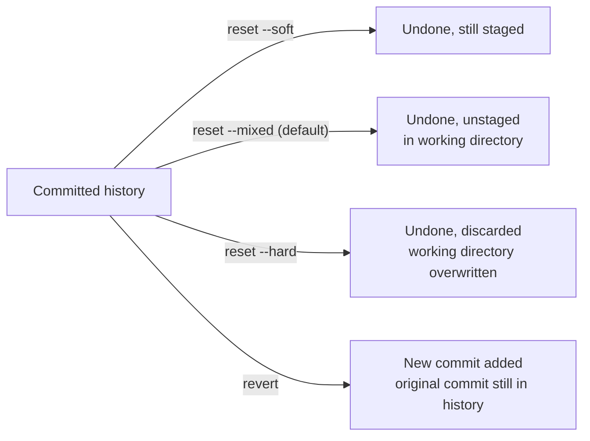

| Command | What it undoes | Safe on a branch others already pulled? |
|---|---|---|
| `git restore <file>` | Uncommitted working directory changes to one file | Yes — only ever touches your local, uncommitted files |
| `git restore --staged <file>` | Staging, without touching file contents | Yes — same reason |
| `git reset --soft` | Moves branch pointer; changes stay staged | No — rewrites history other people may have already fetched |
| `git reset --mixed` | Moves branch pointer; unstages, keeps working directory | No — same reason |
| `git reset --hard` | Moves branch pointer; discards staged and working directory changes | No, and also destructive locally — uncommitted work is gone |
| `git revert <commit>` | Adds a new commit that cancels out an old one | Yes — original history is untouched, safe to push |

**Example:**

```bash
$ git reset --soft HEAD~1     # undo last commit, keep it staged to redo
$ git reset HEAD~1            # (--mixed, default) undo commit and staging
$ git reset --hard HEAD~1     # undo commit, discard the changes entirely

$ git revert a1b2c3d
[main 7f3e9d1] Revert "Fix tax rounding on totals under $1"
 1 file changed, 1 insertion(+), 1 deletion(-)
```

**Good for:**
- `reset --hard`: cleanly throwing away local experiments you're certain you don't want, on a branch nobody else has
- `revert`: undoing a bad commit that's already on a shared branch, without rewriting history anyone else depends on

**Watch out for:**
- Running `git reset --hard` without checking `git status` first — any uncommitted work, staged or not, is gone with no warning
- Using `reset` (in any form) to "undo" a commit that's already been pushed and pulled by teammates — use `revert` instead, for exactly the reason the table above shows

### reflog as the safety net

**In one line:** the reflog is Git's private local log of everywhere HEAD has pointed, which means it can often recover commits that look "lost" after a reset or a rebase gone wrong.

**How it works:** every time HEAD moves — a commit, a checkout, a reset, a rebase — Git records it in the reflog, kept locally (it's never pushed, and each clone has its own). Even after `git reset --hard` seems to erase a commit, the commit object itself usually still exists in Git's storage until garbage collection eventually cleans it up (by default, unreachable commits are kept roughly 30 days, reachable ones around 90); the reflog is how you find its hash again so you can point a branch back at it.

**Example:**

```bash
$ git reset --hard HEAD~1     # oops, that commit had work I needed
$ git reflog
a1b2c3d HEAD@{0}: reset: moving to HEAD~1
f9e8d7c HEAD@{1}: commit: Add checkout button
$ git reset --hard f9e8d7c    # recovered
```

**Good for:**
- Recovering commits after a `reset --hard` you immediately regret
- Untangling a rebase or cherry-pick that went badly wrong, by finding the branch's state before it started

**Watch out for:**
- Relying on the reflog as a long-term backup — it's local-only (not shared or pushed) and entries eventually expire
- Assuming reflog helps with lost *uncommitted* changes — it only tracks where commits and branches pointed, not working-directory or staged edits that were never committed

### Stash

**In one line:** `git stash` temporarily shelves your uncommitted changes so you can switch branches with a clean working directory, then bring them back later.

**How it works:** `git stash` (or `git stash push`) takes everything in your working directory and staging area, saves it as a special commit-like object off to the side, and resets your working directory back to match the last commit — as if you'd never touched anything. `git stash pop` reapplies the most recent stash and removes it from the stash list; `git stash apply` reapplies it without removing it, useful if you want to apply the same stash to more than one branch. `git stash list` shows everything currently stashed.

**Example:**

```bash
$ git status
modified:   checkout.js   # not ready to commit yet

$ git stash
Saved working directory and index state WIP on checkout-flow: 4f2a1c9 ...
$ git checkout main        # now clean, can switch freely
...
$ git checkout checkout-flow
$ git stash pop
On branch checkout-flow
modified:   checkout.js    # your changes are back
```

**Good for:**
- Switching branches quickly to look at something else, without committing half-finished work just to clear the working directory
- Temporarily shelving a change while you pull the latest main, then reapplying it on top

**Watch out for:**
- Forgetting a stash exists — `git stash list` can quietly accumulate old, forgotten entries that are easy to lose track of
- Stashing across very different branch states and hitting conflicts on `pop`, the same way a merge would

## Side by side

| Strategy | Branch lifetime | Release cadence | Team size fit | CI requirement |
|---|---|---|---|---|
| Trunk-based development | Hours to a day or two, or none at all | Continuous, many times a day | Any size, common at large scale | Essential — every merge to main must pass fast, trustworthy tests |
| GitHub flow | A few days, until the PR merges | Continuous or on demand, right after merge | Small to medium teams, single deployable app | Required on every pull request |
| Git flow | Features short-lived; `develop`/`main` permanent; releases live until shipped | Scheduled, often weeks to months apart | Larger teams shipping versioned, installed software | Useful, but less central to the workflow itself |
| Release branches + hotfixes | A release branch lives until that version reaches end of life | Scheduled, with hotfix patches released as needed | Teams supporting multiple live versions at once | Required on hotfix branches too, not just main |

## Which strategy should I pick?

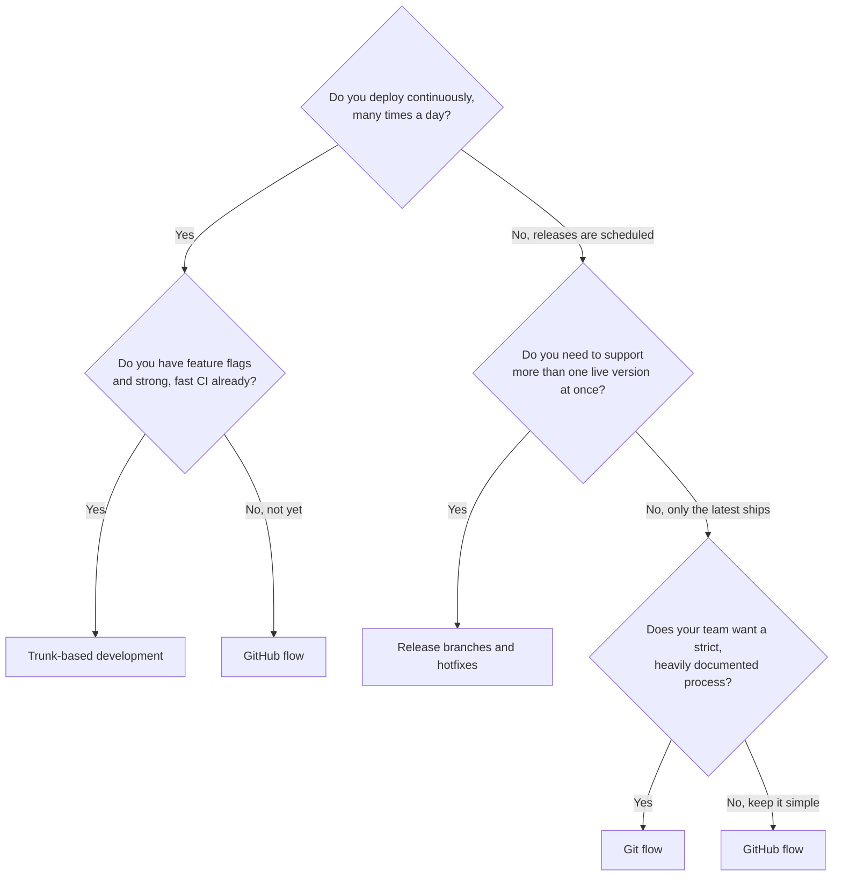

A few real scenarios to sanity-check the tree against:

1. **A small startup deploying the bookshop website to production several times a day.** Trunk-based development, if the team has feature flags and fast CI — otherwise GitHub flow as a stepping stone toward it.
2. **A three-person team shipping one web app, reviewing every change with a PR, deploying after each merge.** GitHub flow — simple, matches team size, no need for a `develop` branch.
3. **A company selling an installed point-of-sale app to bookstores, supporting the last three major versions with security patches.** Release branches and hotfixes, since old versions still need fixes long after the next one ships.
4. **A large enterprise team that wants a very explicit, documented process and only ships on a quarterly schedule.** Git flow — the ceremony matches a slow, formal release cadence.

## Common mistakes

- **Rebasing a branch other people already pulled from.** The golden rule exists for a reason — rewritten hashes break everyone else's copy of that branch, not just yours.
- **Running `git reset --hard` without checking `git status` or stashing first.** Uncommitted work, staged or not, is gone the instant you run it.
- **Committing straight to `main` because branch protection wasn't set up yet.** One unreviewed, untested change is all it takes to break production.
- **Writing commit messages like "fix" or "more changes".** Six months later, `git blame` and `git log` are useless for answering "why was this line written this way?"
- **Treating a merge conflict as something broken.** It's Git correctly refusing to guess between two real, simultaneous changes — not an error to panic over.
- **Adopting Git flow for a simple app that deploys continuously.** The extra branches and syncing overhead solve a problem (supporting multiple live versions) that a continuously-deployed app doesn't have.
- **Force-pushing to a shared branch without `--force-with-lease`.** A plain `--force` can silently overwrite commits a teammate pushed after you last fetched.

## Go deeper

- Sibling deep dives: [Deployment](deployment.md) — trunk-based development and feature flags in the context of shipping safely · [Testing](testing.md) — what the CI checks in "protecting main" are actually running
- Authoritative references: [Pro Git book](https://git-scm.com/book/en/v2), [trunkbaseddevelopment.com](https://trunkbaseddevelopment.com/), [GitHub flow docs](https://docs.github.com/en/get-started/using-github/github-flow), [Conventional Commits](https://www.conventionalcommits.org/), [semver.org](https://semver.org/), ["Oh Shit, Git!?!"](https://ohshitgit.com/) — plain-English fixes for common Git mistakes
