# Rendering strategies

> Where and when your HTML actually gets built — in the browser, on a server, or ahead of time — and why that one choice drags speed, SEO, and server cost along with it.

[← Back to Frontend concepts](../README.md#frontend-concepts)

## Why this matters

Picture the bookshop again. A visitor lands on a book's product page from a Google search — that page needs to exist as real HTML the instant the search crawler looks at it, or it never ranks and that visitor never arrives at all. The same visitor then goes to checkout, where the page is entirely personal (their cart, their address, their price) and needs to feel instant the moment they click "place order." Meanwhile, an order-tracking widget on that same site needs to show "shipped" the second it actually ships, not whenever the page happened to load. Three screens, one site, three completely different answers to "when should this become real HTML, and when should it become clickable."

That's what a rendering strategy actually decides. It isn't one choice — it's three, bundled together: **where the HTML gets built** (in the visitor's browser, on your server per request, or once ahead of time), **when JavaScript takes over** to make things clickable, and **when the data itself arrives**. Get this wrong and the symptoms are specific and painful: a product page that Google can't index because the content only exists after JavaScript runs; a page that *looks* done but ignores the first three clicks because it's still hydrating; a checkout flow that costs you a server render on every single request when a cached file would've done; a "live" stock count that's actually a week-old build. Every framework decision you'll bump into — Next.js's `"use client"`, Astro's `client:visible`, a `revalidate` number — is really just this page's vocabulary showing up in code.

## The map

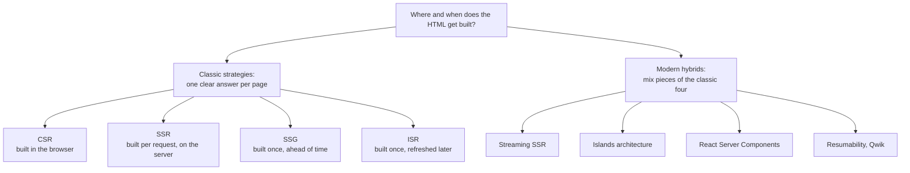

The four classic strategies each give one straightforward answer to "when is the HTML built." The modern hybrids exist because real pages rarely fit one answer cleanly — most of a page might be static while one widget needs to be live, or the HTML might be ready early but data for one section is slow. They borrow pieces of the classic four and combine them per component instead of per page.

## Classic strategies

Every strategy in this section answers the "when is HTML built" question the same way for the *entire page*. That simplicity is their strength and, eventually, their limit — which is why the hybrids exist.

### Client-side rendering (CSR)

**In one line:** the server sends an almost-empty HTML file, then JavaScript downloads in the browser and builds the whole page from there.

**How it works:** the first response from the server is basically a skeleton — a `<div id="root">` and a `<script>` tag — with none of the actual content in it yet. The browser has to download that JavaScript bundle, run it, and only then does it ask for the real data and paint anything a visitor can read. This is how a typical single-page app (SPA) built with plain React or Vue behaves by default: all the rendering work happens on the visitor's own device, not yours.

It's like mailing someone a flat-pack box with no picture on the label — they have to open it, read the instructions, and assemble it themselves before they know what's actually inside.

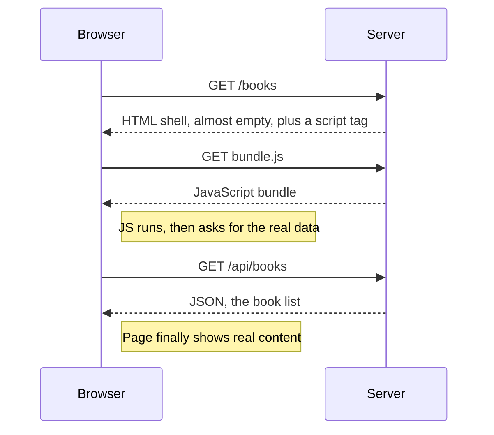

**Example:**

```html
<!-- index.html, the same file shipped to every visitor -->
<div id="root">Loading...</div>
<script src="bundle.js"></script>
```

```js
// bundle.js, runs only after it downloads in the browser
async function renderBooks() {
  const res = await fetch("/api/books");
  const books = await res.json();
  document.getElementById("root").innerHTML = books
    .map((b) => `<div>${b.title} - $${b.price}</div>`)
    .join("");
}
renderBooks();
```

**Good for:**
- App-like, highly interactive screens behind a login where SEO doesn't matter
- Keeping the server simple and cheap, since it just hosts static files

**Watch out for:**
- A blank or spinner-only first paint until the bundle downloads, parses, and fetches data — slow on weak phones or networks
- Search crawlers and link-preview bots that don't run JavaScript see almost nothing there

### Server-side rendering (SSR)

**In one line:** the server builds the full HTML for a page fresh, on every single request, then sends it already filled in.

**How it works:** when a request comes in, the server itself fetches whatever data the page needs, renders it into HTML, and sends back a complete page — a visitor sees real content the moment it arrives, with no blank-then-fill step. JavaScript still shows up afterward to make the page interactive (see "Hydration and its cost" below), but the *first* thing the browser paints is already real.

It's like ordering from a restaurant where the kitchen cooks your exact dish the moment you ask for it, instead of handing you a box of raw ingredients to cook yourself.

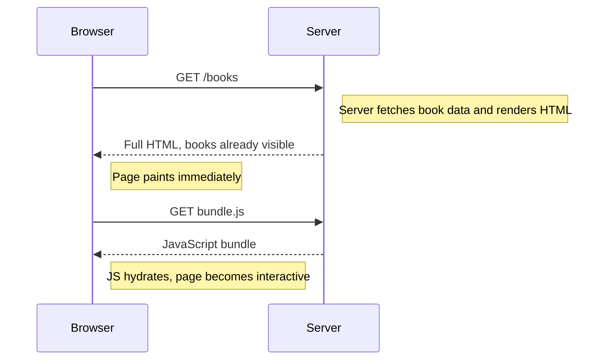

**Example:**

```tsx
// app/books/page.tsx, a Next.js App Router server component
export default async function BooksPage() {
  const books = await db.books.findMany(); // runs on the server, per request
  return (
    <ul>
      {books.map((b) => (
        <li key={b.id}>
          {b.title} - ${b.price}
        </li>
      ))}
    </ul>
  );
}
```

**Good for:**
- Pages that need real content in the first response: SEO, link previews, slow devices
- Content that's genuinely different per request — a personalized homepage, a live stock count

**Watch out for:**
- Every visit costs real server compute, so a traffic spike costs more than serving a cached file would
- The server's render time is added latency the visitor sits through before seeing anything at all

### Static site generation (SSG)

**In one line:** every page is built once, ahead of time, at deploy — then served as a plain, pre-built file to everyone who asks.

**How it works:** instead of building HTML per visitor, a build step runs once (usually as part of deploying), fetches whatever data each page needs, and writes out a finished HTML file per page. Those files sit on a CDN — servers spread around the world that just hand back the same file, fast, with no rendering left to do (see [big-tech-system-design/concepts/cdn.md](https://github.com/alwintwk/big-tech-system-design/blob/main/concepts/cdn.md)). Every visitor, anywhere, gets the exact same file.

It's like printing a run of a book's catalog page once, then handing the same printed copy to whoever walks in — nobody's waiting while a page gets typeset on the spot.

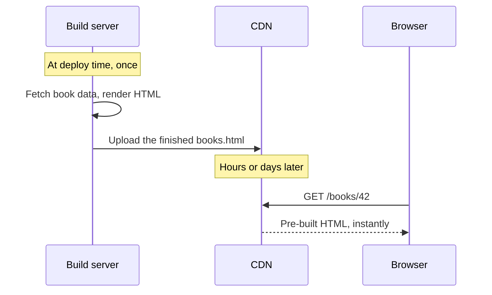

**Example:**

```astro
---
// src/pages/books/[id].astro, this whole block runs once, at build time
export async function getStaticPaths() {
  const books = await db.books.findMany();
  return books.map((b) => ({ params: { id: String(b.id) } }));
}
const { id } = Astro.params;
const book = await db.books.findOne(id);
---

<h1>{book.title}</h1>
<p>${book.price}</p>
```

**Good for:**
- Content that's the same for everyone and doesn't change often: marketing pages, blog posts, a book's product page
- The fastest possible response, since there's no rendering left to do when a visitor actually shows up

**Watch out for:**
- Data can drift between builds — a price change won't show up until the next deploy runs
- A catalog with millions of pages can make the build step itself painfully slow

### Incremental static regeneration (ISR)

**In one line:** pages are built like SSG, once — but each one quietly rebuilds itself in the background after it's gone a set amount of time without a refresh.

**How it works:** a visitor gets a cached, pre-built page just like SSG, which is why it's still fast. But each page also carries a "good for N seconds" window. Once that window passes, the *next* visitor still gets the old cached page instantly — but that request also triggers a rebuild behind the scenes, and once it finishes, every visitor after that gets the fresh version. Nobody ever waits for a rebuild; they just sometimes see content that's a little behind.

It's a printed menu that a restaurant reprints every hour if a price changed, rather than reprinting it on every single customer's request — you might read a menu that's a few minutes stale, but you're never stuck watching it get typeset.

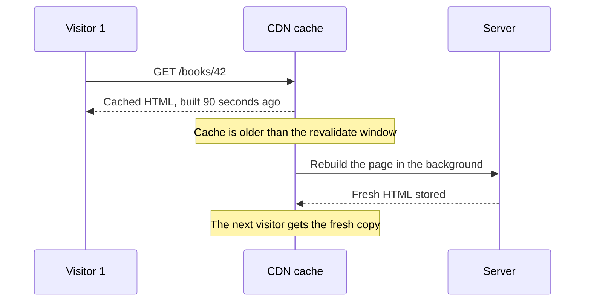

**Example:**

```tsx
// app/books/page.tsx
export const revalidate = 60; // rebuild this page in the background, at most once every 60s

export default async function BooksPage() {
  const res = await fetch("https://api.bookshop.com/books");
  const books = await res.json();
  return <BookList books={books} />;
}
```

**Good for:**
- Large catalogs where rebuilding every page on every deploy is too slow, but content still needs to feel current
- Getting most of SSG's speed with much less staleness than a fixed build

**Watch out for:**
- The very first visitor after content changes can still see the stale page while the rebuild runs
- One more moving part than plain SSG: a revalidate window and a background rebuild to reason about

## Modern hybrids

The classic four each apply one rule to a whole page. The strategies below mix pieces of those rules within a single page — some content built ahead of time, some streamed in late, some never hydrated at all — because most real pages are a mix of "mostly static" and "one part needs to be live."

### Hydration and its cost

**In one line:** the process where JavaScript, after the fact, re-attaches event handlers and state to HTML that already arrived from the server, turning static-looking markup into a working app.

**How it works:** SSR and SSG both send real, readable HTML first — but that HTML is inert. Buttons are drawn but do nothing yet, because no JavaScript has run to wire them up. Hydration is the step where the framework walks the page it already received, rebuilds its understanding of the component tree in memory, and attaches the click handlers, form state, and everything else that makes it respond to input. Until that finishes, the page looks done but isn't.

It's a stage play where the set is already fully built and lit before the audience arrives — but the actors still have to walk out and take their places before anything on that set actually happens.

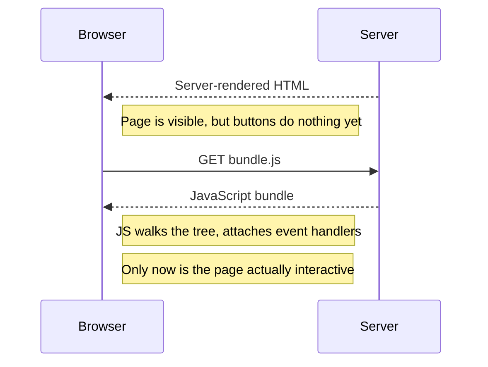

**Example:**

```js
// the browser already has this HTML from the server:
// <button id="cart-btn">Add to cart</button>

// hydration re-attaches the click handler to markup that already exists
import { hydrateRoot } from "react-dom/client";
hydrateRoot(document.getElementById("root"), <BookPage />);
```

**Good for:**
- Explaining why a server-rendered page can look finished but ignore the first click or two
- Understanding "hydration mismatch" errors, when the server's HTML and the client's first render disagree

**Watch out for:**
- Cost scales with how much of the page is interactive — a big page re-renders every component in memory, whether the visitor ever touches it or not
- Ships the JavaScript for the whole page, even if the visitor only ever clicks one button on it

### Streaming SSR

**In one line:** the server sends HTML in chunks as each piece becomes ready, instead of making the browser wait for the single slowest part before it sees anything.

**How it works:** a normal SSR response waits for every data fetch to finish before sending a single byte. Streaming SSR sends the fast, ready parts of the page — the header, the layout, the book's title — immediately, then keeps the same connection open and flushes each remaining chunk as it finishes, typically marked out with a component like React's `Suspense`. The browser paints what's arrived so far rather than waiting on the slowest database call in the whole page.

It's a waiter bringing your drinks out the moment they're ready instead of holding the entire table's order until the kitchen finishes the slowest dish.

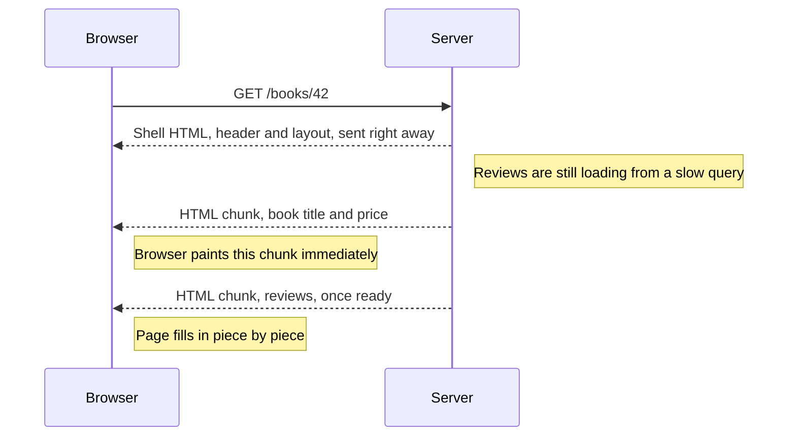

**Example:**

```tsx
// app/books/[id]/page.tsx
export default function BookPage({ params }) {
  return (
    <>
      <BookHeader id={params.id} />
      <Suspense fallback={<ReviewsSkeleton />}>
        <Reviews id={params.id} /> {/* slow, streams in once ready */}
      </Suspense>
    </>
  );
}
```

**Good for:**
- Pages with one slow, non-critical section (recommendations, reviews) blocking a fast, critical one (title, price)
- Improving perceived speed without waiting on the single slowest data source

**Watch out for:**
- Needs a framework and hosting setup that actually support streaming responses — not every host does
- Harder to reason about than one synchronous render: an error in a later chunk arrives after earlier chunks are already on screen

### Islands architecture

**In one line:** the page ships as static HTML by default, and only small, specific interactive components — "islands" — download and hydrate their own JavaScript, individually.

**How it works:** most content on most pages never needs JavaScript at all — a blog post's body, a book's description, a page's layout. Islands architecture treats that as the default and makes interactivity opt-in per component. Each interactive piece is hydrated on its own, often only when it's actually needed — for example, once it scrolls into view — instead of the whole page hydrating together as one unit. Everything outside an island stays plain, inert HTML forever.

It's a mostly-quiet museum where almost every exhibit is a still display, except for the few hands-on stations that light up and respond only once a visitor actually walks up to them.

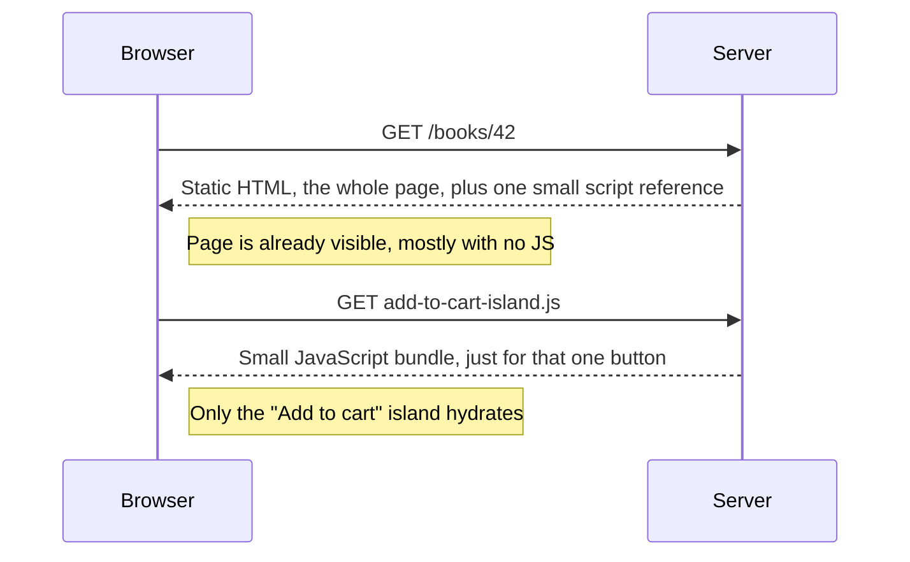

**Example:**

```astro
---
import AddToCartButton from "../components/AddToCartButton.jsx";
---

<article>
  <h1>{book.title}</h1>
  <p>{book.description}</p>
  <AddToCartButton bookId={book.id} client:visible />
</article>
```

**Good for:**
- Content-heavy pages with a handful of interactive widgets: a blog with a comment box, a product page with one "add to cart" button
- Shipping close to zero JavaScript for the parts of the page that never change

**Watch out for:**
- Doesn't fit pages that are interactive almost everywhere — a full dashboard has few genuinely "static" gaps to leave as plain HTML
- Sharing state between two separate islands takes deliberate wiring; they don't share a component tree by default

### React Server Components

**In one line:** components that run only on the server, fetch their own data directly, and send finished output to the browser — shipping zero JavaScript for that component, ever.

**How it works:** in a framework that supports React Server Components (RSC), components are Server Components by default: they can talk straight to a database or a filesystem, and none of their code is included in the JavaScript bundle sent to the browser. A component only becomes a Client Component — one that ships JS and can use things like `onClick` or `useState` — when it's explicitly marked, commonly with a `"use client"` directive at the top of the file. A page ends up as a mix: server-only pieces that fetch data with no API layer in between, wrapping the few client pieces that genuinely need interactivity.

It's the difference between a chef plating a finished dish for you (a Server Component, nothing further to do) and handing you a portion of raw ingredients plus a recipe card to cook yourself (a Client Component, which still needs code to run on your side).

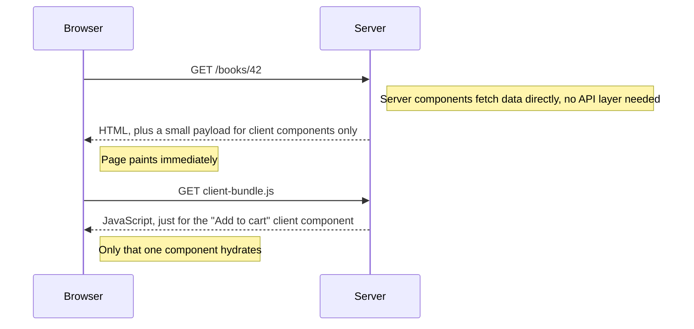

**Example:**

```tsx
// app/books/[id]/page.tsx — a Server Component by default, no directive needed
import AddToCartButton from "./AddToCartButton";

export default async function BookPage({ params }) {
  const book = await db.books.findOne(params.id); // runs only on the server
  return (
    <article>
      <h1>{book.title}</h1>
      <AddToCartButton bookId={book.id} /> {/* the one part that needs JS */}
    </article>
  );
}
```

```tsx
// app/books/[id]/AddToCartButton.tsx
"use client"; // opts this one component into shipping JavaScript

export default function AddToCartButton({ bookId }) {
  return <button onClick={() => addToCart(bookId)}>Add to cart</button>;
}
```

**Good for:**
- Fetching data directly inside a component that runs on the server, with no separate API endpoint to build and call
- Keeping large dependencies — a markdown parser, a full database client — out of the browser entirely, since that code never leaves the server

**Watch out for:**
- Server and Client Components follow different rules (no `useState` or `onClick` in a Server Component), a real mental-model shift from plain React
- Still mainly a Next.js App Router pattern today, not yet a portable standard every framework implements the same way

### Resumability (Qwik)

**In one line:** instead of re-running the app to hydrate it, Qwik serializes the page's state directly into the HTML, so the browser can resume exactly where the server left off, and only downloads JavaScript for one interaction at a time, on demand.

**How it works:** where hydration re-runs a component tree in memory to reattach behavior, resumability skips that step entirely — the HTML itself already encodes what state exists and which handler belongs to which element. Clicking a button downloads and runs only the tiny bit of code that button needs, at the moment it's clicked, rather than the whole page's JavaScript upfront.

**Example:**

```tsx
// Qwik component: state and the click handler are serialized straight into the HTML
export default component$(() => {
  const count = useSignal(0);
  return <button onClick$={() => count.value++}>Added {count.value}</button>;
});
```

**Good for:**
- Apps where hydration cost is the real bottleneck, and a smaller framework ecosystem is an acceptable trade

**Watch out for:**
- A much smaller ecosystem, tooling, and hiring pool than React, Vue, or Svelte
- An unfamiliar mental model — serialized state, per-interaction code loading — even for experienced frontend developers

## Where it runs

Every strategy above still has to answer a second question: physically, on which machine does the rendering work happen, and how much of that work can be skipped entirely by handing back something already made?

### Origin server vs edge rendering

**In one line:** rendering can run on one central server (the "origin"), or on edge nodes — the same CDN locations used for caching, spread across many regions — physically closer to each visitor.

**How it works:** a typical server lives in one region. A visitor on the other side of the planet pays for that distance twice: once for the request to arrive, once for the response to come back, before rendering even starts. Edge rendering runs the same rendering logic at many CDN points-of-presence worldwide instead, so the nearest one to the visitor does the work. The trade-off is that edge runtimes are usually a stripped-down JavaScript environment — no full Node.js API surface, tight memory and CPU limits, no long-lived database connections — so not every server-rendering workload fits there unmodified.

It's the difference between one central kitchen mailing meals nationwide and a chain of small local kitchens — the local one gets food to you faster, but each branch has less equipment than the main kitchen does.

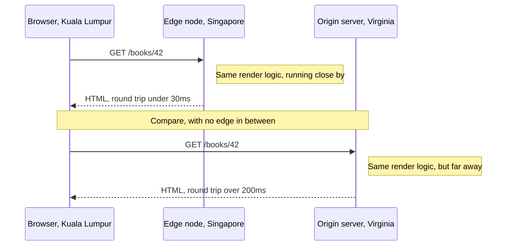

**Example:**

```tsx
// app/books/[id]/page.tsx
export const runtime = "edge"; // render this page at the nearest edge location
```

**Good for:**
- Cutting network latency for visitors far from your main server region
- Simple, read-heavy rendering logic that doesn't need a full server runtime

**Watch out for:**
- Edge runtimes usually can't run everything a full Node.js server can — check what your rendering logic actually depends on first
- Debugging is harder when logs and errors are spread across many regions instead of one server

### Caching rendered pages

**In one line:** store the already-rendered output of a page so future requests skip rendering entirely and get served straight from a cache.

**How it works:** even an SSR page can be cheap if its content doesn't change per visitor — the first request renders it and the result gets stored at the CDN, keyed by the URL (and any headers that actually vary the content, sent back via a `Vary` header). Every request after that is answered straight from the cache, with the origin server never touched, until the cached copy expires or something explicitly invalidates it. `stale-while-revalidate` softens the expiry: the cache can keep serving the old copy instantly while it fetches a fresh one in the background, rather than making one unlucky visitor wait for a live re-render.

It's a photocopy left at the front desk — the first person who asks gets one made specially; everyone after that just gets handed a copy from the stack, instead of a fresh print run each time.

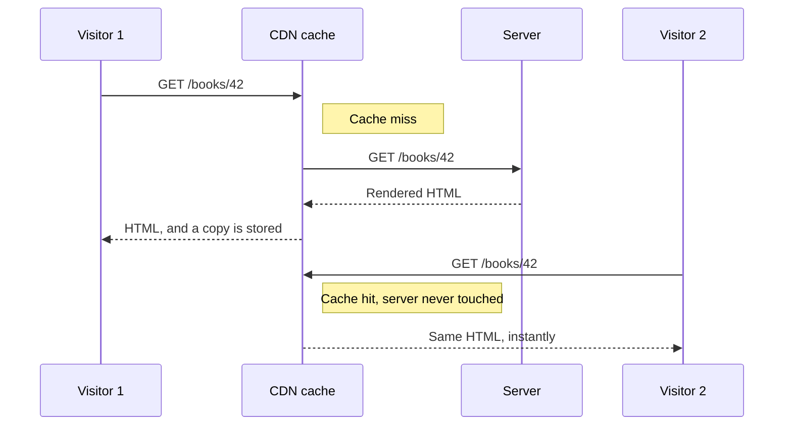

**Example:**

```http
GET /books/42 HTTP/1.1

HTTP/1.1 200 OK
Cache-Control: public, max-age=60, stale-while-revalidate=300
Content-Type: text/html
```

**Good for:**
- Making even a server-rendered page as cheap and fast as a static file, for the requests that hit the cache
- Absorbing traffic spikes without the origin server ever seeing most of the requests

See [big-tech-system-design/concepts/cdn.md](https://github.com/alwintwk/big-tech-system-design/blob/main/concepts/cdn.md) for how CDNs distribute this, and [big-tech-system-design/concepts/caching.md](https://github.com/alwintwk/big-tech-system-design/blob/main/concepts/caching.md) for caching mechanics beyond just rendered pages.

**Watch out for:**
- Caching a page that's different per visitor (a "Hi, Alwin" greeting) by URL alone can leak one visitor's page to another unless the cache key accounts for that
- Stale cached HTML after a real price or stock change, until the entry expires or is explicitly invalidated

## Measuring it

### Core Web Vitals

**In one line:** a small, standard set of metrics — published by Google, measured by real browsers — that score whether a page actually *feels* fast, and each rendering strategy tends to pull them in different directions.

**How it works:** five metrics cover a page's timeline, roughly in the order they happen. **TTFB** (Time To First Byte) is how long until the very first byte of the response arrives — mostly a server and network number, largely untouched by which rendering strategy you use, though SSR adds render time to it that SSG or a cache hit skips entirely. **FCP** (First Contentful Paint) is when the first bit of real content — text, an image — appears on screen. **LCP** (Largest Contentful Paint) is when the biggest, most meaningful content block finishes painting, and is Google's main stand-in for "does this page feel loaded" — the official "good" threshold is 2.5 seconds or under. **INP** (Interaction to Next Paint) measures how quickly the page responds to *any* click, tap, or key press across the whole time someone's on the page, not just the first one — good is 200 milliseconds or under. **CLS** (Cumulative Layout Shift) measures how much content unexpectedly jumps around as things load in — an image with no reserved size, a banner that shoves the button you were about to tap — good is a score of 0.1 or under. LCP, INP, and CLS together are the three officially designated "Core Web Vitals"; TTFB and FCP are supporting metrics that help explain *why* the Core Web Vitals landed where they did.

As a rough pattern: strategies that get real content painted early — SSR, SSG, ISR, streaming, islands, RSC — tend to score well on TTFB, FCP, and LCP, since there's little or no client-side fetch-then-render delay. CSR tends to score worse on those, since the browser has to download, run, and fetch before anything meaningful paints. INP mostly comes down to how much JavaScript is hydrating and running on the main thread — heavy hydration (a big CSR bundle, or an SSR page with a huge interactive tree) tends to hurt it, while islands and RSC — which ship far less JavaScript per page — tend to help it. CLS is less about rendering strategy and more about layout discipline (reserving space for images and ads), though content that streams or hydrates in late can trigger it if it's not sized ahead of time.

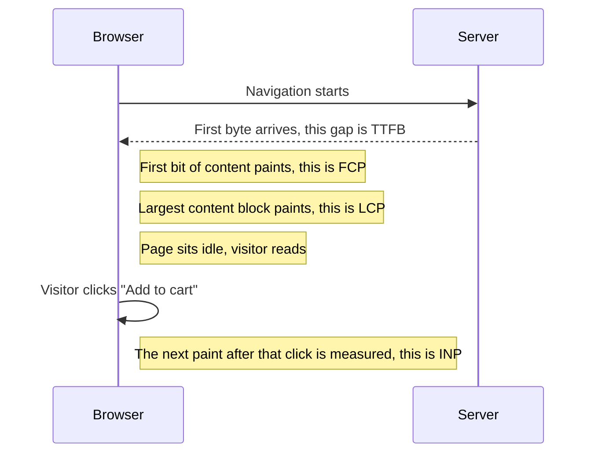

**Example:**

```
Book page, mobile, throttled connection
  TTFB   420ms   good, under 800ms
  FCP    1.2s    good, under 1.8s
  LCP    2.1s    good, under 2.5s
  INP    180ms   good, under 200ms
  CLS    0.03    good, under 0.1
```

**Good for:**
- A shared, objective vocabulary for "does this page feel fast," instead of a vague opinion
- Comparing how different rendering strategies actually perform, not just how they're supposed to in theory

**Watch out for:**
- Lab data (Lighthouse, on one machine) and field data (real users, in Chrome's own usage reports) can disagree — ship what real users experience, not just what your laptop measures
- Chasing LCP while ignoring INP just moves the pain: a page that paints fast and then freezes on the first click doesn't actually feel fast

## Side by side

| Strategy | When HTML is built | First paint speed | Interactivity | SEO | Server cost | Data freshness | Frameworks |
|---|---|---|---|---|---|---|---|
| CSR | In the browser, after JS loads | Slow, blank until JS runs | Full app, but only after the bundle loads | Poor, unless the crawler runs JS | Very low, static file hosting | Always fresh, fetched live | React (Vite/CRA), Vue, Angular |
| SSR | On the server, per request | Fast, content already there | Needs hydration first | Good | High, every request costs compute | Always fresh, fetched per request | Next.js, Nuxt, SvelteKit, Remix |
| SSG | At build time, once | Fastest, pre-built file from a CDN | Needs hydration first | Good | Very low, no compute at request time | Stale until the next build | Astro, Next.js static export, Hugo, Eleventy |
| ISR | At build time, rebuilt in the background | Fast, served from cache | Needs hydration first | Good | Low, occasional background rebuilds | Fresh within the revalidate window | Next.js |
| Streaming SSR | On the server, sent in chunks | Fast for the first chunk, rest fills in | Needs hydration first, per chunk | Good | High, still per-request compute | Always fresh, fetched per request | Next.js App Router, Remix |
| Islands | Mostly at build time, static | Fastest for the static parts | Only inside each island | Good | Very low | Stale unless rebuilt, or the island fetches live | Astro, Fresh |
| React Server Components | On the server, per request | Fast, no client fetch waterfall | Only inside Client Components | Good | High, still per-request compute | Always fresh, fetched per request | Next.js App Router |
| Resumability | On the server, per request | Fast, interactive with no hydration step | Immediate, code loads per interaction | Good | High, still per-request compute | Always fresh, fetched per request | Qwik |

## Which one should I pick?

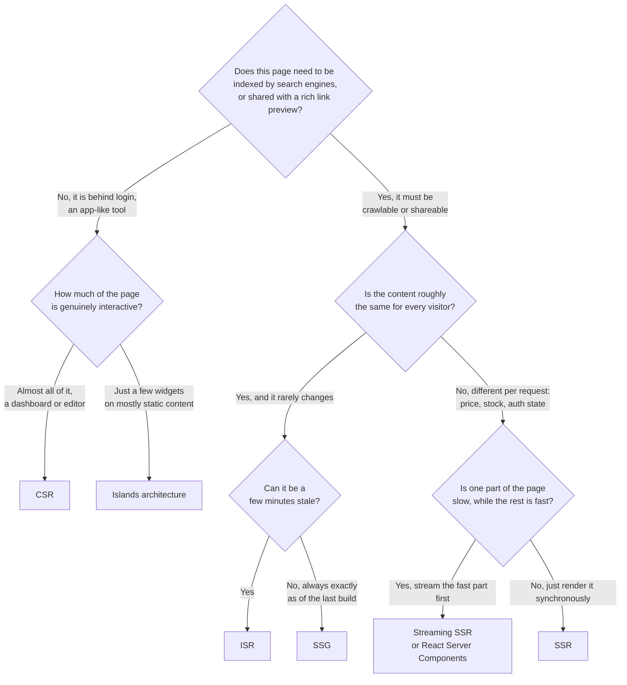

A few real scenarios to sanity-check the tree against:

1. **A book's product page, the same for every visitor, needs to rank on Google.** SSG if the price and stock barely move; ISR if they change often enough that a few minutes of staleness matters.
2. **The checkout page: cart contents, address, and price are all personal to the visitor placing the order.** SSR — it's not indexed anyway, so hydration cost is a smaller concern, and a blank first paint on a page about to take someone's money is the wrong place to save server compute.
3. **An internal admin dashboard: charts, filters, and grids the staff use all day, never seen by a search engine.** CSR — no SEO need, and the whole screen is genuinely interactive from the start.
4. **A "how we pack orders" blog post with one comment box at the very bottom.** Islands architecture — almost the entire page is static prose; only the comment box needs any JavaScript at all.
5. **The homepage: a fast static hero and grid, plus a personalized "recommended for you" row that's slow to compute.** Streaming SSR or React Server Components — send the fast part immediately, stream the slow row in once it's ready.

## Common mistakes

- **Using CSR for a public page that needs to rank on Google.** Crawlers that don't wait for your JavaScript bundle see almost nothing; even ones that do run JS index it slower and less reliably than getting real HTML in the first response.
- **Reaching for SSR on a page that's identical for every visitor.** That's a render cost paid on every single request for content a CDN could've served as a plain cached file.
- **Shipping full hydration for a page that's mostly static text.** Most of a typical page's JavaScript budget goes to components no one ever touches — islands or Server Components exist specifically to stop paying for that.
- **Treating an ISR revalidate window as instant.** A price change doesn't show up for everyone the moment it happens; it shows up after the window passes and a visitor's request triggers the rebuild.
- **Caching a personalized page by URL alone.** Without a correct cache key or `Vary` header, one visitor's cached, cookie-personalized page can be served straight to someone else.
- **Chasing LCP while ignoring INP.** A page that paints fast and then locks up on the first click doesn't feel fast to the person using it.
- **Running rendering logic on an edge runtime that doesn't support it.** A full ORM client or a large dependency built for Node.js can fail in confusing ways on a stripped-down edge runtime instead of a clear "not supported" error.

## Go deeper

Big-tech-system-design concepts:
- [CDN](https://github.com/alwintwk/big-tech-system-design/blob/main/concepts/cdn.md) — how static files and cached pages get distributed close to visitors
- [Caching](https://github.com/alwintwk/big-tech-system-design/blob/main/concepts/caching.md) — caching mechanics beyond just rendered pages

Tools: [web-dev-resources → Meta-frameworks](https://github.com/alwintwk/web-dev-resources#meta-frameworks) · [web-dev-resources → Static sites & docs](https://github.com/alwintwk/web-dev-resources#static-sites--docs)

External references:
- [web.dev — Rendering on the web](https://web.dev/articles/rendering-on-the-web)
- [web.dev — Web Vitals](https://web.dev/articles/vitals)
- [Next.js docs — Incremental Static Regeneration](https://nextjs.org/docs/app/guides/incremental-static-regeneration)
- [Astro docs — Islands architecture](https://docs.astro.build/en/concepts/islands/)
- [React docs — Server Components](https://react.dev/reference/rsc/server-components)
