# Testing

> Tests are how you find out a change broke something before your users do — and the real skill isn't writing more of them, it's writing the right kind for the risk you're actually facing.

[← Back to Testing](../README.md#testing)

## Why this matters

Say the bookshop's `calculateOrderTotal` function adds up line items, applies a discount code, and adds tax. It's worked for a year. Today someone adds a "buy 2, get free shipping" rule. Does the discount still stack correctly with tax? Does an expired code still get silently ignored? Does a cart with zero items still return zero instead of throwing? Nobody wants to manually click through the checkout page fifteen times to find out — and even if they did, they'd only be checking today's fifteen cases, not the next change six months from now.

That's what tests are actually for: not proving code is perfect, but giving you a fast, repeatable way to ask "did I just break something?" and get an honest answer in seconds instead of a support ticket next week. But "write tests" undersells how many different shapes that answer can take. A test that checks `calculateOrderTotal` in isolation catches a different class of bug than one that checks the real `POST /orders` endpoint against a real database, which catches a different class again from one that clicks through the actual checkout page in a browser. Each is more expensive than the last, and each catches something the cheaper ones can't. This page maps that space — by how much of the system a test touches, by what kind of problem it's built to catch, and by the techniques that make any of them worth trusting.

## The map

Every test on this page answers one of three different questions.

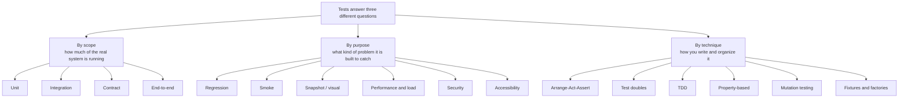

These three axes aren't rival systems — they cross. A regression test (purpose) for `calculateOrderTotal` (scope: unit) written using Arrange-Act-Assert (technique) is one test wearing all three labels at once. Scope is mostly about *how much is real*; purpose is about *why this test exists*; technique is about *how it's built and organized*. Keep them separate in your head and the rest of this page is just filling in each branch.

## Test types by scope

Scope is about how much of the real system is actually running when the test does. The less that's real, the faster and more isolated the test — and the less it can tell you about whether the pieces actually fit together.

### Unit tests

**In one line:** tests one small piece of code — usually a single function — completely on its own, with everything around it faked, stubbed, or simply not needed.

**How it works:** a unit test calls a function directly and checks what comes back, with no database, no network call, no other service involved — it doesn't care that "in real life" a cart comes from a database and a discount code comes from an HTTP request. Think of it like testing one gear from a clock in a vice on a workbench: you can confirm its teeth are the right shape and it turns the right way, without the rest of the clock attached. That isolation is exactly what makes unit tests fast — hundreds can run in well under a second — and exactly what limits them: a gear that's perfect on its own can still jam the moment it's meshed with the gear next to it, which is a different test's job to catch.

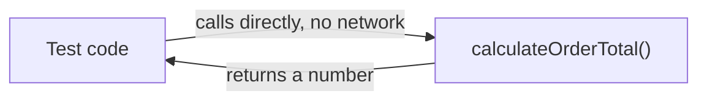

**Example:**

```js
// calculateOrderTotal.test.js (Vitest)
import { calculateOrderTotal } from "./calculateOrderTotal";

it("applies a percentage discount before tax", () => {
  const cart = [{ price: 20, quantity: 2 }]; // $40 subtotal
  const total = calculateOrderTotal(cart, { code: "SAVE10", percentOff: 10 }, { taxRate: 0.08 });
  expect(total).toBeCloseTo(38.88); // 40 - 10% = 36, +8% tax = 38.88
});
```

**Good for:**
- Pinning down exact business logic — pricing, discounts, validation rules — with fast, precise feedback
- Running on every keystroke or save, since there's nothing slow in the loop

**Watch out for:**
- A pile of unit tests that all pass while the real `POST /orders` endpoint is broken, because nothing checked how the pieces connect
- Testing private implementation details so closely that every refactor breaks tests even though behavior never changed

### Integration tests

**In one line:** tests several real pieces working together — commonly your application code plus a real (or close-to-real) database — to catch bugs that only show up where two pieces meet.

**How it works:** where a unit test isolates one gear, an integration test checks that this gear actually meshes with the one next to it. For the bookshop, that means calling the real `createOrder` function against a real test database, not a fake one — so a bug like "the discount column never actually gets written" or "the unique constraint on order IDs blocks a legitimate retry" shows up here, because a unit test with an in-memory fake object would never touch the real schema at all. It's slower than a unit test, since a real database write and read takes real milliseconds, but still far cheaper than driving a full browser.

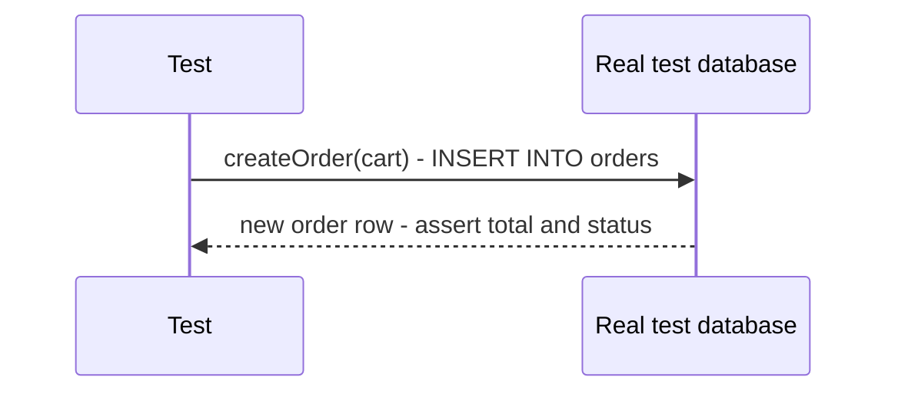

**Example:**

```js
// createOrder.integration.test.js (Vitest, against a real Postgres test DB)
it("persists a new order with the correct total", async () => {
  const order = await createOrder(testDb, { userId: testUser.id, items: [{ bookId: 42, quantity: 1, price: 15.99 }] });
  const stored = await testDb.query("SELECT * FROM orders WHERE id = $1", [order.id]);
  expect(stored.rows[0].total).toBe("15.99");
});
```

**Good for:**
- Catching bugs at the seams: wrong SQL, a missing migration, a constraint that rejects data your code assumed was fine
- Testing the actual query and data-access layer, not a mental model of it

**Watch out for:**
- Reusing one shared, long-lived test database across test files — one test's leftover row can quietly break the next one (see [Test isolation and databases](#test-isolation-and-databases) below)
- Mocking so much of the surrounding code that the "integration" test isn't actually integrating with anything real

### Contract tests

**In one line:** checks that a service's API still matches what the other services or teams calling it actually expect — without spinning up both sides together to find out.

**How it works:** in a system built from [microservices](https://github.com/alwintwk/big-tech-system-design/blob/main/concepts/microservices.md), the bookshop's Orders service might call a separate Warehouse service to reserve stock. An integration test that spins up both services together works, but it's slow and only tests today's version of both. A contract test instead has the *consumer* (Orders) record what it expects from a call — "when I ask to reserve book 42, I expect back a boolean `reserved` field" — as a saved contract. The *provider* (Warehouse) then independently replays that same contract against its own real code in its own test suite, without Orders needing to be running at all. If Warehouse ever changes its response shape in a way that breaks the contract, its own tests fail immediately, before a deploy ships something that breaks Orders in production.

It's like two departments agreeing on the fields of a shared form ahead of time, then each checking their own paperwork against that agreed form independently — instead of only finding out it doesn't match when a real form gets rejected at the counter.

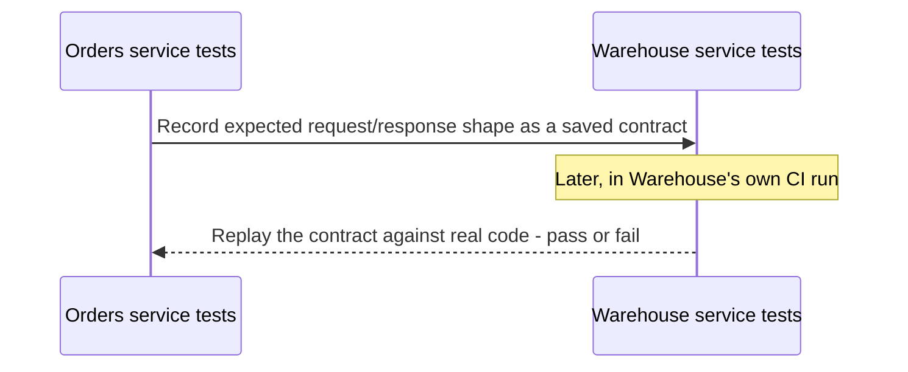

**Example:**

```js
// Orders service: consumer contract test (Pact-style)
it("expects reserveStock to return a boolean reserved field", async () => {
  await provider.addInteraction({
    uponReceiving: "a request to reserve book 42",
    withRequest: { method: "POST", path: "/reserve", body: { bookId: 42, quantity: 1 } },
    willRespondWith: { status: 200, body: { reserved: true } },
  });
});
```

**Good for:**
- Teams that own separate services and deploy independently, where a real integration test across both would be slow or require a shared environment
- Catching a breaking API change on the *provider's* side, before it ever reaches a consumer

**Watch out for:**
- Contract tests aren't a replacement for some real integration or end-to-end coverage — they check shape and agreement, not that the whole flow actually works
- Letting the contract go stale because nobody updates it when the consumer's real needs change

### End-to-end tests

**In one line:** drives the real, fully running application the way an actual user would — clicking buttons in a real browser — to check that every layer works together, not just each one in isolation.

**How it works:** an end-to-end (E2E) test starts a real browser, points it at the real (or a close staging copy of the) frontend, which talks to the real backend, which talks to a real database. Nothing is faked. It's a mystery shopper walking through the whole store from the front door to the till, rather than a quality check on one shelf — which is exactly why it catches things nothing smaller can, like a broken deploy config or a CSS change that hides the "Place order" button, but also exactly why it's the slowest and most expensive test on this page: a real browser has to launch and render for every click.

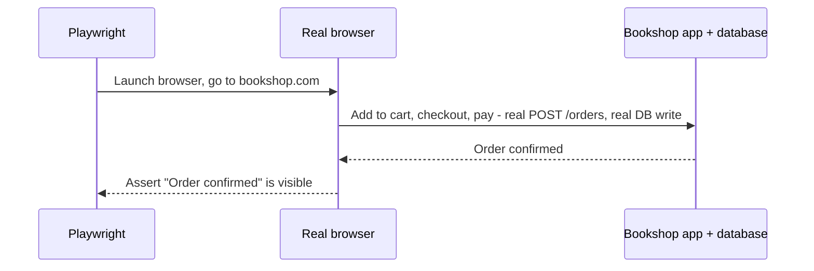

**Example:**

```js
// checkout.e2e.test.js (Playwright)
test("customer can buy a book end to end", async ({ page }) => {
  await page.goto("/books/42");
  await page.click("text=Add to cart");
  await page.click("text=Checkout");
  await page.fill("#card-number", "4242 4242 4242 4242");
  await page.click("text=Pay now");
  await expect(page.locator("text=Order confirmed")).toBeVisible();
});
```

**Good for:**
- The handful of flows where losing them would actually hurt the business — checkout, sign-up, login
- Catching integration and deployment problems that no smaller test can see, because nothing smaller runs the whole real stack

**Watch out for:**
- Using E2E tests for logic a unit test could check in milliseconds — a slow, flaky suite for the same confidence a fast one already gives
- Flakiness from real timing (a spinner that takes a variable amount of time) — see [Flaky tests](#flaky-tests) below

### Pyramid vs trophy vs honeycomb

**In one line:** three different opinions on how many tests of each scope you should have, and the disagreement mostly comes down to what kind of system each shape was designed for.

**How it works:** the **test pyramid** (popularized by Martin Fowler, tracing back to Mike Cohn) says: many fast unit tests at the base, some integration tests in the middle, and a thin cap of slow end-to-end tests at the top — because unit tests are cheap and E2E tests are expensive, so you want the cheap layer to do most of the work. It fits systems where most of the interesting logic lives inside individual functions and modules.

The **testing trophy** (Kent C. Dodds) reshapes that for typical frontend apps: a small base of static checks (types, linting — catching entire classes of bugs before a test even runs), then integration tests as the *largest* layer, a smaller layer of unit tests, and a thin cap of E2E tests. The reasoning: in a component-heavy frontend, most of the risk is in how components and hooks work *together*, and Testing Library's own philosophy — test behavior, not implementation — means a test that renders a few real components together and checks what the user sees gives more confidence per test than one that isolates a single hook.

The **testing honeycomb** goes further for service-oriented backends: a small unit layer, integration as the dominant middle layer (often shaped closer to a hexagon than a triangle), and a thin E2E cap — because in a system built from small services, a lot of a single service's actual risk is in how it talks to its own database and neighboring calls, not in isolated pure functions.

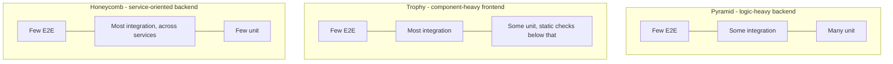

**Example:**

```text
# A checkout feature's test suite, pyramid-shaped
tests/
  unit/           42 files   # calculateOrderTotal, validators, formatters
  integration/    11 files   # POST /orders, DB writes, contract checks
  e2e/             3 files   # happy path, declined card, out-of-stock
```

**Good for:**
- Using the pyramid as a default starting point, and consciously choosing trophy or honeycomb shapes when your system's actual risk (rich UI components, or many small services) matches them better
- Explaining to a team, with a picture, why "just write more E2E tests" isn't automatically the safer choice

**Watch out for:**
- Copying a shape because it's popular, without asking what your own system's risk actually looks like
- Treating any of the three as a strict ratio to hit rather than a reminder that cheaper, faster tests should carry most of the weight

## Test types by purpose

Purpose is a different cut of the same tests: not how much is running, but *why this particular test exists* and what specific class of problem it's aimed at.

### Regression tests

**In one line:** a test written specifically because a bug happened once, so the exact same bug can never silently come back.

**How it works:** a customer reports that stacking two discount codes on one order applies both in full instead of capping at the larger one. You reproduce it, write a test that fails against the current (buggy) code, then fix the code until that test passes. The test doesn't get deleted afterward — it stays in the suite permanently, as a tripwire. It's the same instinct as painting a stripe on a step you once tripped on: not because you expect to trip there again on purpose, but because "it worked last time I checked" isn't the same guarantee as "it's checked every single time."

**Example:**

```js
it("regression: two stacked discount codes never exceed the larger single discount (#482)", () => {
  const cart = [{ price: 100, quantity: 1 }];
  const codes = [{ percentOff: 10 }, { percentOff: 15 }];
  const total = calculateOrderTotal(cart, codes, { taxRate: 0 });
  expect(total).toBe(85); // capped at the better single discount, not 100 - 10% - 15%
});
```

**Good for:**
- Making sure a fixed bug is a closed chapter, not a recurring one
- Documenting real past failures for anyone reading the test suite later

**Watch out for:**
- Fixing a bug without adding a test for it — the same class of bug tends to come back once nobody remembers it happened
- Writing the regression test so specifically that it only catches the exact reported case, not the underlying rule that was actually broken

### Smoke tests

**In one line:** a small, fast set of checks run right after a build or deploy to confirm the absolute basics work, before anyone trusts the release any further.

**How it works:** the name comes from hardware testing — power on a new device and check that it doesn't literally start smoking before you plug in every accessory and run it for a week. A software smoke test does the same job cheaply: hit the health endpoint, load the homepage, complete one basic checkout. It's not trying to catch subtle bugs; it's trying to catch "the deploy is completely broken" in seconds, right after a [deployment](deployment.md), instead of from the first angry user report.

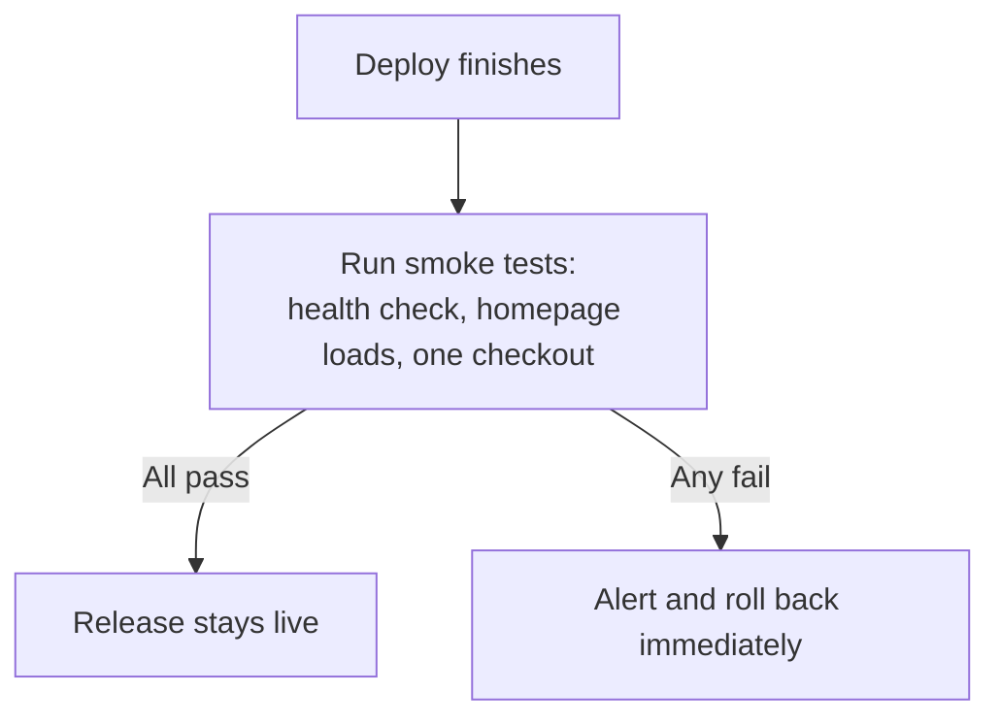

**Example:**

```js
// smoke.test.js — runs against the just-deployed environment, not localhost
test("critical paths are alive after deploy", async () => {
  const health = await fetch(`${BASE_URL}/health`);
  expect(health.status).toBe(200);

  const home = await fetch(`${BASE_URL}/`);
  expect(home.status).toBe(200);

  const order = await fetch(`${BASE_URL}/orders`, { method: "POST", body: minimalTestOrder });
  expect(order.status).toBe(201);
});
```

**Good for:**
- A fast go/no-go signal right after every deploy, cheap enough to run every time
- Catching whole-environment failures — bad config, missing environment variable, a service that never started

**Watch out for:**
- Treating smoke tests as a substitute for real coverage — they're meant to be shallow and fast, not thorough
- Skipping them because "the deploy pipeline already ran the full test suite" — a full suite runs against pre-deploy code; a smoke test runs against what's actually live

### Snapshot / visual regression tests

**In one line:** saves a known-good output once — markup, JSON, or a screenshot — and fails later if anything changes it, so a human has to look and decide whether the change was intended.

**How it works:** the first time a snapshot test runs, it saves whatever the code currently produces as the "expected" file. Every run after that compares the new output against the saved one; any difference fails the test and shows a diff. It's a "before" photo taped next to a shop's display window: any change to the window gets flagged, and someone has to look and either approve it (this window was deliberately redecorated — update the photo) or reject it (nobody was supposed to touch that window — this is a bug).

Visual regression testing is the same idea applied to actual rendered pixels: a screenshot of a page or component, compared pixel-by-pixel (or with a tolerance) against a saved baseline, to catch layout and styling breaks that a plain markup snapshot would miss entirely.

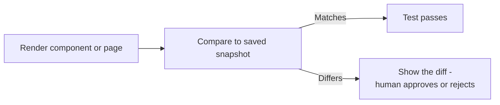

**Example:**

```js
// order summary JSON snapshot (Vitest)
it("matches the saved order summary shape", () => {
  expect(formatOrderSummary(sampleOrder)).toMatchSnapshot();
});

// checkout page visual regression (Playwright)
test("checkout page looks right", async ({ page }) => {
  await page.goto("/checkout");
  await expect(page).toHaveScreenshot("checkout.png");
});
```

**Good for:**
- Catching unintended visual or structural drift in things that are tedious to describe with individual assertions
- UI-heavy areas where "does this still look right" is the actual question, not any single value

**Watch out for:**
- Snapshots so large or so frequently changing that developers rubber-stamp "update snapshot" without actually looking — the test stops catching anything
- Committing an accidentally-broken snapshot as the new baseline, which then hides the real bug from then on

### Performance and load tests

**In one line:** throws real traffic at the system on purpose, because different traffic patterns answer different questions about how it holds up.

**How it works:** all four aim requests at the bookshop's `POST /orders` endpoint, but each asks something different. A **load test** sends the traffic you actually expect — say, typical Friday-evening concurrent shoppers — held steady for a while, checking response times stay acceptable under normal conditions. A **stress test** keeps increasing traffic past that expected level on purpose, looking for the ceiling: at what point does it slow down, and does it fail gracefully (clear errors, degraded but stable) or catastrophically (crashes, data corruption)? A **soak test** (also called endurance testing) applies moderate, realistic load but holds it for hours instead of minutes, catching problems that only appear over time — a slow memory leak, a connection pool that never releases connections, disk filling with logs. A **spike test** does the opposite of soak: a sudden, sharp jump in traffic — like a product going viral or a flash sale starting at 9am sharp — to see if the system survives the jolt, not just gradual growth.

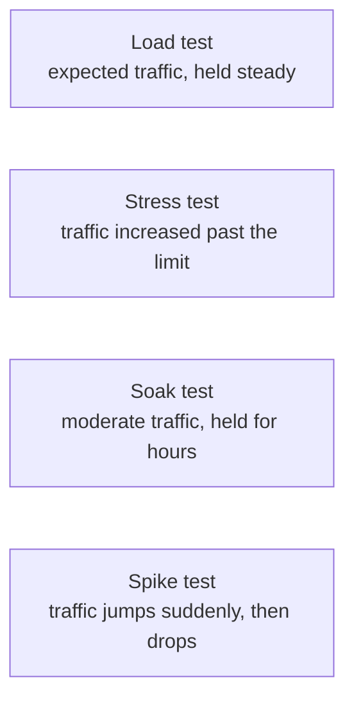

**Example:**

```js
// order-load-test.js (k6) - ramps to 100 concurrent users, holds, then ramps down
import http from "k6/http";
import { check } from "k6";

export const options = { stages: [{ duration: "1m", target: 100 }, { duration: "5m", target: 100 }] };

export default function () {
  const res = http.post("https://staging.bookshop.com/orders", JSON.stringify({ bookId: 42, quantity: 1 }));
  check(res, { "status is 201": (r) => r.status === 201 });
}
```

**Good for:**
- Finding real capacity limits and slow leaks before a real traffic spike finds them for you
- Giving infrastructure decisions (how many servers, what to autoscale) actual numbers instead of guesses

**Watch out for:**
- Running only load tests and never a stress or soak test — the failure modes each one catches don't overlap
- Testing against a staging environment that's a fraction of production's size and trusting the absolute numbers, rather than the relative behavior

### Security tests

**In one line:** automated tools that hunt for security weaknesses, either by reading your source code without running it (SAST) or by attacking your actual running app the way an outsider would (DAST).

**How it works:** **SAST** (static application security testing) reads your source code and dependency list without executing anything — flagging things like a SQL query built with string concatenation instead of parameters, a hardcoded API key, or a dependency with a known vulnerable version. It's a proofreader who never runs the play, just reads the script looking for lines that could go wrong on stage. **DAST** (dynamic application security testing) does the opposite: it runs against your actual live, deployed application and throws real attack-shaped input at it — malformed inputs, injection attempts, forced authentication bypass attempts — watching how the running app actually responds. It's a mystery shopper who tries to shoplift, to find out if the store's real alarms actually go off. Common SAST tools include Semgrep, CodeQL, and Snyk Code; common DAST tools include OWASP ZAP and Burp Suite. Neither replaces the other — SAST catches issues before anything ever runs; DAST catches issues that only exist once the app is actually live, like misconfiguration. See [Web security](web-security.md) for the vulnerability classes these tools are actually looking for.

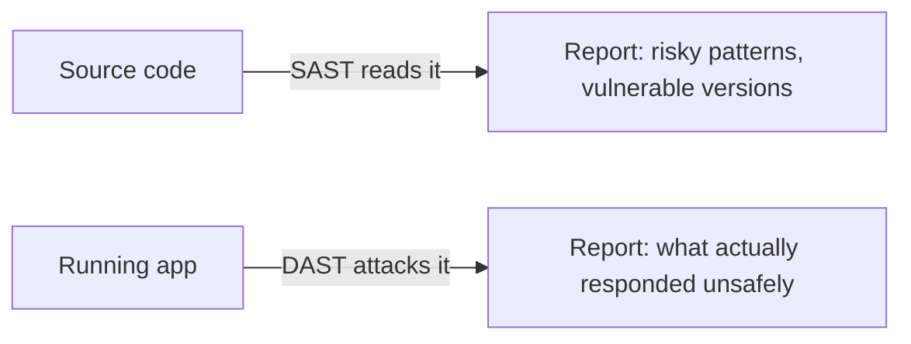

**Example:**

```yaml
# .github/workflows/security.yml
- name: SAST - scan source code
  run: semgrep --config auto .

- name: DAST - attack the staging deployment
  run: docker run zaproxy/zap-stable zap-baseline.py -t https://staging.bookshop.com
```

**Good for:**
- Catching whole classes of bugs (injection, hardcoded secrets, outdated dependencies) automatically, on every commit or deploy
- Running in CI without needing a human security review for every single change

**Watch out for:**
- Treating a clean SAST/DAST scan as proof the app is secure — both catch known patterns, not every possible flaw, and neither replaces a real audit for anything sensitive
- Drowning real findings in noisy false positives until the team starts ignoring the reports entirely

### Accessibility tests

**In one line:** checks that the bookshop's site actually works for someone using a screen reader, keyboard-only navigation, or other assistive technology — not just for a mouse-and-monitor user.

**How it works:** automated scanners like axe-core and Lighthouse can check a page against measurable rules — missing `alt` text on the book cover image, insufficient color contrast on the "Add to cart" button, a form input with no associated label — and catch a real but limited slice of accessibility issues, commonly cited as under half of them. The rest need a human: someone actually tabbing through the checkout flow using only a keyboard, or navigating it with a screen reader turned on. An automated scanner is a checklist inspector confirming a ramp exists and a door is wide enough on paper; only someone who actually needs the ramp finds out whether it's usable in practice.

**Example:**

```js
// checkout.a11y.test.js (jest-axe)
import { axe } from "jest-axe";

it("checkout page has no automatically detectable a11y violations", async () => {
  const { container } = render(<CheckoutPage />);
  const results = await axe(container);
  expect(results).toHaveNoViolations();
});
```

**Good for:**
- Catching a real, measurable slice of issues automatically and cheaply, on every build
- A starting checklist for the manual pass, not a replacement for it

**Watch out for:**
- Treating "zero automated violations" as "accessible" — it means "no violations this specific tool can detect"
- Never testing with an actual screen reader or keyboard-only navigation, which is where most of the real usability issues live

## Techniques

These aren't test types — they're ways of writing and organizing whatever test you're already building, from any of the scopes or purposes above.

### Arrange-Act-Assert

**In one line:** a simple three-part shape for writing a single test — set up the world, do the one thing you're testing, check what happened.

**How it works:** **Arrange** sets up the starting state — a cart with two books, a discount code. **Act** does the one action being tested — calls `calculateOrderTotal`. **Assert** checks the result matches what's expected. Keeping to exactly one Act per test matters more than it sounds: a test with three actions and one assertion at the end can fail without telling you which of the three actions actually broke. It's the same discipline as a science lab write-up — list your materials, describe the one procedure, record the one observation — rather than five procedures blurred into a single paragraph.

**Example:**

```js
it("applies free shipping when the cart total is over $50", () => {
  // Arrange
  const cart = [{ price: 30, quantity: 2 }]; // $60 subtotal
  // Act
  const total = calculateOrderTotal(cart, null, { taxRate: 0, freeShippingOver: 50 });
  // Assert
  expect(total.shipping).toBe(0);
});
```

**Good for:**
- Making any test's failure message point at exactly one cause
- Giving every test in a codebase the same shape, so anyone can skim and understand one they've never read before

**Watch out for:**
- Multiple unrelated Acts crammed into one test "to save time" — when it fails, you're left guessing which part broke
- Arrange sections so long and tangled they need their own tests to trust

### Test doubles

**In one line:** five different kinds of stand-ins you swap in for a real dependency — a payment API, a database, an email service — so a test stays fast, predictable, and focused on the one thing it's actually checking.

**How it works:** all five replace something real, but at different levels of "how much does it actually do." A **dummy** is passed around only because a function signature requires *something* there — the test never actually uses it (a placeholder logger object, just so the constructor doesn't throw). A **stub** returns canned answers with no real logic behind them (a fake `PaymentGateway` that always returns "success," no matter what it's given). A **spy** does what a stub does, but also records how it was called, so the test can check that afterward ("was `sendEmail` called exactly once, with the right order ID?"). A **mock** goes further still: it's pre-programmed with expectations about which calls it *should* receive, and the test fails automatically if those expectations aren't met — the assertion lives inside the double itself, not in a separate check afterward. A **fake** is a working, simplified stand-in that behaves close enough to the real thing for the test's purposes but takes a shortcut unsuitable for production — an in-memory "database" that behaves like Postgres but just keeps rows in an array.

| Type | Does it do anything? | Can you assert on how it was called? | Typical use |
|---|---|---|---|
| Dummy | No — never actually used | No | Satisfying a required parameter the test doesn't care about |
| Stub | Returns fixed, canned answers | No | Making a dependency return a specific value without real logic |
| Spy | Returns answers, and records calls | Yes, checked after the fact | Confirming a side effect happened, like "was the email sent?" |
| Mock | Pre-programmed with expected calls | Yes, built into the double itself | Strict checks on exact interactions, like call order or arguments |
| Fake | A real, simplified working implementation | Not directly — it behaves like the real thing | Swapping a slow/expensive real dependency (a DB) for a fast one in tests |

**Example:**

```js
// stub PaymentGateway so no real charge happens in tests
const stubGateway = { charge: vi.fn().mockResolvedValue({ success: true }) };

it("marks an order as paid when the gateway succeeds", async () => {
  const order = await checkout(cart, stubGateway);
  expect(order.status).toBe("paid");
  expect(stubGateway.charge).toHaveBeenCalledWith(38.88); // spy-style assertion
});
```

**Good for:**
- Keeping tests fast and deterministic by removing real network calls, real charges, real emails from the loop
- Choosing precisely how much of a dependency's real behavior a given test needs

**Watch out for:**
- Over-mocking until a test only checks that your mocks were called the way you told them to respond — it stops testing real behavior at all
- Reaching for a strict mock when a simple stub would do; mocks that check exact call order make tests brittle to harmless refactors

### Test-driven development

**In one line:** write a failing test first, write the smallest code that makes it pass, then clean up while the test keeps you honest — then repeat for the next behavior.

**How it works:** **Red** — write a test for behavior that doesn't exist yet, and watch it fail, ideally for exactly the reason you expect (not a typo). **Green** — write the smallest amount of code that makes it pass, resisting the urge to build more than the test currently demands. **Refactor** — clean up the implementation, or the test, or both, while the test suite keeps passing the whole way through, so you know you haven't changed behavior. Then you pick the next small behavior and go around again. It's less "testing" in the traditional sense and more using a test as a sketch: you define the shape you want before you carve it, the same way a sculptor roughs out a form before polishing any single detail.

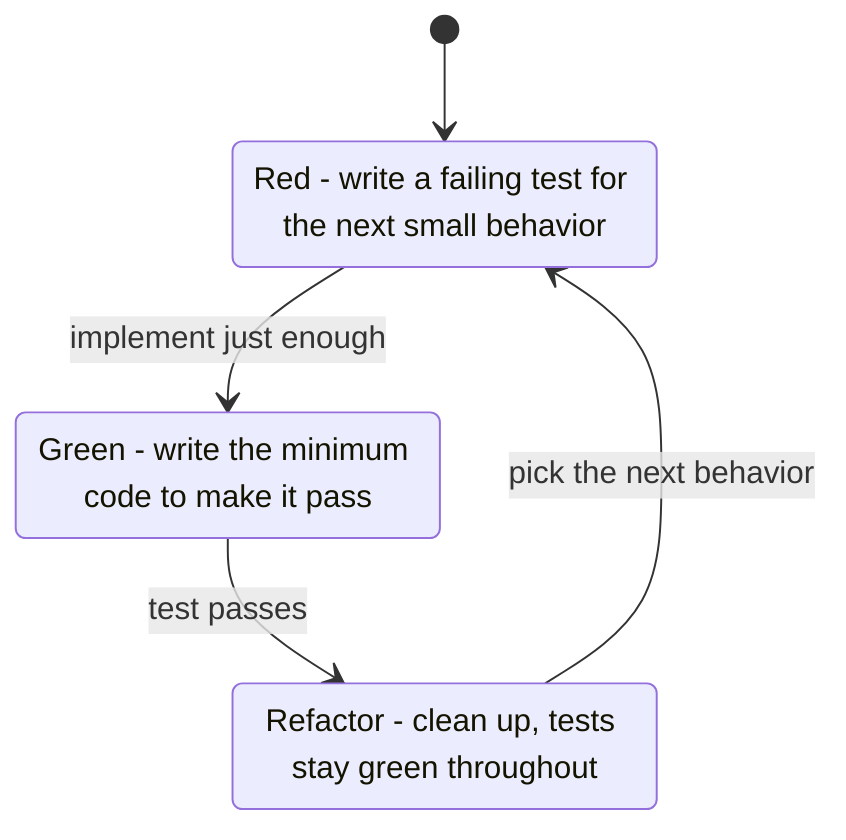

**Example:**

```js
// Red: fails - bulk discounts aren't implemented yet
it("applies 5% off when quantity is 10 or more", () => {
  expect(calculateOrderTotal([{ price: 10, quantity: 10 }], null, { taxRate: 0 })).toBe(95);
});

// Green: smallest change that makes it pass
function calculateOrderTotal(cart, discount, opts) {
  const subtotal = cart.reduce((sum, i) => sum + i.price * i.quantity, 0);
  return cart.some((i) => i.quantity >= 10) ? subtotal * 0.95 : subtotal;
}
// Refactor: extract the bulk rule once more tests pin it down, tests stay green
```

**Good for:**
- Forcing every piece of behavior to have a test that actually exercises it, since the test is written before the code that satisfies it
- Keeping scope small — you can't get far ahead of yourself when the next test is the thing telling you what to build

**Watch out for:**
- Writing several behaviors' worth of code in the "green" step before writing the tests that justify them — that's not TDD anymore, just testing after the fact
- Skipping the refactor step — code that only ever gets to "green" and never gets cleaned up accumulates the same debt as code with no tests at all

### Property-based testing

**In one line:** instead of listing individual example inputs, you describe a rule that should hold for *any* valid input, and a tool generates hundreds of random ones trying to break it.

**How it works:** an example-based test checks one specific case: `calculateOrderTotal` of this exact cart with this exact code equals this exact number. A property-based test instead states a rule that should always be true — "the total should never be negative, no matter what's in the cart" or "the total should always equal quantity times price, before any discount is applied" — and a library like fast-check (JavaScript/TypeScript) or Hypothesis (Python), following the same idea as the original Haskell QuickCheck, throws hundreds of randomly generated inputs at that rule. If one breaks it, the tool doesn't just report the huge random cart it happened to generate — it automatically **shrinks** the failing input down to the smallest example that still fails, so you get a minimal, readable repro instead of a 40-item cart with odd prices.

It's the difference between proofreading five sample sentences by hand and writing a grammar rule, then having a machine try thousands of sentences against it and hand you back the shortest one that broke the rule.

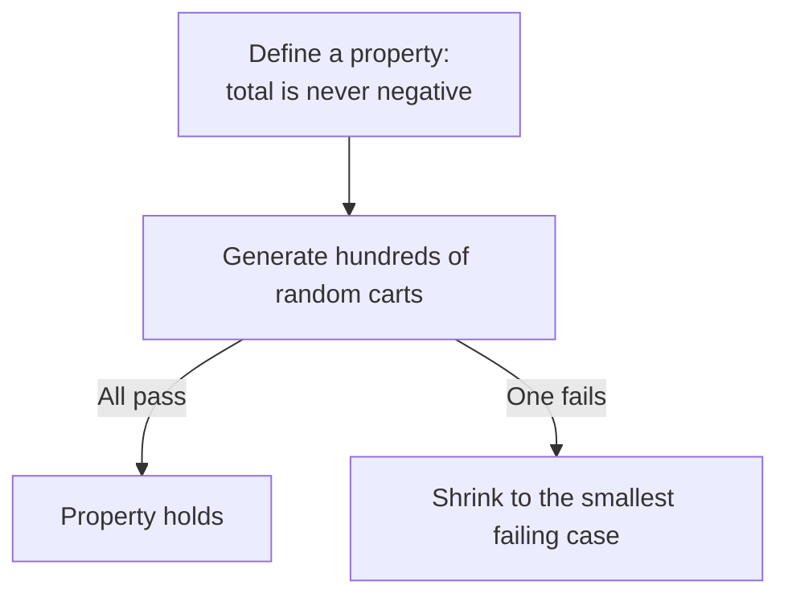

**Example:**

```js
// order-total.property.test.js (fast-check)
import fc from "fast-check";

it("total is never negative, for any valid cart", () => {
  const cartArb = fc.array(fc.record({ price: fc.float({ min: 0 }), quantity: fc.integer({ min: 1 }) }));
  fc.assert(fc.property(cartArb, (cart) => calculateOrderTotal(cart, null, { taxRate: 0.08 }) >= 0));
});
```

**Good for:**
- Rules that should hold across a huge input space — totals, sorting, encode/decode round trips — where hand-picked examples would miss edge cases
- Finding the genuinely weird edge case (a zero price, a huge quantity, a 100% discount) a human wouldn't think to write by hand

**Watch out for:**
- Properties that are too weak to actually catch bugs, like only checking that the function "doesn't throw"
- Random generators that don't actually reflect realistic data, which can either miss real bugs or flag impossible cases as failures

### Mutation testing

**In one line:** checks how good your tests actually are by deliberately breaking your code in small ways and seeing whether any test notices.

**How it works:** a mutation testing tool — Stryker for JavaScript/TypeScript, PIT for Java — automatically makes tiny changes to your code, one at a time: flips a `>` to `>=`, changes a `+` to a `-`, deletes a line entirely. Each change is called a **mutant**. The tool reruns your full test suite against each mutant. If a test fails, the mutant is **killed** — good, your tests actually noticed the change in behavior. If every test still passes, the mutant **survived** — bad, it means that exact piece of logic could silently break in production and nothing in your suite would catch it. The **mutation score** is the percentage of mutants killed. It's a fire drill where someone quietly disables one exit sign beforehand, to see whether anyone on the safety team actually notices during the drill — a real test of whether the safety checks work, not just whether they exist.

**Example:**

```text
# stryker mutation report, pricing module
calculateOrderTotal.js
  quantity >= 10  →  quantity > 10       KILLED
  Math.round(total)  →  total            SURVIVED
  Mutation score: 87%
```

The survived mutant is a real gap: nothing in the suite checks that totals get rounded, even though every existing test passes either way.

**Good for:**
- Finding weak or assertion-free tests that pass while checking almost nothing — a gap plain code coverage can't see (see [Code coverage](#code-coverage) below)
- Prioritizing where to add real assertions, instead of guessing

**Watch out for:**
- Running it on every commit — mutation testing reruns the whole suite once per mutant, which is far slower than the suite itself, so it's usually run nightly or on demand, not in the fast feedback loop
- Chasing a 100% mutation score as a target rather than a signal — some surviving mutants are genuinely harmless and not worth chasing

### Fixtures and factories

**In one line:** reusable, ready-made test data — a fixture is one fixed example, a factory is a small function that builds a fresh, customizable one on demand.

**How it works:** a **fixture** is a static, hardcoded example, defined once and reused as-is: `const sampleBook = { id: 42, title: "Dune", price: 15.99 }`. A **factory** is a function that builds one with sensible defaults, letting each test override only the field it actually cares about: `buildOrder({ status: "shipped" })` returns a complete, valid order — a random ID, a fake user, one line item, every required field filled in — except `status`, forced to `"shipped"` because that's the one thing this particular test is about. Factories keep a test readable: anyone reading it sees immediately which field matters, instead of scanning past twenty irrelevant ones, and different tests don't quietly collide by reusing literally the same shared mutable object.

**Example:**

```js
// factories/order.js
let nextId = 1;
const buildOrder = (overrides = {}) => ({
  id: nextId++, userId: "user-1", status: "pending",
  items: [{ bookId: 42, quantity: 1, price: 15.99 }],
  ...overrides,
});

it("shows a tracking link for shipped orders", () => {
  const order = buildOrder({ status: "shipped", trackingNumber: "TRK123" });
  expect(renderOrderCard(order)).toContain("Track package");
});
```

**Good for:**
- Making each test's setup say only what's different about it, not every field an order object happens to have
- Avoiding fragile, shared test fixtures that different tests accidentally mutate and interfere with each other through

**Watch out for:**
- Factories with so many options and overrides that they're harder to read than just writing the plain object out
- Fixture files that drift out of date with the real schema, so tests pass against a shape production no longer produces

## Keeping tests healthy

A test suite is itself a piece of software that can rot. These three ideas are about keeping the suite trustworthy over time, not about writing any particular new test.

### Flaky tests

**In one line:** a test that passes sometimes and fails other times with no code change — the single fastest way to destroy a team's trust in its own test suite.

**How it works:** common causes: real timing issues (waiting a fixed `sleep(500)` instead of waiting for the actual condition to be true); shared, mutable state between tests (one test leaves a row behind that the next test didn't expect); relying on real wall-clock time or unseeded randomness; depending on an external service that's occasionally slow or briefly down; and tests that depend on running in a specific order, or that collide with each other when run in parallel against the same resource. The fixes match the causes one-for-one: wait for the actual condition instead of a fixed delay (Playwright's built-in auto-waiting, `waitFor` from Testing Library); give every test its own isolated data; control time and randomness explicitly with fake timers and fixed seeds; stub out unreliable external calls; and run each test in true isolation, with no state carried over from the last one.

The trap to avoid is treating "rerun it until it's green" as a fix. The Google Testing Blog's account of flaky tests at Google makes the same point: a quarantined, auto-retried flaky test quietly stops testing anything, while looking exactly like one that's still working. A quick diagnostic: rerun the failing test alone — if it always fails, it's a real bug, not flakiness; if it only fails inside the full suite, suspect shared state or timing with another test.

**Example:**

```js
// flaky: guesses how long the spinner takes
await page.click("text=Checkout");
await page.waitForTimeout(500);
expect(await page.isVisible("text=Order confirmed")).toBe(true);

// fixed: waits for the actual condition, however long it takes
await expect(page.locator("text=Order confirmed")).toBeVisible();
```

**Good for (catching them early):**
- CI that automatically flags a test which failed, then passed on an immediate rerun with no code change, instead of letting it blend in
- Quarantining a known-flaky test with a visible, tracked ticket — as a temporary holding pen, not a permanent home

**Watch out for:**
- Silently retrying failed tests until green with no tracking — it hides the problem instead of fixing it
- Deleting a flaky test instead of fixing it, which quietly removes real coverage along with the flakiness

### Code coverage

**In one line:** the percentage of your code that ran at least once while your tests ran — a measure of what was *exercised*, not what was *actually checked*.

**How it works:** coverage tools (Istanbul/nyc and c8 for JavaScript, `coverage.py` for Python) track which lines, branches, and functions executed during a test run and report it as a percentage. The trap: a line counts as "covered" the moment it runs, even if the test that ran it asserts nothing at all, or asserts the wrong thing. A test that calls `calculateOrderTotal` and only checks `expect(result).toBeDefined()` gives that function 100% line coverage while verifying almost nothing about whether the number is actually correct. It's a reading comprehension check that only confirms every page got turned — not that anyone understood, or even read, what was on them.

**Example:**

```text
# coverage report, pricing module - 100% lines, only 62% branches
File                     % Stmts   % Branch   % Funcs   % Lines
calculateOrderTotal.js      100        62         100       100

# and here's how: 100% line coverage, near-zero actual verification
it("calculates a total", () => {
  expect(calculateOrderTotal(cart, discount, opts)).toBeDefined(); // passes no matter the number
});
```

**Good for:**
- Finding code that's never executed by any test at all — a real, useful signal for what has zero coverage
- A rough map of where to look first when adding tests to an unfamiliar codebase

**Watch out for:**
- Treating a coverage percentage as a target to hit rather than a hint about where gaps might be — it rewards weak, assertion-free tests just as much as strong ones
- Branch coverage gaps hiding behind a high line-coverage number, like the discount/tax combinations above that technically "ran" but were never actually varied

### Test isolation and databases

**In one line:** making sure one test's data or state can never leak into and break another test — especially the moment a real database is involved.

**How it works:** two common patterns keep a real database from becoming a shared, mutating mess between tests. **Transaction rollback**: wrap each test in a database transaction, let the test run its real inserts and queries against the real database, then roll the transaction back instead of committing it — the database ends the test exactly as it started, with no manual cleanup code, and it's fast because nothing is permanently written to disk. **Test containers**: spin up a real, fully disposable database (Postgres, Redis) in a Docker container, fresh for the test run — or even fresh per test file — instead of pointing every branch and every developer's laptop at one long-lived shared "test database" that everyone can quietly stomp on. Testcontainers is the most common library for this, with bindings across most major languages.

Transaction rollback is writing on a whiteboard in erasable marker and wiping it clean after each rehearsal. Test containers are building a brand-new, disposable stage set for every rehearsal, instead of reusing — and gradually wrecking — the one real stage.

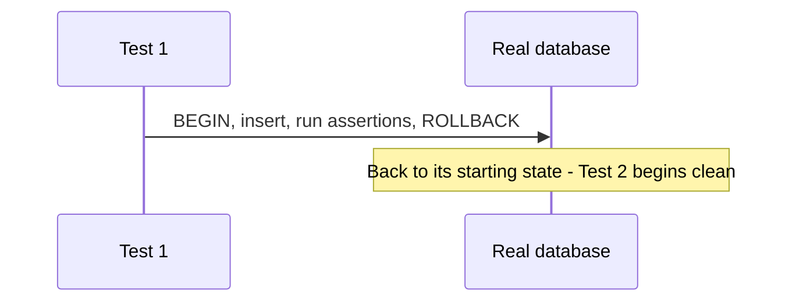

**Example:**

```js
// transaction rollback pattern
beforeEach(async () => { tx = await testDb.begin(); });
afterEach(async () => { await tx.rollback(); }); // nothing written survives past this test

it("creates an order with the right total", async () => {
  const order = await createOrder(tx, { userId: "u1", items: [...] });
  expect(order.total).toBe(38.88);
});
```

**Good for:**
- Running tests in parallel without them corrupting each other's data
- Trusting a failing test actually means something broke, not that another test ran first and left a mess

**Watch out for:**
- Sharing one long-lived "test" database across developers and CI runs with no isolation — a classic, hard-to-diagnose source of the flakiness described above
- Rollback patterns that don't cover every write path (a test that also writes to a queue or cache outside the transaction still leaves state behind)

## Side by side

| Test type | What it catches | Speed | Cost to write | Typical tools |
|---|---|---|---|---|
| Unit | Broken logic in one function or module | Milliseconds | Low | Vitest, Jest |
| Integration | Bugs where code meets a real DB or service | Fast (ms–s) | Medium | Vitest/Jest + a real test DB |
| Contract | A provider's API drifting from what a consumer expects | Fast | Medium | Pact |
| End-to-end | The whole real stack failing together | Slow (s–min) | High | Playwright, Cypress |
| Regression | A previously fixed bug coming back | Depends on scope | Low, once reproduced | Whatever framework the bug lives in |
| Smoke | A deploy that's completely broken | Very fast | Low | curl, k6, Playwright |
| Snapshot / visual | Unintended structural or visual drift | Fast–medium | Low to set up | Jest/Vitest snapshots, Playwright, Percy |
| Performance / load | Slowness or breakage under traffic | Slow, minutes+ | Medium–high | k6, Gatling, Locust |
| Security (SAST/DAST) | Known vulnerable patterns and live exploitable weaknesses | Medium | Low (mostly config) | Semgrep, CodeQL, OWASP ZAP |
| Accessibility | Missing labels, contrast, keyboard/screen-reader issues | Fast | Low–medium | axe-core, Lighthouse, jest-axe |

## Which tests should I write?

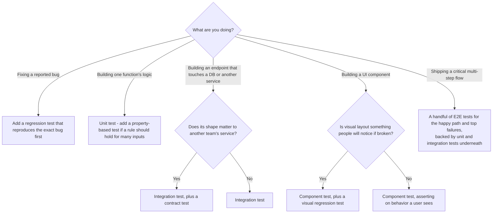

A few real scenarios to sanity-check the tree against:

1. **A new bug report: two discount codes stack past the intended cap.** A regression test that reproduces the exact reported case, written to fail first — then fix the code until it passes, and leave the test in the suite for good.
2. **A new API endpoint, `POST /orders`.** An integration test hitting a real test database, checking the row that actually gets written. If a separate Warehouse service depends on the response shape, add a contract test alongside it. A smoke check for this endpoint also belongs in the post-deploy suite.
3. **A UI component: a discount code input field.** A component test with Testing Library that types an invalid code and checks the user-visible error message appears — behavior, not implementation. Add a visual regression test only if this component's actual layout (not just its behavior) is something a broken CSS change could silently ruin.
4. **The checkout flow, start to finish.** A small number of E2E tests — the happy path, plus the top failure paths like a declined card or an out-of-stock item — backed underneath by unit tests for `calculateOrderTotal` and integration tests for `POST /orders`, so the expensive E2E layer stays thin.

## Common mistakes

- **Writing an E2E test for logic a unit test could check in milliseconds.** Same confidence, far slower and flakier suite.
- **Chasing 100% code coverage as the goal.** It rewards tests that execute a line without actually checking anything about it — see [Code coverage](#code-coverage) above for why the number alone can't tell you that.
- **Mocking so much of an "integration" test that nothing real is left to integrate.** If every dependency is a mock, it's a unit test wearing an integration test's name.
- **Retrying a flaky test in CI until it goes green, instead of fixing the root cause.** It hides a real problem behind a passing badge.
- **Skipping a regression test for an "obvious" bug fix.** The same bug quietly returns once nobody remembers the original report.
- **Copying the test pyramid's shape without asking whether your system is actually pyramid-shaped.** A component-heavy frontend or a service-oriented backend can genuinely need more integration tests than unit tests.
- **Sharing one mutable test database across developers or CI runs.** One test's leftover row becomes the next test's mystery failure.
- **Clicking "update snapshot" on a failing test without actually looking at the diff.** That turns the safety net into a rubber stamp.

## Go deeper

Related deep dives:
- [Web security](web-security.md) — the vulnerability classes SAST and DAST tools are actually looking for
- [Deployment](deployment.md) — where smoke tests fit into a release pipeline
- [Concurrency](concurrency.md) — race conditions are a common root cause behind flaky tests

Big-tech-system-design concepts:
- [Microservices](https://github.com/alwintwk/big-tech-system-design/blob/main/concepts/microservices.md) — the architecture that makes contract testing worth the extra setup

Tools: [web-dev-resources → Testing](https://github.com/alwintwk/web-dev-resources#testing)

External references:
- [Martin Fowler — Practical Test Pyramid](https://martinfowler.com/articles/practical-test-pyramid.html)
- [Kent C. Dodds — The Testing Trophy and Testing Classifications](https://kentcdodds.com/blog/the-testing-trophy-and-testing-classifications)
- [Testing Library — Guiding Principles](https://testing-library.com/docs/guiding-principles/)
- [Google Testing Blog — Flaky Tests at Google and How We Mitigate Them](https://testing.googleblog.com/2016/05/flaky-tests-at-google-and-how-we.html)
- [OWASP — Web Security Testing Guide](https://owasp.org/www-project-web-security-testing-guide/)
