# Web security attacks and defences

> Most web attacks trick a browser, a server, or a database into trusting something it shouldn't. This page walks through the common ones, grouped by OWASP's Top 10, using the bookshop as the running example.

[← Back to Security](../README.md#security)

## Why this matters

Say you're building that same online bookshop. A junior developer ships a search box: `GET /books/search?q=dune` builds a SQL query by gluing the query string straight into it. It works in every test anyone ran. Three weeks later someone submits `q=' OR '1'='1` and walks away with the entire customers table, including password hashes. Nobody wrote a vulnerability on purpose — the code just trusted something it shouldn't have: a string from a stranger, treated as if it were safe.

That's the shape of almost every attack on this page. A browser trusts a cookie a hostile page attached to a request (CSRF). A server trusts a URL a user gave it (SSRF). A file-download endpoint trusts a filename close enough to `../../etc/passwd` (path traversal). A build pipeline trusts whatever version of a dependency happened to be newest that morning (supply chain). The fixes are just as repetitive once you see the pattern: never let untrusted input decide what code runs, what file gets read, or whose data gets returned — check it, encode it, or scope it down to exactly what's allowed, at the exact point where trust changes hands.

OWASP (the Open Web Application Security Project, a nonprofit that publishes free, community-maintained security guides) ranks the most common ways this goes wrong in its Top 10 list, refreshed every few years from real breach data. This page is organized around the 2021 edition — not because the ranking is gospel, but because it's the shared vocabulary you'll hit in code review, a CVE writeup, or a security audit.

## The map

Every attack below tricks one of three things: the browser rendering a page, the server handling a request, or data sitting at rest. The tree groups this page's sections that way, and each branch names the OWASP 2021 category it maps to.

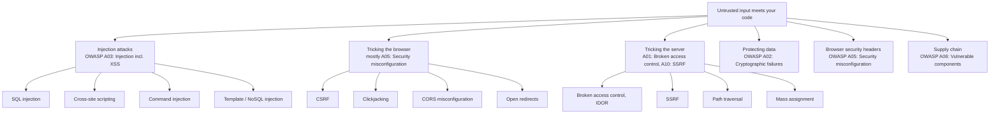

Three 2021 categories don't get their own section: **A04 Insecure design** and **A09 Security logging and monitoring failures** are habits more than single fixes, covered under "How to think like a defender" below. **A07 Identification and authentication failures** is the subject of the [auth.md](auth.md) deep dive — including credential stuffing, brute force, and session hijacking in its attacks table, so they aren't repeated here.

## Injection attacks

Injection happens when untrusted input gets interpreted as code or commands instead of plain data. OWASP's 2021 list folds cross-site scripting into this same category (A03), because the underlying mistake — mixing data and instructions in one string — is identical whether the interpreter is SQL, a shell, or a browser's HTML parser.

### SQL injection

**In one line:** gluing user input directly into a SQL query string lets an attacker rewrite what the query does.

**How it works:** a query built by string concatenation is really the database reading two things as one — your intended command and whatever the user typed — with no boundary between them. Feed it `' OR '1'='1` where a value was expected, and the database can't tell that wasn't part of the command; it just sees a `WHERE` clause that's now always true. It's a mad-lib where the blank isn't fenced off from the rest of the sentence: fill it with the wrong words and you rewrite the whole sentence's meaning.

<a href="https://alwintwk.github.io/dev-knowledge/diagrams/web-security-sql-injection.html">
  <picture>
    <source media="(prefers-color-scheme: dark)" srcset="../diagrams/web-security-sql-injection.dark.png">
    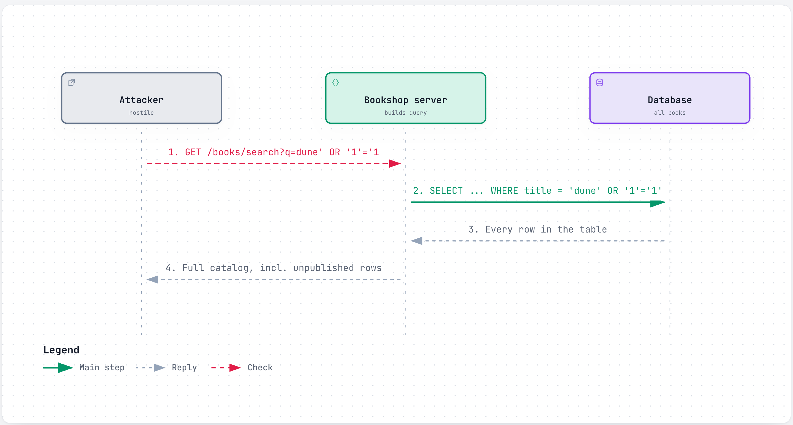
  </picture>
</a>

<sub>Click the diagram for the interactive version (zoom, dark mode, trace a path).</sub>

**Example:**

```js
// vulnerable: user input glued straight into the query string
const rows = await db.query(`SELECT * FROM books WHERE title = '${q}'`);

// fixed: parameterized query — driver sends data and command separately
const rows = await db.query("SELECT * FROM books WHERE title = $1", [q]);
```

**Where it shows up:**
- Any query built with string concatenation or template literals instead of placeholders
- ORMs that expose a raw-query escape hatch, reached for "just this once"

**Watch out for:**
- One raw string anywhere in the codebase is enough — an ORM elsewhere doesn't protect you
- Least-privilege database accounts limit the damage even if a query slips through

### Cross-site scripting (XSS)

**In one line:** attacker-supplied content gets rendered as live HTML or JavaScript in someone else's browser, instead of as inert text.

**How it works:** XSS comes in three flavors, differing in *where* the payload is stored and *when* it runs — the underlying mistake, output that should have been escaped wasn't, is the same in all three. **Stored XSS**: the payload is saved somewhere — a book review, a username — and served to every visitor who views that page. **Reflected XSS**: the payload lives in the request itself, usually a URL query parameter, and only fires for whoever clicks a crafted link, because the server echoes it straight back. **DOM-based XSS**: the payload never touches the server at all — client-side JavaScript reads something attacker-controlled (`location.hash`) and writes it into the page with `innerHTML`, so the bug lives entirely in the browser's own code.

<a href="https://alwintwk.github.io/dev-knowledge/diagrams/web-security-xss.html">
  <picture>
    <source media="(prefers-color-scheme: dark)" srcset="../diagrams/web-security-xss.dark.png">
    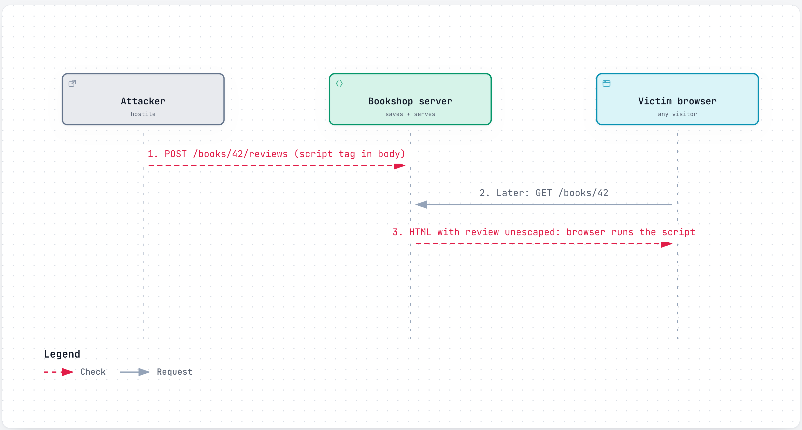
  </picture>
</a>

**Example:**

```js
// vulnerable: raw review text injected straight into HTML
res.send(`<div class="review">${review.text}</div>`);

// fixed: escape on output — or let a framework do it by default
res.send(`<div class="review">${escapeHtml(review.text)}</div>`);
// React: <div>{review.text}</div> escapes automatically;
// dangerouslySetInnerHTML opts back out of that — avoid it
```

**Where it shows up:**
- Anywhere user text gets written into HTML, an attribute, or a URL without context-appropriate encoding
- Rich-text fields (reviews, bios) that intentionally allow some HTML

**Watch out for:**
- Escaping has to match the context — HTML-escaping a value going into a URL attribute isn't enough
- If some HTML must be allowed, sanitize with a maintained library (DOMPurify), not a denylist of "bad tags"; a Content Security Policy (below) limits the damage if a bug slips through anyway

### Command injection

**In one line:** user input reaches a shell command unsanitized, letting an attacker run arbitrary commands on the server.

**How it works:** any code path that hands a string to a shell to interpret has SQL injection's problem with the operating system as the interpreter. A shell reads `;`, `&&`, `|`, and backticks as command separators — so a filename that looks like data to your code can look like a second command to the shell.

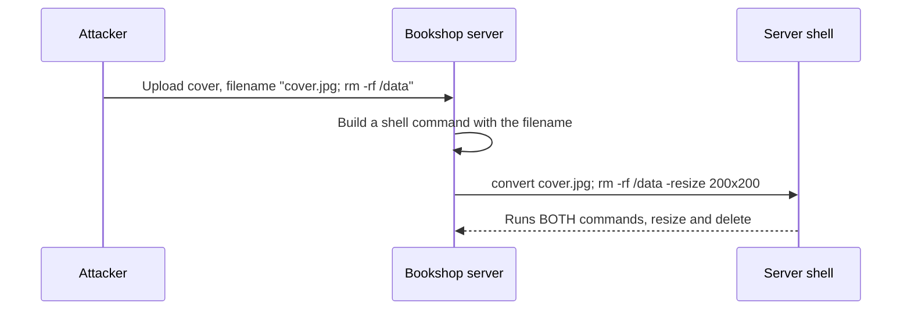

**Example:**

```js
// vulnerable: filename can inject a second shell command
exec(`convert ${filename} -resize 200x200 out.jpg`);

// fixed: execFile with an argument array never invokes a shell —
// no command separator for the filename to exploit
execFile("convert", [filename, "-resize", "200x200", "out.jpg"]);
```

**Where it shows up:**
- File processing, image conversion, or any "call an external tool" feature that builds its command line from user input

**Watch out for:**
- `execFile`/`spawn` without `shell: true` removes the shell entirely, not just speeds things up — there's nothing left to inject into
- If a shell is truly required, allow-list the exact characters permitted in the input first

### Template and NoSQL injection

**In one line:** the same trick as SQL injection, aimed at a template engine's expression syntax or a NoSQL query's operators instead of SQL.

**How it works:** server-side template injection happens when user input is evaluated as part of the template itself, not passed in as a plain variable — an engine that lets `{{ 7 * 7 }}` run expressions will run whatever an attacker puts there too. NoSQL injection is the MongoDB-flavored version: a query builder that accepts raw JSON lets an attacker send an operator instead of a value — `{ "password": { "$ne": null } }` asks "any password that is not null," matching every account.

```js
// vulnerable: raw request body passed straight into the query
const user = await db.users.findOne({
  username: req.body.username,
  password: req.body.password, // attacker sends { "$ne": null }
});

// fixed: validate types before they reach the query — $ne is an
// object, not the string a password field expects
if (typeof req.body.password !== "string") return res.status(400).end();
const user = await db.users.findOne({ username, password: hash(pw) });
```

**Where it shows up:**
- Template engines that expose full expression evaluation to "just render this string" use cases; query builders fed the request body directly

**Watch out for:**
- A schema validator (Zod, Joi, strict Mongoose types) closes this off once, instead of in every handler

## Tricking the browser

These attacks don't touch your database at all — they exploit what a browser is willing to trust on your users' behalf: a cookie it attaches automatically, a frame it's willing to render, an origin it's told to allow, a redirect it's told to follow.

### Cross-site request forgery (CSRF)

**In one line:** a malicious page makes the victim's browser send a state-changing request to your site, riding along on the session cookie the browser attaches automatically.

**How it works:** browsers attach a site's cookies to every request to that site, no matter which page triggered the request. If bookshop.com trusts a cookie alone to decide who's asking, a hostile page can auto-submit a form to `bookshop.com/account/change-email`, and the victim's browser dutifully attaches their real session cookie. The request looks completely legitimate to the server — the cookie is genuine — even though the click never happened on bookshop.com.

<a href="https://alwintwk.github.io/dev-knowledge/diagrams/web-security-csrf.html">
  <picture>
    <source media="(prefers-color-scheme: dark)" srcset="../diagrams/web-security-csrf.dark.png">
    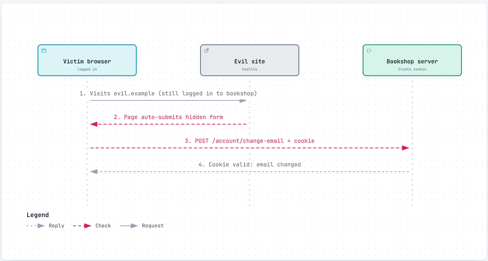
  </picture>
</a>

**Example:**

```html
<!-- vulnerable: no CSRF token, cookie alone is trusted -->
<form action="https://bookshop.com/account/change-email" method="POST">
  <input type="hidden" name="email" value="attacker@evil.example" />
</form>
<script>document.forms[0].submit()</script>
```

```js
// fixed: SameSite cookie as the baseline, plus a CSRF token as
// defense in depth on the state-changing route
res.cookie("session_id", id, { sameSite: "lax", httpOnly: true, secure: true });
app.post("/account/change-email", verifyCsrfToken, handler);
```

**Where it shows up:**
- Any state-changing request (POST/PUT/PATCH/DELETE) that relies only on a cookie to authenticate

**Watch out for:**
- `SameSite=Lax` (the modern browser default) blocks most cross-site form submissions alone, but OWASP still recommends a CSRF token for anything that can't rely on SameSite alone, such as cookies deliberately set to `SameSite=None`
- Checking `Origin`/`Referer` is a reasonable extra check, never the only one

### Clickjacking

**In one line:** an attacker overlays your page, invisibly, inside their own, and tricks the victim into clicking something they can't see.

**How it works:** the attacker's page loads bookshop.com inside an `<iframe>`, makes it fully transparent with CSS, and positions it exactly over a fake button on their own page. The victim thinks they're clicking "claim your free gift"; they're actually clicking "confirm purchase" on the invisible bookshop.com iframe underneath.

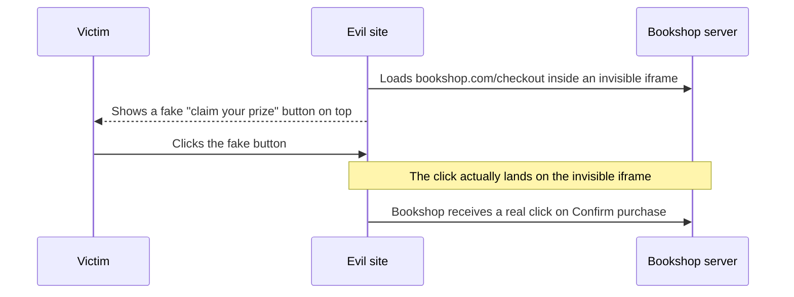

**Example:**

```
# vulnerable: no framing protection at all

# fixed: tell browsers not to render this page inside a frame
X-Frame-Options: DENY
Content-Security-Policy: frame-ancestors 'none'
```

**Where it shows up:**
- Any page with a sensitive one-click action: purchase, delete account, change settings

**Watch out for:**
- `frame-ancestors` (a CSP directive) is the current standard and more flexible than `X-Frame-Options` — it can allow-list specific origins; send both for older browsers that don't read CSP

### CORS misconfiguration

**In one line:** getting Cross-Origin Resource Sharing wrong doesn't create a new hole by itself, but it removes a browser protection other defences may have been quietly relying on.

**How it works:** CORS is enforced by the browser, for the browser's users — it is **not** a permission system for your server. By default, a browser blocks page A from reading a response from origin B (the same-origin policy); CORS is how B's server says "actually, I trust origin A, let its pages read my responses." Nothing about CORS stops a direct request from `curl`, a script, or another server — there's no browser there to enforce it, so an endpoint that skips real authentication because "CORS will block outsiders" is not protected at all outside a browser. The real danger is narrower: if an API trusts cookies for auth and reflects back whatever `Origin` header it receives with `Access-Control-Allow-Credentials: true`, any site the victim happens to visit can make an authenticated request from inside the victim's browser and read the response back.

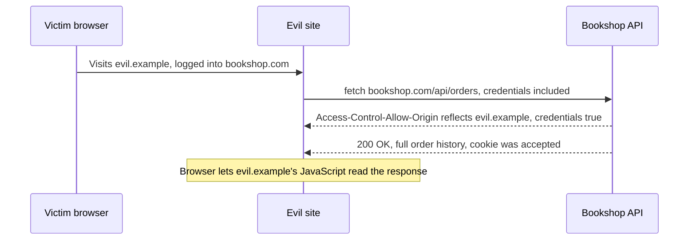

**Example:**

```js
// vulnerable: reflects any Origin back, with credentials allowed
res.set("Access-Control-Allow-Origin", req.headers.origin);
res.set("Access-Control-Allow-Credentials", "true");

// fixed: allow-list of trusted origins, nothing else gets credentials
const allowed = ["https://bookshop.com", "https://app.bookshop.com"];
if (allowed.includes(req.headers.origin)) {
  res.set("Access-Control-Allow-Origin", req.headers.origin);
  res.set("Access-Control-Allow-Credentials", "true");
}
```

**Where it shows up:**
- APIs that copy `req.headers.origin` straight into the response header "to make CORS errors go away," especially when mixed with cookie-based auth

**Watch out for:**
- The spec already refuses `Access-Control-Allow-Origin: *` together with credentials — the risky pattern is *reflecting* the origin, which passes that check while still allowing anyone
- CORS is not the authorization check; the server still has to verify the caller is allowed to see that data, regardless of origin

### Open redirects

**In one line:** a URL on your own domain that redirects wherever a query parameter says, letting attackers dress a phishing link up as a link to your trusted site.

**How it works:** a login flow that supports "return to where you were" often reads a `redirect` parameter and sends the browser there after success. Trusted blindly, `bookshop.com/login?redirect=https://evil.example` is a link that genuinely starts at bookshop.com — passing a wary user's glance-check — and ends up at the attacker's page anyway.

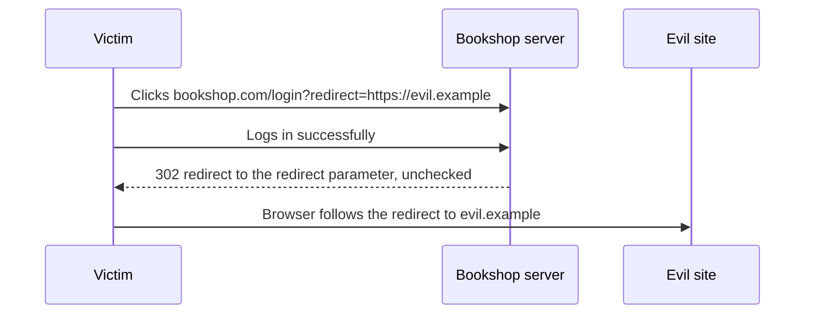

**Example:**

```js
// vulnerable: redirects to whatever the query parameter says
res.redirect(req.query.redirect);

// fixed: only allow a relative, single-slash path
const t = req.query.redirect;
const safe = t && t.startsWith("/") && !t.startsWith("//");
res.redirect(safe ? t : "/account");
```

**Where it shows up:**
- Post-login redirects, logout redirects, "continue to partner site" links

**Watch out for:**
- `//evil.example` is a protocol-relative URL and still an open redirect — reject a leading double slash too, not just a missing leading slash
- Unvalidated `redirect_uri` values are also how OAuth authorization codes get stolen

## Tricking the server

These attacks target the server's own logic: what it assumes about which resource an ID refers to, which URLs are safe to fetch, which files are safe to open, and which fields a client is allowed to set.

### Broken access control and IDOR

**In one line:** the server returns or changes a resource based on an ID in the request, without checking that the resource actually belongs to whoever's asking.

**How it works:** IDOR (Insecure Direct Object Reference) is the single most common way broken access control shows up, and why OWASP moved this category to #1 in 2021. `GET /orders/1002` looks protected — you have to be logged in to call it — but if the handler only checks "does order 1002 exist" and never "does it belong to this user," any logged-in customer can page through order IDs and read everyone else's purchases just by changing a number in the URL.

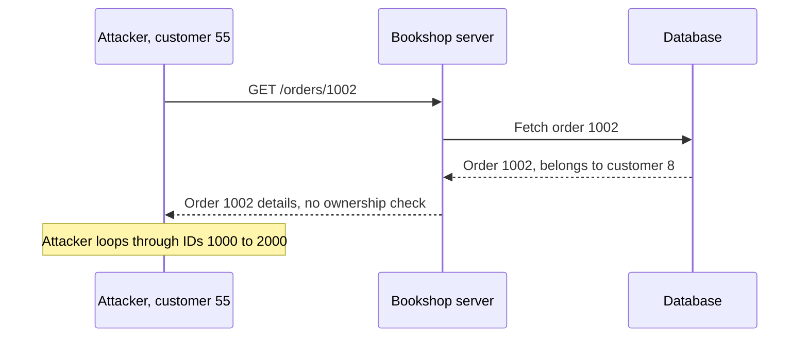

**Example:**

```js
// vulnerable: fetches by ID alone, no ownership check
const order = await db.orders.findById(req.params.id);
res.json(order);

// fixed: check the order belongs to the requesting user
const order = await db.orders.findById(req.params.id);
if (!order || order.customerId !== req.user.id) {
  return res.status(404).end(); // 404, not 403 — don't confirm the ID exists
}
res.json(order);
```

**Where it shows up:**
- Any endpoint taking an ID from a URL, form field, or hidden input, on both reads and writes

**Watch out for:**
- The check must run server-side on every access path — hiding a link in the UI changes nothing
- Sequential IDs make this easy to sweep; unguessable IDs (UUIDs) only make it harder to *find* other people's data, the ownership check is still mandatory

### Server-side request forgery (SSRF)

**In one line:** the server fetches a URL supplied by the user, and an attacker points it somewhere it was never meant to reach.

**How it works:** a feature like "import a book cover from a URL" means the server makes an outbound request to whatever address it's given. Left unrestricted, an attacker can point it at internal-only services the server can reach but the attacker never could directly — a cloud provider's metadata endpoint, which can hand back credentials, or an internal admin panel with no auth because it "was never exposed to the internet."

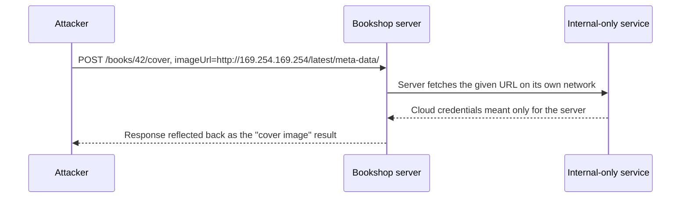

**Example:**

```js
// vulnerable: fetches whatever URL the request supplies
const cover = await (await fetch(req.body.imageUrl)).buffer();

// fixed: allow-list of schemes and destinations
const allowedHosts = ["images.bookshop-suppliers.com"];
const url = new URL(req.body.imageUrl);
if (url.protocol !== "https:" || !allowedHosts.includes(url.hostname)) {
  return res.status(400).send("Image source not allowed");
}
const cover = await (await fetch(url)).buffer();
```

**Where it shows up:**
- "Fetch from a URL" features: image or file imports, PDF generators loading remote resources, link previews, outbound webhooks

**Watch out for:**
- Blocking by hostname alone isn't enough if DNS can resolve to an internal IP after the check — resolve first, then check the resulting IP against private and link-local ranges
- Network segmentation, so the app server genuinely can't reach sensitive internal services, is the defense-in-depth layer under the allow-list

### Path traversal

**In one line:** user-supplied input reaches a file path unsanitized, letting `../` sequences walk outside the folder the code intended.

**How it works:** a file-download endpoint that builds a path by gluing a filename onto a base folder trusts that the filename is really just a filename. `../../../etc/passwd` isn't a filename in the usual sense — it's instructions to walk up out of the intended folder entirely, and most filesystems follow it.

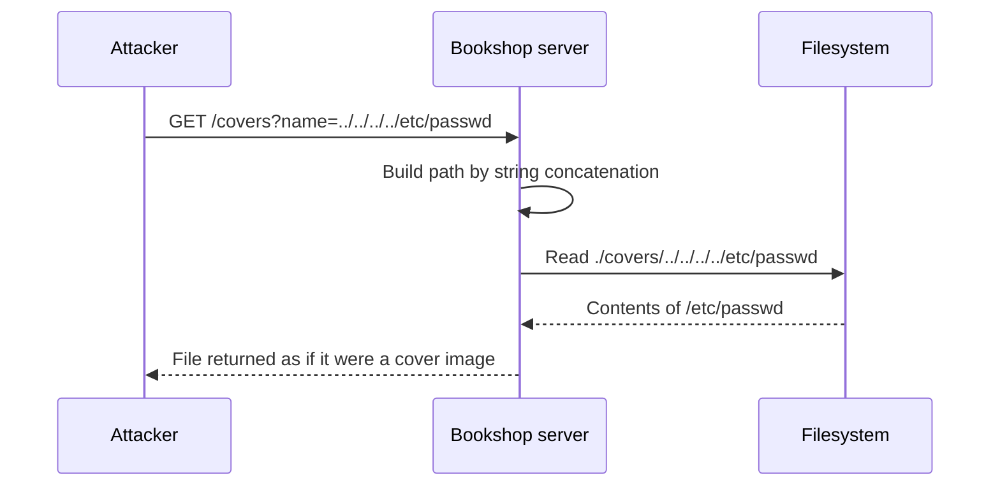

**Example:**

```js
// vulnerable: filename concatenated straight into a filesystem path
res.sendFile(`./covers/${req.query.name}`);

// fixed: resolve the final path, verify it stays inside the base folder
const base = path.resolve("./covers");
const filePath = path.resolve(base, req.query.name);
if (!filePath.startsWith(base + path.sep)) {
  return res.status(400).send("Invalid file");
}
res.sendFile(filePath);
```

**Where it shows up:**
- Download endpoints, log viewers, template loaders — anything building a filesystem path from request input

**Watch out for:**
- Blocking the literal string `../` isn't enough — encoded (`%2e%2e%2f`) or Windows-style variants slip past a naive filter; resolving the full path and checking the prefix handles them all
- Better still: don't accept raw filenames at all, map an opaque ID to a path server-side

### Mass assignment

**In one line:** the server writes an entire request body straight onto a database record, letting an attacker set fields that were never meant to be user-editable.

**How it works:** an update handler that does the convenient thing — `Object.assign(user, req.body)` — trusts every key the client sent, not just the ones the form offered. A profile-edit form only shows `name` and `bio`, but nothing stops an attacker adding `"isAdmin": true` to the JSON body by hand; if the server writes the whole object, that field gets set too.

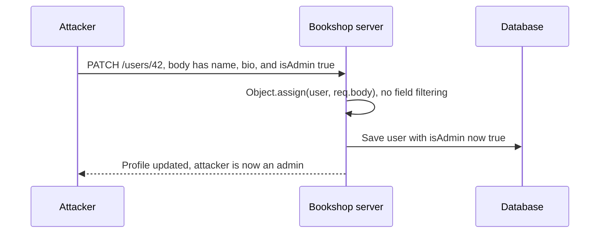

**Example:**

```js
// vulnerable: the whole request body gets written to the record
Object.assign(user, req.body);
await user.save();

// fixed: explicit allow-list of fields a user may actually edit
const { name, bio } = req.body; // only these two are ever read
user.name = name;
user.bio = bio;
await user.save();
```

**Where it shows up:**
- ORM "update from object" convenience methods fed the raw request body, on records that also hold admin-only fields (`isAdmin`, `role`, `balance`)

**Watch out for:**
- A DTO (data transfer object) or serializer naming the editable fields once is safer than filtering `req.body` in every handler — this is the same root mistake as broken access control: trusting a request to describe its own permissions

## Protecting data

Not every defence is about rejecting a malicious request — some is about what happens to legitimate data in transit and at rest, so a breach elsewhere doesn't hand over anything readable.

### HTTPS/TLS and HSTS

**In one line:** TLS encrypts traffic between browser and server so nobody in between can read or tamper with it; HSTS makes sure a browser never falls back to the unencrypted version by mistake.

**How it works:** without TLS, anyone on the network path — shared Wi-Fi, an ISP — can read every request in plain text, including login forms and cookies. TLS wraps the connection so only browser and server hold the keys to unscramble it. HSTS (`Strict-Transport-Security`) closes a specific gap: the very first request to a site is sometimes made over plain HTTP before a redirect to HTTPS, and an attacker on the network can intercept that first request and strip the redirect (SSL stripping). HSTS tells the browser, after the first visit, to never attempt a plain-HTTP connection to this domain again for as long as the header specifies.

**Example:**

```
Strict-Transport-Security: max-age=63072000; includeSubDomains; preload
```

**Good for:**
- Every site handling logins or payments — in practice, every site
- `preload` submits the domain to a list browsers ship with, protecting even the truly first-ever visit

**Watch out for:**
- Removing HSTS is hard to walk back — browsers that already saw the header refuse plain HTTP for the full `max-age`, even if you later need it
- HSTS protects the connection, not the content — it does nothing for an XSS bug or a leaked key

### Secrets management

**In one line:** API keys, database passwords, and signing keys belong in an environment variable or a secrets manager — never in the code itself.

**How it works:** a hardcoded secret isn't a risk only if someone reads that one file — it's in every clone, every fork, every CI log that prints an env dump, and permanently in git history even after it's "removed," since a deleted line is still sitting in an earlier commit. The fix is to keep secrets out of version control entirely: read them from environment variables at runtime, or from a secrets manager (Vault, AWS Secrets Manager, Doppler) that also handles rotation.

**Example:**

```js
// vulnerable: committed directly in source
const stripeKey = "sk_live_51Hxyz9f2a7c1b...";

// fixed: read from the environment, never written into the repo
const stripeKey = process.env.STRIPE_SECRET_KEY;
```

```
# .gitignore
.env
.env.local
```

**Good for:**
- Every credential the app needs: database URLs, API keys, webhook secrets
- Pre-commit hooks (gitleaks, git-secrets) that scan for secret-shaped strings before a commit is made

**Watch out for:**
- A secret that leaked once has to be rotated — removing it from the latest commit does not undo the exposure
- `.env` files are for local convenience; production secrets belong in the platform's own secret store

### Hashing vs encryption vs encoding

**In one line:** three different things people call "scrambling" a value, and only one of them, hashing, is right for passwords.

**How it works:** encoding changes a value's format and nothing more — Base64, URL encoding — anyone can reverse it with no key; it's for compatibility, never secrecy. Encryption is reversible on purpose, but only with the right key — symmetric (AES, one shared key) or asymmetric (RSA, a public key that locks, a private key that unlocks) — use it for data you genuinely need back later, like a file at rest. Hashing is one-way by design, no key reverses it, which is exactly why it's right for a password: the server only ever needs to check "does this match," never "what was the original value." Confusing these is a real, recurring mistake — "encrypting" passwords instead of hashing them means whoever holds the decryption key can recover every plaintext password at once.

**Example:**

```js
// encoding: reversible by anyone, no key
Buffer.from("Dune").toString("base64"); // "RHVuZQ=="

// encryption: reversible only with the key
const cipher = crypto.createCipheriv("aes-256-gcm", key, iv);

// hashing: not reversible at all — the right tool for passwords
const hash = await bcrypt.hash(password, 12);
```

**Good for:**
- Encoding: moving binary data through text-only channels
- Encryption: data you need to read back later, like sensitive database columns
- Hashing: passwords (bcrypt/argon2), and checking a file wasn't tampered with (SHA-256)

**Watch out for:**
- Base64 is not encryption — a bug report assuming otherwise shows up somewhere every year
- See [auth.md](auth.md) for the full password-hashing walkthrough, including salts

## Browser security headers

A handful of HTTP response headers tell the browser to enforce rules on your behalf, closing off entire classes of attack in a few lines of server configuration.

### Content Security Policy (CSP)

**In one line:** a header telling the browser exactly which sources of scripts, styles, and other content a page may load, so an injected `<script>` tag has nowhere sanctioned to run from.

**How it works:** without CSP, any script that ends up on the page — yours or an attacker's — runs with full page access. CSP is an allow-list: `script-src 'self'` means only scripts from your own domain may run, so an attacker's injected inline script, or one loaded from `evil.example`, is refused by the browser even if the injection itself succeeded. Current OWASP guidance is to avoid `'unsafe-inline'` in `script-src` entirely and use a per-request nonce or a hash of the exact allowed script instead, since `'unsafe-inline'` re-opens the hole CSP exists to close.

**Example:**

```
Content-Security-Policy: default-src 'self'; script-src 'self' 'nonce-r4nd0m123'; object-src 'none'; frame-ancestors 'self'
```

```html
<!-- the nonce must match the header, generated fresh per request -->
<script nonce="r4nd0m123">initCart();</script>
```

**Good for:**
- Defense in depth against XSS — a safety net for when output encoding fails somewhere, not a replacement for it
- `Content-Security-Policy-Report-Only` to see what a policy would block before enforcing it

**Watch out for:**
- `'unsafe-inline'` and `'unsafe-eval'` defeat most of CSP's XSS protection — an escape hatch for legacy code, not a starting point
- A strict policy can break third-party widgets that inject inline code; roll out in report-only mode first

### Other security headers

| Header | What it does | Typical value |
|---|---|---|
| `Strict-Transport-Security` | Forces HTTPS for this domain, no downgrade | `max-age=63072000; includeSubDomains` |
| `X-Content-Type-Options` | Stops the browser guessing a file's type and running it as something more dangerous than declared | `nosniff` |
| `frame-ancestors` (CSP) / `X-Frame-Options` | Controls whether this page can be embedded in a frame, the clickjacking defence | `frame-ancestors 'self'` |
| `Referrer-Policy` | Limits how much of the current URL is sent to the next site on navigation | `strict-origin-when-cross-origin` |
| `Permissions-Policy` | Restricts which browser features, like camera or geolocation, this page and any embedded frame may use | `geolocation=(), camera=()` |

**Good for:**
- Setting most of these once, centrally, in middleware or a reverse proxy — they rarely vary per route
- Libraries like `helmet` (Node) set sane defaults for the whole set in a few lines

**Watch out for:**
- `X-Frame-Options` only allows `DENY` or `SAMEORIGIN`; `frame-ancestors` allow-lists specific origins and is the one to prefer when a partner site genuinely needs to frame you
- Headers only help if they actually reach the browser — check the network tab, don't assume middleware runs on every route

## Supply chain

Your own code is rarely the only code running in production — a typical app pulls in hundreds of transitive dependencies, and a vulnerability in any one of them is a vulnerability in yours. This is OWASP's A06: Vulnerable and Outdated Components.

### Vulnerable dependencies and lockfiles

**In one line:** a known, published vulnerability in a library you depend on, even three layers deep, is exploitable in your app exactly as if you'd written the bug yourself.

**How it works:** `package.json` lists the libraries you asked for; the lockfile (`package-lock.json`, `yarn.lock`, `pnpm-lock.yaml`) pins the exact version of every dependency and sub-dependency actually installed, so a build today matches a build next year instead of silently picking up whatever's newest. That lockfile is also what makes a vulnerability scan possible: `npm audit` checks every pinned version against a database of known vulnerabilities. Dependabot or Renovate automate the boring part — watching for new advisories and opening a pull request with the fixed version already in place. Log4Shell (CVE-2021-44228) is the textbook case of why this matters at scale: a remote-code-execution bug in Log4j, a logging library, sat several dependency layers deep in an enormous share of the world's Java applications, most of which never directly chose to depend on it.

**Example:**

```bash
npm audit
# found 3 vulnerabilities (1 moderate, 2 high)
npm audit fix
```

```yaml
# Dependabot opens PRs automatically, package.json + lockfile updated together
- package-ecosystem: "npm"
  directory: "/"
  schedule:
    interval: "weekly"
```

**Good for:**
- Committing the lockfile always, so everyone and CI install the identical dependency tree
- Running `npm audit` (or equivalent) in CI on a schedule, not just locally and occasionally

**Watch out for:**
- A clean audit today says nothing about tomorrow's newly disclosed CVE
- Not every flagged vulnerability is reachable in your actual usage — triage, don't blindly upgrade everything and hope nothing breaks

### Typosquatting

**In one line:** an attacker publishes a malicious package under a name one keystroke away from a popular one, hoping a typo installs it instead.

**How it works:** `npm install expres` instead of `express`, or a package like `crossenv` sitting next to the real `cross-env` — the malicious package can do anything a normal install can, including running arbitrary code the moment it's installed via a `postinstall` script, often to steal environment variables or CI secrets before anyone notices the typo. It works because installing a package is, by default, running code nobody reviewed first.

**Example:**

```bash
# one character off from the real "express" — easy to type by accident
npm install expres
```

**Good for:**
- Double-checking package names against the lockfile or npmjs.com before adding anything new
- `npm config set ignore-scripts true` in CI, so a malicious `postinstall` never runs where secrets live, if your own dependencies don't need install scripts

**Watch out for:**
- A malicious package doesn't need to stay published long to do damage — it runs once, at install time
- Code review catching a new dependency in a diff is a real defense; a one-character typo in `package.json` is easy to miss without it

## Side by side

| Attack | What attacker gets | Main defence | Where the fix lives |
|---|---|---|---|
| SQL injection | Read, modify, or delete arbitrary rows | Parameterized queries | Query / data-access layer |
| XSS (stored/reflected/DOM) | Runs attacker JS in another user's browser | Output encoding everywhere, plus CSP | Render layer + response headers |
| Command injection | Runs arbitrary commands on the server OS | Argument-array exec, never a shell string | Wherever the app shells out |
| Template / NoSQL injection | Template execution, or auth bypass via query operators | Strict input validation before the query runs | Query builder / template call site |
| CSRF | Triggers a state-changing action as the victim | SameSite cookies + CSRF tokens | Cookie config + form/API middleware |
| Clickjacking | Tricks a click into hitting a hidden real button | `frame-ancestors` / `X-Frame-Options` | Response headers |
| CORS misconfiguration | Another origin's script reads authenticated responses | Allow-list origins, never reflect with credentials | CORS middleware config |
| Open redirect | Dresses a phishing link as your trusted domain | Validate target is relative or allow-listed | Redirect handler |
| Broken access control / IDOR | Reads or changes another user's resource | Ownership check on every access, server-side | Every handler touching the resource |
| SSRF | Server fetches attacker-chosen internal URLs | Allow-list destinations, block private IP ranges | Outbound HTTP client / network layer |
| Path traversal | Reads files outside the intended directory | Resolve the path, verify it stays in the base folder | File access code |
| Mass assignment | Sets fields like `isAdmin` that shouldn't be editable | Explicit allow-list of editable fields | Update / write handler |

Credential stuffing, brute force, session hijacking, and phishing — attacks aimed at the login itself rather than app logic — are covered in [auth.md](auth.md)'s attacks table instead of repeated here.

## How to think like a defender

Every fix above is really one of three habits, applied consistently rather than remembered case by case.

**Validate at every trust boundary.** Anywhere data crosses from something you don't control into something you do — a request body, a URL parameter, a third-party API response, an uploaded file, a webhook payload — check it before acting on it. Nearly every attack above is one specific boundary where that check got skipped.

**Least privilege, by default.** A database account that can only `SELECT` from the tables it needs can't be used to `DROP` anything, even through a successful injection. An API key scoped to `read_orders` can't refund anything, even if it leaks. Grant the smallest set of permissions that lets something do its job, and treat any broader grant as something to justify, not a default.

**Defence in depth.** No single control above is meant to be the only thing standing between an attacker and your data — output encoding *and* CSP both defend against XSS; an allow-list *and* network segmentation both defend against SSRF; a CSRF token *and* SameSite cookies both defend against CSRF. When one layer has a bug, the next one is still there.

**Threat modeling with STRIDE.** These habits work best applied on purpose, before code is written, not discovered after an incident. STRIDE is a checklist Microsoft popularized for exactly that: for each part of a system, ask whether it's vulnerable to **S**poofing (pretending to be someone else), **T**ampering (changing data in flight or at rest), **R**epudiation (denying an action, with no log to prove otherwise), **I**nformation disclosure (exposing data to someone who shouldn't see it), **D**enial of service (making the system unavailable), or **E**levation of privilege (gaining access beyond what was granted). Running through those six questions for a new feature — a search box, a file upload, a payment flow — surfaces most of the attacks on this page before a line of code is written.

## Common mistakes

- **Trusting client-side checks as security.** Hiding a button or disabling a field in the UI stops nothing — every check has to run again on the server, since a direct API call skips the UI entirely.
- **Reaching for string concatenation "just this once."** One raw SQL query, one shelled-out `exec`, one unescaped template — the fix has to be consistent everywhere, not just where it's convenient to remember.
- **Treating CORS as an authorization system.** It's a browser-side relaxation of the same-origin policy, not a check every caller goes through — a direct request from a script ignores it entirely.
- **Rolling a custom sanitizer instead of using a maintained library.** A denylist of "bad characters" misses encodings and edge cases a library like DOMPurify or a parameterized-query driver already handles.
- **Ignoring `npm audit`/Dependabot PRs until an incident forces the issue.** A known, published vulnerability sitting unpatched for months is a self-inflicted wound.
- **Committing a secret "temporarily" and deleting the line later.** It's still in git history — rotate the secret, don't just remove the line.
- **Shipping without logging security-relevant events.** OWASP's A09 gap exactly: without logs of failed logins, permission denials, or unusual access patterns, an ongoing attack looks identical to normal traffic until it's too late to matter.

## Go deeper

- [OWASP Top 10](https://owasp.org/www-project-top-ten/) — the ranked list this page is organized around
- [OWASP Cheat Sheet Series](https://cheatsheetseries.owasp.org/) — practical, current defence guidance for almost every attack here
- [PortSwigger Web Security Academy](https://portswigger.net/web-security) — free, hands-on labs for every attack covered
- [MDN — Content Security Policy](https://developer.mozilla.org/en-US/docs/Web/HTTP/CSP)
- Related: [auth.md](auth.md) — credential stuffing, session hijacking, phishing, and the authentication side of A07
- Big-tech-system-design: [Rate limiting](https://github.com/alwintwk/big-tech-system-design/blob/main/concepts/rate-limiting.md) — throttling login and API abuse, referenced throughout this page

Tools: [web-dev-resources → Auth](https://github.com/alwintwk/web-dev-resources#auth) (auth libraries and hosted identity providers)
